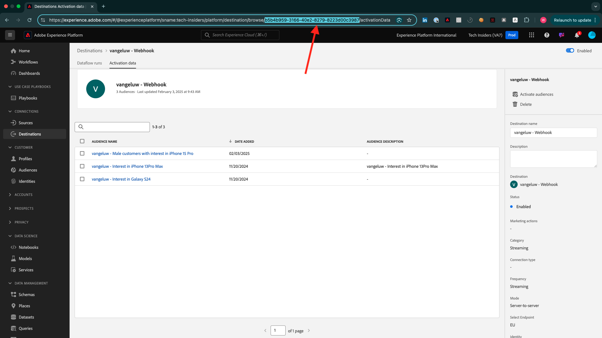

# Wie wird der Abschluss gemessen?

Navigieren Sie zu [https://certification.adobe.com](https://certification.adobe.com) und navigieren Sie zum Kurs **XXX**.

Um ein Modul abzuschließen, müssen Sie einen Abschlussnachweis vorlegen.

Im Folgenden finden Sie die erwarteten Abschlussnachweise für jedes Modul.

## Erste Schritte

Der erwartete Abschlussnachweis für das Modul **Erste Schritte** ist die ID des von Ihnen erstellten Demosystemprojekts für das Web.

Die Kennung des Demo-System-Projekts für das Webformat sieht wie folgt aus: `--demoProfileLdap-- - OCUC`.

## 1.1 Adobe Experience Platform-Datenerfassung und Web SDK-Erweiterung

Der erwartete Abschlussnachweis für das Modul **Datenerfassung und Web-SDK** ist der Name der Datenerfassungseigenschaft für das Web.

Der Name der Datenerfassungseigenschaft für das Webformat sieht wie folgt aus: `--demoProfileLdap-- - Demo System (05/02/2022) (enablement) 1644046719474`.

## 1.2 Datenerfassung

Der erwartete Fertigstellungsnachweis für Modul **Datenerfassung** ist die Datensatz-ID für die beiden von Ihnen erstellten Datensätze.

Das Format der Datensatz-ID sieht wie folgt aus: **5f069724723ef41916a8b5d2**.

`--demoProfileLdap-- - Demo System - Event Dataset for Website`

`--demoProfileLdap-- - Demo System - Profile Dataset for Website`

## 1.3 Zusammengestellte Zielgruppenkomposition

Der erwartete Abschlussnachweis für Modul **Zusammengestellte Zielgruppe** lautet ...

## 2.1 Echtzeit-Kundenprofil

Der erwartete Abschlussnachweis für das Modul **Echtzeit-Kundenprofil** ist die **Segment-ID** des Segments, das Sie über die Benutzeroberfläche erstellt haben, `--demoProfileLdap-- - Male customers with interest in Montana Wind Jacket`.

Das Segment-ID-Format sieht wie folgt aus: **8cb7034d-d4ae-4d26-a61f-a76559c12457**.

## 2.2 Intelligent Services

Der erwartete Fertigstellungsnachweis für das Modul **Intelligent Services** ist die ID für Ihren **Produktakkauf-Propensity Customer AI Service**.

Das Format sieht folgendermaßen aus: **12729** und Sie können es von der URL abrufen, wenn Sie Ihren Dienst geöffnet haben.

## 2.3 Real-Time CDP: Erstellen Sie eine Audience und ergreifen Sie Maßnahmen!

Der erwartete Abschlussnachweis für das Modul **Real-Time CDP** ist die Kennung Ihrer **Adobe Target-Aktivität**.

Das Format sieht wie folgt aus: **111804**.

## 2.4 Real-Time CDP: Audience Activation zu Microsoft Azure Event Hub

Der erwartete Abschlussnachweis für das Modul **RTCDP: EventHub** ist die ID Ihres **Microsoft Azure Event Hub**-Ziels in Adobe Experience Platform.

Die **Microsoft Azure Event Hub Destination ID**, die wie folgt aussieht: **fa3f7ce5-86fd-4096-bf7c-e586fdc096ba**, finden Sie hier:

## 2.5 Real-Time CDP-Verbindungen: Ereignisweiterleitung

Der erwartete Fertigstellungsnachweis für Modul **RTCDP-Verbindungen** ist Ihre **Eigenschaft-ID für die Ereignisweiterleitung**.

Die **Ereignisweiterleitungs-Property-ID**, die wie folgt aussieht: **PR40f44184c888472e9c19d8d602aab0de**, finden Sie hier:

## 2.6 Streamen von Daten von Apache Kafka nach Real-Time CDP

Der erwartete Abschlussnachweis für Modul **Apache Kafka** ist die Kennung Ihres Quell-Connectors `--demoProfileLdap-- - Kafka`.

Die ID sieht wie folgt aus: **f843d50a-ee30-4ca8-a766-0e4f3d29a2f7**. Sie finden sie hier:

## 3.1 Adobe Journey Optimizer: Orchestrierung

Der erwartete Abschlussnachweis für Modul **AJO: Orchestration** ist die eventID für Ihr `--demoProfileLdap--AccountCreationEvent`.

Das Format sieht wie folgt aus: **227402c540eb8f8855c6b2333adf6d54d7153d9d7d56fa475a686081c5 74736**.

## 3.2 Adobe Journey Optimizer: Externe Datenquellen und benutzerdefinierte Aktionen

Der erwartete Abschlussnachweis für Modul **AJO: Benutzerdefinierte Aktionen** ist die eventID für Ihr Ereignis `--demoProfileLdap--GeofenceEntry`.

Das Format sieht wie folgt aus: **fa42ab7982ba55f039eacec24c1e32e5c51b310c67f0fa559ab49b89b63f493 4**.

## 3.3 Adobe Journey Optimizer: Offer decisioning

Der erwartete Abschlussnachweis für Modul **AJO: Angebote** ist die ID der von Ihnen erstellten **Angebotsentscheidung**.

Die **Angebotsentscheidungen-ID**, die wie folgt aussieht: **xcore:offer-activity:1122fcc4603ea499**, finden Sie hier:

## 3.4 Adobe Journey Optimizer: Ereignisbasierte Journey

Der erwartete Abschlussnachweis für Modul **AJO: Events** ist die eventID für Ihr `--demoProfileLdap--StoreEntryEvent`.

Das Format sieht folgendermaßen aus: **e3a8f0bdc0b609667cd96a72a6b1e5aafa0ddaf6ccf121c574e6a2030860a633**.

## 4.1 Customer Journey Analytics: Erstellen eines Dashboards mit Analysis Workspace

Der erwartete Abschlussnachweis für Modul **CJA** ist die Kennung Ihres Projekts `--demoProfileLdap-- - Omnichannel Analysis`.

Das Format sieht folgendermaßen aus: **6217344f6249ac70c726db60**, Sie können es in der URL finden, wenn Sie Ihr Projekt geöffnet haben.

## 4.2 Customer Journey Analytics: Aufnehmen und Analysieren von Google Analytics-Daten in Adobe Experience Platform mit dem BigQuery Source Connector

Der erwartete Abschlussnachweis für Modul **CJA: BigQuery** ist die Kennung Ihrer **BigQuery**-Verbindung.

Die **BigQuery Connection ID**, die wie folgt aussieht: **85a2394d-8b94-410c-a239-4d8b94b10c38**, finden Sie hier:

## 5.1 Query Service

Der erwartete Fertigstellungsnachweis für Modul **Query Service** ist die Datensatz-ID für Ihren `--demoProfileLdap--_callcenter_interaction_analysis` -Datensatz, den Sie nach Abschluss des Moduls erhalten.

Das Format sieht folgendermaßen aus: **62076f68f14a9d194995d4e2**.

[Zu allen Modulen zurückkehren](./overview.md)
