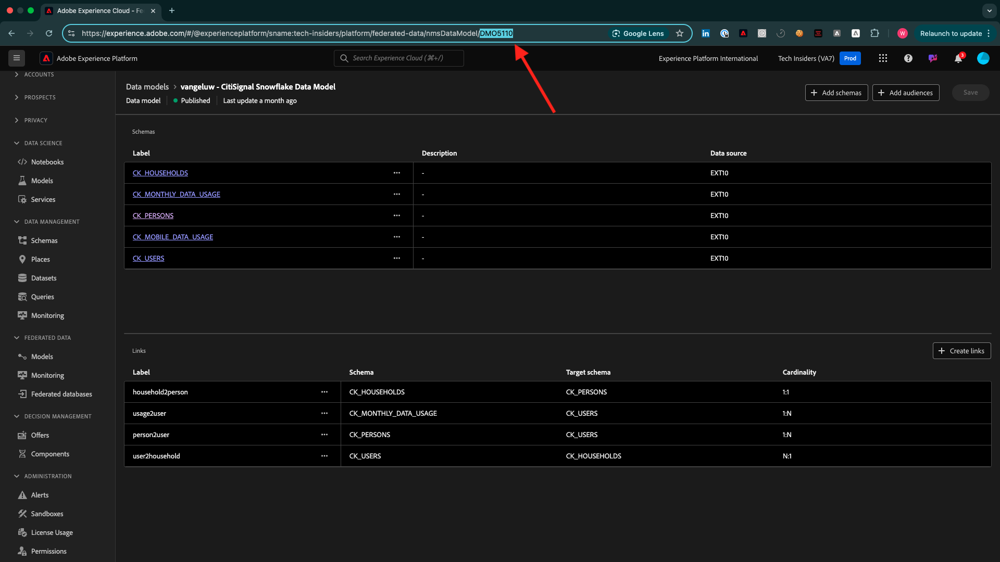

# Wie wird der Abschluss gemessen?

Navigieren Sie zu [https://certification.adobe.com/courses/1258](https://certification.adobe.com/courses/1258).

{zoomable="yes"}

Klicken Sie **Start** neben dem Modul, für das Sie den Abschluss übermitteln möchten.

{zoomable="yes"}

Um ein Modul abzuschließen, muss für jedes Modul ein Abschlussnachweis vorgelegt und gesendet werden.

{zoomable="yes"}

Im Folgenden finden Sie die erwarteten Abschlussnachweise für jedes Modul.

## Erste Schritte

Der erwartete Abschlussnachweis für das Modul **Erste Schritte** ist die ID des Demosystemprojekts für das von Ihnen erstellte Web.

Die ID des Demosystemprojekts für das Webformat sieht wie folgt aus: `--aepUserLdap-- - QIMU`.

{zoomable="yes"}

## 1.1 Adobe Experience Platform-Datenerfassung und Web SDK-Erweiterung

Der erwartete Abschlussnachweis für das Modul **Datenerfassung und Web-SDK** ist die **Umgebungs-ID** der Datenerfassungseigenschaft für das Web.

Die Umgebungs-ID der Datenerfassungseigenschaft für das Webformat sieht wie folgt aus: `EN5211f7792b4442f8a45deb68f8902d3a`.

{zoomable="yes"}

## 1.2 Datenaufnahme

Der erwartete Abschlussnachweis für das Modul **Datenaufnahme** ist die Datenfluss-ID für die Source-Verbindung der Data Landing Zone.

Die Datenfluss-ID sieht wie folgt aus: **374c2c6d-f39a-4b0b-b568-40c41e6c4e8e**.

{zoomable="yes"}

## 1.3 Federated Audience-Komposition

Der erwartete Abschlussnachweis für das Modul **Federated-Audience-Komposition** ist die ID des von Ihnen erstellten Federated-Data-Modells.

Die ID des Federated Data Model sieht wie folgt aus: **DMO5110** und kann der URL entnommen werden, wie in der folgenden Abbildung dargestellt.

{zoomable="yes"}

## 2.1 Echtzeit-Kundenprofil

Der erwartete Abschlussnachweis für das Modul **Echtzeit-**) ist die **Zielgruppen-ID** der Zielgruppe, die Sie `--aepUserLdap-- - Male customers with interest in iPhone 15 Pro` über die Benutzeroberfläche erstellt haben.

Die Zielgruppen-ID sieht wie folgt aus: **81a9acbe-12e6-424b-b658-abba3a435c83**.

{zoomable="yes"}

## 2.2 Intelligent Services

Der erwartete Abschlussnachweis für das Modul **Intelligent Services** ist die **Zielgruppen-ID** der Zielgruppe, die Sie `--aepUserLdap-- - Customer AI High Propensity` über die Benutzeroberfläche erstellt haben.

Die Zielgruppen-ID sieht wie folgt aus: **cb6db21d-8fa3-484a-93ac-25aa1ab48412**.

{zoomable="yes"}

## 2.3 Real-Time CDP: Zielgruppe aufbauen und Maßnahmen ergreifen!

Der erwartete Abschlussnachweis für das Modul **Real-Time CDP: Erstellen Sie eine Zielgruppe und ergreifen Sie Maßnahmen!** ist die ID Ihres **Ziele SDK Webhook-Ziels**.

Die ID Ihres Webhook-Ziels sieht wie folgt aus: **b5b4b959-3166-40e2-8279-8223d00c3987** und kann der URL entnommen werden, wie in der folgenden Abbildung dargestellt.

{zoomable="yes"}

## 2.4 Real-Time CDP: Audience Activation zum Microsoft Azure Event Hub

Der erwartete Abschlussnachweis für das Modul **Real-Time CDP: Audience Activation zum Microsoft Azure Event Hub** ist die ID Ihres **Microsoft Azure Event Hub**-Ziels in Adobe Experience Platform.

Sie finden die **Microsoft Azure Event Hub-Ziel-ID**, die wie folgt aussieht: **43cf85bc-3d01-49fd-80c9-a2913db45e3c**, in der URL wie unten angegeben:

{zoomable="yes"}

## 2.5 Real-Time CDP-Verbindungen: Ereignisweiterleitung

Der erwartete Abschlussnachweis für das Modul **Real-Time CDP Connections: Ereignisweiterleitung** ist Ihre **Eigenschafts-ID für die Ereignisweiterleitung**.

Sie finden die **Ereignisweiterleitungs-Eigenschafts-ID**, die wie folgt aussieht **PRa18819171c1241dfb16d74a49993dd5b**, in der URL, wie in der folgenden Abbildung dargestellt:

{zoomable="yes"}

## 2.6 Streamen Sie Daten von Apache Kafka nach Real-Time CDP

Der erwartete Abschlussnachweis für das Modul **Streamen von Daten von Apache Kafka in Real-Time CDP** ist die ID Ihrer Quell-Connector-`--aepUserLdap-- - Kafka`.

Die ID sieht wie folgt aus: **f843d50a-ee30-4ca8-a766-0e4f3d29a2f7**, und Sie finden sie hier:

{zoomable="yes"}

## 3.1 Adobe Journey Optimizer: Orchestrierung

Der erwartete Abschlussnachweis für das Modul **Adobe Journey Optimizer: Orchestration** ist die ID der von Ihnen erstellten Journey.

Die ID der Journey sieht wie folgt aus: **594fa01f-1a3b-450c-ba09-b7e3ff377c0f**, und kann der URL entnommen werden, wie in der folgenden Abbildung dargestellt.

{zoomable="yes"}

## 3.2 Adobe Journey Optimizer: Externe Datenquellen und benutzerdefinierte Aktionen

Der erwartete Abschlussnachweis für das Modul **Adobe Journey Optimizer: Externe Datenquellen und benutzerdefinierte Aktionen** ist die ID der von Ihnen erstellten Journey.

Die ID der Journey sieht wie folgt aus: **6962d3bc-4f44-4f9c-b326-83978f245f2a**, und kann der URL entnommen werden, wie in der folgenden Abbildung dargestellt.

{zoomable="yes"}

## 3.3 Adobe Journey Optimizer: Offer decisioning

Der erwartete Abschlussnachweis für das Modul **Adobe Journey Optimizer: Offer decisioning** ist die ID der **Entscheidung** erstellten Entscheidung.

Sie finden die **Entscheidungs-ID**, die wie folgt aussieht **dps:offer-activity:1a08ba4b529b2fb2**, hier:

{zoomable="yes"}

## 3.4 Adobe Journey Optimizer: Veranstaltungsbasierte Journey

Der erwartete Abschlussnachweis für das Modul **Adobe Journey Optimizer: Ereignisbasierte Journey** ist die ID der von Ihnen erstellten Journey.

Die ID der Journey sieht wie folgt aus: **5f5efc7e-49f7-44c1-85df-b23482b38d32**, und kann der URL entnommen werden, wie in der folgenden Abbildung dargestellt.

{zoomable="yes"}

## 3.5 Adobe Journey Optimizer: Übersetzungsdienstleistungen

Der erwartete Abschlussnachweis für das Modul **Adobe Journey Optimizer: Translation Services** ist die **Campaign-Versions-ID** Ihrer CitiSignal-Glasfaserkampagne.

Die Kampagnen-Versions-ID des Federated Data Model sieht wie folgt aus: **b11c998b-a345-4f8e-afb1-6285547eb693** und kann aus dem Kampagnen-Übersichtsbildschirm kopiert werden, wie in der folgenden Abbildung dargestellt.

{zoomable="yes"}

## 4.1 Customer Journey Analytics: Erstellen eines Dashboards mit Analysis Workspace

Der erwartete Abschlussnachweis für das Modul **Customer Journey Analytics: Erstellen eines Dashboards mit Analysis Workspace** ist die ID Ihrer `--aepUserLdap-- - Omnichannel Analysis`.

Das Format sieht wie folgt aus: **677bcb247064db3c7de2a0e4**, Sie können es in der URL finden, wenn Sie Ihr Projekt geöffnet haben.

{zoomable="yes"}

## 4.2 Customer Journey Analytics: Aufnehmen und Analysieren von Google Analytics-Daten in Adobe Experience Platform mit dem BigQuery Source Connector

Der erwartete Abschlussnachweis für das Modul **Customer Journey Analytics: Aufnehmen und Analysieren von Google Analytics-Daten in Adobe Experience Platform mit dem BigQuery Source Connector** ist die ID Ihrer **BigQuery**-Quellverbindung.

Sie finden die **BigQuery-Verbindungs-ID**, die wie folgt aussieht **b63a810c-a8cc-4c6b-a57e-dcb7e3368cf8**, hier:

{zoomable="yes"}

## 5.1 Abfrage-Service

Der erwartete Abschlussnachweis für das Modul **Abfrage-Service** ist die Datensatz-ID für Ihren `--aepUserLdap--_callcenter_interaction_analysis` - Datensatz, die Sie nach Abschluss des Moduls erhalten.

Die ID sieht wie folgt aus: **675033c903fb3b2aefed8a0a**.

{zoomable="yes"}{width="50px" align="left"}

>[!NOTE]
>
>Wenn Sie Fragen haben oder ein allgemeines Feedback zu künftigen Inhalten geben möchten, wenden Sie sich bitte direkt an Tech Insiders, indem Sie eine E-Mail an **techinsiders@adobe.com senden**.

[Zurück zu „Alle Module“](./overview.md)