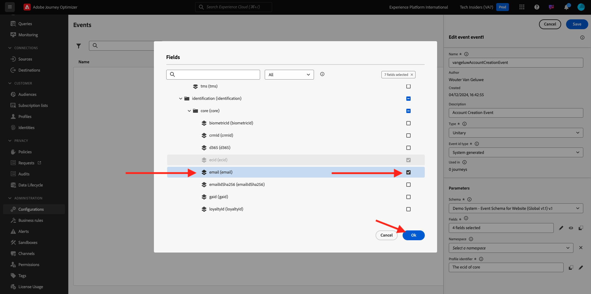

# 3.1.1 Ereignis erstellen

Melden Sie sich bei Adobe Journey Optimizer an, indem Sie zu [Adobe Experience Cloud](https://experience.adobe.com) wechseln. Klicken Sie auf **Journey Optimizer**.

Sie werden zur Ansicht **Home** in Journey Optimizer weitergeleitet. Vergewissern Sie sich zunächst, dass Sie die richtige Sandbox verwenden. Die zu verwendende Sandbox heißt `--aepSandboxName--`. Um von einer Sandbox zu einer anderen zu wechseln, klicken Sie auf **PRODUKTIONSPROD (VA7)** und wählen Sie die Sandbox aus der Liste aus. In diesem Beispiel erhält die Sandbox den Namen **AEP-Aktivierung FY22**. Sie befinden sich dann in der Ansicht **Home** Ihrer Sandbox `--aepSandboxName--`.

Scrollen Sie im linken Menü nach unten und klicken Sie auf **Konfigurationen**. Klicken Sie anschließend unter **Ereignisse** auf die Schaltfläche **Verwalten** .

Daraufhin wird eine Übersicht über alle verfügbaren Ereignisse angezeigt. Klicken Sie auf **Ereignis erstellen** , um mit der Erstellung Ihres eigenen Ereignisses zu beginnen.

Daraufhin wird ein neues, leeres Ereignisfenster angezeigt.

Geben Sie Ihrem Ereignis zunächst einen Namen wie den folgenden: `--aepUserLdap--AccountCreationEvent`.

Fügen Sie als Nächstes eine Beschreibung wie `Account Creation Event` hinzu.

Stellen Sie als Nächstes sicher, dass der **Typ** auf **Einzeln** eingestellt ist, und wählen Sie für die Auswahl des **Ereignis-ID-Typs** die Option **Systemgeneriert** aus.

Als Nächstes folgt die Schemaauswahl. Für diese Übung wurde ein Schema vorbereitet. Verwenden Sie das Schema `Demo System - Event Schema for Website (Global v1.1) v.1`.

Nach Auswahl des Schemas werden im Abschnitt **Payload** eine Reihe von Feldern ausgewählt. Sie sollten nun den Mauszeiger über den Abschnitt **Payload** bewegen und es werden drei Symbole angezeigt. Klicken Sie auf das Symbol **Bearbeiten**.

Es wird ein Popup-Fenster mit den **Feldern** angezeigt, in dem Sie einige der Felder auswählen müssen, die für die Personalisierung der E-Mail erforderlich sind.  Später werden wir mithilfe der bereits in Adobe Experience Platform vorhandenen Daten andere Profilattribute auswählen.

Wählen Sie im Objekt `--aepTenantId--.demoEnvironment` die Felder **brandLogo** und **brandName** aus.

Wählen Sie im Objekt `--aepTenantId--.identification.core` das Feld **email** aus.

Klicken Sie auf **OK** , um Ihre Änderungen zu speichern.

Daraufhin sollte Folgendes angezeigt werden:

Klicken Sie erneut auf **Speichern** , um Ihre Änderungen zu speichern.

Ihr Ereignis ist jetzt konfiguriert und gespeichert.

Klicken Sie erneut auf das Ereignis, um den Bildschirm **Ereignis bearbeiten** erneut zu öffnen. Bewegen Sie den Mauszeiger erneut über das Feld **Payload** , um die 3 Symbole erneut anzuzeigen. Klicken Sie auf das Symbol **Payload anzeigen** .

Sie sehen nun ein Beispiel der erwarteten Payload.

Ihr Ereignis verfügt über eine eindeutige eventID für die Orchestrierung, die Sie finden können, indem Sie in dieser Payload nach unten scrollen, bis Sie `_experience.campaign.orchestration.eventID` sehen.

Die Ereignis-ID muss an Adobe Experience Platform gesendet werden, um die in Übung 7.2 erstellte Journey Trigger. Merken Sie sich diese eventID, da Sie sie in Übung 7.3 benötigen werden.
`"eventID": "227402c540eb8f8855c6b2333adf6d54d7153d9d7d56fa475a6866081c574736"`

Klicken Sie auf **OK** und anschließend auf **Abbrechen**.

Du bist jetzt mit dieser Übung fertig.

Nächster Schritt: [3.1.2 Journey Optimizer: Journey und E-Mail-Nachricht erstellen](./ex2.md)

[Zurück zu Modul 3.1](./journey-orchestration-create-account.md)

[Zu allen Modulen zurückkehren](../../../overview.md)
