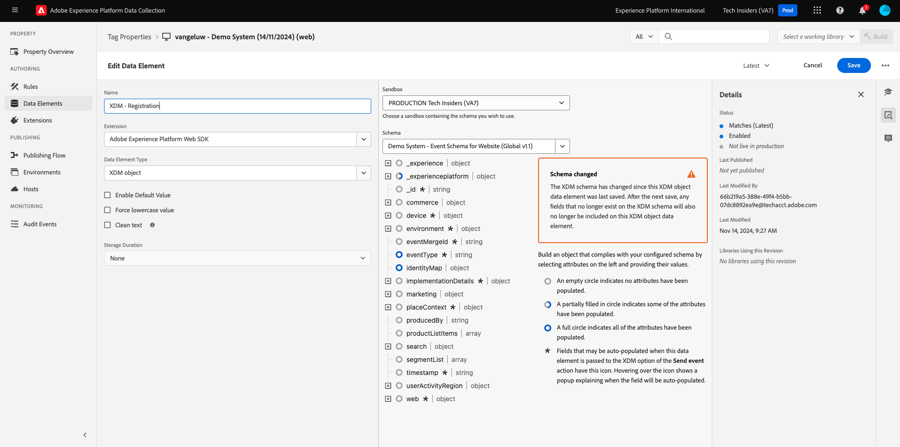

# 3.1.3 Aktualisieren der Datenerfassungseigenschaft und Testen des Journey

## 3.1.3.1 Aktualisieren der Datenerfassungseigenschaft

Wechseln Sie zu [Adobe Experience Platform-](https://experience.adobe.com/launch/) und wählen Sie **Tags** aus.

In **Erste Schritte** hat Demo System zwei Client-Eigenschaften für Sie erstellt: eine für die Website und eine für die Mobile App. Suchen Sie sie, indem Sie im Feld **[!UICONTROL nach `--aepUserLdap--`]**. Klicken Sie, um die Eigenschaft **Web** zu öffnen.

Sie werden es dann sehen.

Gehen Sie im linken Menü zu **Regeln** und suchen Sie nach der Regel **Konto erstellen**. Klicken Sie auf die Regel **Konto erstellen**, um sie zu öffnen.

Anschließend werden die Details dieser Regel angezeigt. Klicken, um die Aktion &quot;**-Ereignis senden“ zu**.

Anschließend sehen Sie, dass beim Auslösen dieser Aktion ein bestimmtes Datenelement zum Definieren der XDM-Datenstruktur verwendet wird. Sie müssen dieses Datenelement aktualisieren und die **Ereignis-ID** des Ereignisses definieren, das Sie in [Übung 3.1.1](./ex1.md) konfiguriert haben.

Jetzt müssen Sie das Datenelement (XDM - **)**. Navigieren Sie dazu zu **Datenelemente**. Suchen Sie nach **XDM - Registrierung** und klicken Sie, um dieses Datenelement zu öffnen.

Sie sehen dann Folgendes:

Navigieren Sie zur `_experience.campaign.orchestration.eventID`. Entfernen Sie den aktuellen Wert und fügen Sie Ihre eventID dort ein.

Zur Erinnerung: Die Ereignis-ID finden Sie in Adobe Journey Optimizer unter **Konfigurationen > Ereignisse** und Sie finden die Ereignis-ID in der Beispiel-Payload Ihres Ereignisses, die wie folgt aussieht: `"eventID": "5ae9b8d3f68eb555502b0c07d03ef71780600c4bd0373a4065c692ae0bfbd34d"`.

Nach dem Einfügen Ihrer eventID sollte Ihr Bildschirm wie folgt aussehen. Klicken Sie anschließend auf **Speichern** oder **In Bibliothek speichern**.

Schließlich müssen Sie Ihre Änderungen veröffentlichen. Navigieren Sie **linken Menü zu** Veröffentlichungsfluss) und klicken Sie darauf, um Ihre **Hauptbibliothek** zu öffnen.

Klicken Sie auf **Alle geänderten Ressourcen hinzufügen** und anschließend auf **Für Entwicklung speichern und erstellen**.

Ihre Bibliothek wird dann aktualisiert und nach 1-2 Minuten können Sie mit dem Testen Ihrer Konfiguration fortfahren.

## 3.1.3.2 Testen des Journey

Navigieren Sie zu [https://dsn.adobe.com](https://dsn.adobe.com). Nachdem Sie sich mit Ihrer Adobe ID angemeldet haben, sehen Sie Folgendes. Klicken Sie auf die 3 Punkte **…** in Ihrem Website-Projekt und dann auf **Ausführen**, um es zu öffnen.

Anschließend wird Ihre Demo-Website geöffnet. Wählen Sie die URL aus und kopieren Sie sie in die Zwischenablage.

Öffnen Sie ein neues Inkognito-Browser-Fenster.

Fügen Sie die URL Ihrer Demo-Website ein, die Sie im vorherigen Schritt kopiert haben. Sie werden dann aufgefordert, sich mit Ihrer Adobe ID anzumelden.

Wählen Sie Ihren Kontotyp aus und schließen Sie den Anmeldevorgang ab.

Ihre Website wird dann in einem Inkognito-Browser-Fenster geladen. Für jede Übung müssen Sie ein neues Inkognito-Browser-Fenster verwenden, um Ihre Demo-Website-URL zu laden.

Klicken Sie auf das Adobe-Logo oben links im Bildschirm, um den Profil-Viewer zu öffnen.

Sehen Sie sich das Bedienfeld Profil-Viewer und das Echtzeit-Kundenprofil mit der **Experience Cloud-ID** als primäre Kennung für diesen derzeit unbekannten Kunden an. Klicken Sie auf **Anmelden**.

Klicken Sie **KONTO ERSTELLEN**.

Füllen Sie Ihre Daten aus und klicken Sie **Registrieren**, woraufhin Sie zur vorherigen Seite weitergeleitet werden.

Öffnen Sie das Bedienfeld Profil-Viewer und navigieren Sie zum Echtzeit-Kundenprofil. Im Profil-Viewer-Fenster sollten Sie alle Ihre personenbezogenen Daten angezeigt bekommen, z. B. Ihre neu hinzugefügten E-Mail- und Telefonkennungen.

1 Minute nach der Erstellung Ihres Kontos erhalten Sie Ihre E-Mail zur Kontoerstellung von Adobe Journey Optimizer.

Außerdem werden der Journey-Eintrag und der Fortschritt durch die Journey im Journey-Dashboard in Journey Optimizer angezeigt.

Nächster Schritt: [Zusammenfassung und Vorteile](./summary.md)

[Zurück zum Modul 3.1](./journey-orchestration-create-account.md)

[Zurück zu „Alle Module“](../../../overview.md)
