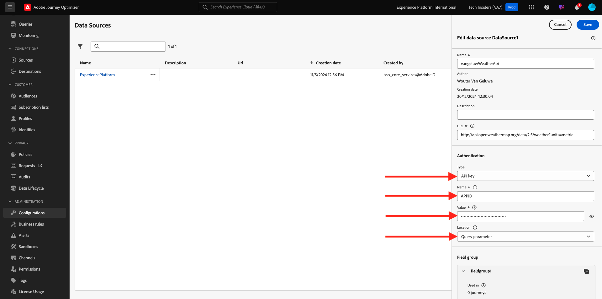
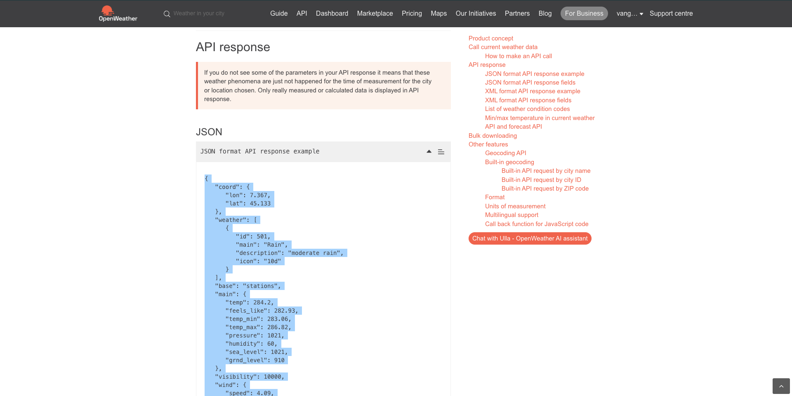

# 3.2.2 Externe Datenquelle definieren

In dieser Übung erstellen Sie eine benutzerdefinierte externe Datenquelle, indem Sie Adobe Journey Optimizer verwenden.

Melden Sie sich bei Adobe Journey Optimizer an, indem Sie zu [Adobe Experience Cloud](https://experience.adobe.com) wechseln. Klicken Sie auf **Journey Optimizer**.


Sie werden zur Ansicht **Home** in Journey Optimizer weitergeleitet. Vergewissern Sie sich zunächst, dass Sie die richtige Sandbox verwenden. Die zu verwendende Sandbox heißt `--aepSandboxName--`. Um von einer Sandbox zu einer anderen zu wechseln, klicken Sie auf **PRODUKTIONSPROD (VA7)** und wählen Sie die Sandbox aus der Liste aus. In diesem Beispiel erhält die Sandbox den Namen **AEP-Aktivierung FY22**. Sie befinden sich dann in der Ansicht **Home** Ihrer Sandbox `--aepSandboxName--`.


Scrollen Sie im linken Menü nach unten und klicken Sie auf **Konfigurationen**. Klicken Sie anschließend unter **Datenquellen** auf die Schaltfläche **Verwalten** .


Daraufhin wird die Liste **Data Sources** angezeigt.
Klicken Sie auf **Data Source erstellen** , um Ihre Datenquelle hinzuzufügen.


Es wird ein leeres Datenquellen-Popup angezeigt.


Bevor Sie mit der Konfiguration beginnen können, benötigen Sie ein Konto mit dem Dienst **Wetterkarte öffnen** . Führen Sie diese Schritte aus, um Ihr Konto zu erstellen und Ihren API-Schlüssel zu erhalten.

Wechseln Sie zu [https://openweathermap.org/](https://openweathermap.org/). Klicken Sie auf der Startseite auf **Anmelden**.


Klicken Sie auf **Konto erstellen**.


Füllen Sie die Details aus.


Klicken Sie auf **Konto erstellen**.


Sie werden dann zu Ihrer Kontoseite weitergeleitet.


Klicken Sie im Menü auf **API-Schlüssel** , um Ihren API-Schlüssel abzurufen, den Sie zum Einrichten Ihrer benutzerdefinierten externen Datenquelle benötigen.


Ein **API-Schlüssel** sieht wie folgt aus: `b2c4c36b6bb59c3458d6686b05311dc3`.

Die **API-Dokumentation** für das **aktuelle Wetter** [finden Sie hier](https://openweathermap.org/current).

In unserem Anwendungsfall implementieren wir die Verbindung mit Open Weather Map basierend auf der Stadt, in der sich der Kunde befindet.


Gehen Sie zurück zu **Adobe Journey Optimizer**, zu Ihrem leeren Popup für die **Externe Daten - Source** .


Verwenden Sie als Namen für die Datenquelle `--aepUserLdap--WeatherApi`. In diesem Beispiel ist der Datenquellenname `vangeluwWeatherApi `.

Legen Sie für Beschreibung den Wert `Access to the Open Weather Map` fest.

Die URL für die Open Weather Map-API lautet: **http://api.openweathermap.org/data/2.5/weather?units=metric**


Als Nächstes müssen Sie die zu verwendende Authentifizierung auswählen.

Verwenden Sie diese Variablen:

| Feld | Wert |
|:-----------------------:| :-----------------------|
| Typ | **API-Schlüssel** |
| Name | **APPID** |
| Wert | **Ihr API-Schlüssel** |
| Standort | **Abfrageparameter** |



Schließlich müssen Sie eine **FieldGroup** definieren, die im Wesentlichen die Anfrage ist, die Sie an die Wetter-API senden. In unserem Fall möchten wir den Namen der Stadt verwenden, um das aktuelle Wetter für diese Stadt anzufordern.


Gemäß der Dokumentation zur Wetter-API müssen wir den Parameter `q=City` senden.


Um die erwartete API-Anfrage zu erfüllen, konfigurieren Sie Ihre FieldGroup wie folgt:

>[!IMPORTANT]
>
>Der Name der Feldergruppe muss eindeutig sein. Verwenden Sie diese Namenskonvention: `--aepUserLdap--WeatherByCity` . In diesem Fall sollte der Name `vangeluwWeatherByCity` sein.


Für die Antwort-Payload müssen Sie ein Beispiel der Antwort einfügen, die von der Wetter-API gesendet wird.

Die erwartete API-JSON-Antwort finden Sie auf der API-Dokumentationsseite [hier](https://openweathermap.org/current).



Alternativ können Sie die JSON-Antwort hier kopieren:

```json
{"coord": { "lon": 139,"lat": 35},
  "weather": [
    {
      "id": 800,
      "main": "Clear",
      "description": "clear sky",
      "icon": "01n"
    }
  ],
  "base": "stations",
  "main": {
    "temp": 281.52,
    "feels_like": 278.99,
    "temp_min": 280.15,
    "temp_max": 283.71,
    "pressure": 1016,
    "humidity": 93
  },
  "wind": {
    "speed": 0.47,
    "deg": 107.538
  },
  "clouds": {
    "all": 2
  },
  "dt": 1560350192,
  "sys": {
    "type": 3,
    "id": 2019346,
    "message": 0.0065,
    "country": "JP",
    "sunrise": 1560281377,
    "sunset": 1560333478
  },
  "timezone": 32400,
  "id": 1851632,
  "name": "Shuzenji",
  "cod": 200
}
```

Kopieren Sie die obige JSON-Antwort in die Zwischenablage und rufen Sie dann den Konfigurationsbildschirm für benutzerdefinierte Datenquellen auf.

Klicken Sie auf das Symbol **Payload bearbeiten** .


Es wird ein Popup angezeigt, in das Sie jetzt die oben genannte JSON-Antwort einfügen müssen.


Fügen Sie Ihre JSON-Antwort ein, danach wird dies angezeigt. Klicken Sie auf **Speichern**.


Ihre benutzerdefinierte Datenquellenkonfiguration ist jetzt abgeschlossen. Scrollen Sie nach oben und klicken Sie auf **Speichern**.


Ihre Datenquelle wurde jetzt erfolgreich erstellt und ist Teil der Liste **Data Sources** .


Nächster Schritt: [3.2.3 Benutzerdefinierte Aktion definieren](./ex3.md)

[Zurück zu Modul 3.2](journey-orchestration-external-weather-api-sms.md)

[Zu allen Modulen zurückkehren](../../../overview.md)
