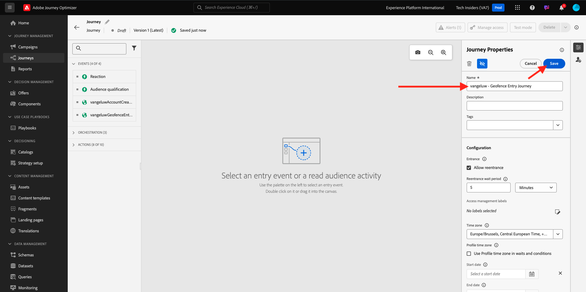
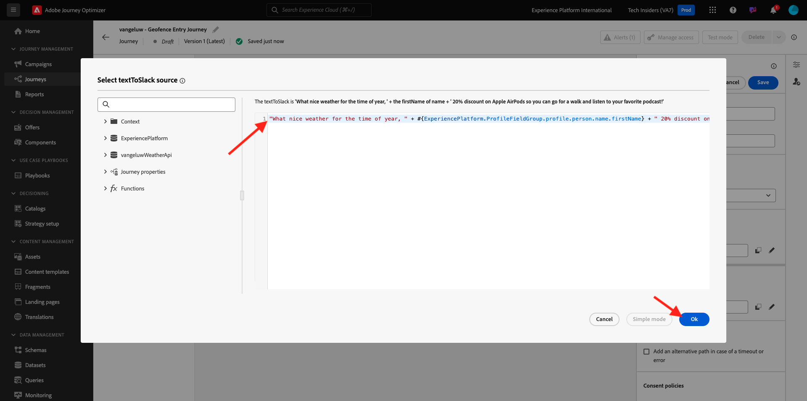

# 3.2.4 Journey und Nachrichten erstellen

In dieser Übung erstellen Sie eine Journey und mehrere Textnachrichten, indem Sie Adobe Journey Optimizer verwenden.

In diesem Anwendungsfall besteht das Ziel darin, je nach den Wetterbedingungen des Standorts Ihres Kunden unterschiedliche SMS-Nachrichten zu senden. Es wurden 3 Szenarien definiert:

- Mindestens 10° Celsius
- Zwischen 10° und 25° Celsius
- Warmer als 25° Celsius

Für diese drei Bedingungen müssen Sie drei SMS-Nachrichten in Adobe Journey Optimizer definieren.

## 3.2.4.1 Journey erstellen

Melden Sie sich bei Adobe Journey Optimizer an, indem Sie zu [Adobe Experience Cloud](https://experience.adobe.com) wechseln. Klicken Sie auf **Journey Optimizer**.


Sie werden zur Ansicht **Home** in Journey Optimizer weitergeleitet. Vergewissern Sie sich zunächst, dass Sie die richtige Sandbox verwenden. Die zu verwendende Sandbox heißt `--aepSandboxName--`. Um von einer Sandbox zu einer anderen zu wechseln, klicken Sie auf **PRODUKTIONSPROD (VA7)** und wählen Sie die Sandbox aus der Liste aus. In diesem Beispiel erhält die Sandbox den Namen **AEP-Aktivierung FY22**. Sie befinden sich dann in der Ansicht **Home** Ihrer Sandbox `--aepSandboxName--`.


Gehen Sie im linken Menü zu **Journey** und klicken Sie auf **Journey erstellen** , um mit der Erstellung Ihrer Journey zu beginnen.


Du solltest zuerst deine Journey benennen.

Verwenden Sie als Namen für die Journey `--aepUserLdap-- - Geofence Entry Journey`. In diesem Beispiel lautet der Journey-Name `vangeluw - Geofence Entry Journey`. Derzeit dürfen keine anderen Werte festgelegt werden. Klicken Sie auf **OK**.



Sehen Sie sich auf der linken Seite Ihres Bildschirms **Ereignisse** an. Ihr zuvor erstelltes Ereignis sollte in dieser Liste angezeigt werden. Wählen Sie es aus und ziehen Sie es per Drag-and-Drop auf die Journey-Arbeitsfläche. Ihre Journey sieht dann so aus. Klicken Sie auf **OK**.


Klicken Sie anschließend auf **Orchestrierung**. Jetzt sehen Sie die verfügbaren Funktionen für **Orchestrierung**. Wählen Sie **Bedingung** aus und ziehen Sie sie per Drag-and-Drop auf die Journey-Arbeitsfläche.


Definieren Sie nun drei Bedingungen:

- Es ist kälter als 10° Celsius
- Es ist zwischen 10° und 25° Celsius
- Es ist wärmer als 25°C

Definieren wir die erste Bedingung.

### Bedingung 1: Kälter als 10° Celsius

Klicken Sie auf die **Bedingung**.  Klicken Sie auf **Pfad1** und bearbeiten Sie den Namen des Pfads in **Niedriger als 10 C**. Klicken Sie auf das Symbol **Bearbeiten** für den Ausdruck von Path1.


Dann wird ein leerer Bildschirm mit dem Namen **Einfacher Editor** angezeigt. Ihre Abfrage wird ein wenig erweiterter sein, sodass Sie den **erweiterten Modus** benötigen. Klicken Sie auf **Erweiterter Modus**.


Dann sehen Sie den **erweiterten Editor**, der die Codeeingabe zulässt.


Wählen Sie den folgenden Code aus und fügen Sie ihn in den **erweiterten Editor** ein.

`#{--aepUserLdap--WeatherApi.--aepUserLdap--WeatherByCity.main.temp} <= 10`

Dann wirst du das sehen.


Um die Temperatur als Teil dieser Bedingung abzurufen, müssen Sie die Stadt angeben, in der sich der Kunde derzeit befindet.
Der **Ort** muss mit dem dynamischen Parameter `q` verknüpft werden, genau wie wir es zuvor in der Dokumentation zur Open Weather API gesehen haben.

Klicken Sie auf das Feld **dynamic val: q** , wie im Screenshot angegeben.


Dann müssen Sie das Feld, das die aktuelle Stadt des Kunden enthält, in einer der verfügbaren Data Sources finden.


Sie können das Feld finden, indem Sie zu `--aepUserLdap--GeofenceEntry.placeContext.geo.city` navigieren.

Durch Klicken auf dieses Feld wird es als dynamischer Wert für den Parameter `q` hinzugefügt. Dieses Feld wird beispielsweise durch den Geolocation-Service ausgefüllt, den Sie in Ihrer Mobile App implementiert haben. In unserem Fall simulieren wir dies mit der Admin Console der Demo-Website. Klicken Sie auf **OK**.


### Bedingung 2: Zwischen 10° und 25° Celsius

Nachdem Sie die erste Bedingung hinzugefügt haben, sehen Sie diesen Bildschirm. Klicken Sie auf **Pfad hinzufügen**.


Doppelklicken Sie auf **Pfad1** und bearbeiten Sie den Pfadnamen in **Zwischen 10 und 25 C**. Klicken Sie auf das Symbol **Bearbeiten** für den Ausdruck in diesem Pfad.


Dann wird ein leerer Bildschirm mit dem Namen **Einfacher Editor** angezeigt. Ihre Abfrage wird ein wenig erweiterter sein, sodass Sie den **erweiterten Modus** benötigen. Klicken Sie auf **Erweiterter Modus**.


Dann sehen Sie den **erweiterten Editor**, der die Codeeingabe zulässt.


Wählen Sie den folgenden Code aus und fügen Sie ihn in den **erweiterten Editor** ein.

`#{--aepUserLdap--WeatherApi.--aepUserLdap--WeatherByCity.main.temp} > 10 and #{--aepUserLdap--WeatherApi.--aepUserLdap--WeatherByCity.main.temp} <= 25`

Dann wirst du das sehen.


Um die Temperatur als Teil dieser Bedingung abzurufen, müssen Sie die Stadt angeben, in der sich der Kunde derzeit befindet.
Der **Ort** muss mit dem dynamischen Parameter **q** verknüpft werden, genau wie wir es zuvor in der Dokumentation zur Open Weather API gesehen haben.

Klicken Sie auf das Feld **dynamic val: q** , wie im Screenshot angegeben.


Dann müssen Sie das Feld, das die aktuelle Stadt des Kunden enthält, in einer der verfügbaren Data Sources finden.


Sie können das Feld finden, indem Sie zu `--aepUserLdap--GeofenceEntry.placeContext.geo.city` navigieren. Durch Klicken auf dieses Feld wird es als dynamischer Wert für den Parameter **q** hinzugefügt. Dieses Feld wird beispielsweise durch den Geolocation-Service ausgefüllt, den Sie in Ihrer Mobile App implementiert haben. In unserem Fall simulieren wir dies mit der Admin Console der Demo-Website. Klicken Sie auf **OK**.


Als Nächstes fügen Sie die dritte Bedingung hinzu.

### Bedingung 3: Warmer als 25° Celsius

Nachdem Sie die zweite Bedingung hinzugefügt haben, sehen Sie diesen Bildschirm. Klicken Sie auf **Pfad hinzufügen**.


Doppelklicken Sie auf Path1 , um den Namen in **wärmer als 25 C** zu ändern.
Klicken Sie dann auf das Symbol **Bearbeiten** für den Ausdruck in diesem Pfad.


Dann wird ein leerer Bildschirm mit dem Namen **Einfacher Editor** angezeigt. Ihre Abfrage wird ein wenig erweiterter sein, sodass Sie den **erweiterten Modus** benötigen. Klicken Sie auf **Erweiterter Modus**.


Dann sehen Sie den **erweiterten Editor**, der die Codeeingabe zulässt.


Wählen Sie den folgenden Code aus und fügen Sie ihn in den **erweiterten Editor** ein.

`#{--aepUserLdap--WeatherApi.--aepUserLdap--WeatherByCity.main.temp} > 25`

Dann wirst du das sehen.


Um die Temperatur als Teil dieser Bedingung abzurufen, müssen Sie die Stadt angeben, in der sich der Kunde derzeit befindet.
Der **Ort** muss mit dem dynamischen Parameter **q** verknüpft werden, genau wie wir es zuvor in der Dokumentation zur Open Weather API gesehen haben.

Klicken Sie auf das Feld **dynamic val: q** , wie im Screenshot angegeben.


Dann müssen Sie das Feld, das die aktuelle Stadt des Kunden enthält, in einer der verfügbaren Data Sources finden.


Sie können das Feld finden, indem Sie zu ```--aepUserLdap--GeofenceEntry.placeContext.geo.city``` navigieren. Durch Klicken auf dieses Feld wird es als dynamischer Wert für den Parameter **q** hinzugefügt. Dieses Feld wird beispielsweise durch den Geolocation-Service ausgefüllt, den Sie in Ihrer Mobile App implementiert haben. In unserem Fall simulieren wir dies mit der Admin Console der Demo-Website. Klicken Sie auf **OK**.


Sie haben jetzt drei konfigurierte Pfade. Klicken Sie auf **OK**.


Da dies eine Journey für Lernzwecke ist, konfigurieren wir nun eine Reihe von Aktionen, um die Vielfalt der Optionen zu veranschaulichen, die Marketing-Experten jetzt haben, um Nachrichten zu senden.

## 3.2.4.2 Nachrichten für Pfad senden: älter als 10° Celsius

Für jeden Temperaturkontext versuchen wir, eine Textnachricht an unseren Kunden zu senden. Wir können eine Textnachricht nur senden, wenn eine Mobiltelefonnummer für einen Kunden verfügbar ist. Daher müssen wir zunächst überprüfen, ob wir dies tun.

Fokussieren wir uns auf **Kälter größer als 10 C**.


Nehmen wir ein weiteres Element vom Typ **Bedingung** und ziehen es wie im Screenshot unten angegeben. Wir werden überprüfen, ob für diesen Kunden eine Mobiltelefonnummer zur Verfügung steht.


Da dies nur ein Beispiel ist, konfigurieren wir nur die Option, bei der der Kunde über eine Mobiltelefonnummer verfügt. Fügen Sie den Titel **Hat Mobilgerät?** hinzu.

Klicken Sie auf das Symbol **Bearbeiten** für den Ausdruck für den Pfad **Pfad1** .


Navigieren Sie in den links angezeigten Datenquellen zu **ExperiencePlatform.ProfileFieldGroup.profile.mobilePhone.number**. Sie lesen die Mobiltelefonnummer jetzt direkt aus dem Echtzeit-Kundenprofil von Adobe Experience Platform.


Wählen Sie das Feld **Zahl** aus und ziehen Sie es auf die Arbeitsfläche &quot;Bedingung&quot;.

Wählen Sie den Operator **ist nicht leer** aus. Klicken Sie auf **OK**.


Dann wirst du das sehen. Klicken Sie erneut auf **OK**.


Ihre Journey wird dann so aussehen. Klicken Sie auf **Aktionen** , wie im Screenshot angegeben.


Wählen Sie die Aktion **SMS** aus und ziehen Sie sie nach der soeben hinzugefügten Bedingung per Drag-and-Drop.


Setzen Sie die **Kategorie** auf **Marketing** und wählen Sie eine SMS-Oberfläche aus, über die Sie SMS senden können. In diesem Fall ist die auszuwählende E-Mail-Oberfläche **SMS**.


Der nächste Schritt besteht darin, Ihre Nachricht zu erstellen. Klicken Sie dazu auf **Inhalt bearbeiten**.


Jetzt wird das Nachrichten-Dashboard angezeigt, in dem Sie den Text Ihrer SMS konfigurieren können. Klicken Sie auf den Bereich **Nachricht erstellen** , um Ihre Nachricht zu erstellen.


Geben Sie den folgenden Text ein: `Brrrr... {{profile.person.name.firstName}}, it's freezing. 20% discount on jackets today!`. Klicken Sie auf **Speichern**.


Dann wirst du das sehen. Klicken Sie auf den Pfeil oben links, um zu Ihrer Journey zurückzukehren.


Du wirst dann wieder hier sein. Klicken Sie auf **OK**.


Gehen Sie im linken Menü zurück zu **Aktionen**, wählen Sie die Aktion `--aepUserLdap--TextSlack` aus und ziehen Sie sie dann nach der Aktion **Nachricht** .


Wechseln Sie zu **Aktionsparameter** und klicken Sie auf das Symbol **Bearbeiten** für den Parameter `TEXTTOSLACK`.


Klicken Sie im Popup-Fenster auf **Erweiterter Modus**.


Wählen Sie den folgenden Code aus, kopieren Sie ihn und fügen Sie ihn in den **Erweiterter Modus-Editor** ein. Klicken Sie auf **OK**.

`"Brrrr..." + #{ExperiencePlatform.ProfileFieldGroup.profile.person.name.firstName} + " It's freezing. 20% discount on Jackets today!"`


Sie sehen Ihre abgeschlossene Aktion. Klicken Sie auf **OK**.


Dieser Pfad der Journey ist jetzt bereit.

## 3.2.4.3 Nachrichten für den Pfad senden: zwischen 10° und 25° Celsius

Für jeden Temperaturkontext versuchen wir, eine Textnachricht an unseren Kunden zu senden. Wir können eine Textnachricht nur senden, wenn eine Mobiltelefonnummer für einen Kunden verfügbar ist. Daher müssen wir zunächst überprüfen, ob wir dies tun.

Fokussieren wir uns auf den Pfad **zwischen 10 und 25 C**.


Nehmen wir ein weiteres Element vom Typ **Bedingung** und ziehen es wie im Screenshot unten angegeben. Wir werden überprüfen, ob für diesen Kunden eine Mobiltelefonnummer zur Verfügung steht.


Da dies nur ein Beispiel ist, konfigurieren wir nur die Option, bei der der Kunde über eine Mobiltelefonnummer verfügt. Fügen Sie den Titel **Hat Mobilgerät?** hinzu.

Klicken Sie auf das Symbol **Bearbeiten** für den Ausdruck für den Pfad **Pfad1** .


Navigieren Sie in den links angezeigten Datenquellen zu **ExperiencePlatform.ProfileFieldGroup.profile.mobilePhone.number**. Sie lesen die Mobiltelefonnummer jetzt direkt aus dem Echtzeit-Kundenprofil von Adobe Experience Platform.


Wählen Sie das Feld **Zahl** aus und ziehen Sie es auf die Arbeitsfläche &quot;Bedingung&quot;.

Wählen Sie den Operator **ist nicht leer** aus. Klicken Sie auf **OK**.


Dann wirst du das sehen. Klicken Sie auf **OK**.


Ihre Journey wird dann so aussehen. Klicken Sie auf **Aktionen** , wie im Screenshot angegeben.


Wählen Sie die Aktion **SMS** aus und ziehen Sie sie nach der soeben hinzugefügten Bedingung per Drag-and-Drop.


Setzen Sie die **Kategorie** auf **Marketing** und wählen Sie eine SMS-Oberfläche aus, über die Sie SMS senden können. In diesem Fall ist die auszuwählende E-Mail-Oberfläche **SMS**.


Der nächste Schritt besteht darin, Ihre Nachricht zu erstellen. Klicken Sie dazu auf **Inhalt bearbeiten**.


Jetzt wird das Nachrichten-Dashboard angezeigt, in dem Sie den Text Ihrer SMS konfigurieren können. Klicken Sie auf den Bereich **Nachricht erstellen** , um Ihre Nachricht zu erstellen.


Geben Sie den folgenden Text ein: `What a nice weather for the time of year, {{profile.person.name.firstName}} - 20% discount on Sweaters today!`. Klicken Sie auf **Speichern**.


Dann wirst du das sehen. Klicken Sie auf den Pfeil oben links, um zu Ihrer Journey zurückzukehren.


Jetzt sehen Sie Ihre abgeschlossene Aktion. Klicken Sie auf **OK**.


Gehen Sie im linken Menü zurück zu **Aktionen**, wählen Sie die Aktion `--aepUserLdap--TextSlack` aus und ziehen Sie sie dann nach der Aktion **Nachricht** .


Wechseln Sie zu **Aktionsparameter** und klicken Sie auf das Symbol **Bearbeiten** für den Parameter `TEXTTOSLACK`.


Klicken Sie im Popup-Fenster auf **Erweiterter Modus**.


Wählen Sie den folgenden Code aus, kopieren Sie ihn und fügen Sie ihn in den **Erweiterter Modus-Editor** ein. Klicken Sie auf **OK**.

`"What nice weather for the time of year, " + #{ExperiencePlatform.ProfileFieldGroup.profile.person.name.firstName} + " 20% discount on Sweaters today!"`



Sie sehen Ihre abgeschlossene Aktion. Klicken Sie auf **OK**.


Dieser Pfad der Journey ist jetzt bereit.

## 3.2.4.4 Nachrichten für den Pfad senden: wärmer als 25° Celsius

Für jeden Temperaturkontext versuchen wir, eine Textnachricht an unseren Kunden zu senden. Wir können eine Textnachricht nur senden, wenn eine Mobiltelefonnummer für einen Kunden verfügbar ist. Daher müssen wir zunächst überprüfen, ob wir dies tun.

Fokussieren wir uns auf den Pfad **wärmer als 25 C**.


Nehmen wir ein weiteres Element vom Typ **Bedingung** und ziehen es wie im Screenshot unten angegeben. Sie überprüfen, ob für diesen Kunden eine Mobiltelefonnummer verfügbar ist.


Da dies nur ein Beispiel ist, konfigurieren wir nur die Option, bei der der Kunde über eine Mobiltelefonnummer verfügt. Fügen Sie den Titel **Hat Mobilgerät?** hinzu.

Klicken Sie auf das Symbol **Bearbeiten** für den Ausdruck für den Pfad **Pfad1** .


Navigieren Sie in den links angezeigten Datenquellen zu **ExperiencePlatform.ProfileFieldGroup.profile.mobilePhone.number**. Sie lesen die Mobiltelefonnummer jetzt direkt aus dem Echtzeit-Kundenprofil von Adobe Experience Platform.


Wählen Sie das Feld **Zahl** aus und ziehen Sie es auf die Arbeitsfläche &quot;Bedingung&quot;.

Wählen Sie den Operator **ist nicht leer** aus. Klicken Sie auf **OK**.


Dann wirst du das sehen. Klicken Sie auf **OK**.


Ihre Journey wird dann so aussehen. Klicken Sie auf **Aktionen** , wie im Screenshot angegeben.


Wählen Sie die Aktion **SMS** aus und ziehen Sie sie nach der soeben hinzugefügten Bedingung per Drag-and-Drop.


Setzen Sie die **Kategorie** auf **Marketing** und wählen Sie eine SMS-Oberfläche aus, über die Sie SMS senden können. In diesem Fall ist die auszuwählende E-Mail-Oberfläche **SMS**.


Der nächste Schritt besteht darin, Ihre Nachricht zu erstellen. Klicken Sie dazu auf **Inhalt bearbeiten**.


Jetzt wird das Nachrichten-Dashboard angezeigt, in dem Sie den Text Ihrer SMS konfigurieren können. Klicken Sie auf den Bereich **Nachricht erstellen** , um Ihre Nachricht zu erstellen.


Geben Sie den folgenden Text ein: `So warm, {{profile.person.name.firstName}}! 20% discount on swimwear today!`. Klicken Sie auf **Speichern**.


Dann wirst du das sehen. Klicken Sie auf den Pfeil oben links, um zu Ihrer Journey zurückzukehren.


Jetzt sehen Sie Ihre abgeschlossene Aktion. Klicken Sie auf **OK**.


Gehen Sie im linken Menü zurück zu **Aktionen**, wählen Sie die Aktion `--aepUserLdap--TextSlack` aus und ziehen Sie sie dann nach der Aktion **Nachrichten** .


Wechseln Sie zu **Aktionsparameter** und klicken Sie auf das Symbol **Bearbeiten** für den Parameter `TEXTTOSLACK`.


Klicken Sie im Popup-Fenster auf **Erweiterter Modus**.


Wählen Sie den folgenden Code aus, kopieren Sie ihn und fügen Sie ihn in den **Erweiterter Modus-Editor** ein. Klicken Sie auf **OK**.

`"So warm, " + #{ExperiencePlatform.ProfileFieldGroup.profile.person.name.firstName} + "! 20% discount on swimwear today!"`


Sie sehen Ihre abgeschlossene Aktion. Klicken Sie auf **OK**.


Dieser Pfad der Journey ist jetzt bereit.

## 3.2.4.5 Publish Ihre Journey

Ihre Journey ist jetzt vollständig konfiguriert. Klicken Sie auf **Veröffentlichen**.


Klicken Sie erneut auf **Publish**.


Ihre Journey ist jetzt veröffentlicht.


Nächster Schritt: [3.2.5 Trigger Ihrer Journey](./ex5.md)

[Zurück zu Modul 3.2](journey-orchestration-external-weather-api-sms.md)

[Zu allen Modulen zurückkehren](../../../overview.md)
