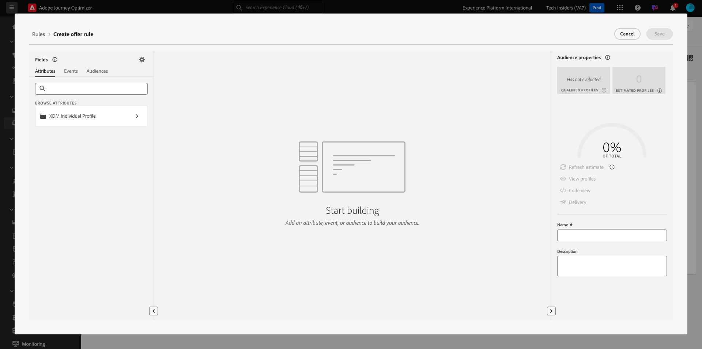

# 3.3.1 Offer decisioning 101

## 3.3.1.1 Terminologie

Um Offer decisioning besser zu verstehen, empfehlen wir Ihnen dringend, die [Übersicht](https://experienceleague.adobe.com/docs/journey-optimizer/using/offer-decisioniong/get-started-decision/starting-offer-decisioning.html?lang=de) über die Funktionsweise des Offer decisioning-Programm-Services mit Adobe Experience Platform zu lesen.

Beim Arbeiten mit Offer decisioning müssen Sie die folgenden Konzepte verstehen:

| Begriff | Erklärung |
| ------------------------- | -------------------------------------------------------------------------------------------------------------------------------------------------------------------------------------------------------------------------------------------------------- |
| **Angebot** | Ein Angebot ist eine Marketing-Nachricht, der ggf. Regeln zugeordnet sind, die angeben, wer sich zum Anzeigen des Angebots eignet. Ein Angebot hat den Status Entwurf, Genehmigt oder Archiviert. |
| **Platzierung** | Die Kombination aus Standort (oder Kanaltyp) und Kontext (oder Inhaltstyp), in dem ein Angebot für einen Endbenutzer angezeigt wird. Im Grunde handelt es sich um eine Kombination aus Text, HTML, Bild, JSON in mobilen, Web-, Social-, Instant Messaging- und nicht digitalen Kanälen. |
| **Regel** | Die Logik, die die Eignung von Endbenutzenden für ein Angebot definiert und steuert. |
| **Personalisiertes Angebot** | Eine anpassbare Marketing-Nachricht, die auf Eignungsregeln und Einschränkungen basiert. |
| **Fallback-Angebot** | Das Standardangebot, das angezeigt wird, wenn ein Endbenutzer für keines der Angebote in der verwendeten Sammlung geeignet ist. |
| **Begrenzung** | Wird in einer Angebotsdefinition verwendet, um festzulegen, wie oft ein Angebot insgesamt und für eine bestimmte Benutzerin oder einen bestimmten Benutzer unterbreitet werden kann. |
| **Priorität** | Ebene, um den Prioritätsrang aus einem Ergebnissatz von Angeboten zu bestimmen. |
| **Sammlung** | Wird zum Filtern einer Untergruppe von Angeboten aus der personalisierten Angebotsliste verwendet, um den offer decisioning-Prozess zu beschleunigen. |
| **Entscheidung** | Eine Kombination aus einer Reihe von Angeboten, Platzierungen und Profilen, für die der Marketer möchte, dass die Entscheidungs-Engine das beste Angebot bereitstellt. |
| **AEM Assets Essentials** | Ein universelles und zentralisiertes Erlebnis zum Speichern, Suchen und Auswählen von Assets in Adobe Experience Cloud-Lösungen und Adobe Experience Platform. |

{style="table-layout:auto"}

## 3.3.1.2 Offer decisioning

Melden Sie sich bei Adobe Journey Optimizer an, indem Sie zu [Adobe Experience Cloud wechseln](https://experience.adobe.com). Auf **Journey Optimizer**.

Sie werden zur Ansicht **Startseite** in Journey Optimizer weitergeleitet. Stellen Sie zunächst sicher, dass Sie die richtige Sandbox verwenden. Die zu verwendende Sandbox heißt `--aepSandboxName--`. Sie befinden sich dann in der **Startseite**-Ansicht Ihres Sandbox-`--aepSandboxName--`.

Klicken Sie im linken Menü auf **Angebote**. Jetzt sehen Sie das Menü Angebote , das Elemente wie Angebote, Sammlungen und Entscheidungen enthält.

Klicken Sie **Komponenten**. Sie sehen jetzt Dinge wie Platzierungen, Sammlungsqualifizierer, Regeln und Rankings.

## Platzierungen 3.3.1.3

Navigieren Sie zu **Platzierungen**.

Auf der Registerkarte **Platzierungen** können Sie Ihre Platzierungen für Ihre Angebote definieren. Wenn Sie eine Entscheidung definieren, definiert die Platzierung, wo das resultierende Angebot angezeigt wird (Kanaltyp) und in welcher Form oder Form (Inhaltstyp).

Wenn Sie keine Platzierungen in Ihrer Umgebung sehen, erstellen Sie sie wie unten und im Screenshot angegeben.

| Name | Kanaltyp | Content-Typ |
| ---------------------- | ------------ | ------------ |
| **Nicht digital – Text** | Nicht digital | Text |
| **Web - JSON** | Web | JSON |
| **Web - HTML** | Web | HTML |
| **Web - Text** | Web | Text |
| **Web – Bild** | Web | Bild |
| **E-Mail - JSON** | E-Mail | JSON |
| **E-Mail - HTML** | E-Mail | HTML |
| **E-Mail - Text** | E-Mail | Text |
| **E-Mail – Bild** | E-Mail | Bild |

{style="table-layout:auto"}

**Hinweis**: Bitte ändern Sie nichts an den bereits verfügbaren Platzierungen.

Klicken Sie auf eine Platzierung, um deren Einstellungen zu visualisieren.

Sie sehen jetzt alle Felder der Platzierung:

- **Name** der Platzierung
- **Platzierungs-ID**
- **Kanaltyp** für die Platzierung
- **Inhaltstyp** der Platzierung, bei der es sich um **Text**, **HTML**, **Image** oder **JSON** handeln kann
- **Beschreibung** Feld, in dem zusätzliche Beschreibungen für die Platzierung hinzugefügt werden können

## Entscheidungsregeln 3.3.1.4

Eine Regel (auch als Eignungsregel bezeichnet) entspricht einer **Zielgruppe**. Eine Regel ist eigentlich eine Zielgruppe selbst, mit dem einzigen Unterschied, dass eine Regel mit einem Angebot verwendet werden kann, um einem Profil in Adobe Experience Platform das beste Angebot zu unterbreiten.

Da Sie bereits wissen, wie Sie Zielgruppen basierend auf den vorherigen Aktivierungsmodulen definieren, sollten wir uns die Segmentierungsumgebung noch einmal schnell ansehen:

Navigieren Sie zu **Regeln**. Klicken Sie auf **+ Regel erstellen**.

Anschließend sehen Sie die Benutzeroberfläche zur Zielgruppenerstellung von Adobe Experience Platform.

Sie können jetzt auf alle Felder zugreifen, die Teil des Vereinigungsschemas für das Echtzeit-Kundenprofil sind, und eine beliebige Regel erstellen.

Gut zu wissen ist auch, dass Sie bereits definierte Zielgruppen in Adobe Experience Platform einfach wiederverwenden können, indem Sie zu **Zielgruppen** > ``--aepTenantId--`` gehen.

Sie sehen dann Folgendes:

Wenn Sie möchten, können Sie jetzt Ihre eigenen Regeln konfigurieren. Für diese Übung benötigen Sie zwei Regeln:

- Alle - Männliche Kunden
- Alle - Weibliche Kunden

Wenn diese Regeln noch nicht vorhanden sind, bitte erstellen Sie sie. Wenn sie bereits vorhanden sind, verwenden Sie diese Regeln und erstellen Sie keine neuen Regeln.

Das Attribut, das zum Erstellen der Regel verwendet werden soll, lautet **Individuelles XDM-Profil** > **Person** > **Gender**.

Im Folgenden finden Sie ein Beispiel für die Regeldefinition für die Regel **alle - Männliche Kunden**:

Hier finden Sie beispielsweise die Regeldefinition für die Regel **alle - Weibliche Kunden**:

## Angebote 3.3.1.5

Gehen Sie zu **Angebote** und wählen Sie **Angebote** aus. Klicken Sie auf **+ Angebot erstellen**.

Dann sehen Sie dieses Popup.

Erstellen Sie jetzt keine Angebote - Sie werden dies in der nächsten Übung tun.

Sie sehen, dass es zwei Arten von Angeboten gibt:

- Personalisierte Angebote
- Fallback-Angebote

Ein personalisiertes Angebot ist ein bestimmter Inhalt, der in einer bestimmten Situation angezeigt werden soll. Ein personalisiertes Angebot wurde speziell entwickelt, um ein persönliches und kontextuelles Erlebnis zu bieten, wenn bestimmte Kriterien erfüllt sind.

Ein Fallback-Angebot ist ein Angebot, das angezeigt wird, wenn die Kriterien für personalisierte Angebote nicht erfüllt sind.

## Entscheidungen 3.3.1.6

Eine Entscheidung kombiniert Platzierungen, eine Sammlung personalisierter Angebote und ein Fallback-Angebot, das letztendlich von der Offer decisioning-Engine verwendet wird, um das beste Angebot für ein bestimmtes Profil zu finden, basierend auf den individuellen personalisierten Angebotsmerkmalen wie Priorität, Eignungsbegrenzung und Gesamtbegrenzung / Benutzerobergrenze.

Um Ihre **Entscheidung** zu konfigurieren, klicken Sie auf **Entscheidungen**.

In der nächsten Übung konfigurieren Sie Ihre eigenen Angebote und Entscheidungen.

Nächster Schritt: [3.3.2 Konfigurieren Sie Ihre Angebote und Entscheidungen](./ex2.md)

[Zurück zum Modul 3.3](./offer-decisioning.md)

[Zurück zu „Alle Module“](./../../../overview.md)
