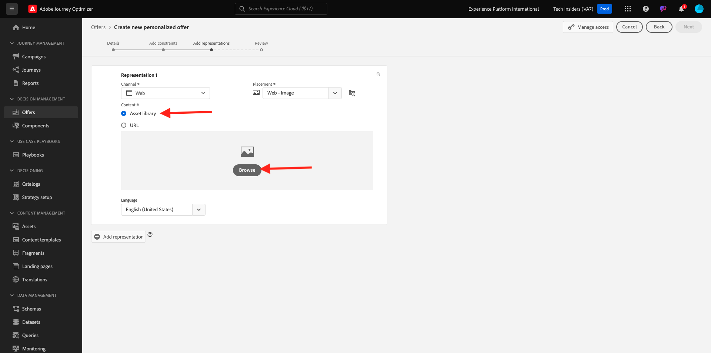
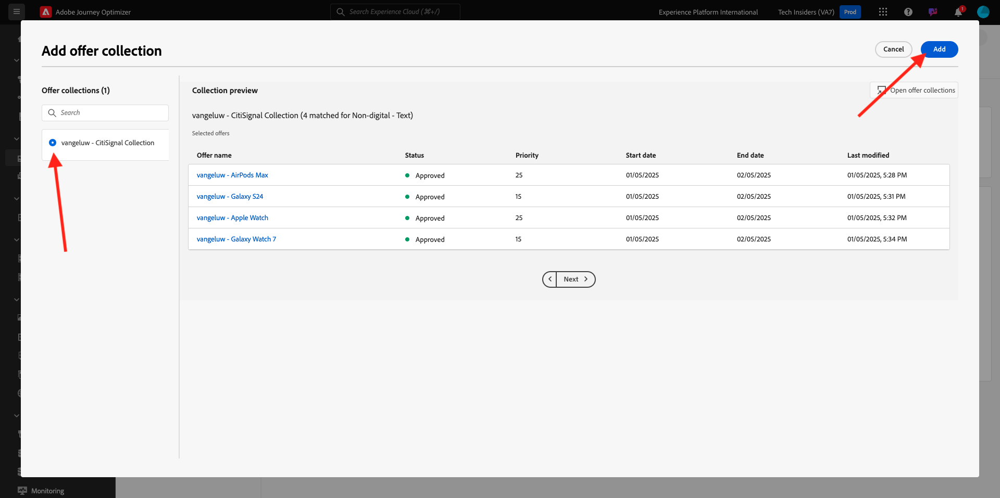
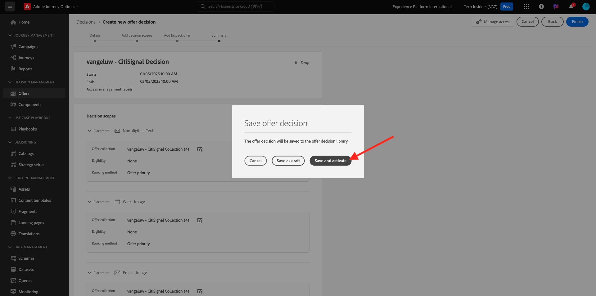

# 3.3.2 Angebot und Entscheidung konfigurieren

## 3.3.2.1 Personalisierte Angebote erstellen

In dieser Übung erstellen Sie vier **personalisierte Angebote**. Im Folgenden finden Sie die Details, die bei der Erstellung dieser Angebote berücksichtigt werden müssen:

| Name | Datumsbereich | Bild-Link für E-Mail | Bild-Link für Web | Text | Priorität | Eignung | Sprache |
|-----|------------|----------------------|--------------------|------|:--------:|--------------|:-------:|
| `--aepUserLdap-- - Nadia Elements Shell` | noch heute - 1 Monat später | https://bit.ly/3nPiwdZ | https://bit.ly/2INwXjt | `{{ profile.person.name.firstName }}, 10% discount on Nadia Elements Shell` | 25 | all - Weibliche Kunden | Englisch (USA) |
| `--aepUserLdap-- - Radiant Tee` | noch heute - 1 Monat später | https://bit.ly/2HfA17v | https://bit.ly/3pEIdzn | `{{ profile.person.name.firstName }}, 5% discount on Radiant Tee` | 15 | all - Weibliche Kunden | Englisch (USA) |
| `--aepUserLdap-- - Zeppelin Yoga Pant` | noch heute - 1 Monat später | https://bit.ly/2IOaItW | https://bit.ly/2INZHZd | `{{ profile.person.name.firstName }}, 10% discount on Zeppelin Yoga Pant` | 25 | all - Männliche Kunden | Englisch (USA) |
| `--aepUserLdap-- - Proteus Fitness Jackshirt` | noch heute - 1 Monat später | https://bit.ly/330a43n | https://bit.ly/36USaQW | `{{ profile.person.name.firstName }}, 5% discount on Proteus Fitness Jackshirt` | 15 | all - Männliche Kunden | Englisch (USA) |

{style="table-layout:auto"}

Melden Sie sich bei Adobe Journey Optimizer an, indem Sie zu [Adobe Experience Cloud](https://experience.adobe.com) wechseln. Klicken Sie auf **Journey Optimizer**.

Sie werden zur Ansicht **Home** in Journey Optimizer weitergeleitet. Vergewissern Sie sich zunächst, dass Sie die richtige Sandbox verwenden. Die zu verwendende Sandbox heißt `--aepSandboxName--`. Um von einer Sandbox zu einer anderen zu wechseln, klicken Sie auf **PRODUKTIONSPROD (VA7)** und wählen Sie die Sandbox aus der Liste aus. In diesem Beispiel erhält die Sandbox den Namen **AEP-Aktivierung FY22**. Sie befinden sich dann in der Ansicht **Home** Ihrer Sandbox `--aepSandboxName--`.

Klicken Sie im linken Menü auf **Angebote** und gehen Sie dann zu **Angebote**. Klicken Sie auf **+ Angebot erstellen**.

Dann sehen Sie dieses Popup. Wählen Sie **Personalisiertes Angebot** und klicken Sie auf **Weiter**.

Sie befinden sich jetzt in der Ansicht **Details** .

In diesem Fall müssen Sie das Angebot `--aepUserLdap-- - Nadia Elements Shell` konfigurieren. Füllen Sie die Felder mithilfe der Informationen in der obigen Tabelle aus. In diesem Beispiel lautet der Name des personalisierten Angebots **vangeluw - Nadia Elements Shell**. Legen Sie außerdem das **Startdatum und die Startzeit** auf &quot;Gestern&quot;fest und setzen Sie das **Enddatum und die Endzeit** in einem Monat auf ein Datum.

Nach der Fertigstellung sollten Sie das haben. Klicken Sie auf **Weiter**.

Sie müssen jetzt **Darstellungen** erstellen. Darstellungen sind eine Kombination aus einer **Platzierung** und einem echten Asset.

Wählen Sie für **Darstellung 1** Folgendes aus:

- Kanal: Web
- Platzierung: Web - Image
- Inhalt: URL
- Öffentlicher Speicherort: Kopieren Sie die URL aus der Spalte **Bild-Link für Web** in der obigen Tabelle.

Alternativ können Sie **Asset-Bibliothek** für den Inhalt auswählen und dann auf **Durchsuchen** klicken.

Sie sehen dann ein Popup der Assets-Bibliothek, wechseln zum Ordner &quot;**enable-assets**&quot;und wählen die Bilddatei &quot;**nadia-web.png**&quot;. Klicken Sie dann auf **Auswählen**.

Daraufhin sehen Sie Folgendes:

Klicken Sie auf **+ Repräsentation hinzufügen**.

Wählen Sie für **Darstellung 2** Folgendes aus:

- Kanal: E-Mail
- Platzierung: E-Mail - Bild
- Inhalt: URL
- Öffentlicher Speicherort: Kopieren Sie die URL aus der Spalte **Bild-Link für E-Mail** in der obigen Tabelle.

Alternativ können Sie **Asset-Bibliothek** für den Inhalt auswählen und dann auf **Durchsuchen** klicken.

Sie sehen dann ein Popup der Assets-Bibliothek, wechseln zum Ordner &quot;**enable-assets**&quot;und wählen die Bilddatei &quot;**nadia-email.png**&quot;. Klicken Sie dann auf **Auswählen**.

Daraufhin sehen Sie Folgendes:

Klicken Sie anschließend auf **+ Repräsentation hinzufügen**.

Wählen Sie für **Darstellung 3** Folgendes aus:

- Kanal: Nicht digital
- Platzierung: Nicht digital - Text

Als Nächstes müssen Sie Inhalte hinzufügen. In diesem Fall bedeutet dies das Hinzufügen des Textes, der als Aktionsaufruf verwendet werden soll.

Klicken Sie auf **Inhalt hinzufügen**.

Dann sehen Sie dieses Popup.

Wählen Sie **Benutzerdefinierter Text** aus und füllen Sie die folgenden Felder aus:

Sehen Sie sich das Feld **Text** aus der obigen Tabelle an und geben Sie diesen Text hier ein, in diesem Fall: `{{ profile.person.name.firstName }}, 10% discount on Nadia Elements Shell`.

Sie werden auch feststellen, dass Sie jedes Profilattribut als dynamisches Feld in den Angebotstext einfügen können. In diesem Beispiel stellt das Feld `{{ profile.person.name.firstName }}` sicher, dass der Vorname des Kunden, der dieses Angebot erhält, in den Angebotstext aufgenommen wird.

Dann wirst du das sehen. Klicken Sie auf **Speichern**.

Das hast du jetzt. Klicken Sie auf **Weiter**.

Daraufhin sehen Sie Folgendes:

Wählen Sie **Durch definierte Entscheidungsregel** und klicken Sie auf das Symbol **+**, um die Regel **all - Weibliche Kunden** hinzuzufügen.

Dann wirst du das sehen. Geben Sie die **Priorität** wie in der obigen Tabelle angegeben ein. Klicken Sie auf **Weiter**.

Daraufhin wird eine Übersicht über Ihr neues **personalisiertes Angebot** angezeigt.

Klicken Sie abschließend auf **Speichern und genehmigen**.

Ihr neu erstelltes personalisiertes Angebot wird dann in der Angebotsübersicht angezeigt:

Wiederholen Sie nun die oben genannten Schritte, um die drei anderen personalisierten Angebote für die Produkte Radiant Tee, Zeppelin Yoga Pant und Proteus Fitness Jackshirt zu erstellen.

Wenn Sie fertig sind, sollten im Bildschirm **Angebotsübersichten** für **personalisierte Angebote** alle Ihre Angebote angezeigt werden.

## 3.3.2.2 Fallback-Angebot erstellen

Nachdem Sie vier personalisierte Angebote erstellt haben, sollten Sie jetzt ein **Fallback-Angebot** konfigurieren.

Stellen Sie sicher, dass Sie sich in der Ansicht **Angebote** befinden:

Klicken Sie auf **+ Angebot erstellen**.

Dann sehen Sie dieses Popup. Wählen Sie **Fallback-Angebot** und klicken Sie auf **Weiter**.

Daraufhin sehen Sie Folgendes:

Geben Sie folgenden Namen für Ihr Fallback-Angebot ein: `--aepUserLdap-- - Luma Fallback Offer`. Klicken Sie auf **Weiter**.

Sie müssen jetzt **Darstellungen** erstellen. Darstellungen sind eine Kombination aus einer **Platzierung** und einem echten Asset.

Wählen Sie für **Darstellung 1** Folgendes aus:

- Kanal: Web
- Platzierung: Web - Image
- Inhalt: URL
- Öffentlicher Speicherort: `https://bit.ly/3nBOt9h`

Alternativ können Sie **Asset-Bibliothek** für den Inhalt auswählen und dann auf **Durchsuchen** klicken.

Sie sehen dann ein Popup der Assets-Bibliothek, wechseln zum Ordner &quot;**enable-assets**&quot;und wählen die Bilddatei &quot;**spriteyogastraps-web.png**&quot;. Klicken Sie dann auf **Auswählen**.

Daraufhin sehen Sie Folgendes:

Wählen Sie für **Darstellung 2** Folgendes aus:

- Kanal: E-Mail
- Platzierung: E-Mail - Bild
- Inhalt: URL
- Öffentlicher Speicherort: `https://bit.ly/3nF4qvE`

Alternativ können Sie **Asset-Bibliothek** für den Inhalt auswählen und dann auf **Durchsuchen** klicken.

Sie sehen dann ein Popup der Assets-Bibliothek, wechseln zum Ordner &quot;**enable-assets**&quot;und wählen die Bilddatei &quot;**spriteyogastraps-email.png**&quot;. Klicken Sie dann auf **Auswählen**.

Daraufhin sehen Sie Folgendes:

Klicken Sie anschließend auf **+ Repräsentation hinzufügen**.

Wählen Sie für **Darstellung 3** Folgendes aus:

- Kanal: Nicht digital
- Platzierung: Nicht digital - Text

Als Nächstes müssen Sie Inhalte hinzufügen. In diesem Fall bedeutet dies das Hinzufügen des Bild-Links.

Klicken Sie auf **Inhalt hinzufügen**.

Dann sehen Sie dieses Popup.

Wählen Sie **Benutzerdefinierter Text** aus und füllen Sie die folgenden Felder aus:

Geben Sie den Text `{{ profile.person.name.firstName }}, discover our Sprite Yoga Straps!` ein und klicken Sie auf **Speichern**.

Dann wirst du das sehen. Klicken Sie auf **Weiter**.

Daraufhin wird ein Überblick über Ihr neues **Fallback-Angebot** angezeigt. Klicken Sie auf **Fertigstellen**.

Klicken Sie abschließend auf **Speichern und genehmigen**.

Im Bildschirm **Angebotsübersichten** sehen Sie jetzt Folgendes:

## 3.3.2.3 Sammlung erstellen

Mit einer Kollektion wird **filter** aus einer Untergruppe von Angeboten aus der personalisierten Angebotsliste herausgefiltert und als Teil einer Entscheidung verwendet, um den Entscheidungsprozess zu beschleunigen.

Wechseln Sie zu **Sammlungen**. Klicken Sie auf **+ Sammlung erstellen**.

Dann sehen Sie dieses Popup. Konfigurieren Sie Ihre Sammlung wie folgt. Klicken Sie auf **Weiter**.

- Sammlungsname: Verwenden Sie `--aepUserLdap-- - Luma Collection`
- Wählen Sie **Statische Sammlung erstellen** aus.

Wählen Sie im nächsten Bildschirm die vier von Ihnen in der vorherigen Übung erstellten personalisierten Angebote **1 aus.** Klicken Sie auf **Speichern**.

Jetzt sehen Sie Folgendes:

## 3.3.2.4 Entscheidung erstellen

Eine Entscheidung kombiniert Platzierungen, eine Kollektion personalisierter Angebote und ein Fallback-Angebot, die letztendlich vom Offer decisioning-Modul verwendet werden, um das beste Angebot für ein bestimmtes Profil zu finden, basierend auf den individuellen personalisierten Angebotsmerkmalen wie Priorität, Eignungsbegrenzung und Gesamtanzahl/Benutzerobergrenze.

Um Ihre **Entscheidung** zu konfigurieren, gehen Sie zu **Entscheidungen**. Klicken Sie auf **+ Aktivität erstellen**.

Daraufhin sehen Sie Folgendes:

Füllen Sie die Felder wie diese aus. Klicken Sie auf **Weiter**.

- Name: `--aepUserLdap-- - Luma Decision`
- Startdatum und -zeit: gestern
- Enddatum und -zeit: heute + 1 Monat

Im nächsten Bildschirm müssen Sie Platzierungen zu Entscheidungsbereichen hinzufügen. Sie müssen Entscheidungsbereiche für die Platzierungen **Web - Bild**, **E-Mail - Bild** und **Nicht-digital - Text** erstellen.

Erstellen Sie zunächst den Entscheidungsbereich für **Nicht digital - Text**, indem Sie diese Platzierung im Dropdown-Menü auswählen. Klicken Sie dann auf die Schaltfläche **Hinzufügen** , um Bewertungskriterien hinzuzufügen.

Wählen Sie Ihre Sammlung `--aepUserLdap-- - Luma Collection` aus und klicken Sie auf **Hinzufügen**.

Dann wirst du das sehen. Klicken Sie auf die Schaltfläche **-** , um einen neuen Entscheidungsbereich hinzuzufügen.

Wählen Sie die Platzierung **Web - Bild** aus und fügen Sie Ihre Sammlung `--aepUserLdap-- - Luma Collection` unter den Bewertungskriterien hinzu. Klicken Sie dann erneut auf die Schaltfläche **+** , um einen neuen Entscheidungsbereich hinzuzufügen.

Wählen Sie die Platzierung **E-Mail - Bild** aus und fügen Sie Ihre Sammlung `--aepUserLdap-- - Luma Collection` unter den Bewertungskriterien hinzu. Klicken Sie dann auf **Weiter**.

Sie müssen jetzt Ihr **Fallback-Angebot** auswählen, das den Namen `--aepUserLdap-- - Luma Fallback Offer` trägt. Klicken Sie auf **Weiter**.

Überprüfen Sie Ihre Entscheidung. Klicken Sie auf **Fertigstellen**.

Klicken Sie im Popup-Fenster auf **Speichern und aktivieren**.

Und schließlich sehen Sie Ihre Entscheidung in der Übersicht:

Sie haben Ihre Entscheidung jetzt erfolgreich konfiguriert. Ihre Entscheidung ist jetzt live und kann dazu verwendet werden, Ihren Kunden optimierte und personalisierte Angebote in Echtzeit bereitzustellen.

Nächster Schritt: [3.3.3 Vorbereitung der Datenerfassungs-Client-Eigenschaft und des Web-SDK-Setups für Offer decisioning](./ex3.md)

[Zurück zu Modul 3.3](./offer-decisioning.md)

[Zu allen Modulen zurückkehren](./../../../overview.md)
