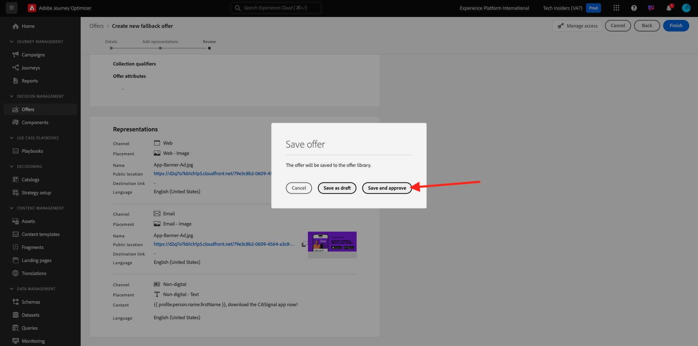

# 3.3.2 Angebote und Entscheidungen konfigurieren

## 3.3.2.1 Personalisierte Angebote erstellen

In dieser Übung erstellen Sie vier **personalisierte Angebote**. Im Folgenden finden Sie die Details, die bei der Erstellung dieser Angebote zu berücksichtigen sind:

| Name | Datumsbereich | Bild-Link für E-Mail | Bildlink für Web | Text | Priorität | Eignung | Sprache | Begrenzungsfrequenz | Bildname |
|-----|------------|----------------------|--------------------|------|:--------:|--------------|:-------:|:-------:|:-------:|
| `--aepUserLdap-- - AirPods Max` | Heute - 1 Monat später | https://bit.ly/4a9RJ5d | Aus Assets Library auswählen | `{{ profile.person.name.firstName }}, 10% discount on AirPods Max` | 25 | Alle - Weibliche Kunden | Englisch (USA) | 3 | Apple AirPods Max - Weiblich.jpg |
| `--aepUserLdap-- - Galaxy S24` | Heute - 1 Monat später | https://bit.ly/3W8yuDv | Aus Assets Library auswählen | `{{ profile.person.name.firstName }}, 5% discount on Galaxy S24` | 15 | Alle - Weibliche Kunden | Englisch (USA) | 3 | Galaxy S24 - Weiblich.jpg |
| `--aepUserLdap-- - Apple Watch` | Heute - 1 Monat später | https://bit.ly/4fGwfxX | https://bit.ly/4fGwfxX | `{{ profile.person.name.firstName }}, 10% discount on Apple Watch` | 25 | Alle - Männliche Kunden | Englisch (USA) | 3 | Apple Watch - Male.jpg |
| `--aepUserLdap-- - Galaxy Watch 7` | Heute - 1 Monat später | https://bit.ly/4gTrkeo | Aus Assets Library auswählen | `{{ profile.person.name.firstName }}, 5% discount on Galaxy Watch 7` | 15 | Alle - Männliche Kunden | Englisch (USA) | 3 | Galaxy Watch7 - Männlich.jpg |

{style="table-layout:auto"}

Melden Sie sich bei Adobe Journey Optimizer an, indem Sie zu [Adobe Experience Cloud wechseln](https://experience.adobe.com). Auf **Journey Optimizer**.

Sie werden zur Ansicht **Startseite** in Journey Optimizer weitergeleitet. Stellen Sie zunächst sicher, dass Sie die richtige Sandbox verwenden. Die zu verwendende Sandbox heißt `--aepSandboxName--`. Sie befinden sich dann in der **Startseite**-Ansicht Ihres Sandbox-`--aepSandboxName--`.

Klicken Sie im linken Menü auf **Angebote** und gehen Sie dann zu **Angebote**. Klicken Sie auf **+ Angebot erstellen**.

Dann sehen Sie dieses Popup. Wählen Sie **Personalisiertes Angebot** aus und klicken Sie auf **Weiter**.

Sie befinden sich jetzt in der Ansicht **Details**.

In diesem Fall müssen Sie den `--aepUserLdap-- - AirPods Max` konfigurieren. Füllen Sie die Felder anhand der Informationen in der obigen Tabelle aus. In diesem Beispiel lautet der Name des personalisierten Angebots **vangeluw - AirPods Max**. Legen Sie außerdem **Startdatum und -uhrzeit** auf „Heute“ und **Enddatum und -uhrzeit** auf ein Datum in einem Monat fest.

Sobald das erledigt ist, sollten Sie es haben. Klicken Sie auf **Weiter**.

Sie sehen dann Folgendes:

Wählen Sie **Nach definierter Entscheidungsregel** und klicken Sie auf das Symbol **+** , um die Regel **Alle - Weibliche Kunden“**.

Füllen Sie die **Priorität** wie in der obigen Tabelle angegeben aus. Klicken Sie anschließend auf **+ Begrenzung erstellen** um festzulegen, wie oft dieses Angebot einer Kundin oder einem Kunden angezeigt werden kann.

Wählen Sie für die Begrenzung Folgendes aus:

- **Begrenzungsereignis auswählen**: **Entscheidungsereignis**
- **Begrenzungstyp**: **Pro Profil (Begrenzung für jedes Profil anwenden)**
- **Anzahl der Begrenzungsereignisse**: **3**
- **Begrenzungshäufigkeit zurücksetzen**: **Täglich**
- **Jeden**: **1 Tag**

Dadurch wird sichergestellt, dass dieses Angebot nicht öfter als dreimal pro Tag und Kunde angezeigt wird.

Klicken Sie auf **Erstellen**.

Dann bist du wieder hier. Klicken Sie auf **Weiter**.

Jetzt müssen Sie (**)**. Darstellungen sind eine Kombination aus einer **Platzierung** und einem echten Asset.

Wählen Sie für **Darstellung 1** Folgendes aus:

- Kanal: Web
- Platzierung: Web - Bild
- Inhalt: URL
- Öffentlicher Speicherort: Kopieren Sie die URL aus der Spalte **Bildlink für Web** in der obigen Tabelle

Alternativ können Sie **Asset-Bibliothek** für den Inhalt auswählen und dann auf **Durchsuchen** klicken.

Anschließend wird ein Popup der Assets-Bibliothek angezeigt. Wechseln Sie zum Ordner **enable-assets** und wählen Sie die Bilddatei **Apple AirPods Max - Female.jpg** aus. Klicken Sie dann auf **Auswählen**.

Sie werden es dann sehen. Klicken Sie auf **+ Darstellung**.

Wählen Sie für **Darstellung**:

- Kanal: E-Mail
- Platzierung: E-Mail - Bild
- Inhalt: URL
- Öffentlicher Speicherort: Wählen Sie **Asset-Bibliothek** aus. Klicken Sie auf **Durchsuchen**

Anschließend wird ein Popup der Assets-Bibliothek angezeigt. Wechseln Sie zum Ordner **enable-assets** und wählen Sie die Bilddatei **Apple AirPods Max - Female.jpg** aus. Klicken Sie dann auf **Auswählen**.

Sie werden es dann sehen. Klicken Sie anschließend auf **+ Darstellung hinzufügen**.

Wählen Sie **Darstellung 3** Folgendes aus:

- Kanal: Nicht digital
- Platzierung: Nicht digital - Text

Als Nächstes müssen Sie Inhalte hinzufügen. In diesem Fall bedeutet dies, dass der Text hinzugefügt wird, der als Aktionsaufruf verwendet werden soll.

Wählen Sie **Benutzerdefiniert** und klicken Sie auf **Inhalt hinzufügen**.

Dann sehen Sie dieses Popup.

Schauen Sie sich das **Text** Feld aus der obigen Tabelle an und geben Sie diesen Text hier ein, in diesem Fall: `{{ profile.person.name.firstName }}, 10% discount on AirPods Max`.

Sie werden auch feststellen, dass Sie ein beliebiges Profilattribut auswählen und es als dynamisches Feld in den Angebotstext aufnehmen können. In diesem Beispiel stellt die `{{ profile.person.name.firstName }}` sicher, dass der Vorname des Kunden, der dieses Angebot erhält, im Angebotstext enthalten ist.

Sie werden es dann sehen. Klicken Sie auf **Speichern**.

Jetzt hast du das. Klicken Sie auf **Weiter**.

Anschließend sehen Sie einen Überblick über Ihr neues **personalisiertes Angebot**. Klicken Sie auf **Fertigstellen**.

Klicken Sie **Speichern und genehmigen**.

Anschließend wird Ihr neu erstelltes personalisiertes Angebot in der Angebotsübersicht verfügbar:

Sie sollten nun die obigen Schritte wiederholen, um die drei anderen personalisierten Angebote für die Produkte zu erstellen, die Sie in der obigen Tabelle finden.

Danach sollte der Bildschirm **Angebotsübersichten** für **Personalisierte Angebote** alle Ihre Angebote anzeigen.

## 3.3.2.2 Fallback-Angebot erstellen

Nachdem Sie vier personalisierte Angebote erstellt haben, sollten Sie jetzt ein **Fallback-Angebot“**.

Stellen Sie sicher, dass Sie sich in der Ansicht **Angebote** befinden. Klicken Sie auf **+ Angebot erstellen**.

Dann sehen Sie dieses Popup. Wählen Sie **Fallback-Angebot** aus und klicken Sie auf **Weiter**.

Sie werden es dann sehen. Geben Sie folgenden Namen für Ihr Fallback-Angebot ein: `--aepUserLdap-- - CitiSignal Fallback Offer`. Klicken Sie auf **Weiter**.

Jetzt müssen Sie (**)**. Darstellungen sind eine Kombination aus einer **Platzierung** und einem echten Asset.

Wählen Sie für **Darstellung 1** Folgendes aus:

- **channel**: **web**
- **Placement**: **Web - Bild**
- **Content**: **Asset-Bibliothek**

Klicken Sie **Durchsuchen**, um Ihr Bild auszuwählen.

Sie sehen dann ein Popup der Assets-Bibliothek, wechseln Sie zum Ordner **citi-signal-images** und wählen Sie die Bilddatei **App-Banner-Ad.jpg** aus. Klicken Sie dann auf **Auswählen**.

Sie werden es dann sehen. Klicken Sie auf **+ Darstellung hinzufügen**.

Wählen Sie für **Darstellung**:

- **channel**: **email**
- **Platzierung**: **E-Mail - Bild**
- **Content**: **Asset-Bibliothek**

Klicken Sie **Durchsuchen**, um Ihr Bild auszuwählen.

Sie sehen dann ein Popup der Assets-Bibliothek, wechseln Sie zum Ordner **citi-signal-images** und wählen Sie die Bilddatei **App-Banner-Ad.jpg** aus. Klicken Sie dann auf **Auswählen**.

Sie werden es dann sehen. Klicken Sie auf **+ Darstellung hinzufügen**.

Wählen Sie **Darstellung 3** Folgendes aus:

- **Kanal**: **Nicht digital**
- **Platzierung**: **Nicht digital - Text**
- **content**: **custom**

Klicken Sie **Inhalt hinzufügen**.

Dann sehen Sie dieses Popup. Geben Sie den `{{ profile.person.name.firstName }}, download the CitiSignal app now!` ein und klicken Sie auf **Speichern**.

Sie werden es dann sehen. Klicken Sie auf **Weiter**.

Anschließend sehen Sie einen Überblick über Ihr neues **Fallback-Angebot**. Klicken Sie auf **Fertigstellen**.

Klicken Sie abschließend auf **Speichern und genehmigen**.

Auf dem Bildschirm **Angebotsübersichten** wird nun Folgendes angezeigt:

## 3.3.2.3 Sammlung erstellen

Eine Sammlung wird verwendet **um eine Untergruppe von Angeboten aus der personalisierten Angebotsliste** herauszufiltern) und diese als Teil einer Entscheidung zu verwenden, um den Entscheidungsprozess zu beschleunigen.

Navigieren Sie zu **Sammlungen**. Klicken Sie auf **+ Sammlung erstellen**.

Daraufhin wird dieses Popup angezeigt. Konfigurieren Sie Ihre Sammlung wie folgt. Klicken Sie auf **Weiter**.

- Sammlungsname: Verwenden Sie `--aepUserLdap-- - CitiSignal Collection`
- Wählen Sie **Statische Sammlung erstellen** aus.

Klicken Sie auf **Weiter**.

Wählen Sie im nächsten Bildschirm die vier **Personalisierten Angebote** aus, die Sie in der vorherigen Übung erstellt haben. Klicken Sie auf **Speichern**.

Sie sehen dies jetzt:

## 3.3.2.4 Entscheidung erstellen

Eine Entscheidung kombiniert Platzierungen, eine Sammlung personalisierter Angebote und ein Fallback-Angebot, das letztendlich von der Offer decisioning-Engine verwendet wird, um das beste Angebot für ein bestimmtes Profil zu finden, basierend auf den individuellen personalisierten Angebotsmerkmalen wie Priorität, Eignungsbegrenzung und Gesamtbegrenzung / Benutzerobergrenze.

Um Ihre **Entscheidung** zu konfigurieren, navigieren Sie zu **Entscheidungen**. Klicken Sie auf **+ Entscheidung erstellen**.

Sie werden es dann sehen. Füllen Sie die Felder wie folgt aus. Klicken Sie auf **Weiter**.

- Name: `--aepUserLdap-- - CitiSignal Decision`
- Startdatum und -uhrzeit: heute
- Enddatum und -uhrzeit: heute + 1 Monat

Im nächsten Bildschirm müssen Sie Platzierungen zu Entscheidungsumfängen hinzufügen. Sie müssen Entscheidungsumfänge für die Platzierungen (Web **Bild),** E-**Bild** und **Nicht digital - Text** erstellen.

Erstellen Sie zunächst den Entscheidungsumfang für **Nicht digital - Text**, indem Sie diese Platzierung in der Dropdown-Liste auswählen. Klicken Sie dann auf **Hinzufügen**, um Bewertungskriterien hinzuzufügen.

Wählen Sie Ihre `--aepUserLdap-- - CitiSignal Collection` aus und klicken Sie auf **Hinzufügen**.

Sie werden es dann sehen. Klicken Sie auf die Schaltfläche **+**, um einen neuen Entscheidungsumfang hinzuzufügen.

Wählen Sie die Platzierung **Web - Bild** aus und fügen Sie Ihre `--aepUserLdap-- - CitiSignal Collection` unter Auswertungskriterien hinzu. Klicken Sie dann erneut auf die Schaltfläche **+**, um einen neuen Entscheidungsumfang hinzuzufügen.

Wählen Sie die Platzierung **E-Mail - Bild** aus und fügen Sie Ihre `--aepUserLdap-- - CitiSignal Collection` unter „Auswertungskriterien“ hinzu. Klicken Sie dann auf **Weiter**.

Nun müssen Sie Ihr **Fallback-Angebot** auswählen, das `--aepUserLdap-- - CitiSignal Fallback Offer` heißt. Klicken Sie auf **Weiter**.

Überprüfen Sie Ihre Entscheidung. Klicken Sie auf **Fertigstellen**.

Klicken Sie im Popup auf **Speichern und**.

Und schließlich sehen Sie jetzt Ihre Entscheidung in der Übersicht:

Sie haben Ihre Entscheidung jetzt erfolgreich konfiguriert. Ihre Entscheidung ist jetzt live und kann verwendet werden, um Ihren Kunden optimierte und personalisierte Angebote in Echtzeit bereitzustellen.

Nächster Schritt: [3.3.3 Bereiten Sie Ihre Datenerfassungs-Client-Eigenschaft und das Web-SDK-Setup für das Offer decisioning vor](./ex3.md)

[Zurück zum Modul 3.3](./offer-decisioning.md)

[Zurück zu „Alle Module“](./../../../overview.md)
