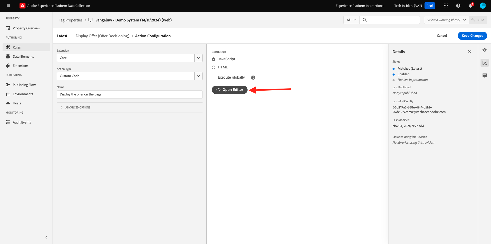
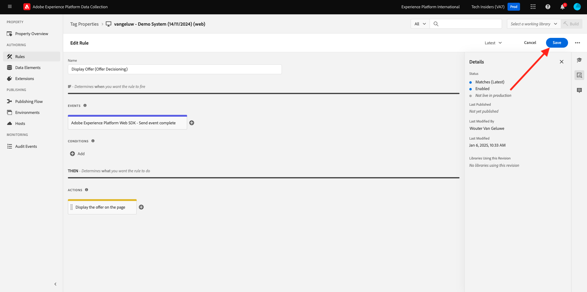
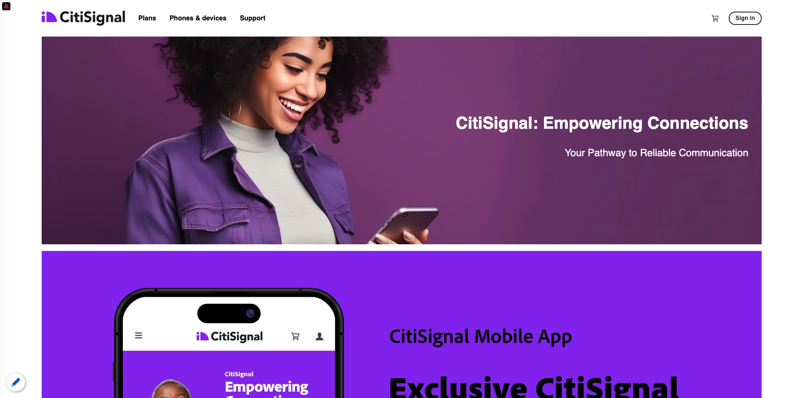

# 3.3.3 Vorbereiten der Adobe Experience Platform-Datenerfassungs-Client-Eigenschaft und des Web-SDK-Setups für Offer decisioning

## 3.3.3.1 Datenspeicher aktualisieren

In [Übung 0.2](./../../../modules/gettingstarted/gettingstarted/ex2.md) haben Sie Ihren eigenen **[!UICONTROL Datastream]** erstellt. Dann haben Sie den Namen `--demoProfileLdap-- - Demo System Datastream` verwendet.

In dieser Übung müssen Sie diesen **[!UICONTROL Datastream]** so konfigurieren, dass er mit **[!DNL Offer Decisioning]** funktioniert.

Gehen Sie dazu zu [https://experience.adobe.com/#/data-collection/](https://experience.adobe.com/#/data-collection/). Dann wirst du das sehen. Klicken Sie auf **[!UICONTROL Datastreams]** oder **[!UICONTROL Datastreams (Beta)]**.

Wählen Sie oben rechts auf Ihrem Bildschirm den Namen Ihrer Sandbox aus, der `--aepSandboxId--` lauten soll.


Suchen Sie nach Ihrem **[!UICONTROL Datastream]** mit dem Namen `--demoProfileLdap-- - Demo System Datastream`. Klicken Sie auf Ihren **[!UICONTROL Datastream]**, um ihn zu öffnen.


Dann wirst du das sehen. Klicken Sie auf **...** neben **Adobe Experience Platform** und klicken Sie dann auf **Bearbeiten**.


Um **[!DNL Offer Decisioning]** zu aktivieren, aktivieren Sie das Kontrollkästchen für **[!DNL Offer Decisioning]**. Klicken Sie auf **Speichern**.


Ihr **[!UICONTROL Datastream]** kann jetzt mit **[!DNL Offer Decisioning]** verwendet werden.


## 3.3.3.2 Konfigurieren Sie Ihre Adobe Experience Platform Data Collection Client-Eigenschaft, um personalisierte Angebote anzufordern

Wechseln Sie zu [https://experience.adobe.com/#/data-collection/](https://experience.adobe.com/#/data-collection/), zu **[!UICONTROL Client]**. Suchen Sie nach Ihren Datenerfassungseigenschaften mit dem Namen &quot;`--demoProfileLdap-- - Demo System (DD/MM/YYYY)`&quot;. Öffnen Sie die Client-Eigenschaft &quot;Datenerfassung&quot;für das Web.


Wechseln Sie in Ihrer Eigenschaft zu **[!UICONTROL Regeln]** und öffnen Sie die Regel **[!UICONTROL Seitenansicht]**.


Klicken Sie auf , um die [!UICONTROL Aktion] **[!UICONTROL AEP Web SDK - Send Event]** zu öffnen.


Dann wirst du das sehen. Sie werden die Menüoption für **[!UICONTROL Entscheidungsbereiche]** bemerken.


Für jede Anfrage, die an den -Edge und an Adobe Experience Platform gesendet wird, können Sie einen oder mehrere **[!UICONTROL Entscheidungsbereiche]** angeben. Ein **[!UICONTROL Entscheidungsbereich]** ist eine Kombination aus zwei Elementen:

- [!UICONTROL Decision ID]
- [!UICONTROL Platzierungs-ID]

Sehen wir uns zunächst einmal an, wo Sie diese beiden Elemente finden können.

### 3.3.3.2.1 Ihre [!UICONTROL Platzierungs-ID] abrufen

Die [!UICONTROL Platzierungs-ID] gibt den Speicherort und den Typ des erforderlichen Assets an. Beispielsweise entspricht das Hero-Bild auf der Startseite der Luma-Website der [!UICONTROL Platzierungs-ID] für [!UICONTROL Web - Image].

>[!NOTE]
>
>Als Teil von Modul 6 haben Sie bereits eine Adobe Target-Erlebnis-Targeting-Aktivität konfiguriert, die das Bild der Heldenposition auf der Homepage ändert, wie im Screenshot dargestellt. Um der Übung willen werden Sie Ihre Angebote nun auf dem Bild unterhalb des Heldenbilds erscheinen lassen, wie im Screenshot angegeben.


Um die [!UICONTROL Platzierungs-ID] für [!UICONTROL Web - Bild] zu finden, gehen Sie zu Adobe Journey Optimizer, indem Sie zu [Adobe Experience Cloud](https://experience.adobe.com) gehen. Klicken Sie auf **Journey Optimizer**.


Sie werden zur Ansicht **Home** in Journey Optimizer weitergeleitet. Vergewissern Sie sich zunächst, dass Sie die richtige Sandbox verwenden. Die zu verwendende Sandbox heißt `--aepSandboxId--`. Um von einer Sandbox zu einer anderen zu wechseln, klicken Sie auf **PRODUKTIONSPROD (VA7)** und wählen Sie die Sandbox aus der Liste aus. In diesem Beispiel erhält die Sandbox den Namen **AEP-Aktivierung FY22**. Sie befinden sich dann in der Ansicht **Home** Ihrer Sandbox `--aepSandboxId--`.


Navigieren Sie als Nächstes zu [!UICONTROL Komponenten] und dann zu [!UICONTROL Platzierungen]. Klicken Sie auf die Platzierung [!UICONTROL Web - Bild] , um deren Details anzuzeigen.


Wie Sie im obigen Bild sehen können, ist in diesem Beispiel die [!UICONTROL Platzierungs-ID] `xcore:offer-placement:14bf09dc4190ebba`. Schreiben Sie die [!UICONTROL Platzierungs-ID] für Ihre Platzierung für [!UICONTROL Web - Bild] auf, da Sie sie in der nächsten Übung benötigen werden.

### 3.3.3.2.2 Ihre [!UICONTROL Entscheidungskennung] abrufen

Die [!UICONTROL Entscheidung-ID] gibt an, welche Kombination aus personalisierten Angeboten und Fallback-Angeboten Sie verwenden möchten. In der vorherigen Übung haben Sie Ihre eigene [!UICONTROL Entscheidung] erstellt und sie `--demoProfileLdap-- - Luma Decision` genannt.

Um die [!UICONTROL Entscheidungskennung] für Ihren `--demoProfileLdap-- - Luma Decision` zu finden, gehen Sie zu [https://platform.adobe.com](https://platform.adobe.com).

Navigieren Sie als Nächstes zu [!UICONTROL Angebote] und gehen Sie dann zu [!UICONTROL Entscheidungen]. Klicken Sie auf , um Ihre [!UICONTROL Entscheidung] auszuwählen, die den Namen `--demoProfileLdap-- - Luma Decision` trägt.


Wie Sie im obigen Bild sehen können, ist in diesem Beispiel die [!UICONTROL Entscheidungs-ID] `xcore:offer-activity:14c052382e1b6505`. Schreiben Sie die [!UICONTROL Entscheidungskennung] für Ihre Entscheidung `--demoProfileLdap-- - Luma Decision` auf, da Sie sie in der nächsten Übung benötigen werden.

Nachdem Sie die beiden Elemente abgerufen haben, die Sie zum Erstellen eines **[!UICONTROL Entscheidungsbereichs]** benötigen, können Sie mit dem nächsten Schritt fortfahren, der die Kodierung des Entscheidungsbereichs umfasst.

### 3.3.3.2.3 BASE64-Kodierung

Der **[!UICONTROL Entscheidungsbereich]**, den Sie eingeben müssen, ist eine BASE64-kodierte Zeichenfolge. Diese BASE64-kodierte Zeichenfolge ist eine Kombination aus der [!UICONTROL Platzierungs-ID] und der [!UICONTROL Entscheidungs-ID], wie unten dargestellt.

```json
{
  "activityId":"xcore:offer-activity:14c052382e1b6505",
  "placementId":"xcore:offer-placement:14bf09dc4190ebba"
}
```

Der **[!UICONTROL Entscheidungsbereich]** kann auf zwei Arten generiert werden:

- Verwenden Sie einen öffentlichen Dienst wie [https://www.base64encode.org/](https://www.base64encode.org/). Geben Sie den JSON-Code wie oben erwähnt ein, klicken Sie auf **[!UICONTROL Kodieren]** und Sie erhalten unten Ihre BASE64-kodierte Zeichenfolge.

  

- Rufen Sie die BASE64-kodierte Zeichenfolge aus Adobe Experience Platform ab. Wechseln Sie zu [!UICONTROL Entscheidungen] und klicken Sie auf , um Ihre [!UICONTROL Entscheidung] mit dem Namen `--demoProfileLdap-- - Luma Decision` zu öffnen.

  

  Nach dem Öffnen von `--demoProfileLdap-- - Luma Decision` sehen Sie dies. Suchen Sie die Platzierung [!UICONTROL Web - Bild] und klicken Sie auf die Schaltfläche **[!UICONTROL Kopieren]** . Klicken Sie anschließend auf **[!UICONTROL Kodierter Entscheidungsbereich]**. Der **[!UICONTROL Entscheidungsbereich]** wird jetzt in die Zwischenablage kopiert.

  

Als Nächstes gehen Sie zurück zu Launch, zu Ihrer Aktion **[!UICONTROL AEP Web SDK - Ereignis senden]**.


Fügen Sie den kodierten Entscheidungsbereich in das Eingabefeld ein.


Speichern Sie Ihre Änderungen in der Aktion **[!UICONTROL AEP Web SDK - Ereignis senden]**, indem Sie auf **[!UICONTROL Änderungen beibehalten]** klicken.


Klicken Sie anschließend auf **[!UICONTROL Speichern]** oder **[!UICONTROL In Bibliothek speichern]**


Wechseln Sie in der Adobe Experience Platform-Datenerfassung zu &quot;**[!UICONTROL Veröffentlichungsfluss]**&quot;und öffnen Sie Ihre **[!UICONTROL Entwicklungsbibliothek]** mit dem Namen &quot;**[!UICONTROL Main]**&quot;. Klicken Sie auf &quot;**[!UICONTROL + Alle geänderten Ressourcen hinzufügen&quot;]** und dann auf &quot;**[!UICONTROL Für Entwicklung speichern und erstellen]**&quot;. Ihre Änderungen werden jetzt auf Ihrer Demo-Website veröffentlicht.


Jedes Mal, wenn Sie jetzt eine **Allgemeine Seite** laden, z. B. auf der Homepage der Demowebsite, bewertet Offer decisioning das jeweilige Angebot und gibt eine Antwort mit den Details des anzuzeigenden Angebots zurück. Die Anzeige des Angebots auf der Website erfordert eine zusätzliche Konfiguration, die Sie im nächsten Schritt durchführen werden.

## 3.3.3.3 Konfigurieren Sie Ihre Adobe Experience Platform Data Collection Client-Eigenschaft für den Empfang und die Anwendung personalisierter Angebote

Wechseln Sie zu [https://experience.adobe.com/#/data-collection/](https://experience.adobe.com/#/data-collection/), zu **[!UICONTROL Eigenschaften]**. Suchen Sie nach Ihren Datenerfassungseigenschaften mit dem Namen &quot;`--demoProfileLdap-- - Demo System (DD/MM/YYYY)`&quot;. Öffnen Sie Ihre Datenerfassungseigenschaft für das Web.


Wechseln Sie in Ihrer Eigenschaft zu **[!UICONTROL Regeln]**.


Suchen und öffnen Sie die Regel &quot;**Entscheidung erhalten**&quot;.


Dann wirst du das sehen. Öffnen Sie die Aktion **Platzieren Sie das Angebot auf der Seite**.


Klicken Sie auf **[!UICONTROL Editor öffnen]**



Überschreiben Sie den Code, indem Sie den unten stehenden Code in den Editor einfügen.

```javascript
if(!Array.isArray(event.decisions)) {
  console.log('No decisions returned')
  return;
}
console.log("decision",event.decisions)

event.decisions.forEach(function(payload) {
  payload.items.forEach(function(item){
    console.log("Response from Offer Decisioning ", item.data.content);
   
    var element = document.querySelector("#root > div > div > div.app-content > div > section.feature_part.padding_top > div > div.row.align-items-center.justify-content-between > div.col-lg-7.col-sm-6.\\30  > div");
    if(!element){
      console.log("Offer Placement Area Selector not found")
      return;
    }
    if(!item.data){
      return
    }
    //check if offer already exists
    var offer = document.querySelector("#root > div > div > div.app-content > div > section.feature_part.padding_top > div > div.row.align-items-center.justify-content-between > div.col-lg-7.col-sm-6.\\30  > div");
    if(!offer){ 
      element.insertAdjacentHTML('afterbegin', item.data.content) 
    }
    else { 
      console.log("item.data.deliveryURL: " + item.data.deliveryURL)
      document.querySelector("#root > div > div > div.app-content > div > section.feature_part.padding_top > div > div.row.align-items-center.justify-content-between > div.col-lg-7.col-sm-6.\\30  > div").style.background="url('"+item.data.deliveryURL+"')";
      document.querySelector("#root > div > div > div.app-content > div > section.feature_part.padding_top > div > div.row.align-items-center.justify-content-between > div.col-lg-7.col-sm-6.\\30  > div").style.backgroundRepeat="no-repeat";
      document.querySelector("#root > div > div > div.app-content > div > section.feature_part.padding_top > div > div.row.align-items-center.justify-content-between > div.col-lg-7.col-sm-6.\\30  > div").style.backgroundPosition="center center";
      document.querySelector("#root > div > div > div.app-content > div > section.feature_part.padding_top > div > div.row.align-items-center.justify-content-between > div.col-lg-7.col-sm-6.\\30  > div").style.backgroundSize = "contain";
    }  
  })
});
```

Die Zeilen 26-27-28-29 wenden das Bild an, das von Offer decisioning an die Website zurückgegeben wird. Klicken Sie auf **[!UICONTROL Speichern]**.


Klicken Sie auf **[!UICONTROL Änderungen beibehalten]**.


Klicken Sie anschließend auf **[!UICONTROL Speichern]** oder **[!UICONTROL In Bibliothek speichern]**



Wechseln Sie in der Adobe Experience Platform-Datenerfassung zu &quot;**[!UICONTROL Veröffentlichungsfluss]**&quot;und öffnen Sie Ihre **[!UICONTROL Entwicklungsbibliothek]** mit dem Namen &quot;**[!UICONTROL Main]**&quot;. Klicken Sie auf &quot;**[!UICONTROL + Alle geänderten Ressourcen hinzufügen&quot;]** und dann auf &quot;**[!UICONTROL Für Entwicklung speichern und erstellen]**&quot;. Ihre Änderungen werden jetzt auf Ihrer Demo-Website veröffentlicht.


Mit dieser Änderung überwacht diese Regel in der Adobe Experience Platform-Datenerfassung nun die Antwort von Offer decisioning, die Teil der Web SDK-Antwort ist. Sobald die Antwort empfangen wird, wird das Bild des Angebots auf der Homepage angezeigt.

Auf der Demo-Website sehen Sie, dass dieses Bild jetzt ersetzt wird:

>[!NOTE]
>
>Als Teil von Modul 6 haben Sie bereits eine Adobe Target-Erlebnis-Targeting-Aktivität konfiguriert, die das Bild der Heldenposition auf der Homepage ändert, wie im Screenshot dargestellt. Um der Übung willen werden Sie Ihre Angebote nun auf dem Bild unterhalb des Heldenbilds erscheinen lassen, wie im Screenshot angegeben.


Und anstelle der standardmäßigen Luma-Website-Bilder sehen Sie jetzt ein Angebot wie dieses. In diesem Fall wird das Fallback-Angebot angezeigt.



Sie haben nun zwei Personalisierungstypen konfiguriert:

- 1 Erlebnis-Targeting-Aktivität mit Adobe Target in Modul 6
- 1 Offer decisioning-Implementierung mithilfe der Datenerfassungseigenschaft

In der nächsten Übung erfahren Sie, wie Sie Ihre in Adobe Journey Optimizer erstellten Angebote und Entscheidungen mit einer Erlebnis-Targeting-Aktivität von Adobe Target kombinieren können.

Nächster Schritt: [3.3.4 Adobe Target und Offer decisioning kombinieren](./ex4.md)

[Zurück zu Modul 3.3](./offer-decisioning.md)

[Zu allen Modulen zurückkehren](./../../../overview.md)
