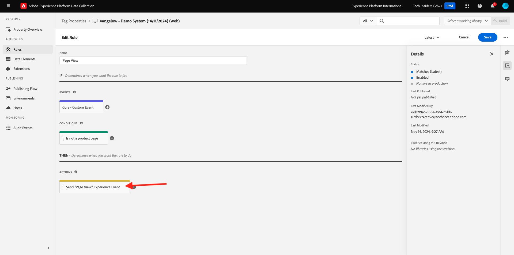
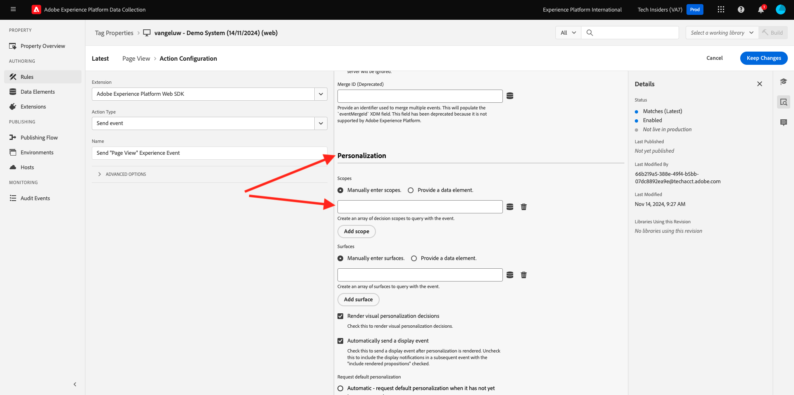

# 3.3.3 Vorbereiten der Client-Eigenschaft der Adobe Experience Platform-Datenerfassung und des Web-SDK-Setups für das Offer decisioning

## 3.3.3.1 Aktualisieren des Datenstroms

In [Übung 0.](./../../../modules/gettingstarted/gettingstarted/ex2.md) haben Sie Ihren eigenen **[!UICONTROL Datenstrom]** erstellt. Sie haben dann den Namen `--aepUserLdap-- - Demo System Datastream` verwendet.

In dieser Übung müssen Sie diesen **[!UICONTROL Datenstrom) so konfigurieren]** dass er mit **[!DNL Offer Decisioning]** funktioniert.

Navigieren Sie dazu zu [https://experience.adobe.com/#/data-collection/](https://experience.adobe.com/#/data-collection/). Sie werden es dann sehen. Klicken Sie **[!UICONTROL Datenströme]** oder **[!UICONTROL Datenströme (Beta)]**.

Wählen Sie oben rechts im Bildschirm den Namen Ihrer Sandbox aus, der `--aepSandboxName--` werden soll.


Suchen Sie nach Ihrem **[!UICONTROL Datenstrom]**, der `--aepUserLdap-- - Demo System Datastream` heißt. Klicken Sie auf **[!UICONTROL Datenstrom]**, um ihn zu öffnen.


Sie werden es dann sehen. Klicken Sie auf **…** neben **Adobe Experience Platform** und dann auf **Bearbeiten**.


Um **[!DNL Offer Decisioning]** zu aktivieren, aktivieren Sie das Kontrollkästchen für **[!DNL Offer Decisioning]**. Klicken Sie auf **Speichern**.


Ihr **[!UICONTROL Datenstrom]** kann jetzt mit **[!DNL Offer Decisioning]** verwendet werden.


## 3.3.3.2 Konfigurieren Sie die Client-Eigenschaft der Adobe Experience Platform-Datenerfassung, um personalisierte Angebote anzufordern

Wechseln Sie zu [https://experience.adobe.com/#/data-collection/](https://experience.adobe.com/#/data-collection/), zu **[!UICONTROL Client]**. Suchen Sie nach Ihren Datenerfassungseigenschaften, die `--aepUserLdap-- - Demo System (DD/MM/YYYY)` heißen. Öffnen Sie Ihre Datenerfassungs-Client-Eigenschaft für das Web.


Wechseln Sie in Ihrer Eigenschaft zu **[!UICONTROL Regeln]** und öffnen Sie die Regel **[!UICONTROL Seitenansicht]**.


Klicken Sie, um [!UICONTROL Action] (AEP **[!UICONTROL SDK - Ereignis senden]** zu öffnen.



Sie werden es dann sehen. Ihnen wird die Menüoption für **[!UICONTROL Entscheidungsumfänge“]**.



Für jede Anfrage, die an den Edge und an Adobe Experience Platform gesendet wird, können ein oder mehrere **[!UICONTROL Entscheidungsumfänge“ angegeben]**. Ein **[!UICONTROL Entscheidungsumfang]** ist eine Kombination aus zwei Elementen:

- [!UICONTROL Entscheidungs-ID]
- [!UICONTROL Platzierungs-ID]

Schauen wir uns zunächst an, wo Sie diese beiden Elemente finden können.

### 3.3.3.2.1 Abrufen Ihrer [!UICONTROL Platzierungs-ID]

Die [!UICONTROL Platzierungs-ID] identifiziert den Speicherort und den Typ des erforderlichen Assets. Beispielsweise entspricht das Hero-Bild auf der Homepage der Luma-Website der [!UICONTROL Platzierungs-ID] für [!UICONTROL Web - Bild].

>[!NOTE]
>
>Als Teil von Modul 6 haben Sie bereits eine Adobe Target Experience Targeting -Aktivität konfiguriert, die das Bild des Hero-Standorts auf der Homepage ändert, wie Sie im Screenshot sehen können. Um der Übung willen, lassen Sie nun Ihre Angebote auf dem Bild unter dem Hero-Bild erscheinen, wie im Screenshot angegeben.


Die [!UICONTROL Platzierungs-ID] für &quot;[!UICONTROL  - Bild“ finden Sie ] Adobe Journey Optimizer unter [Adobe Experience Cloud](https://experience.adobe.com). Auf **Journey Optimizer**.


Sie werden zur Ansicht **Startseite** in Journey Optimizer weitergeleitet. Stellen Sie zunächst sicher, dass Sie die richtige Sandbox verwenden. Die zu verwendende Sandbox heißt `--aepSandboxName--`. Sie befinden sich dann in der **Startseite**-Ansicht Ihres Sandbox-`--aepSandboxName--`.


Gehen Sie dann zu [!UICONTROL Komponenten] und dann zu [!UICONTROL Platzierungen]. Klicken Sie auf [!UICONTROL  Platzierung „Web - Bild] , um die Details anzuzeigen.


Wie Sie in der obigen Abbildung sehen können, wird in diesem Beispiel [!UICONTROL Platzierungs-ID] `xcore:offer-placement:14bf09dc4190ebba`. Notieren Sie [!UICONTROL Platzierungs-ID] für Ihre Platzierung für [!UICONTROL Web - Bild] so, wie Sie es in der nächsten Übung benötigen werden.

### 3.3.3.2.2 Abrufen Ihrer [!UICONTROL Entscheidungs-ID]

Die [!UICONTROL Entscheidungs-ID] gibt an, welche Kombination aus personalisierten Angeboten und Fallback-Angebot Sie verwenden möchten. In der vorherigen Übung haben Sie Ihre eigene [!UICONTROL Entscheidung] erstellt und `--aepUserLdap-- - Luma Decision` benannt.

Die [!UICONTROL Entscheidungs-ID] für Ihre `--aepUserLdap-- - Luma Decision` finden Sie unter [https://platform.adobe.com](https://platform.adobe.com).

Gehen Sie dann zu [!UICONTROL Angebote] und dann zu [!UICONTROL Entscheidungen]. Klicken Sie, um Ihre [!UICONTROL Entscheidung] mit dem Namen `--aepUserLdap-- - Luma Decision` auszuwählen.


Wie Sie in der obigen Abbildung sehen können, wird in diesem Beispiel [!UICONTROL Entscheidungs-ID] `xcore:offer-activity:14c052382e1b6505`. Notieren Sie sich [!UICONTROL Entscheidungs-ID] für Ihre `--aepUserLdap-- - Luma Decision`, da Sie sie in der nächsten Übung benötigen werden.

Nachdem Sie nun die beiden Elemente abgerufen haben, die Sie zum Erstellen eines **[!UICONTROL Entscheidungsumfänge]** benötigen, können Sie mit dem nächsten Schritt fortfahren, der die Kodierung des Entscheidungsumfangs umfasst.

### 3.3.3.2.3 BASE64-Codierung

Der **[!UICONTROL Entscheidungsumfang]** den Sie eingeben müssen, ist eine BASE64-kodierte Zeichenfolge. Diese BASE64-codierte Zeichenfolge ist eine Kombination aus der [!UICONTROL Platzierungs-ID] und der [!UICONTROL Entscheidungs-ID], wie Sie unten sehen können.

```json
{
  "activityId":"xcore:offer-activity:14c052382e1b6505",
  "placementId":"xcore:offer-placement:14bf09dc4190ebba"
}
```

Der **[!UICONTROL Entscheidungsumfang]** kann auf zwei Arten generiert werden:

- Verwenden Sie einen öffentlichen Dienst wie [https://www.base64encode.org/](https://www.base64encode.org/). Geben Sie den JSON-Code wie oben erwähnt ein, klicken **[!UICONTROL auf &quot;]**&quot; und Sie erhalten unten Ihre BASE64-codierte Zeichenfolge.

  

- Rufen Sie die BASE64-codierte Zeichenfolge aus Adobe Experience Platform ab. Navigieren Sie [!UICONTROL Entscheidungen] und klicken Sie, um Ihre [!UICONTROL Entscheidung] mit dem Namen `--aepUserLdap-- - Luma Decision` zu öffnen.

  

  Nach dem Öffnen von `--aepUserLdap-- - Luma Decision` sehen Sie dies. Suchen Sie die Platzierung [!UICONTROL Web - Bild] und klicken Sie auf die Schaltfläche **[!UICONTROL Kopieren]**. Klicken Sie anschließend auf **[!UICONTROL Codierter Entscheidungsumfang]**. Der **[!UICONTROL Entscheidungsumfang]** wird jetzt in die Zwischenablage kopiert.

  

Kehren Sie als Nächstes zu Launch und Ihrer Aktion zurück **[!UICONTROL AEP Web SDK - Ereignis senden]**.


Fügen Sie den kodierten Entscheidungsumfang in das Eingabefeld ein.


Speichern Sie Ihre Änderungen in der Aktion **[!UICONTROL AEP Web SDK - Ereignis senden]** indem Sie auf **[!UICONTROL Änderungen beibehalten]** klicken.


Klicken Sie anschließend auf **[!UICONTROL Speichern]** oder **[!UICONTROL In Bibliothek speichern]**


Wechseln Sie in der Adobe Experience Platform **[!UICONTROL Datenerfassung zu Veröffentlichungsfluss]** öffnen Sie Ihre **[!UICONTROL Entwicklungsbibliothek]** mit dem Namen **[!UICONTROL Main]**. Klicken Sie auf **[!UICONTROL + Alle geänderten Ressourcen hinzufügen]** anschließend auf **[!UICONTROL Für Entwicklung speichern und erstellen]**. Ihre Änderungen werden jetzt auf Ihrer Demo-Website veröffentlicht.


Jedes Mal, wenn Sie jetzt eine **Allgemeine Seite** laden, wie z. B. die Homepage der Demo-Website, bewertet Offer decisioning das passende Angebot und gibt eine Antwort mit den Details des anzuzeigenden Angebots an die Website zurück. Das Anzeigen des Angebots auf der Website erfordert eine zusätzliche Konfiguration, die Sie im nächsten Schritt durchführen werden.

## 3.3.3.3 Konfigurieren Sie Ihre Client-Eigenschaft für die Adobe Experience Platform-Datenerfassung, um personalisierte Angebote zu empfangen und anzuwenden

Wechseln Sie zu [https://experience.adobe.com/#/data-collection/](https://experience.adobe.com/#/data-collection/), zu **[!UICONTROL Properties]**. Suchen Sie nach Ihren Datenerfassungseigenschaften, die `--aepUserLdap-- - Demo System (DD/MM/YYYY)` heißen. Öffnen Sie die Datenerfassungseigenschaft für das Web.


Wechseln Sie in Ihrer Eigenschaft zu **[!UICONTROL Regeln]**.


Suchen und öffnen Sie die Regel **Entscheidung erhalten**.


Sie werden es dann sehen. Öffnen Sie die Aktion **Platzieren des Angebots auf der Seite**.


Klicken Sie auf **[!UICONTROL Editor öffnen]**


Überschreiben Sie den Code, indem Sie den folgenden Code in den Editor einfügen.

```javascript
if(!Array.isArray(event.decisions)) {
  console.log('No decisions returned')
  return;
}
console.log("decision",event.decisions)

event.decisions.forEach(function(payload) {
  payload.items.forEach(function(item){
    console.log("Response from Offer Decisioning ", item.data.content);
   
    var element = document.querySelector("#root > div > div > div.app-content > div > section.feature_part.padding_top > div > div.row.align-items-center.justify-content-between > div.col-lg-7.col-sm-6.\\30  > div");
    if(!element){
      console.log("Offer Placement Area Selector not found")
      return;
    }
    if(!item.data){
      return
    }
    //check if offer already exists
    var offer = document.querySelector("#root > div > div > div.app-content > div > section.feature_part.padding_top > div > div.row.align-items-center.justify-content-between > div.col-lg-7.col-sm-6.\\30  > div");
    if(!offer){ 
      element.insertAdjacentHTML('afterbegin', item.data.content) 
    }
    else { 
      console.log("item.data.deliveryURL: " + item.data.deliveryURL)
      document.querySelector("#root > div > div > div.app-content > div > section.feature_part.padding_top > div > div.row.align-items-center.justify-content-between > div.col-lg-7.col-sm-6.\\30  > div").style.background="url('"+item.data.deliveryURL+"')";
      document.querySelector("#root > div > div > div.app-content > div > section.feature_part.padding_top > div > div.row.align-items-center.justify-content-between > div.col-lg-7.col-sm-6.\\30  > div").style.backgroundRepeat="no-repeat";
      document.querySelector("#root > div > div > div.app-content > div > section.feature_part.padding_top > div > div.row.align-items-center.justify-content-between > div.col-lg-7.col-sm-6.\\30  > div").style.backgroundPosition="center center";
      document.querySelector("#root > div > div > div.app-content > div > section.feature_part.padding_top > div > div.row.align-items-center.justify-content-between > div.col-lg-7.col-sm-6.\\30  > div").style.backgroundSize = "contain";
    }  
  })
});
```

Die Zeilen 26-27-28-29 wenden das Bild, das von Offer decisioning zurückgegeben wird, auf die Website an. Klicken Sie auf **[!UICONTROL Speichern]**.


Klicken Sie auf **[!UICONTROL Änderungen beibehalten]**.


Klicken Sie anschließend auf **[!UICONTROL Speichern]** oder **[!UICONTROL In Bibliothek speichern]**


Wechseln Sie in der Adobe Experience Platform **[!UICONTROL Datenerfassung zu Veröffentlichungsfluss]** öffnen Sie Ihre **[!UICONTROL Entwicklungsbibliothek]** mit dem Namen **[!UICONTROL Main]**. Klicken Sie auf **[!UICONTROL + Alle geänderten Ressourcen hinzufügen]** anschließend auf **[!UICONTROL Für Entwicklung speichern und erstellen]**. Ihre Änderungen werden jetzt auf Ihrer Demo-Website veröffentlicht.


Mit dieser Änderung überwacht diese Regel in der Adobe Experience Platform-Datenerfassung jetzt die Antwort von Offer decisioning, die Teil der Web-SDK-Antwort ist, und wenn die Antwort empfangen wird, wird das Angebotsbild auf der Homepage angezeigt.

Wenn Sie sich die Demo-Website ansehen, werden Sie sehen, dass dieses Bild jetzt ersetzt wird:

>[!NOTE]
>
>Als Teil von Modul 6 haben Sie bereits eine Adobe Target Experience Targeting -Aktivität konfiguriert, die das Bild des Hero-Standorts auf der Homepage ändert, wie Sie im Screenshot sehen können. Um der Übung willen, lassen Sie nun Ihre Angebote auf dem Bild unter dem Hero-Bild erscheinen, wie im Screenshot angegeben.


Und anstelle der standardmäßigen Bilder der Luma-Website sehen Sie jetzt ein Angebot wie dieses. In diesem Fall wird das Fallback-Angebot angezeigt.


Sie haben jetzt zwei Arten der Personalisierung konfiguriert:

- 1 Experience Targeting-Aktivität mit Adobe Target in Modul 6
- 1 Offer decisioning-Implementierung mithilfe Ihrer Datenerfassungseigenschaft

In der nächsten Übung erfahren Sie, wie Sie Ihre in Adobe Journey Optimizer erstellten Angebote und Entscheidungen mit einer Adobe Target Experience Targeting-Aktivität kombinieren können.

Nächster Schritt: [3.3.4 Adobe Target und Offer decisioning kombinieren](./ex4.md)

[Zurück zum Modul 3.3](./offer-decisioning.md)

[Zurück zu „Alle Module“](./../../../overview.md)
