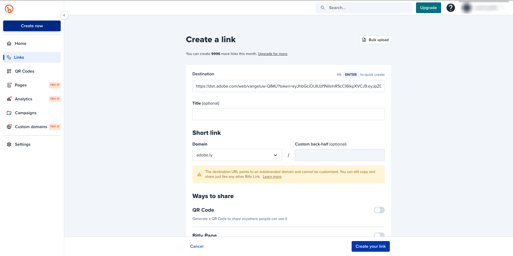

# 3.3.4 Adobe Target und Offer decisioning kombinieren

## 3.3.4.1 Abruf des freigebbaren Links Ihres Demoprojekts

Um das Demo-Website-Projekt in Adobe Target zu laden, müssen Sie zunächst einen speziellen Link erfassen, über den Adobe Target Ihr Demo-Website-Projekt laden kann.

Gehen Sie dazu zu [https://builder.adobedemo.com/projects](https://builder.adobedemo.com/projects). Nach der Anmeldung bei Ihrer Adobe ID sehen Sie dies. Klicken Sie auf Ihr Website-Projekt, um es zu öffnen.

Das wirst du jetzt sehen. Klicken Sie auf **Freigabe**.

Klicken Sie auf **Link erzeugen** und kopieren Sie dann den Link in die Zwischenablage.

Gehen Sie zu [https://bitly.com](https://bitly.com), fügen Sie den kopierten Link ein und klicken Sie auf **Kürzen**. Sie erhalten jetzt einen gekürzten Link, der wie folgt aussieht: `https://bit.ly/3JxN7aG`. Sie werden diesen Link in der nächsten Übung benötigen.

## 3.3.4.2 Sammlung

Gehen Sie jetzt zur Adobe Experience Cloud-Homepage, indem Sie zu [https://experiencecloud.adobe.com/](https://experiencecloud.adobe.com/) navigieren. Klicken Sie auf **Ziel**.

Auf der Startseite von **Adobe Target** werden alle vorhandenen Aktivitäten angezeigt.

Klicken Sie auf **+ Aktivität erstellen** , um eine neue Aktivität zu erstellen.

Wählen Sie **Erlebnis-Targeting** aus.

Wählen Sie nun **Visual** aus und fügen Sie den gekürzten Link in das Feld **Aktivitäts-URL eingeben** ein. Klicken Sie auf **Weiter**.

Anschließend sehen Sie, wie Ihr Demowebsite-Projekt in den Visual Experience Composer geladen wird.

Wechseln Sie zum Modus **Durchsuchen** , um im Popup für Cookie-Zustimmung auf **Alle erlauben** zu klicken.

Klicken Sie auf den Bereich, der den Text **Vorgestellte Kategorien** enthält. Klicken Sie auf **Einfügen vor** und wählen Sie dann **Angebotsentscheidung** aus.

Dann sehen Sie dieses Popup. Wählen Sie Ihre Sandbox `--aepSandboxId--` und dann die Platzierung **Web - Bild** aus.

Wählen Sie anschließend Ihre Entscheidung `--demoProfileLdap-- - Luma Decision` aus. Klicken Sie auf **Speichern**.

Dann wirst du das sehen. Stellen Sie sicher, dass die zusätzliche Vorlagenregel **URL** **enthält** **Ihren Projektnamen** enthält. Klicken Sie auf **Speichern**.

Dann wirst du das sehen. Klicken Sie auf **Weiter**.

Geben Sie einen Namen für Ihr Angebot ein und verwenden Sie folgenden Namen: `--demoProfileLdap-- - XT with Offers (VEC)`. Klicken Sie auf **Weiter**.

Dann wirst du das sehen. Definieren Sie Ihre **Zielmetrik** wie angegeben. Klicken Sie auf **Speichern und schließen**.

Ihr Angebot wird jetzt erstellt und veröffentlicht.

Sobald Ihr Angebot veröffentlicht wurde, können Sie es aktivieren.

Nächster Schritt: [3.3.5 Verwenden Sie Ihre Entscheidung in einer E-Mail und SMS](./ex5.md)

[Zurück zu Modul 3.3](./offer-decisioning.md)

[Zu allen Modulen zurückkehren](./../../../overview.md)
