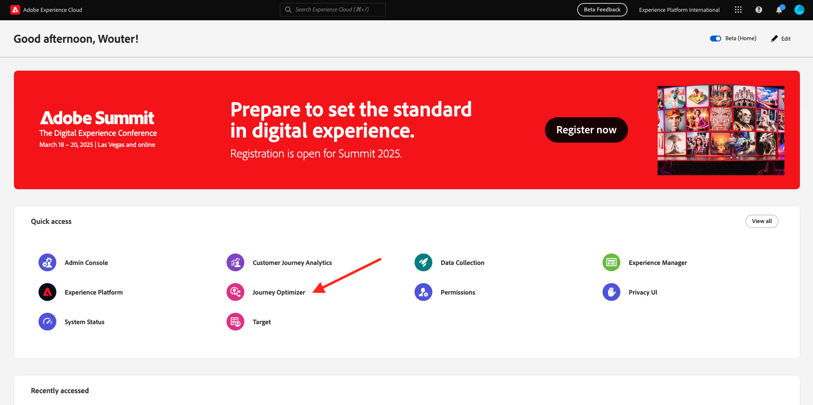
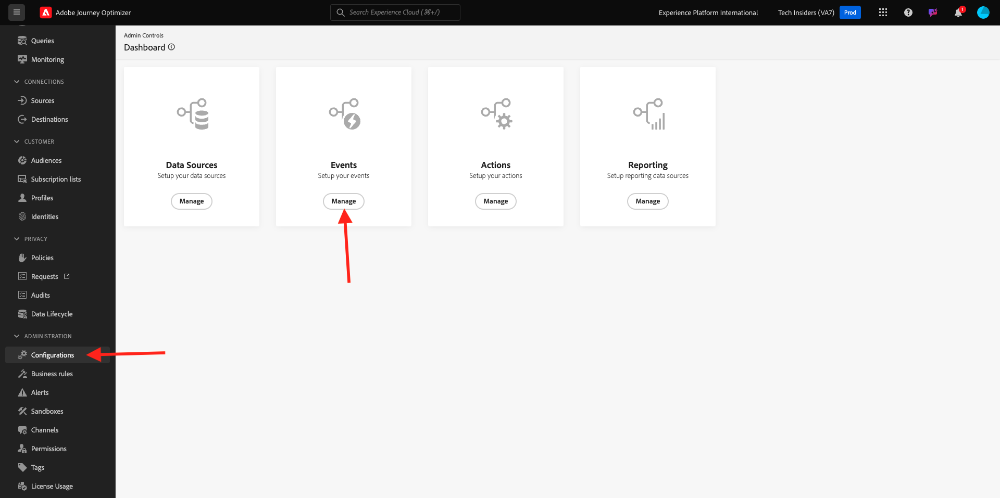
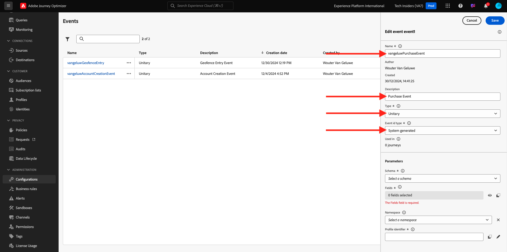
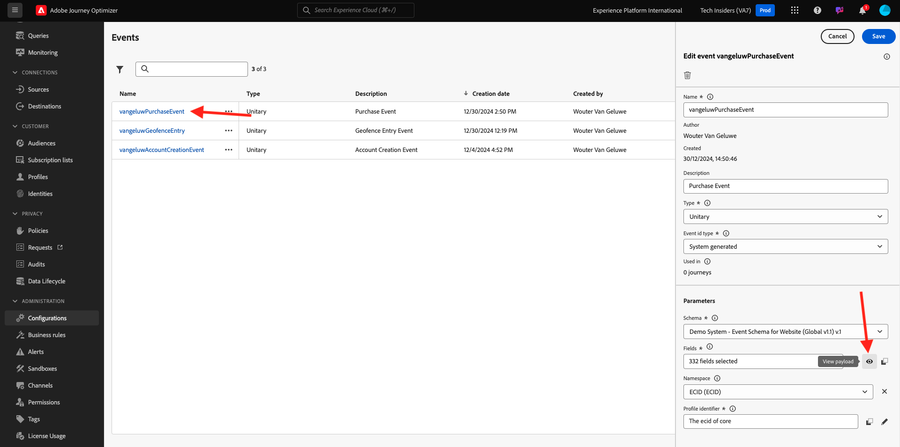
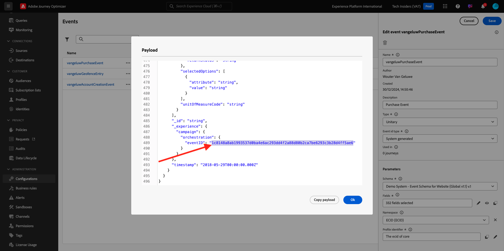
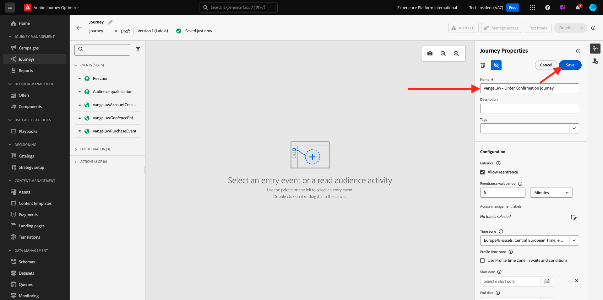
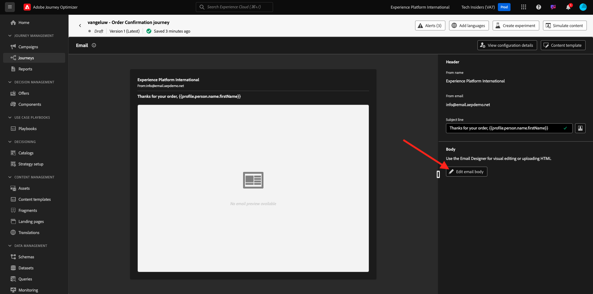
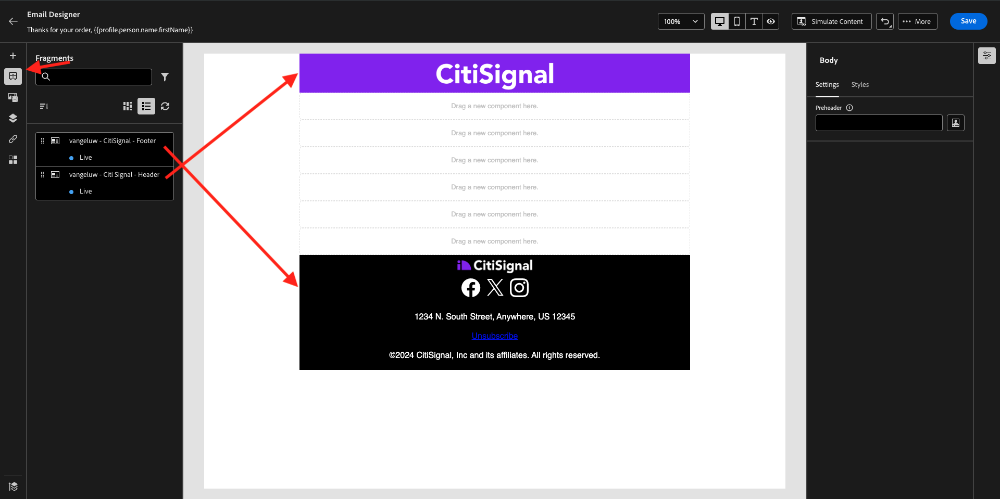
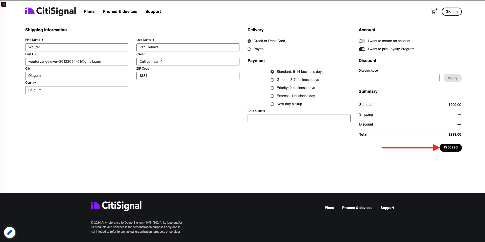

# 3.4.1 Konfigurieren einer Trigger-basierten Journey - Bestellbestätigung

Melden Sie sich bei Adobe Journey Optimizer an, indem Sie zu [Adobe Experience Cloud wechseln](https://experience.adobe.com). Auf **Journey Optimizer**.



Sie werden zur Ansicht **Startseite** in Journey Optimizer weitergeleitet. Stellen Sie zunächst sicher, dass Sie die richtige Sandbox verwenden. Die zu verwendende Sandbox heißt `--aepSandboxName--`. Sie befinden sich dann in der **Startseite**-Ansicht Ihres Sandbox-`--aepSandboxName--`.


## 3.4.1.1 Ereignis erstellen

Gehen Sie im Menü zu **Konfigurationen** und klicken Sie unter **Ereignisse** auf **Verwalten**.



Auf dem **Ereignisse** wird eine ähnliche Ansicht angezeigt. Klicken Sie **Ereignis erstellen**.


Anschließend wird eine leere Ereigniskonfiguration angezeigt.

Geben Sie Ihrem Ereignis zunächst einen Namen wie den folgenden: `--aepUserLdap--PurchaseEvent` und fügen Sie eine Beschreibung wie die folgende hinzu: `Purchase Event`.

Wählen Sie **Typ** die Option **Unitär** aus.
Wählen Sie **Ereignis-ID-**) **Systemgeneriert** aus.



Als Nächstes sehen Sie die Schemaauswahl. Für diese Übung wurde ein Schema vorbereitet. Verwenden Sie das Schema `Demo System - Event Schema for Website (Global v1.1) v.1`.

Nach Auswahl des Schemas werden Sie eine Reihe von Feldern sehen, die im Abschnitt **Payload** ausgewählt sind. Klicken Sie auf **Bearbeiten/Bleistift**, um diesem Ereignis zusätzliche Felder hinzuzufügen.


Dann sehen Sie dieses Popup. Sie müssen jetzt zusätzliche Kontrollkästchen aktivieren, um auf zusätzliche Daten zuzugreifen, wenn dieses Ereignis ausgelöst wird.


Aktivieren Sie zunächst das Kontrollkästchen in der `--aepTenantId--`.


Scrollen Sie dann nach unten und aktivieren Sie das Kontrollkästchen in der `commerce`.


Scrollen Sie dann nach unten und aktivieren Sie das Kontrollkästchen in der `productListItems`. Klicken Sie auf **OK**.


Anschließend werden Sie sehen, dass dem Ereignis zusätzliche Felder hinzugefügt wurden. Klicken Sie auf **Speichern**.


Ihr neues Ereignis wird dann gespeichert und Sie sehen Ihr Ereignis jetzt in der Liste der verfügbaren Ereignisse.

Klicken Sie erneut auf Ihr Ereignis, um den Bildschirm **Ereignis bearbeiten** erneut zu öffnen.
Bewegen Sie den Mauszeiger erneut über **Feld** Payload“, um die drei Symbole erneut anzuzeigen. Klicken Sie auf das Symbol **Payload anzeigen**.



Im Folgenden sehen Sie ein Beispiel für die erwartete Payload. Ihr Ereignis verfügt über eine eindeutige Orchestrierungs-eventID, die Sie finden können, indem Sie in dieser Payload nach unten scrollen, bis Sie `_experience.campaign.orchestration.eventID` sehen.



Die Ereignis-ID muss an Adobe Journey Optimizer gesendet werden, um die Journey, die Sie im nächsten Schritt erstellen, zum Trigger zu bringen. Notieren Sie sich diese eventID, da Sie sie in einem der nächsten Schritte benötigen werden.
`"eventID": "1c8148a8ab1993537d0ba4e6ac293dd4f2a88d80b2ca7be6293c3b28d4ff5ae6"`

Klicken Sie **OK** gefolgt von **Abbrechen**.

Ihr Ereignis ist jetzt konfiguriert und kann verwendet werden.

## 3.4.1.2 Journey erstellen

Wechseln Sie im Menü zu **Journey** und klicken Sie auf **Journey erstellen**.


Sie werden es dann sehen. Geben Sie Ihrem Journey einen Namen. Verwenden Sie `--aepUserLdap-- - Order Confirmation journey`. Klicken Sie auf **Speichern**.



Zunächst müssen Sie Ihr Ereignis als Ausgangspunkt Ihres Journey hinzufügen. Suchen Sie nach Ihrer `--aepUserLdap--PurchaseEvent` und ziehen Sie sie per Drag-and-Drop auf die Arbeitsfläche. Klicken Sie auf **Speichern**.


Suchen Sie dann unter **Aktionen** nach der Aktion **E-Mail** und fügen Sie sie zur Arbeitsfläche hinzu.


Legen Sie die **Kategorie** auf **Marketing** fest und wählen Sie eine E-Mail-Oberfläche aus, mit der Sie E-Mails senden können. In diesem Fall ist die auszuwählende E-Mail-Oberfläche **E-Mail**. Stellen Sie sicher, dass die Kontrollkästchen für **Klicks auf E-**) und **E-Mail-Öffnungen** beide aktiviert sind.


Der nächste Schritt besteht darin, Ihre Nachricht zu erstellen. Klicken Sie dazu auf **Inhalt bearbeiten**.


Jetzt seht ihr das. Klicken Sie auf **Textfeld** Betreffzeile“.


Beginnen Sie im Textbereich mit dem Schreiben von **Vielen Dank für Ihre Bestellung** und klicken Sie auf das Symbol **Personalization**.


Die Betreffzeile ist noch nicht fertig. Als Nächstes müssen Sie das Personalisierungs-Token für das Feld **Vorname“**, das unter `profile.person.name.firstName` gespeichert ist. Scrollen Sie im linken Menü nach unten zum Feld **Person** > **Vollständiger Name** > **Vorname** und klicken Sie auf das Symbol **+** , um das Personalisierungs-Token in die Betreffzeile einzufügen. Klicken Sie auf **Speichern**.


Dann bist du wieder hier. Klicken Sie auf **E-Mail-Text bearbeiten**, um den Inhalt der E-Mail zu erstellen.



Klicken Sie im nächsten Bildschirm auf **Erstellen von neuen Inhalten**.


Im linken Menü finden Sie die Strukturkomponenten, mit denen Sie die Struktur der E-Mail definieren können (Zeilen und Spalten).

Ziehen Sie 8-mal eine **1:1-Spalte** die Arbeitsfläche, was Ihnen folgendes geben sollte:


Navigieren Sie im linken Menü zu **Fragmente**. Ziehen Sie die zuvor in [Übung 3.1.2.1](./../module3.1/ex2.md) erstellte Kopfzeile auf die erste Komponente auf der Arbeitsfläche. Ziehen Sie die Fußzeile, die Sie zuvor in [Übung 3.1.2.2](./../module3.1/ex2.md) erstellt haben, auf die letzte Komponente auf der Arbeitsfläche.



Klicken Sie im linken Menü auf das Symbol **+** . Navigieren Sie zu **Inhalte**, um Inhalte zur Arbeitsfläche hinzuzufügen.


Navigieren Sie zu **Inhalte** und ziehen Sie per Drag-and-Drop eine **Bild**-Komponente in die zweite Zeile. Klicken Sie auf **Durchsuchen**.


Öffnen Sie den Ordner **citi-signal-images**, klicken Sie auf das Bild **citsignal-preparation.png** und klicken Sie auf **Auswählen**.


Ändern **unter &quot;**&quot; die Breite in **40%**.


Gehen Sie dann zu **Inhalte** und ziehen Sie per Drag-and-Drop eine **Text**-Komponente in die dritte Zeile.


Wählen Sie den Standardtext in dieser Komponente aus **Geben Sie hier Ihren Text ein.** und durch den folgenden Text ersetzen:

```javascript
You’re one step closer!

Hi 

We've received your order details!

We will also send you a separate email containing your VAT Invoice.

We'll be back in touch with you as soon as we've finished packing your package. Please read carefully the Order Information detailed below.
```


Setzen Sie den Cursor neben den Text **Hi** und klicken Sie auf **Personalization hinzufügen**.


Navigieren Sie zum Feld **Person** > **Vollständiger Name** > **Vorname** und klicken Sie auf das Symbol **+** , um das Personalisierungs-Token in die Betreffzeile einzufügen. Klicken Sie auf **Speichern**.


Sie sehen dann Folgendes:


Gehen Sie dann zu **Inhalte** und ziehen Sie per Drag-and-Drop eine **Text**-Komponente in die vierte Zeile.


Wählen Sie den Standardtext in dieser Komponente aus **Geben Sie hier Ihren Text ein.** und durch den folgenden Text ersetzen:

`Order Information`

Ändern Sie die Schriftgröße in **26 Pixel** und zentrieren Sie den Text in dieser Zelle. Sie erhalten dann Folgendes:


Gehen Sie dann zu **Inhalte** und ziehen Sie per Drag-and-Drop eine **** HTML)-Komponente in die fünfte Zeile. Klicken Sie auf die HTML-Komponente und dann auf **Quellcode anzeigen**.


Fügen Sie **Popup HTML bearbeiten** folgende HTML ein:

```<table><tbody><tr><td><b>Items purchased</b></td><td></td><td><b>Quantity</b></td><td><b>Subtotal</b></td></tr><tr><td colspan="4" width="500"><hr></td></tr></tbody></table>```

Klicken Sie auf **Speichern**.


Dann hast du das hier. Klicken Sie **Speichern**, um Ihren Fortschritt zu speichern.


HTML Wechseln Sie zu **Inhalte** und ziehen Sie per Drag-and-Drop eine ****-Komponente in die sechste Zeile. Klicken Sie auf die HTML-Komponente und dann auf **Quellcode anzeigen**.


Fügen Sie **Popup HTML bearbeiten** folgende HTML ein:

```{{#each xxx as |item|}}<table width="500"><tbody><tr><td></td><td><table><tbody><tr><td><b>{{item.name}}</b><br>{{item.--aepTenantId--.core.subCategory}}<br><b>{{item.priceTotal}}</b><br>&nbsp;<br>Article no: {{item.SKU}}</td></tr></tbody></table></td><td>{{item.quantity}}</td><td><b>{{item.priceTotal}}</b></td></tr></tbody></table>{{/each}}```

Sie erhalten dann Folgendes:


Sie müssen jetzt **xxx** durch einen Verweis auf das productListItems-Objekt ersetzen, das Teil des Ereignisses ist, das die Journey Trigger.


Löschen Sie zunächst **xxx** in Ihrem HTML-Code.


Klicken Sie im linken Menü auf **Kontextuelle Attribute**. Dieser Kontext wird von der Journey an die Nachricht übergeben.

Sie werden es dann sehen. Klicken Sie auf den Pfeil neben **Journey Orchestration**, um einen Drilldown durchzuführen.


Klicken Sie auf den Pfeil neben **Ereignisse**, um einen Drilldown durchzuführen.


Klicken Sie auf den Pfeil neben `--aepUserLdap--PurchaseEvent`, um einen Drilldown durchzuführen.


Klicken Sie auf den Pfeil neben **productListItems**, um einen Drilldown durchzuführen.


Klicken Sie auf das Symbol **+** neben **Name**, um es zur Arbeitsfläche hinzuzufügen. Dann hast du das hier. Wählen Sie nun **.name** wie im folgenden Screenshot gezeigt aus und entfernen Sie **.name**.


Dann hast du das hier. Klicken Sie auf **Speichern**.


Jetzt sind Sie wieder im E-Mail-Designer. Klicken Sie **Speichern**, um Ihren Fortschritt zu speichern.


Gehen Sie dann zu **Inhalte** und ziehen Sie per Drag-and-Drop eine **** HTML)-Komponente in die siebte Zeile. Klicken Sie auf die HTML-Komponente und dann auf **Quellcode anzeigen**.


Fügen Sie **Popup HTML bearbeiten** folgende HTML ein:

```<table><tbody><tr><td><b>Subtotal</b><br>Delivery charge (included)</td><td align="right"><b>xxx</b><br><b>5</b></td></tr><tr><td colspan="2" width="500"><hr></td></tr><tr><td><b>Total including VAT</b></td><td align="right"><b>xxx</b></td></tr></tbody></table>```

Dieser HTML-Code enthält zwei Verweise **xxx**. Jetzt müssen Sie jedes **xxx** durch einen Verweis auf das productListItems-Objekt ersetzen, das Teil des Ereignisses ist, das die Journey Trigger.


Löschen Sie zunächst die erste **xxx** in Ihrem HTML-Code.


Klicken Sie im linken Menü auf **Kontextuelle Attribute**.
Klicken Sie auf den Pfeil neben **Journey Orchestration**, um einen Drilldown durchzuführen.


Klicken Sie auf den Pfeil neben **Ereignisse**, um einen Drilldown durchzuführen.


Klicken Sie auf den Pfeil neben `--aepUserLdap--PurchaseEvent`, um einen Drilldown durchzuführen.


Klicken Sie auf den Pfeil neben **Commerce**, um einen Drilldown durchzuführen.


Klicken Sie auf den Pfeil neben **Reihenfolge**, um einen Drilldown durchzuführen.


Klicken Sie auf das Symbol **+** neben **Gesamtpreis**, um dieses zur Arbeitsfläche hinzuzufügen.


Dann hast du das hier. Löschen Sie nun die zweite **xxx** in Ihrem HTML-Code.


Klicken Sie erneut auf das Symbol **+** neben **Gesamtpreis**, um dieses Element zur Arbeitsfläche hinzuzufügen.
Sie können auch das Feld **Währung** innerhalb des Objekts **Bestellung** auf der Arbeitsfläche hinzufügen, wie Sie hier sehen können.
Wenn Sie fertig sind, klicken Sie auf **Speichern** um Ihre Änderungen zu speichern.


Sie sind dann wieder in der E-Mail-Designer. Klicken Sie **erneut auf** Speichern“.


Kehren Sie zum Nachrichten-Dashboard zurück, indem Sie auf den **Pfeil** neben dem Betreffzeilentext in der oberen linken Ecke klicken.


Klicken Sie auf den Pfeil oben links, um zu Ihrem Journey zurückzukehren.


Klicken Sie auf **Speichern**, um die E-Mail-Aktion zu schließen.


Klicken Sie auf **Publish**, um Ihren Journey zu veröffentlichen.


Klicken Sie erneut auf **** Publish.


Ihr Journey ist jetzt veröffentlicht.


## 3.4.1.5 Aktualisieren der Client-Eigenschaft der Adobe Experience Platform-Datenerfassung

Wechseln Sie zu [Adobe Experience Platform-](https://experience.adobe.com/launch/) und wählen Sie **Tags** aus.

Dies ist die Seite mit den Eigenschaften der Adobe Experience Platform-Datenerfassung, die Sie zuvor gesehen haben.


In **Erste Schritte** hat Demo System zwei Client-Eigenschaften für Sie erstellt: eine für die Website und eine für die Mobile App. Suchen Sie sie, indem Sie im Feld **[!UICONTROL nach `--aepUserLdap--`]**. Klicken Sie, um die Eigenschaft **Web** zu öffnen.


Navigieren Sie zu **Datenelemente**. Suchen und öffnen Sie das Datenelement **XDM - Kauf**.


Sie werden es dann sehen. Navigieren Sie zum Feld **_experience.campaign.orchestration.eventID** und füllen Sie hier Ihre eventID aus. Die eventID, die hier ausgefüllt werden soll, ist die eventID, die Sie im Rahmen der Übung erstellt haben 3.4.1.1 Klicken Sie auf **Speichern** oder **In Bibliothek speichern**.


Speichern Sie die Änderungen in der Eigenschaft, und veröffentlichen Sie die Änderungen, indem Sie Ihre Entwicklungsbibliothek aktualisieren.


Ihre Änderungen werden jetzt bereitgestellt und können getestet werden.

## 3.4.1.6 Testen der E-Mail zur Bestellbestätigung über die Demo-Website

Testen wir die aktualisierte Journey durch den Kauf eines Produkts auf der Demo-Website.

Navigieren Sie zu [https://dsn.adobe.com](https://dsn.adobe.com). Nachdem Sie sich mit Ihrer Adobe ID angemeldet haben, sehen Sie Folgendes. Klicken Sie auf die 3 Punkte **…** in Ihrem Website-Projekt und dann auf **Ausführen**, um es zu öffnen.


Anschließend wird Ihre Demo-Website geöffnet. Wählen Sie die URL aus und kopieren Sie sie in die Zwischenablage.


Öffnen Sie ein neues Inkognito-Browser-Fenster.


Fügen Sie die URL Ihrer Demo-Website ein, die Sie im vorherigen Schritt kopiert haben. Sie werden dann aufgefordert, sich mit Ihrer Adobe ID anzumelden.


Wählen Sie Ihren Kontotyp aus und schließen Sie den Anmeldevorgang ab.


Ihre Website wird dann in einem Inkognito-Browser-Fenster geladen. Für jede Übung müssen Sie ein neues Inkognito-Browser-Fenster verwenden, um Ihre Demo-Website-URL zu laden.


Sehen Sie sich das Bedienfeld Profil-Viewer und das Echtzeit-Kundenprofil mit der **Experience Cloud-ID** als primäre Kennung für diesen derzeit unbekannten Kunden an.


Navigieren Sie zur Anmelde-/Anmeldeseite. Klicken Sie **KONTO ERSTELLEN**.


Füllen Sie Ihre Daten aus und klicken Sie **Registrieren**, woraufhin Sie zur vorherigen Seite weitergeleitet werden.


Beliebiges Produkt zum Warenkorb hinzufügen


Navigieren Sie zur Seite **Warenkorb**. Klicken Sie **Checkout**.


Überprüfen Sie anschließend die Felder und füllen Sie sie ggf. aus. Klicken Sie **Fortfahren**.



Klicken Sie **Bestellung bestätigen**.


Ihre Bestellung ist jetzt bestätigt.


Sie erhalten dann innerhalb von Sekunden Ihre Bestellbestätigungs-E-Mail.


Du hast diese Übung beendet.

Nächster Schritt: [3.4.2 Konfigurieren einer Batch-basierten Newsletter-Journey](./ex2.md)

[Zurück zum Modul 3.4](./journeyoptimizer.md)

[Zurück zu „Alle Module“](../../../overview.md)
