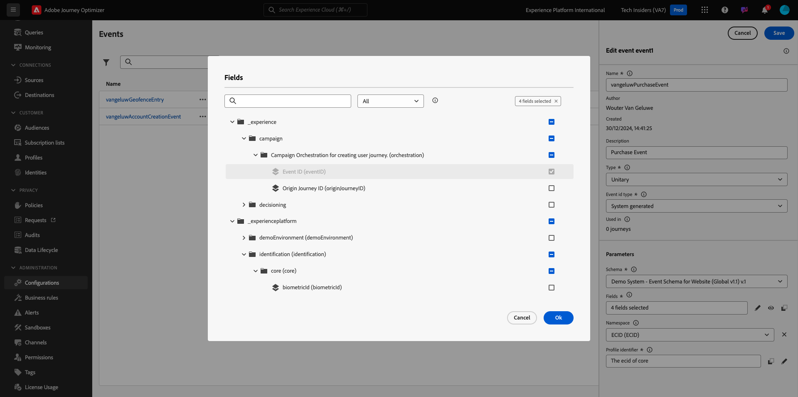
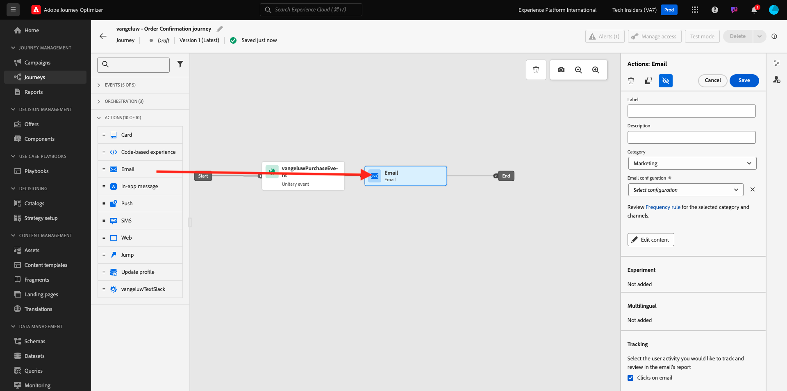
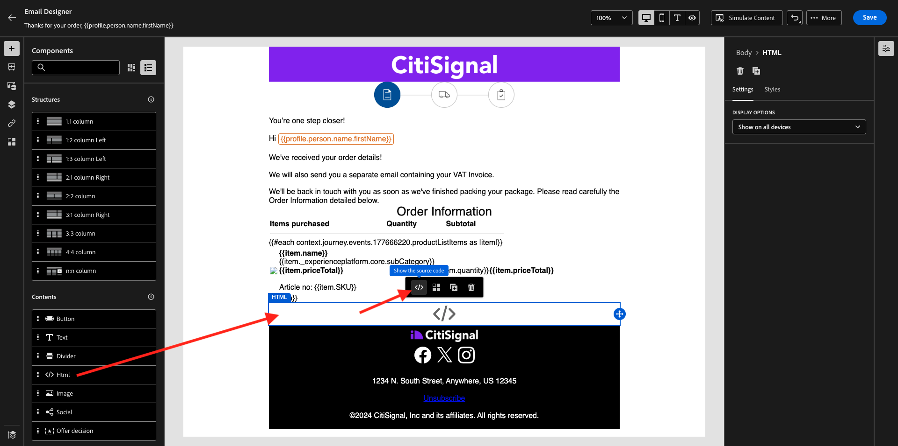
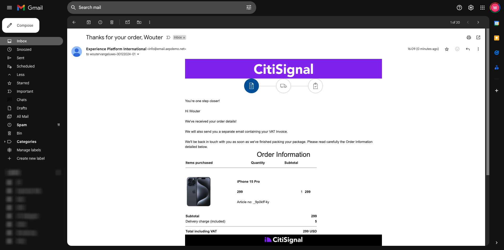

# 3.4.1 Trigger-basierte Journey konfigurieren - Bestellbestätigung

Melden Sie sich bei Adobe Journey Optimizer an, indem Sie zu [Adobe Experience Cloud](https://experience.adobe.com) wechseln. Klicken Sie auf **Journey Optimizer**.


Sie werden zur Ansicht **Home** in Journey Optimizer weitergeleitet. Vergewissern Sie sich zunächst, dass Sie die richtige Sandbox verwenden. Die zu verwendende Sandbox heißt `--aepSandboxId--`. Um von einer Sandbox zu einer anderen zu wechseln, klicken Sie auf **PRODUKTIONSPROD (VA7)** und wählen Sie die Sandbox aus der Liste aus. In diesem Beispiel erhält die Sandbox den Namen **AEP-Aktivierung FY22**. Sie befinden sich dann in der Ansicht **Home** Ihrer Sandbox `--aepSandboxId--`.


## 3.4.1.1 Ereignis erstellen

Wechseln Sie im Menü zu **Konfigurationen** und klicken Sie unter **Ereignisse** auf **Verwalten** .


Auf dem Bildschirm **Ereignisse** wird eine Ansicht ähnlich der folgenden angezeigt. Klicken Sie auf **Ereignis erstellen**.


Anschließend wird eine leere Ereigniskonfiguration angezeigt.


Geben Sie zunächst Ihrem Ereignis einen Namen wie folgt: `--demoProfileLdap--PurchaseEvent` und fügen Sie eine Beschreibung wie diese hinzu: `Purchase Event`.


Als Nächstes wird die Auswahl **Ereignistyp** ausgewählt. Wählen Sie **Einzeln** aus.


Als Nächstes wählen Sie den **Ereignis-ID-Typ** aus. Wählen Sie **System generiert** aus.


Als Nächstes folgt die Schemaauswahl. Für diese Übung wurde ein Schema vorbereitet. Verwenden Sie das Schema `Demo System - Event Schema for Website (Global v1.1) v.1`.


Nach Auswahl des Schemas werden im Abschnitt **Payload** eine Reihe von Feldern ausgewählt. Klicken Sie auf das Symbol **Bearbeiten/Bleistift** , um diesem Ereignis zusätzliche Felder hinzuzufügen.


Dann sehen Sie dieses Popup. Sie müssen jetzt zusätzliche Kontrollkästchen aktivieren, um auf zusätzliche Daten zuzugreifen, wenn dieses Ereignis ausgelöst wird.



Aktivieren Sie zunächst das Kontrollkästchen in der Zeile `--aepTenantId--`.


Scrollen Sie dann nach unten und aktivieren Sie das Kontrollkästchen in der Zeile `productListItems`.


Scrollen Sie dann nach unten und aktivieren Sie das Kontrollkästchen in der Zeile `commerce`.


Klicken Sie anschließend auf **OK**.

Anschließend werden Sie sehen, dass dem Ereignis zusätzliche Felder hinzugefügt wurden. Klicken Sie auf **Speichern**.


Ihr neues Ereignis wird dann freigegeben und Ihr Ereignis wird jetzt in der Liste der verfügbaren Ereignisse angezeigt.

Klicken Sie erneut auf Ihr Ereignis, um den Bildschirm **Ereignis bearbeiten** erneut zu öffnen.
Bewegen Sie den Mauszeiger erneut über das Feld **Payload** , um die 3 Symbole erneut anzuzeigen. Klicken Sie auf das Symbol **Payload anzeigen** .


Sie sehen nun ein Beispiel der erwarteten Payload. Ihr Ereignis verfügt über eine eindeutige eventID für die Orchestrierung, die Sie finden können, indem Sie in dieser Payload nach unten scrollen, bis Sie `_experience.campaign.orchestration.eventID` sehen.


Die Ereignis-ID muss an Adobe Journey Optimizer gesendet werden, um die Journey Trigger, die Sie im nächsten Schritt erstellen werden. Notieren Sie sich diese eventID, da Sie sie in einem der nächsten Schritte benötigen werden.
`"eventID": "ef6dd943c94fe1b4763c098ccd1772344662f2a9f614513106cb5ada8be36857"`

Klicken Sie auf **OK**, gefolgt von **Abbrechen**.

Ihr Ereignis ist jetzt konfiguriert und kann verwendet werden.

## 3.4.1.2 Journey erstellen

Wechseln Sie im Menü zu **Journey** und klicken Sie auf **Journey erstellen**.


Dann wirst du das sehen. Benennen Sie Ihre Journey. Verwenden Sie `--demoProfileLdap-- - Order Confirmation journey`. Klicken Sie auf **OK**.


Zunächst müssen Sie Ihr Ereignis als Ausgangspunkt Ihrer Journey hinzufügen. Suchen Sie nach Ihrem Ereignis `--demoProfileLdap--PurchaseEvent` und ziehen Sie es auf die Arbeitsfläche. Klicken Sie auf **OK**.


Suchen Sie dann unter **Aktionen** nach der Aktion **E-Mail** und fügen Sie sie der Arbeitsfläche hinzu.



Setzen Sie die **Kategorie** auf **Marketing** und wählen Sie eine E-Mail-Oberfläche aus, über die Sie E-Mails senden können. In diesem Fall ist die auszuwählende E-Mail-Oberfläche **E-Mail**. Stellen Sie sicher, dass die Kontrollkästchen für **Klicks auf E-Mail** und **E-Mail-Öffnungen** aktiviert sind.


Der nächste Schritt besteht darin, Ihre Nachricht zu erstellen. Klicken Sie dazu auf **Inhalt bearbeiten**.


Das sehen Sie jetzt. Klicken Sie auf das Textfeld **Betreff**.


Beginnen Sie im Textbereich mit dem Schreiben von **Danke für Ihre Bestellung,**


Die Betreffzeile ist noch nicht fertig. Als Nächstes müssen Sie das Personalisierungstoken für das Feld **Vorname** einfügen, das unter `profile.person.name.firstName` gespeichert ist. Scrollen Sie im linken Menü nach unten, um das Feld **Person** > **Vollständiger Name** > **Vorname** zu suchen, und klicken Sie auf das Symbol **+** , um das Personalisierungstoken zur Betreffzeile hinzuzufügen. Klicken Sie auf **Speichern**.


Du wirst dann wieder hier sein. Klicken Sie auf **E-Mail-Designer** , um den E-Mail-Inhalt zu erstellen.


Klicken Sie im nächsten Bildschirm auf **Design von Grund auf**.


Im linken Menü finden Sie die Strukturkomponenten, mit denen Sie die Struktur der E-Mail definieren können (Zeilen und Spalten).

Ziehen Sie eine **1:1-Spalte** 8-mal auf die Arbeitsfläche und legen Sie sie dort ab.


Wechseln Sie zu **Inhaltskomponenten**.


Ziehen Sie eine **Bild** -Komponente in die erste Zeile und legen Sie sie ab. Klicken Sie auf **Durchsuchen**.


Wechseln Sie zum Ordner &quot;**enable-assets**&quot;, wählen Sie die Datei &quot;**luma-logo.png**&quot;aus und klicken Sie auf &quot;**Select**&quot;.


Du bist jetzt wieder hier. Klicken Sie auf das Bild, um es auszuwählen, und verwenden Sie dann den Regler **Größe** , um das Logo-Bild etwas kleiner zu machen.


Wechseln Sie zu **Inhaltskomponenten** und ziehen Sie eine Komponente **Bild** in die zweite Zeile. Wählen Sie die **Bildkomponente** aus, klicken Sie aber nicht auf &quot;Durchsuchen&quot;.


Fügen Sie diese Bild-URL in das Feld **Source**: `https://parsefiles.back4app.com/hgJBdVOS2eff03JCn6qXXOxT5jJFzialLAHJixD9/29043bedcde632a9cbe8a02a164189c9_preparing.png` ein. Dieses Bild wird außerhalb von Adobe gehostet.


Wenn Sie den Umfang in ein anderes Feld ändern, wird das Bild gerendert und Sie sehen Folgendes:


Navigieren Sie als Nächstes zu **Inhaltskomponenten** und ziehen Sie eine Komponente **Text** in die dritte Zeile.


Wählen Sie den Standardtext in dieser Komponente aus **Geben Sie hier Ihren Text ein.** und ersetzen Sie sie durch den folgenden Text:

```javascript
You’re one step closer!

Hi 

We've received your order details!

We will also send you a separate email containing your VAT Invoice.

We'll be back in touch with you as soon as we've finished packing your package. Please read carefully the Order Information detailed below.
```


Setzen Sie den Cursor neben den Text **Hi** und klicken Sie auf **Personalization hinzufügen**.


Navigieren Sie zum Feld **Person** > **Vollständiger Name** > **Vorname** und klicken Sie auf das Symbol **+** , um das Personalisierungstoken zur Betreffzeile hinzuzufügen. Klicken Sie auf **Speichern**.


Daraufhin sehen Sie Folgendes:


Navigieren Sie als Nächstes zu **Inhaltskomponenten** und ziehen Sie eine Komponente **Text** in die vierte Zeile.


Wählen Sie den Standardtext in dieser Komponente aus **Geben Sie hier Ihren Text ein.** und ersetzen Sie sie durch den folgenden Text:

`Order Information`

Ändern Sie die Schriftgröße in **26px** und zentrieren Sie den Text in dieser Zelle. Dann haben Sie Folgendes:


Navigieren Sie als Nächstes zu **Inhaltskomponenten** und ziehen Sie eine **HTML** -Komponente in die fünfte Zeile. Klicken Sie auf die HTML-Komponente und dann auf **Quellcode anzeigen**.


Fügen Sie im Popup **HTML bearbeiten** diese HTML ein:

```<table><tbody><tr><td><b>Items purchased</b></td><td></td><td><b>Quantity</b></td><td><b>Subtotal</b></td></tr><tr><td colspan="4" width="500"><hr></td></tr></tbody></table>```

Klicken Sie auf **Speichern**.


Dann wirst du das haben. Klicken Sie auf **Speichern** , um den Fortschritt zu speichern.


Wechseln Sie zu **Inhaltskomponenten** und ziehen Sie eine **HTML** -Komponente in die sechste Zeile. Klicken Sie auf die HTML-Komponente und dann auf **Quellcode anzeigen**.


Fügen Sie im Popup **HTML bearbeiten** diese HTML ein:

```{{#each xxx as |item|}}<table width="500"><tbody><tr><td></td><td><table><tbody><tr><td><b>{{item.name}}</b><br>{{item.--aepTenantId--.core.subCategory}}<br><b>{{item.priceTotal}}</b><br>&nbsp;<br>Article no: {{item.SKU}}</td></tr></tbody></table></td><td>{{item.quantity}}</td><td><b>{{item.priceTotal}}</b></td></tr></tbody></table>{{/each}}```

Dann haben Sie Folgendes:


Sie müssen jetzt **xxx** durch einen Verweis auf das productListItems-Objekt ersetzen, das Teil des Ereignisses ist, das die Journey Trigger.


Löschen Sie zunächst **xxx** in Ihrem HTML-Code.


Klicken Sie im linken Menü auf **Kontextuelle Attribute**. Dieser Kontext wird von der Journey an die Nachricht übergeben.


Dann wirst du das sehen. Klicken Sie auf den Pfeil neben **Journey Orchestration** , um einen tieferen Drilldown durchzuführen.


Klicken Sie auf den Pfeil neben **Ereignisse** , um einen tieferen Drilldown durchzuführen.


Klicken Sie auf den Pfeil neben `--demoProfileLdap--PurchaseEvent` , um tiefer zu bohren.


Klicken Sie auf den Pfeil neben **productListItems** , um einen tieferen Drilldown durchzuführen.


Klicken Sie auf das Symbol **+** neben **Name** , um es der Arbeitsfläche hinzuzufügen. Dann wirst du das haben. Jetzt müssen Sie &quot;**.name**&quot; auswählen, wie im folgenden Screenshot angegeben, und dann sollten Sie &quot;**.name**&quot; entfernen.


Dann wirst du das haben. Klicken Sie auf **Speichern**.


Sie sind jetzt wieder in der Email Designer. Klicken Sie auf **Speichern** , um den Fortschritt zu speichern.


Navigieren Sie als Nächstes zu **Inhaltskomponenten** und ziehen Sie eine **HTML** -Komponente in die siebte Zeile. Klicken Sie auf die HTML-Komponente und dann auf **Quellcode anzeigen**.



Fügen Sie im Popup **HTML bearbeiten** diese HTML ein:

```<table><tbody><tr><td><b>Subtotal</b><br>Delivery charge (included)</td><td align="right"><b>xxx</b><br><b>5</b></td></tr><tr><td colspan="2" width="500"><hr></td></tr><tr><td><b>Total including VAT</b></td><td align="right"><b>xxx</b></td></tr></tbody></table>```

Dieser HTML-Code enthält 2 Verweise auf **xxx**. Sie müssen jetzt jeden **xxx** durch einen Verweis auf das productListItems-Objekt ersetzen, das Teil des Ereignisses ist, das die Journey Trigger.


Löschen Sie zunächst die erste **xxx** in Ihrem HTML-Code.


Klicken Sie im linken Menü auf **Kontextuelle Attribute**.


Klicken Sie auf den Pfeil neben **Journey Orchestration** , um einen tieferen Drilldown durchzuführen.


Klicken Sie auf den Pfeil neben **Ereignisse** , um einen tieferen Drilldown durchzuführen.


Klicken Sie auf den Pfeil neben `--demoProfileLdap--PurchaseEvent` , um tiefer zu bohren.


Klicken Sie auf den Pfeil neben **Commerce** , um einen tieferen Drilldown durchzuführen.


Klicken Sie auf den Pfeil neben **Bestellung** , um einen tieferen Drilldown durchzuführen.


Klicken Sie auf das Symbol **+** neben **Preissumme** , um es der Arbeitsfläche hinzuzufügen.


Dann wirst du das haben. Löschen Sie nun die zweite **xxx** in Ihrem HTML-Code.


Klicken Sie erneut auf das Symbol **+** neben **Preissumme** , um es der Arbeitsfläche hinzuzufügen.


Sie können auch das Feld **Währung** aus dem Objekt **Bestellung** auf der Arbeitsfläche hinzufügen, wie Sie hier sehen können.
Wenn Sie fertig sind, klicken Sie auf **Speichern** , um Ihre Änderungen zu speichern.


Sie sind dann wieder in der E-Mail-Designer. Klicken Sie erneut auf **Speichern**.


Gehen Sie zurück zum Nachrichten-Dashboard, indem Sie in der oberen linken Ecke auf den Pfeil **11} neben dem Betreffzeilentext klicken.**


Klicken Sie auf den Pfeil oben links, um zu Ihrer Journey zurückzukehren.


Klicken Sie auf **OK** , um Ihre E-Mail-Aktion zu schließen.


Klicken Sie auf **Publish** , um Ihre Journey zu veröffentlichen.


Klicken Sie erneut auf **Publish**.


Ihre Journey ist jetzt veröffentlicht.


## 3.4.1.5 Adobe Experience Platform-Datenerfassungs-Client-Eigenschaft aktualisieren

Wechseln Sie zu [Adobe Experience Platform-Datenerfassung](https://experience.adobe.com/launch/) und wählen Sie **Tags** aus.

Dies ist die Seite mit den Eigenschaften der Adobe Experience Platform-Datenerfassung , die Sie zuvor gesehen haben.


In Modul 0 hat Demo System zwei Client-Eigenschaften für Sie erstellt: eine für die Website und eine für die mobile App. Suchen Sie sie, indem Sie im Feld **[!UICONTROL Suche]** nach `--demoProfileLdap--` suchen. Klicken Sie auf , um die Eigenschaft **Web** zu öffnen.


Wechseln Sie zu **Datenelemente**. Suchen und öffnen Sie das Datenelement **XDM - Purchase**.


Dann wirst du das sehen. Navigieren Sie zum Feld **_experience.campaign.orchestration.eventID** und geben Sie hier Ihre eventID ein. Die hier auszufüllende eventID ist die eventID, die Sie im Rahmen von Übung 10.1.2 erstellt haben. Klicken Sie auf **Speichern** oder **In Bibliothek speichern**.


Speichern Sie Ihre Änderungen in Ihrer Client-Eigenschaft und veröffentlichen Sie dann Ihre Änderungen, indem Sie Ihre Entwicklungsbibliothek aktualisieren.


Ihre Änderungen sind jetzt bereitgestellt und können getestet werden.

## 3.4.1.6 Testen Sie Ihre Bestätigungs-E-Mail mit der Demo-Website.

Testen wir die aktualisierte Journey, indem wir ein Produkt auf der Demowebsite kaufen.

Wechseln Sie zu [https://builder.adobedemo.com/projects](https://builder.adobedemo.com/projects). Nach der Anmeldung bei Ihrer Adobe ID sehen Sie dies. Klicken Sie auf Ihr Website-Projekt, um es zu öffnen.


Klicken Sie auf der Seite **Screens** auf **Ausführen**.


Sie werden dann Ihre Demowebsite öffnen sehen. Wählen Sie die URL aus und kopieren Sie sie in die Zwischenablage.


Öffnen Sie ein neues Inkognito-Browserfenster.


Fügen Sie die URL Ihrer Demo-Website ein, die Sie im vorherigen Schritt kopiert haben. Sie werden dann aufgefordert, sich mit Ihrer Adobe ID anzumelden.


Wählen Sie Ihren Kontotyp aus und schließen Sie den Anmeldevorgang ab.


Sie sehen dann Ihre Website in einem Inkognito-Browser-Fenster geladen. Für jede Demonstration müssen Sie ein neues Inkognito-Browser-Fenster verwenden, um Ihre Demo-Website-URL zu laden.


Klicken Sie auf das Adobe-Logo-Symbol oben links im Bildschirm, um den Profilanzeige zu öffnen.


Sehen Sie sich das Bedienfeld &quot;Profil-Viewer&quot;und das Echtzeit-Kundenprofil mit der **Experience Cloud-ID** als primäre ID für diesen derzeit unbekannten Kunden an.


Gehen Sie zur Seite Registrieren/Anmelden . Klicken Sie auf **KONTO ERSTELLEN**.


Füllen Sie Ihre Details aus und klicken Sie auf **Registrieren** . Danach werden Sie zur vorherigen Seite weitergeleitet.


Fügen Sie Ihrem Warenkorb ein Produkt hinzu und wechseln Sie zur Seite **Warenkorb** . Klicken Sie auf **Fahren Sie fort, um auszuchecken**.


Überprüfen Sie dann die Felder auf der Checkout-Seite und klicken Sie auf **Checkout**.


Sie erhalten dann Ihre Bestätigungs-E-Mail innerhalb von Sekunden.



Du hast diese Übung beendet.

Nächster Schritt: [3.4.2 Batch-basierte Newsletter-Journey konfigurieren](./ex2.md)

[Zurück zu Modul 3.4](./journeyoptimizer.md)

[Zu allen Modulen zurückkehren](../../../overview.md)
