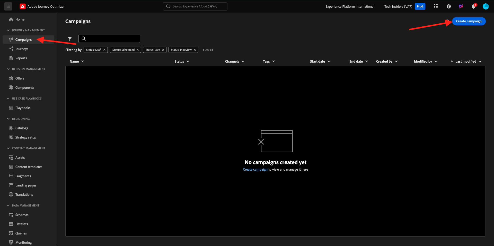
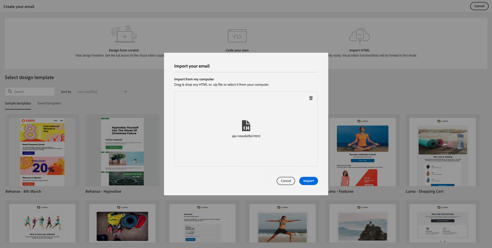
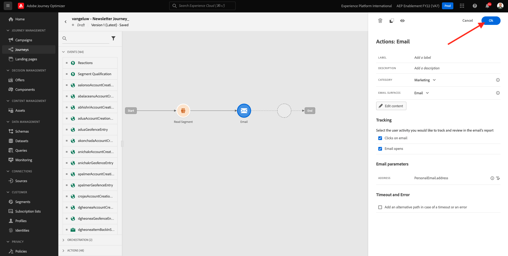

# 3.4.2 Batch-basierte Newsletter-Journey konfigurieren

Melden Sie sich bei Adobe Journey Optimizer an, indem Sie zu [Adobe Experience Cloud](https://experience.adobe.com) wechseln. Klicken Sie auf **Journey Optimizer**.

Sie werden zur Ansicht **Home** in Journey Optimizer weitergeleitet. Vergewissern Sie sich zunächst, dass Sie die richtige Sandbox verwenden. Die zu verwendende Sandbox heißt `--aepSandboxName--`. Um von einer Sandbox zu einer anderen zu wechseln, klicken Sie auf **PRODUKTIONSPROD (VA7)** und wählen Sie die Sandbox aus der Liste aus. In diesem Beispiel erhält die Sandbox den Namen **AEP-Aktivierung FY22**. Sie befinden sich dann in der Ansicht **Home** Ihrer Sandbox `--aepSandboxName--`.

## 3.4.2.1 Newsletter-Journey erstellen

Jetzt erstellen Sie eine Batch-basierte Journey. Im Gegensatz zur ereignisbasierten Journey der vorherigen Übung, bei der eingehende Erlebnisereignisse oder Segmenteinträge oder -ausstiege zum Trigger einer Journey für einen bestimmten Kunden verwendet werden, richten sich Batch-basierte Journey ein ganzes Segment einmal mit eindeutigen Inhalten wie Newslettern, einmaligen Promotions oder allgemeinen Informationen oder regelmäßig mit ähnlichen Inhalten, die regelmäßig gesendet werden, z. B. Geburtstagskampagnen und Erinnerungen.

Wechseln Sie im Menü zu **Journey** und klicken Sie auf **Journey erstellen**.

Auf der rechten Seite sehen Sie ein Formular, in dem Sie den Journey-Namen und die Beschreibung angeben müssen. Geben Sie die folgenden Werte ein:

- **Name**: `--aepUserLdap-- - Newsletter Journey`. Beispiel: **vangeluw - Newsletter-Journey**.
- **Beschreibung**: Monatlicher Newsletter

Klicken Sie auf **OK**.

Ziehen Sie unter **Orchestrierung** **Segment lesen** auf die Arbeitsfläche. Das bedeutet, dass die Journey nach der Veröffentlichung mit dem Abrufen der gesamten Segmentzielgruppe beginnt, die dann zur Zielgruppe der Journey und Nachricht wird. Klicken Sie auf **Segment auswählen**.

Suchen Sie im Popup **Segment auswählen** nach Ihrem ldap und wählen Sie das Segment aus, das Sie in [Modul 2.3 - Echtzeit-Kundendatenplattform - Erstellen eines Segments erstellt haben. Nehmen Sie die Aktion](./../../../modules/rtcdp-b2c/module2.3/real-time-cdp-build-a-segment-take-action.md) mit dem Namen `--aepUserLdap-- - Interest in PROTEUS FITNESS JACKSHIRT` vor. Beispiel: vangeluw - Interesse an PROTEUS FITNESS JACKSHIRT. Klicken Sie auf **Speichern**.

Klicken Sie auf **OK**.

Suchen Sie im linken Menü den Abschnitt **Aktionen** und ziehen Sie eine Aktion vom Typ **E-Mail** auf die Arbeitsfläche.

Setzen Sie die **Kategorie** auf **Marketing** und wählen Sie eine E-Mail-Oberfläche aus, über die Sie E-Mails senden können. In diesem Fall ist die auszuwählende E-Mail-Oberfläche **E-Mail**. Stellen Sie sicher, dass die Kontrollkästchen für **Klicks auf E-Mail** und **E-Mail-Öffnungen** aktiviert sind.

Der nächste Schritt besteht darin, Ihre Nachricht zu erstellen. Klicken Sie dazu auf **Inhalt bearbeiten**.

Das sehen Sie jetzt. Klicken Sie auf das Textfeld **Betreff**.

Geben Sie diesen Text für die Betreffzeile ein: `Luma Newsletter - your monthly update has arrived.`. Klicken Sie auf **Speichern**.

Du wirst dann wieder hier sein. Klicken Sie auf **E-Mail-Designer** , um mit der Erstellung des E-Mail-Inhalts zu beginnen.

Dann wirst du das sehen. Klicken Sie auf **HTML importieren**.

Im Popup-Bildschirm müssen Sie die HTML-Datei der E-Mail per Drag-and-Drop verschieben. Die HTML-Vorlage [finden Sie hier](./../../../assets/html/ajo-newsletter.html.zip). Laden Sie die ZIP-Datei mit der HTML-Vorlage auf Ihren lokalen Computer herunter und dekomprimieren Sie sie auf Ihrem Desktop.

Ziehen Sie die Datei **ajo-newsletter.html** in den Arbeitsbereich, um sie in Journey Optimizer hochzuladen. Klicken Sie auf **Importieren**.

Dieser E-Mail-Inhalt ist einsatzbereit, da er die erwartete Personalisierung, Bilder und Text aufweist. Leer bleibt nur der Angebots-Platzhalter.

Möglicherweise erhalten Sie eine Fehlermeldung: **Fehler beim Versuch, Assets abzurufen**. Dies ist mit dem Bild in der E-Mail verknüpft.

Wenn dieser Fehler auftritt, wählen Sie das Bild aus und klicken Sie auf die Schaltfläche **Bild bearbeiten** .

Klicken Sie auf **Assets Essentials** , um zur AEM Assets Essentials-Bibliothek zurückzukehren.

Dann sehen Sie dieses Popup. Navigieren Sie zum Ordner **enable-assets** und wählen Sie das Bild **luma-newsletterContent.png** aus. Klicken Sie auf **Auswählen**.

Ihre einfache Newsletter-E-Mail ist jetzt bereit. Klicken Sie auf **Speichern**.

Gehen Sie zurück zum Nachrichten-Dashboard, indem Sie in der oberen linken Ecke auf den Pfeil **11} neben dem Betreffzeilentext klicken.**

Klicken Sie auf den Pfeil oben links, um zu Ihrer Journey zurückzukehren.

Klicken Sie auf **OK** , um Ihre E-Mail-Aktion zu schließen.

Ihre Newsletter-Journey kann jetzt veröffentlicht werden. Beachten Sie zunächst den Abschnitt **Planung** , in dem Sie diese Journey von einer einmaligen zu einer wiederkehrenden Kampagne wechseln können. Klicken Sie auf die Schaltfläche **Zeitplan** .

Dann wirst du das sehen. Wählen Sie **Einmal** aus.

Wählen Sie Datum und Uhrzeit innerhalb der nächsten Stunde aus, damit Sie Ihre Journey testen können. Klicken Sie auf **OK**.

>[!NOTE]
>
>Datum und Uhrzeit des Nachrichtenversands müssen innerhalb von mehr als einer Stunde liegen.

Klicken Sie auf **Veröffentlichen**.

Klicken Sie erneut auf **Publish**.

Ihre grundlegende Newsletter-Journey ist jetzt veröffentlicht. Ihre Newsletter-E-Mail-Nachricht wird wie in Ihrem Zeitplan definiert gesendet und Ihre Journey wird beendet, sobald die letzte E-Mail gesendet wurde.

Du hast diese Übung beendet.

Nächster Schritt: [3.4.3 Personalisierung in einer E-Mail-Nachricht anwenden](./ex3.md)

[Zurück zu Modul 3.4](./journeyoptimizer.md)

[Zu allen Modulen zurückkehren](../../../overview.md)
