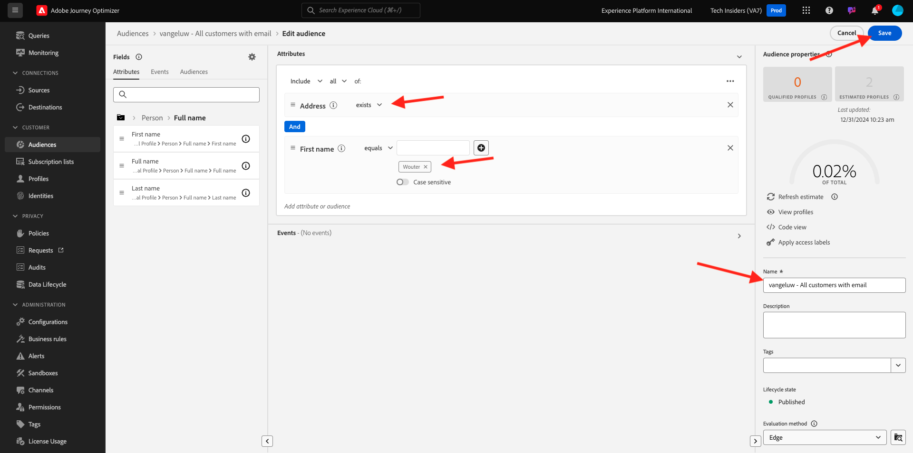
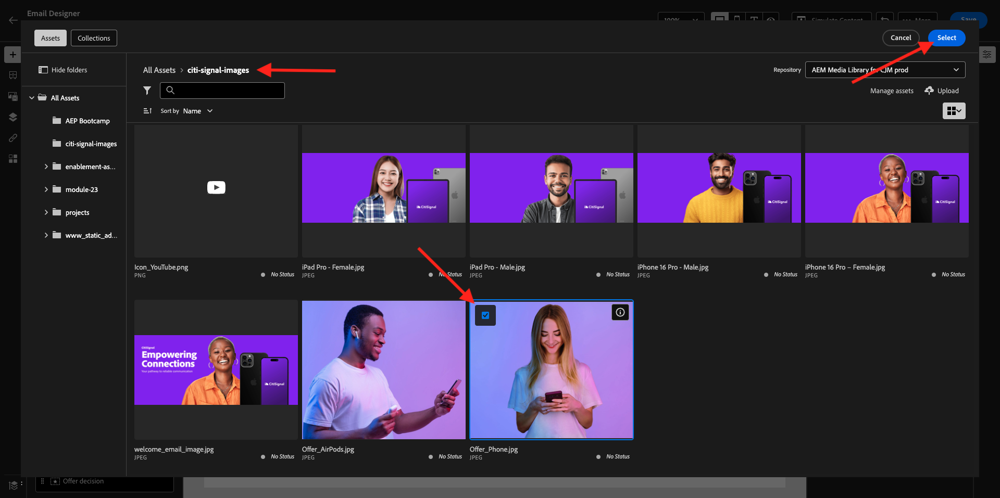
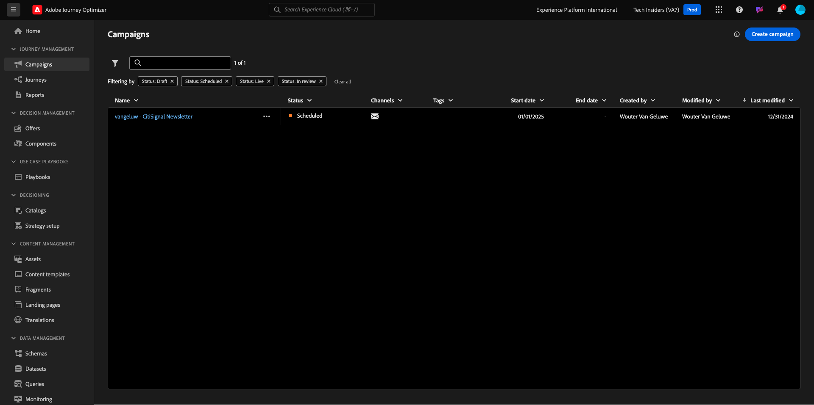

# 3.4.2 Konfigurieren einer Kampagne

Melden Sie sich bei Adobe Journey Optimizer an, indem Sie zu [Adobe Experience Cloud wechseln](https://experience.adobe.com). Auf **Journey Optimizer**.


Sie werden zur Ansicht **Startseite** in Journey Optimizer weitergeleitet. Stellen Sie zunächst sicher, dass Sie die richtige Sandbox verwenden. Die zu verwendende Sandbox heißt `--aepSandboxName--`. Sie befinden sich dann in der **Startseite**-Ansicht Ihres Sandbox-`--aepSandboxName--`.


## 3.4.2.1 Zielgruppe erstellen

Bevor Sie eine Kampagne erstellen, sollten Sie die Audience definieren, die die Kampagne erhalten soll. Um eine Zielgruppe zu erstellen, gehen **im** Menü zu „Zielgruppen“. Dort sehen Sie alle zuvor erstellten Zielgruppen.

Klicken Sie auf **+ Zielgruppe erstellen**.


Wählen Sie **Regel erstellen** und klicken Sie auf **Erstellen**.


Wählen Sie das Feld **Individuelles XDM-Profil > Persönliche E-Mail > Adresse** aus und fügen Sie es zur Arbeitsfläche hinzu. Legen Sie die Regelbedingung auf &quot;**&quot;**.

Um zu vermeiden, dass E-Mails an andere Benutzer in Ihrer freigegebenen Trainings-Umgebung gesendet werden, können Sie auch einen Filter hinzufügen, z. B **„Vorname ist gleich -Ihr Vorname-**.

Legen Sie den Namen Ihrer Audience auf `--aepUserLdap-- - All customers with email` fest und klicken Sie auf **Publish**.



Ihre Zielgruppe ist jetzt veröffentlicht und kann in einer Kampagne verwendet werden.

## 3.4.2.2 Erstellen einer Newsletter-Kampagne

Im Folgenden erstellen Sie eine Kampagne. Im Gegensatz zum ereignisbasierten Journey der vorherigen Übung, das auf eingehenden Erlebnisereignissen oder Zielgruppeneintritten oder -austritten beruht, um eine Journey für einen bestimmten Kunden Trigger, richten sich Kampagnen mit einzigartigen Inhalten wie Newslettern, einmaligen Werbeaktionen oder allgemeinen Informationen oder regelmäßig mit ähnlichen Inhalten, die regelmäßig gesendet werden, wie z. B. Geburtstagskampagnen und Erinnerungen.

Gehen Sie im Menü zu **Kampagnen** und klicken Sie auf **Kampagne erstellen**.


Wählen Sie **Geplant - Marketing** und klicken Sie auf **Erstellen**.


Konfigurieren Sie im Bildschirm zur Kampagnenerstellung Folgendes:

- **Name**: `--aepUserLdap-- - CitiSignal Newsletter`.
- **Beschreibung**: monatlicher Newsletter
- **Identitätstyp**: Ändern in E-Mail

Klicken Sie **Zielgruppe auswählen**.


Wählen Sie für **Zielgruppe** die Zielgruppe aus, die Sie `--aepUserLdap-- - All customers with email` im vorherigen Schritt erstellt haben. Klicken Sie auf **Speichern**.


Wählen Sie für **Aktion** die Option **E-Mail** und wählen Sie eine vorhandene **E-Mail-Konfiguration**. Sie werden den Inhalt in einigen Minuten bearbeiten.


Wählen Sie für **Zeitplan** die Option **An einem bestimmten Datum und zu** Uhrzeit“ und legen Sie eine Uhrzeit der Wahl fest.


Sie können jetzt mit der Erstellung der E-Mail-Nachricht beginnen. Scrollen Sie etwas nach oben und klicken Sie auf **Inhalt bearbeiten**.


Sie werden es dann sehen. Verwenden Sie für **Betreffzeile** den folgenden Code: `Your monthly CitiSignal update has arrived.`. Klicken Sie anschließend auf **E-Mail-Textkörper bearbeiten**.


Wählen Sie **Von Grund auf gestalten**.


Sie werden es dann sehen. Im linken Menü finden Sie die Strukturkomponenten, mit denen Sie die Struktur der E-Mail definieren können (Zeilen und Spalten).

Ziehen Sie 3-mal eine **1:1-Spalte** auf die Arbeitsfläche, 1-mal eine 1:2-Spalte links und 1-mal eine 2:1-Spalte rechts, was Ihnen diese Struktur geben sollte:


Navigieren Sie im linken Menü zu **Fragmente**. Ziehen Sie die zuvor in [Übung 3.1.2.1](./../module3.1/ex2.md) erstellte Kopfzeile auf die erste Komponente auf der Arbeitsfläche. Ziehen Sie die Fußzeile, die Sie zuvor in [Übung 3.1.2.2](./../module3.1/ex2.md) erstellt haben, auf die letzte Komponente auf der Arbeitsfläche.


Klicken Sie im linken Menü auf das Symbol **+** . Navigieren Sie zu **Inhalte**, um Inhalte zur Arbeitsfläche hinzuzufügen.


Ziehen Sie eine **Text**-Komponente per Drag-and-Drop auf die zweite Zeile.


Wählen Sie den Standardtext in dieser Komponente aus **Geben Sie hier Ihren Text ein.** und durch den unten stehenden Text ersetzen. Ändern Sie die Ausrichtung in **Ausrichtung zentrieren**.

```javascript
Hi {{profile.person.name.firstName}}

As a CitiSignal member, you're part of a dynamic community that's constantly evolving to meet your needs. We're committed to delivering innovative solutions that enhance your digital lifestyle and keep you ahead of the curve.

Stay connected.
```


Ziehen Sie eine Komponente **Bild** per Drag-and-Drop in die dritte und vierte Zeile. Klicken Sie **3** Zeile auf „Durchsuchen“.


Öffnen Sie den Ordner **citi-signal-images**, klicken Sie auf das Bild **Offer_AirPods.jpg** und klicken Sie auf **Auswählen**.


Klicken Sie **dem** auf der vierten Zeile auf „Durchsuchen“.


Öffnen Sie den Ordner **citi-signal-images**, klicken Sie auf das Bild **Offer_Phone.jpg** und klicken Sie auf **Auswählen**.



Ziehen Sie eine **Text**-Komponente per Drag-and-Drop in die 3. und 4. Zeile.


Wählen Sie den Standardtext in der Komponente in der dritten Zeile aus **Geben Sie hier Ihren Text ein.** und durch den unten stehenden Text ersetzen.

```javascript
Get AirPods for free:

Experience seamless connectivity like never before with CitiSignal. Sign up for select premium plans and receive a complimentary pair of Apple AirPods. Stay connected in style with our unbeatable offer.
```

Wählen Sie den Standardtext in der Komponente in der 4. Zeile aus **Bitte geben Sie hier Ihren Text ein.** und durch den unten stehenden Text ersetzen.

```javascript
We'll pay off your phone:

Make the switch to CitiSignal and say goodbye to phone payments! Switching to CitiSignal has never been more rewarding. Say farewell to hefty phone bills as we help pay off your phone, up to 800$!
```


Ihre Standard-Newsletter-E-Mail ist jetzt bereit. Klicken Sie auf **Speichern**.


Kehren Sie zum Kampagnen-Dashboard zurück, indem Sie auf den **Pfeil** neben dem Betreffzeilentext in der oberen linken Ecke klicken.


Klicken Sie auf **Zum Aktivieren überprüfen**.


Sie erhalten dann möglicherweise diesen Fehler. In diesem Fall müssen Sie möglicherweise bis zu 24 Stunden warten, bis die Zielgruppe ausgewertet wurde, und dann erneut versuchen, Ihre Kampagne zu aktivieren. Möglicherweise müssen Sie auch den Zeitplan Ihrer Kampagne aktualisieren, damit sie zu einem späteren Zeitpunkt ausgeführt wird.

Klicken Sie **Aktivieren**.


Nach der Aktivierung wird die Ausführung der Kampagne geplant.



Ihre Kampagne ist jetzt aktiviert. Ihre Newsletter-E-Mail-Nachricht wird so gesendet, wie Sie es in Ihrem Zeitplan definiert haben. Ihre Kampagne wird gestoppt, sobald die letzte E-Mail gesendet wurde.

Sie sollten die E-Mail auch unter der E-Mail-Adresse erhalten, die Sie für das zuvor erstellte Demoprofil verwendet haben.


Du hast diese Übung beendet.

Nächster Schritt: [3.4.3 Anwenden der segmentbasierten Personalisierung in einer E-Mail-Nachricht](./ex3.md)

[Zurück zum Modul 3.4](./journeyoptimizer.md)

[Zurück zu „Alle Module“](../../../overview.md)
