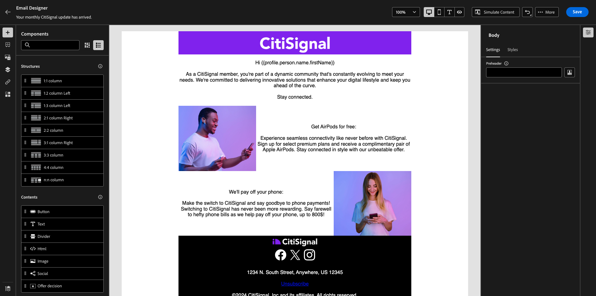
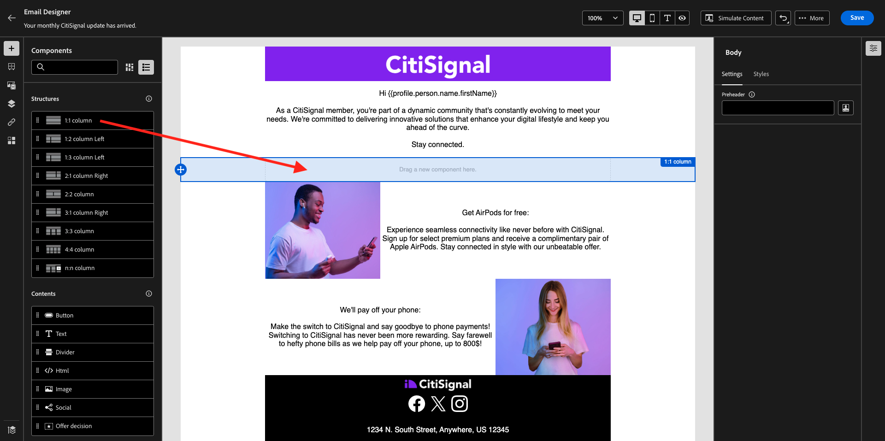

# 3.4.3 Personalisierung in einer E-Mail-Nachricht anwenden

Melden Sie sich bei Adobe Experience Cloud an, indem Sie zu [Adobe Experience Cloud wechseln](https://experience.adobe.com). Auf **Adobe Journey Optimizer**.

Sie werden zur Ansicht **Startseite** in Journey Optimizer weitergeleitet. Bevor Sie fortfahren, müssen Sie eine **Sandbox“**. Die auszuwählende Sandbox hat den Namen ``--aepTenantId--``.

## 3.4.3.1 segmentbasierte Personalisierung

In dieser Übung verbessern Sie Ihre Newsletter-E-Mail-Nachricht mit einem personalisierten Text, der auf der Segmentzugehörigkeit basiert.

Wechseln Sie zu **Journey**. Suchen Sie die Newsletter-Journey, die Sie in der vorherigen Übung erstellt haben. Suchen Sie nach `--aepUserLdap-- - Newsletter`. Klicken Sie auf den Journey, um ihn zu öffnen.

Sie werden es dann sehen. Klicken Sie auf **Duplizieren**.

Klicken Sie auf **Duplizieren**.

Wählen Sie Ihre Aktion **E** und klicken Sie auf **Inhalt bearbeiten**.

Klicken Sie auf **E-Mail an Designer**.

Sie werden es dann sehen.

Öffnen Sie **Inhaltskomponenten** und ziehen Sie eine **Text**-Komponente unter den aktuellen Newsletter-Inhalt.

Wählen Sie den gesamten Standardtext aus und löschen Sie ihn. Klicken Sie dann auf die **Personalisierung hinzufügen** in der Symbolleiste.

Sie sehen dann Folgendes:

Klicken Sie im linken Menü auf **Segmentzugehörigkeit**.

>[!NOTE]
>
>Wenn Sie Ihr Segment nicht in dieser Liste finden können, scrollen Sie ein wenig nach unten, um Anweisungen zum manuellen Abrufen der Segment-ID zu finden.

Wählen Sie die `Luma - Women's Category Interest` aus und klicken Sie auf das Symbol **+** , das wie folgt aussehen sollte:

Sie sollten dann die erste Zeile so lassen, wie sie ist, und Zeile 2 und 3 durch diesen Code ersetzen:

``
    Psssst... a private sale in the women category will launch soon, we will keep you posted

    Thanks for taking the time to read our newsletter. Here is a 10% promo code to use on the website: READER10

``

Sie erhalten dann Folgendes:

Klicken Sie auf **Validieren**, um sicherzustellen, dass der Code korrekt ist. Klicken Sie auf **Speichern**.

Sie können diese Nachricht jetzt speichern, indem Sie auf die **Speichern**-Schaltfläche oben rechts klicken. Klicken Sie dann auf **Inhalt simulieren**.

Wählen Sie eines der Profile aus, die Sie im Rahmen dieses Tutorials erstellt haben, und klicken Sie auf **Vorschau**. Anschließend werden die Ergebnisse Ihrer Konfiguration angezeigt.

Sie werden es dann sehen. Klicken Sie dann auf **Schließen**.

Kehren Sie zum Nachrichten-Dashboard zurück, indem Sie auf den **Pfeil** neben dem Betreffzeilentext in der oberen linken Ecke klicken.

Klicken Sie auf den Pfeil oben links, um zu Ihrem Journey zurückzukehren.

Klicken Sie auf **OK**, um die E-Mail-Aktion zu schließen.

Ändern Sie **Zeitplan** in **Einmal** und definieren Sie ein **Datum/Uhrzeit**. Klicken Sie auf **OK**.

>[!NOTE]
>
>Datum und Uhrzeit des Nachrichtenversands müssen innerhalb von mehr als einer Stunde liegen.

Klicken Sie auf die Schaltfläche **Publish** auf der Journey.

Klicken Sie im Popup-Fenster erneut auf **Publish**.

Ihre Standard-Newsletter-Journey ist jetzt veröffentlicht. Ihre Newsletter-E-Mail-Nachricht wird auf der Grundlage Ihres Zeitplans gesendet und Ihr Journey wird gestoppt, sobald die letzte E-Mail gesendet wurde.

Du hast diese Übung beendet.

Nächster Schritt: [3.4.4 Einrichten und Verwenden von Push-Benachrichtigungen für iOS](./ex4.md)

[Zurück zum Modul 3.4](./journeyoptimizer.md)

[Zurück zu „Alle Module“](../../../overview.md)
