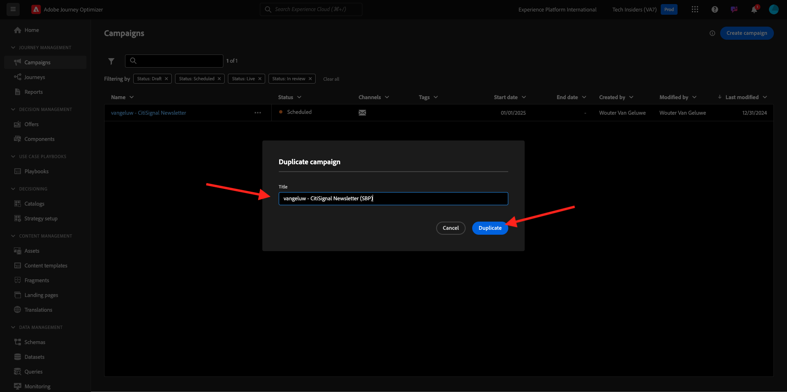
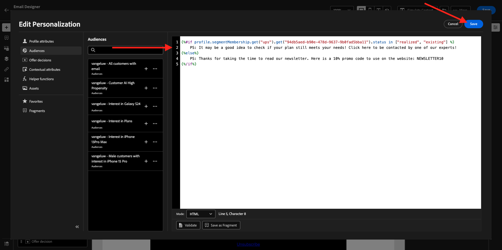

# 3.4.3 Personalisierung in einer E-Mail-Nachricht anwenden

Melden Sie sich bei Adobe Experience Cloud an, indem Sie zu [Adobe Experience Cloud](https://experience.adobe.com) wechseln. Klicken Sie auf **Adobe Journey Optimizer**.

Sie werden zur Ansicht **Home** in Journey Optimizer weitergeleitet. Bevor Sie fortfahren, müssen Sie eine **Sandbox** auswählen. Die auszuwählende Sandbox heißt ``--aepTenantId--``. Klicken Sie dazu in der blauen Zeile oben auf Ihrem Bildschirm auf den Text **[!UICONTROL Produktions-Prod]** .

## 3.4.3.1 Segmentbasierte Personalisierung

In dieser Übung verbessern Sie Ihre Newsletter-E-Mail-Nachricht mit einem personalisierten Text, der auf der Segmentmitgliedschaft basiert.

Wechseln Sie zu **Journey**. Suchen Sie die Newsletter-Journey, die Sie in der vorherigen Übung erstellt haben. Suchen Sie nach `--aepUserLdap-- - Newsletter`. Klicken Sie auf Ihre Journey, um sie zu öffnen.

Dann wirst du das sehen. Klicken Sie auf **Duplizieren**.

Klicken Sie auf **Duplizieren**.

Wählen Sie die Aktion **E-Mail** aus und klicken Sie auf **Inhalt bearbeiten**.

Klicken Sie auf **E-Mail an Designer senden**.

Dann wirst du das sehen.

Öffnen Sie **Inhaltskomponenten** und ziehen Sie eine Komponente **Text** unter den aktuellen Newsletter-Inhalt.

Wählen Sie den gesamten Standardtext aus und löschen Sie ihn. Klicken Sie dann in der Symbolleiste auf die Schaltfläche **Personalisierung hinzufügen** .

Daraufhin sehen Sie Folgendes:

Klicken Sie im linken Menü auf **Segmentmitgliedschaften**.

>[!NOTE]
>
>Wenn Sie Ihr Segment nicht in dieser Liste finden, scrollen Sie nach unten, um Anweisungen zum manuellen Abrufen der Segment-ID zu erhalten.

Wählen Sie das Segment `Luma - Women's Category Interest` aus und klicken Sie auf das Symbol **+** , das wie folgt aussehen soll:

Lassen Sie dann die erste Zeile unverändert und ersetzen Sie die Zeilen 2 und 3 durch diesen Code:

``
    Psssst... a private sale in the women category will launch soon, we will keep you posted

    Thanks for taking the time to read our newsletter. Here is a 10% promo code to use on the website: READER10

``

Dann haben Sie Folgendes:

Klicken Sie auf **Validieren** , um sicherzustellen, dass der Code korrekt ist. Klicken Sie auf **Speichern**.

Sie können diese Nachricht jetzt speichern, indem Sie oben rechts auf die Schaltfläche **Speichern** klicken. Klicken Sie dann auf **Inhalt simulieren**.

Wählen Sie eines der Profile aus, die Sie im Rahmen dieses Tutorials erstellt haben, und klicken Sie auf **Vorschau**. Sie sehen dann das Ergebnis Ihrer Konfiguration.

Dann wirst du das sehen. Klicken Sie dann auf **Close**.

Gehen Sie zurück zum Nachrichten-Dashboard, indem Sie in der oberen linken Ecke auf den Pfeil **11} neben dem Betreffzeilentext klicken.**

Klicken Sie auf den Pfeil oben links, um zu Ihrer Journey zurückzukehren.

Klicken Sie auf **OK** , um Ihre E-Mail-Aktion zu schließen.

Ändern Sie Ihren **Zeitplan** in **einmal** und definieren Sie ein **Datum/Uhrzeit**. Klicken Sie auf **OK**.

>[!NOTE]
>
>Datum und Uhrzeit des Nachrichtenversands müssen innerhalb von mehr als einer Stunde liegen.

Klicken Sie auf die Schaltfläche **Publish** im Journey.

Klicken Sie erneut im Popup-Fenster auf **Publish** .

Ihre grundlegende Newsletter-Journey ist jetzt veröffentlicht. Ihre Newsletter-E-Mail-Nachricht wird nach Ihrem Zeitplan gesendet und Ihre Journey wird beendet, sobald die letzte E-Mail gesendet wurde.

Du hast diese Übung beendet.

Nächster Schritt: [3.4.4 Push-Benachrichtigungen für iOS einrichten und verwenden](./ex4.md)

[Zurück zu Modul 3.4](./journeyoptimizer.md)

[Zu allen Modulen zurückkehren](../../../overview.md)
