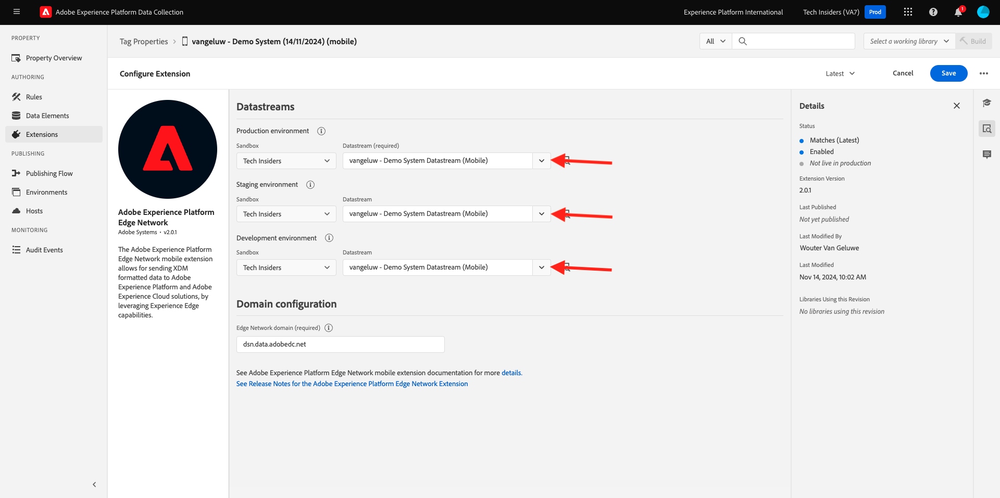
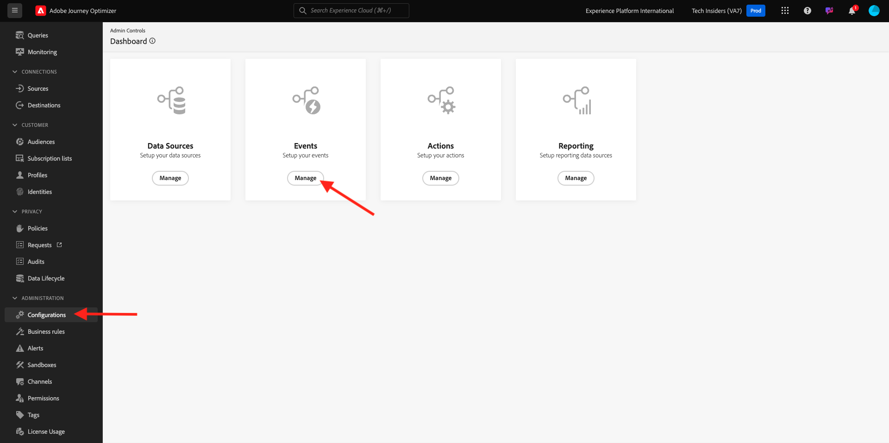
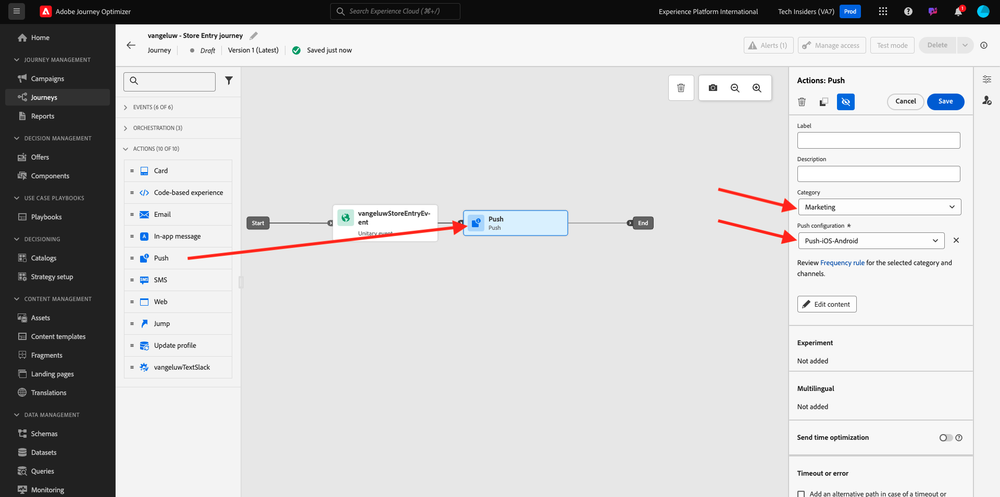

# 3.4.4 Push-Benachrichtigungen für iOS einrichten und verwenden

Um Push-Benachrichtigungen mit Adobe Journey Optimizer verwenden zu können, müssen Sie eine Reihe von Einstellungen festlegen.

Im Folgenden finden Sie alle zu überprüfenden Einstellungen:

- Datensätze und Schemata in Adobe Experience Platform
- Datenspeicher für Mobilgeräte
- Datenerfassungseigenschaft für Mobilgeräte
- App-Oberfläche für Push-Zertifikate
- Testen des Push-Setups mit AEP Assurance

Lasst uns diese einzeln überprüfen.

Melden Sie sich bei Adobe Journey Optimizer an, indem Sie zu [Adobe Experience Cloud](https://experience.adobe.com) wechseln. Klicken Sie auf **Journey Optimizer**.

Sie werden zur Ansicht **Home** in Journey Optimizer weitergeleitet. Vergewissern Sie sich zunächst, dass Sie die richtige Sandbox verwenden. Die zu verwendende Sandbox heißt `--aepSandboxName--`. Um von einer Sandbox zu einer anderen zu wechseln, klicken Sie auf **PRODUKTIONSPROD (VA7)** und wählen Sie die Sandbox aus der Liste aus. In diesem Beispiel erhält die Sandbox den Namen **AEP-Aktivierung FY22**. Sie befinden sich dann in der Ansicht **Home** Ihrer Sandbox `--aepSandboxName--`.

## 3.4.4.1 Push-Datensätze

Adobe Journey Optimizer verwendet Datensätze, um Dinge wie die Push-Token von Mobilgeräten oder Interaktionen mit Push-Nachrichten (z. B. gesendete Nachrichten, geöffnete Nachrichten usw.) in einem Datensatz in Adobe Journey Optimizer zu speichern.

Sie können diese Datensätze finden, indem Sie im Menü links auf Ihrem Bildschirm zu **[!UICONTROL Datensätze]** navigieren. Um Systemdatensätze anzuzeigen, klicken Sie auf das Filtersymbol.

Aktivieren Sie die Option **Systemdatensätze anzeigen** und suchen Sie nach **AJO**. Anschließend werden die für Push-Benachrichtigungen verwendeten Datensätze angezeigt.

## 3.4.4.2 Datenspeicher für Mobilgeräte

Wechseln Sie zu [https://experience.adobe.com/#/data-collection/](https://experience.adobe.com/#/data-collection/).

Navigieren Sie im linken Menü zu **[!UICONTROL Datastream]** und suchen Sie nach Ihrem Datastream, den Sie in [Übung 0.2](./../../../modules/gettingstarted/gettingstarted/ex2.md) erstellt haben, der den Namen `--aepUserLdap-- - Demo System Datastream (Mobile)` trägt. Klicken Sie auf , um es zu öffnen.

Klicken Sie im Dienst **Adobe Experience Platform** auf **Bearbeiten** .

Anschließend werden die definierten Datenspeichereinstellungen angezeigt, in denen Datensätze und Profilattribute gespeichert werden.

Es sind keine Änderungen erforderlich. Ihr Datastream kann jetzt in Ihrer Datenerfassungs-Client-Eigenschaft für Mobile verwendet werden.

## 3.4.4.3 Überprüfen Sie Ihre Datenerfassungseigenschaft für Mobile

Wechseln Sie zu [https://experience.adobe.com/#/data-collection/](https://experience.adobe.com/#/data-collection/). Im Rahmen von [Übung 0.1](./../../../modules/gettingstarted/gettingstarted/ex1.md) wurden 2 Datenerfassungseigenschaften erstellt.
Sie haben diese Datenerfassungs-Client-Eigenschaften bereits als Teil früherer Module verwendet.

Klicken Sie auf , um die Datenerfassungseigenschaft für Mobilgeräte zu öffnen.

Wechseln Sie in der Datenerfassungseigenschaft zu **Erweiterungen**. Anschließend werden die verschiedenen Erweiterungen angezeigt, die für die mobile App erforderlich sind. Klicken Sie auf , um die Erweiterung **Adobe Experience Platform-Edge Network** zu öffnen.

Dann sehen Sie, dass Ihr Datastream für Mobilgeräte hier verknüpft ist. Klicken Sie anschließend auf **Abbrechen** , um zur Übersicht über Ihre Erweiterungen zurückzukehren.

Du wirst dann wieder hier sein. Sie sehen die Erweiterung für **AEP Assurance**. Mit AEP Assurance können Sie die Erfassung, den Testversand, die Simulation und die Validierung der Datenerfassung und der Bereitstellung von Erlebnissen in Ihrer App überprüfen. Weitere Informationen zu AEP Assurance und Project Griffon finden Sie hier [https://aep-sdks.gitbook.io/docs/beta/project-griffon](https://aep-sdks.gitbook.io/docs/beta/project-griffon).

Klicken Sie anschließend auf **Konfigurieren** , um die Erweiterung **Adobe Journey Optimizer** zu öffnen.

Dann sehen Sie, dass der Datensatz für die Verfolgung von Push-Ereignissen hier verknüpft ist.

Sie müssen keine Änderungen an Ihrer Datenerfassungseigenschaft vornehmen.

## 3.4.4.4 Einrichten der App-Oberfläche überprüfen

Wechseln Sie zu [https://experience.adobe.com/#/data-collection/](https://experience.adobe.com/#/data-collection/). Navigieren Sie im linken Menü zu **App-Oberflächen** und öffnen Sie die App-Oberfläche für **DX Demo App APNS**.

Anschließend wird die konfigurierte App-Oberfläche für iOS und Android angezeigt.

## 3.4.4.5 Testen der Einrichtung von Push-Benachrichtigungen mit AEP Assurance

Sobald die App installiert ist, finden Sie sie auf dem Startbildschirm Ihres Geräts. Klicken Sie auf das Symbol, um die App zu öffnen.

Wenn Sie die App zum ersten Mal verwenden, werden Sie aufgefordert, sich mit Ihrer Adobe ID anzumelden. Schließen Sie den Anmeldevorgang ab.

Nach der Anmeldung wird eine Benachrichtigung angezeigt, in der Sie um Ihre Berechtigung zum Senden von Benachrichtigungen ersucht werden. Wir senden Benachrichtigungen als Teil des Tutorials. Klicken Sie daher auf **Zulassen**.

Sie sehen dann die Startseite der App. Wechseln Sie zu **Einstellungen**.

In den Einstellungen wird angezeigt, dass derzeit ein **öffentliches Projekt** in die App geladen ist. Klicken Sie auf **Benutzerdefiniertes Projekt**.

Sie können jetzt ein benutzerdefiniertes Projekt laden. Klicken Sie auf den QR-Code, um Ihr Projekt einfach zu laden.

Nach Übung 0.1 hatten Sie dieses Ergebnis. Klicken Sie auf , um das für Sie erstellte Projekt **Mobile Retail** zu öffnen.

Falls Sie Ihr Browser-Fenster versehentlich geschlossen haben oder für zukünftige Demo- oder Aktivierungssitzungen, können Sie auch auf Ihr Website-Projekt zugreifen, indem Sie [https://builder.adobedemo.com/projects](https://builder.adobedemo.com/projects) aufrufen. Nach der Anmeldung bei Ihrer Adobe ID sehen Sie dies. Klicken Sie auf Ihr Mobile-App-Projekt, um es zu öffnen.

Dann wirst du das sehen. Klicken Sie auf **Integrationen**.

Sie müssen die Datenerfassungseigenschaft für Mobilgeräte auswählen, die in Übung 0.1 erstellt wurde. Klicken Sie anschließend auf **Ausführen**.

Dann sehen Sie dieses Popup, das einen QR-Code enthält. Scannen Sie diesen QR-Code aus der Mobile App heraus.

Anschließend wird Ihre Projekt-ID in der App angezeigt. Anschließend können Sie auf **Speichern** klicken.

Gehen Sie in der App zurück zu **Home** . Ihre App kann jetzt verwendet werden.

Sie müssen jetzt einen QR-Code scannen, um Ihr Mobilgerät mit Ihrer AEP Assurance-Sitzung zu verbinden.

Um eine AEP Assurance-Sitzung zu starten, gehen Sie zu [https://experience.adobe.com/#/@experienceplatform/griffon](https://experience.adobe.com/#/@experienceplatform/griffon). Klicken Sie auf **Sitzung erstellen**.

Klicken Sie auf **Starten**.

Füllen Sie die Werte aus:

- Sitzungsname: Verwenden Sie `--aepUserLdap-- - push debugging` und ersetzen Sie ldap durch Ihren ldap
- Basis-URL: Verwenden Sie **dxdemo://default**

Klicken Sie auf **Weiter**.

Daraufhin wird auf Ihrem Bildschirm ein QR-Code angezeigt, den Sie mit Ihrem iOS-Gerät scannen sollten.

Öffnen Sie auf Ihrem Mobilgerät die Kamera-App und scannen Sie den QR-Code, der von AEP Assurance angezeigt wird.

Dann sehen Sie einen Popup-Bildschirm, in dem Sie aufgefordert werden, den PIN-Code einzugeben. Kopieren Sie den PIN-Code aus Ihrem AEP Assurance-Bildschirm und klicken Sie auf **Verbinden**.

Dann wirst du das sehen.

In AEP Assurance sehen Sie jetzt, dass ein Gerät zur AEP Assurance-Sitzung gehört.

Wechseln Sie zu **Push Debug**. Du wirst so etwas sehen.

Einige Erklärungen:

- Die erste Spalte, **Client**, zeigt die verfügbaren IDs auf Ihrem iOS-Gerät an. Es werden eine ECID und ein Push-Token angezeigt.
- Die zweite Spalte enthält Informationen zum **Profil** mit zusätzlichen Informationen zur Plattform, auf der sich das Push-Token befindet (APNS oder APNSSandbox). Wenn Sie auf die Schaltfläche **Inspect-Profil** klicken, gelangen Sie zu Adobe Experience Platform und das vollständige Echtzeit-Kundenprofil wird angezeigt.
- Die dritte Spalte zeigt die **App-Konfiguration**, die im Rahmen der Übung **3.4.5.4 Erstellen einer App-Konfiguration in Launch** eingerichtet wurde.

Um die Einrichtung der Push-Konfiguration zu testen, klicken Sie auf die Schaltfläche **Push-Benachrichtigung senden** .

Sie müssen sicherstellen, dass die **DX Demo**-App nicht geöffnet ist, wenn Sie auf die Schaltfläche **Push-Benachrichtigung senden** klicken. Wenn die App geöffnet ist, wird die Push-Benachrichtigung möglicherweise im Hintergrund empfangen und nicht angezeigt.

Daraufhin wird auf Ihrem Mobilgerät eine Push-Benachrichtigung wie diese angezeigt.

Wenn Sie die Push-Benachrichtigung erhalten haben, bedeutet dies, dass Ihr Setup korrekt ist und ordnungsgemäß funktioniert.

## 3.4.4.6 Neues Ereignis erstellen

Wechseln Sie im Menü zu **Journey Administration** und klicken Sie unter **-Ereignisse** auf **Verwalten** .

Auf dem Bildschirm **Ereignisse** wird eine Ansicht ähnlich der folgenden angezeigt. Klicken Sie auf **Ereignis erstellen**.

Anschließend wird eine leere Ereigniskonfiguration angezeigt.

Geben Sie zunächst Ihrem Ereignis einen Namen wie folgt: `--aepUserLdap--StoreEntryEvent` und legen Sie die Beschreibung auf `Store Entry Event` fest.

Als Nächstes wird die Auswahl **Ereignistyp** ausgewählt. Wählen Sie **Einzeln** aus.

Als Nächstes wählen Sie den **Ereignis-ID-Typ** aus. Wählen Sie **System generiert** aus.

Als Nächstes folgt die Schemaauswahl. Für diese Übung wurde ein Schema vorbereitet. Verwenden Sie das Schema `Demo System - Event Schema for Mobile App (Global v1.1) v.1`.

Nach Auswahl des Schemas werden im Abschnitt **Payload** eine Reihe von Feldern ausgewählt. Ihr Ereignis ist jetzt vollständig konfiguriert.

Dann sollten Sie das sehen. Klicken Sie auf **Speichern**.

Ihr Ereignis ist jetzt konfiguriert und gespeichert. Klicken Sie erneut auf Ihr Ereignis, um den Bildschirm **Ereignis bearbeiten** erneut zu öffnen.

Bewegen Sie den Mauszeiger über das Feld **Payload** und klicken Sie auf das Symbol **Payload anzeigen** .

Sie sehen nun ein Beispiel der erwarteten Payload.

Ihr Ereignis verfügt über eine eindeutige eventID für die Orchestrierung, die Sie finden können, indem Sie in dieser Payload nach unten scrollen, bis Sie `_experience.campaign.orchestration.eventID` sehen.

Die Ereignis-ID muss an Adobe Experience Platform gesendet werden, um die Journey Trigger, die Sie im nächsten Schritt erstellen werden. Notieren Sie sich diese eventID, da Sie sie im nächsten Schritt benötigen werden.
`"eventID": "e3a8f0bdc0b609667cd96a72a6b1e5aafa0ddaf6ccf121c574e6a2030860a633"`

Klicken Sie auf **OK**, gefolgt von **Abbrechen**.

## 3.4.4.7 Journey erstellen

Wechseln Sie im Menü zu **Journey** und klicken Sie auf **Journey erstellen**.

Dann wirst du das sehen. Benennen Sie Ihre Journey. Verwenden Sie `--aepUserLdap-- - Store Entry journey`. Klicken Sie auf **OK**.

Zunächst müssen Sie Ihr Ereignis als Ausgangspunkt Ihrer Journey hinzufügen. Suchen Sie nach Ihrem Ereignis `--aepUserLdap--StoreEntryEvent` und ziehen Sie es auf die Arbeitsfläche. Klicken Sie auf **OK**.

Suchen Sie dann unter **Aktionen** nach der Aktion **Push** .
Ziehen Sie die Aktion **Push** auf die Arbeitsfläche.

Setzen Sie die **Kategorie** auf **Marketing** und wählen Sie eine Push-Oberfläche aus, über die Sie Push-Benachrichtigungen senden können. In diesem Fall ist die auszuwählende E-Mail-Oberfläche **Push-iOS-Android**.

Der nächste Schritt besteht darin, Ihre Nachricht zu erstellen. Klicken Sie dazu auf **Inhalt bearbeiten**.

Dann wirst du das sehen. Klicken Sie auf das Symbol **personalization** für das Feld **Title** .

Dann wirst du das sehen. Sie können jetzt jedes Profilattribut direkt aus dem Echtzeit-Kundenprofil auswählen.

Suchen Sie nach dem Feld **Vorname** und klicken Sie dann auf das Symbol **+** neben dem Feld **Vorname**. Anschließend wird das Personalisierungstoken für Vorname hinzugefügt: **{{profile.person.name.firstName}}**.

Als Nächstes fügen Sie den Text **, willkommen in unserem Geschäft!** hinter **{{profile.person.name.firstName}}**.

Klicken Sie auf **Speichern**.

Das hast du jetzt. Klicken Sie auf das Symbol **personalization** für das Feld **body** .

Geben Sie diesen Text ein **Klicken Sie hier, um einen 10% Rabatt zu erhalten, wenn Sie heute kaufen!** und klicken Sie auf **Speichern**.

Dann wirst du das haben. Klicken Sie auf den Pfeil oben links, um zu Ihrer Journey zurückzukehren.

Klicken Sie auf **OK** , um Ihre Push-Aktion zu schließen.

Klicken Sie auf **Veröffentlichen**.

Klicken Sie erneut auf **Publish**.

Ihre Journey ist jetzt veröffentlicht.

## 3.4.4.8 Journey und Push-Nachricht testen

Wechseln Sie in Ihrer DX Demo 2.0-Mobile App zum Bildschirm **Einstellungen** . Klicken Sie auf die Schaltfläche **Eintrag speichern** .

>[!NOTE]
>
>Die Schaltfläche **Eintrag speichern** wird derzeit implementiert. Sie werden es noch nicht in der App finden.

Schließen Sie die App sofort, nachdem Sie auf das Symbol **Eintrag speichern** geklickt haben. Andernfalls wird die Push-Nachricht nicht angezeigt.

Nach einigen Sekunden wird die Nachricht angezeigt.

Du hast diese Übung beendet.

Nächster Schritt: [3.4.5 Geschäftsereignis-Journey erstellen](./ex5.md)

[Zurück zu Modul 3.4](./journeyoptimizer.md)

[Zu allen Modulen zurückkehren](../../../overview.md)
