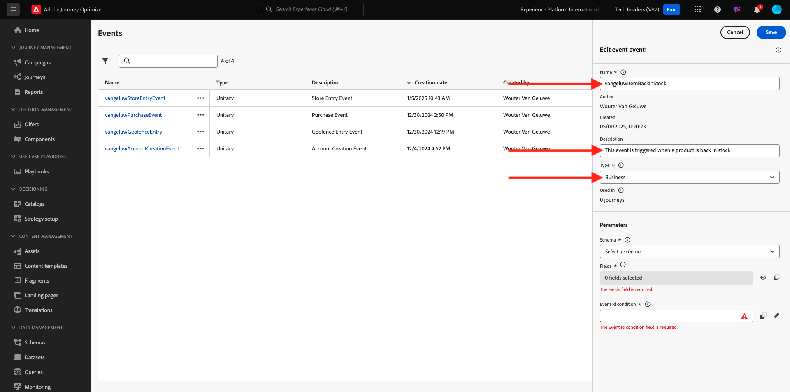
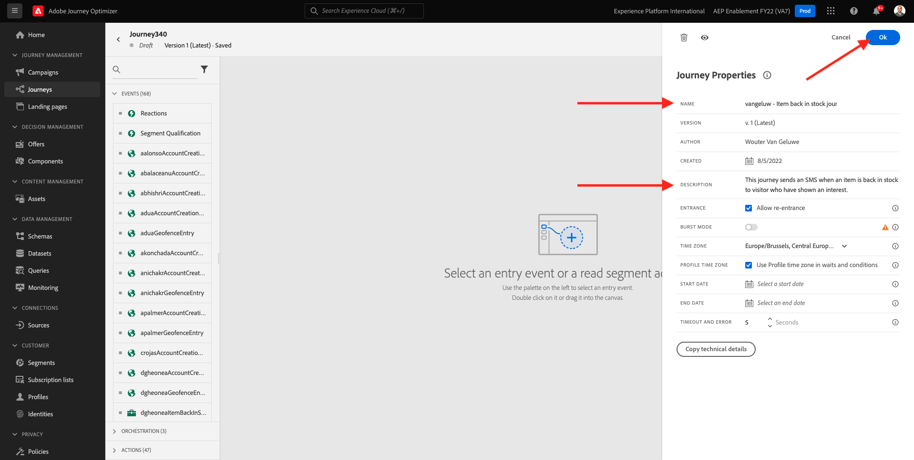
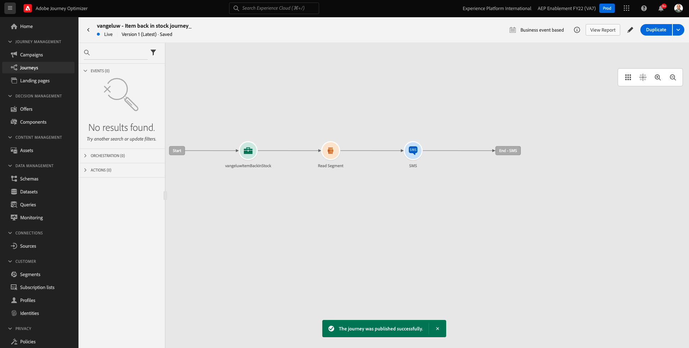
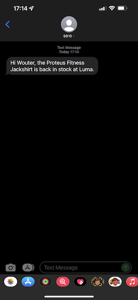

# 3.4.5 Erstellen einer Geschäftsereignis-Journey

Melden Sie sich bei Adobe Journey Optimizer an, indem Sie zu [Adobe Experience Cloud wechseln](https://experience.adobe.com). Auf **Journey Optimizer**.


Sie werden zur Ansicht **Startseite** in Journey Optimizer weitergeleitet. Stellen Sie zunächst sicher, dass Sie die richtige Sandbox verwenden. Die zu verwendende Sandbox heißt `--aepSandboxName--`. Sie befinden sich dann in der **Startseite**-Ansicht Ihres Sandbox-`--aepSandboxName--`.


## 3.4.5.1 Erstellen eines Geschäftsereignisses

Klicken Sie im linken Menü auf &quot;**&quot;**. Klicken Sie auf die **Verwalten** in der Karte **Ereignisse**.


Geschäftsereignisse sind eine neue Art von Ereignissen, die Sie in Journey Optimizer erstellen können. Im Gegensatz **„Unitär**-Ereignisse, die Sie in vorherigen Modulen erstellt haben, werden die Geschäftsereignisse nicht vom Kunden, sondern von der Organisation ausgelöst. Jetzt erstellen Sie Ihr Geschäftsereignis.

Klicken Sie **Ereignis erstellen**.


Geben Sie die folgenden Werte in das Formular für die Ereigniserstellung ein:

- **Name**: `--aepUserLdap--ItemBackInStock`. Beispiel: **vangeluwItemBackInStock**
- **Beschreibung**: Dieses Ereignis wird ausgelöst, wenn ein Produkt wieder auf Lager ist
- **Typ**: Wählen Sie **Unternehmen** in der Dropdown-Liste aus.



Wählen Sie für das Schema **Demosystem - Ereignisschema für JO-Geschäftsereignisse (Global v1.1) v.1** aus. Nun müssen Sie die Felder im Schema auswählen, die Sie für Ihren Anwendungsfall benötigen.


Führen Sie folgende Schritte aus:

Klicken Sie auf das **Bleistift**-Symbol in dem Feld, in dem sich **1 Feld ausgewählt** befindet.


Wählen Sie alle verfügbaren Felder im Schema aus und klicken Sie dann auf **OK**.


Für die Bedingung: Sie müssen angeben, welche Datensätze in diesem Schema das Geschäftsereignis auslösen.

Führen Sie folgende Schritte aus:

Klicken Sie auf **Stiftsymbol** dem Feld, in dem sich &quot;**hinzufügen“**.


Erweitern Sie auf der linken Seite das `--aepTenantId--`, erweitern Sie das Objekt **joBusinessEvents** und ziehen Sie das Feld **eventName** per Drag-and-Drop auf die Arbeitsfläche.


Geben Sie für das Feld **eventName** den folgenden Wert ein: `--aepUserLdap--ItemBackInStock`. Beispiel: vangeluwItemBackInStock.
Klicken Sie auf **OK**.


Klicken Sie auf **OK**.


Schließlich sollte Ihr Formular für die Ereigniserstellung wie folgt aussehen. Klicken Sie **Speichern**, um Ihr Geschäftsereignis zu speichern.


## 3.4.5.2 Erstellen einer Geschäftsereignis-Journey

Sie können jetzt dieses Geschäftsereignis und die Nachricht in einer Journey nutzen. Wechseln Sie zu **Journey**. Klicken Sie **Journey erstellen**.


Auf der rechten Seite sehen Sie ein Formular, in dem Sie den Journey-Namen und die Beschreibung angeben müssen. Geben Sie die folgenden Werte ein:

- **Name**: `--aepUserLdap-- - Item back in stock journey`. Zum Beispiel: vangeluw - Artikel zurück auf Lager Journey
- **Beschreibung**: Diese Journey sendet eine SMS, wenn ein Artikel wieder auf Lager ist, an einen Besucher, der Interesse gezeigt hat.

Klicken Sie auf **OK**.



Suchen Sie im linken Menü unter **Ereignisse** nach Ihrem LDAP. Sie finden die zuvor erstellte `--aepUserLdap--ItemBackInStock` für Geschäftsereignisse. Ziehen Sie dieses Ereignis per Drag-and-Drop auf die Arbeitsfläche, da dies der Ausgangspunkt der Journey ist.


Wie Sie sehen können, wurde **Aktivität „Zielgruppe lesen** automatisch zur Arbeitsfläche hinzugefügt. Dies liegt daran, dass die Geschäftsereignisse nur einen Trigger für die Journey senden, um eine bestimmte Zielgruppe zu lesen, die dann die Profilliste für diese Journey abruft.

Klicken Sie auf die **Zielgruppe lesen** Aktivität.
Bei der Konfiguration **Zielgruppe lesen** müssen Sie die Zielgruppe auswählen, die Sie über das gerade eingetretene Geschäftsereignis benachrichtigen möchten. Klicken Sie auf **Feld** Zielgruppe auswählen“.


Suchen Sie im Popup **Zielgruppe wählen** nach Ihrem LDAP und wählen Sie die Zielgruppe aus, die Sie in [Modul 2.3 - Real-Time CDP - Eine Zielgruppe erstellen und ](./../../../modules/rtcdp-b2c/module2.3/real-time-cdp-build-a-segment-take-action.md). `--aepUserLdap-- - Interest in Galaxy S24` erstellt haben. Klicken Sie auf **Speichern**.


Klicken Sie anschließend auf **OK**.


Der nächste Schritt besteht darin, die Aktion, die wir auf dieser Journey ausführen möchten, per Drag-and-Drop abzulegen. Wählen Sie die Aktion **SMS** aus und ziehen Sie sie dann nach der soeben hinzugefügten Bedingung per Drag-and-Drop hinüber.


Legen Sie die **Kategorie** auf **Marketing** fest und wählen Sie eine SMS-Oberfläche aus, mit der Sie SMS senden können. In diesem Fall ist die auszuwählende E-Mail-Oberfläche **SMS**.


Der nächste Schritt besteht darin, Ihre Nachricht zu erstellen. Klicken Sie dazu auf **Inhalt bearbeiten**.


Jetzt sehen Sie das Nachrichten-Dashboard, in dem Sie den Text Ihrer SMS konfigurieren können. Klicken Sie auf **Nachricht erstellen**, um Ihre Nachricht zu erstellen.


Geben Sie folgenden Text ein: `Hi {{profile.person.name.firstName}}, the Proteus Fitness Jackshirt is back in stock at Luma.`. Klicken Sie auf **Speichern**.


Kehren Sie zum Nachrichten-Dashboard zurück, indem Sie auf den **Pfeil** neben dem Betreffzeilentext in der oberen linken Ecke klicken.


Jetzt wird Ihre abgeschlossene SMS-Aktion angezeigt. Klicken Sie auf **OK**.


Ihr Journey ist jetzt zur Veröffentlichung bereit. Klicken Sie auf **Veröffentlichen**.


Klicken Sie erneut auf **** Publish.


Ihr Journey ist jetzt veröffentlicht, Sie können ihn jetzt testen!



## 3.4.5.3 Testen der Geschäftsereignis-Journey

Sie simulieren jetzt die erneute Lagerung eines Produkts, indem Sie mithilfe von Postman ein neues Ereignis für das **Demosystem - Ereignisschema für JO-Geschäftsereignisse (Global v1.1) v.1** aufnehmen.

Klicken Sie im linken Menü auf **Quellen** und dann auf die Registerkarte **Konten**.


Auf der Registerkarte **Konten** finden Sie das Konto mit dem Namen **Journey Optimizer Business Events**. Klicken Sie darauf, um sie zu öffnen.


Dieses Konto hat nur einen Datenfluss. Klicken Sie auf den Namen des Datenflusses, um ihn auszuwählen.


Klicken **im rechten Menü auf** Schema-Payload kopieren“. Diese Option kopiert den gesamten **curl**-Befehl, um einen Datensatz für **Demosystem - Ereignisschema für JO-Geschäftsereignisse (Global v1.1) v.1) in** Zwischenablage einzufügen.


Fügen Sie den cURL-Befehl in einen Texteditor ein


Schauen wir uns diese Anfrage näher an.

- Die Anfrage zur POST wird an die DCS Inlet ID gesendet
- Die Anfrage verweist auf das Schema, den Datensatz und die Organisations-ID.
- Schließlich enthält sie den Knoten xdmEntity , der die Daten darstellt, die wir im Datensatz erstellen möchten.

Jetzt müssen Sie die folgende `xdmEntity` ersetzen…

```json
"xdmEntity": {
  "_experienceplatform": {
    "joBusinessEvents": {
      "eventDescription": "string",
      "eventName": "string",
      "stockEventId": "string"
    }
  },
  "_id": "/uri-reference",
  "eventType": "advertising.completes",
  "timestamp": "2018-11-12T20:20:39+00:00"
}
```

…überprüfen Sie anhand dieser Zeile das Feld eventName, wie es lauten sollte: `--aepUserLdap--ItemBackInStock`. Dies stellt die Bedingung dar, die Sie im Geschäftsereignis angegeben haben, um Ihren Journey zum Trigger zu bringen.

```json
"xdmEntity": {
  "_experienceplatform": {
    "joBusinessEvents": {
      "eventDescription": "Product Proteus Fitness Jackshirt is back in stock",
      "eventName": "--aepUserLdap--ItemBackInStock",
      "stockEventId": "1"
    }
  },
  "_id": "/uri-reference",
  "eventType": "productBackInStock",
  "timestamp": "2021-04-19T15:25:39+00:00"
}
```

Der aktualisierte **curl**-Befehl sollte wie folgt aussehen:


Wählen Sie alles aus und kopieren Sie es in die Zwischenablage.

Öffnen Sie Postman. Klicken Sie auf der linken Seite von Postman auf **Importieren**.


Wählen Sie die Registerkarte **Rohtext** und fügen Sie den zuvor kopierten Befehl ein. Klicken Sie auf **Weiter**.


Klicken Sie **Importieren**.


Postman hat den **curl**-Befehl automatisch in einen REST-Befehl konvertiert, der ausgelöst werden kann. Klicken Sie einfach auf die Schaltfläche **Senden**, um die Erstellung dieses Datensatzes im Datensatz anzufordern.


Überprüfen Sie, ob Ihre Anfrage erfolgreich empfangen wurde. Suchen Sie nach einem **200 OK**-Status in Postman.


Es kann einige Minuten dauern, bis die SMS auf Ihrem Mobiltelefon ankommt. Ist dies nicht der Fall, enthält **Segment „Interesse an Proteus Fitness**&quot; möglicherweise kein Profil mit einem richtigen Mobiltelefon. Wenn ja, gehen Sie auf die Luma Website, besuchen Sie das **Proteus Fitness Jackshirt** Produkt und registrieren Sie sich, während Sie sicherstellen, dass Sie die richtige Mobiltelefonnummer angeben.



Sie haben diese Übung jetzt abgeschlossen.

Nächster Schritt: [Zusammenfassung und Vorteile](./summary.md)

[Zurück zum Modul 3.4](./journeyoptimizer.md)

[Zurück zu „Alle Module“](../../../overview.md)
