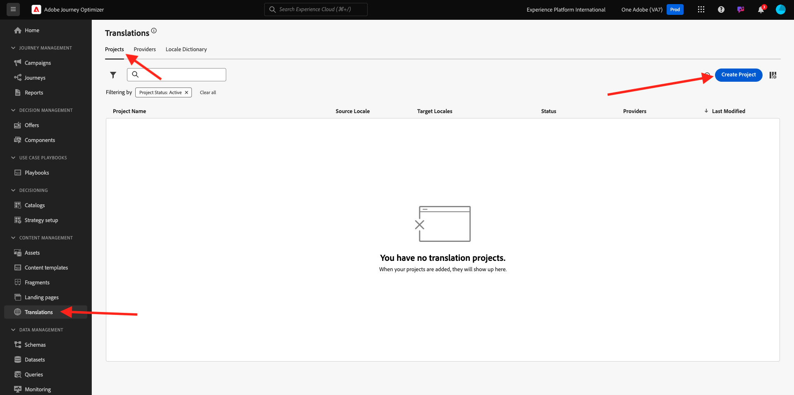
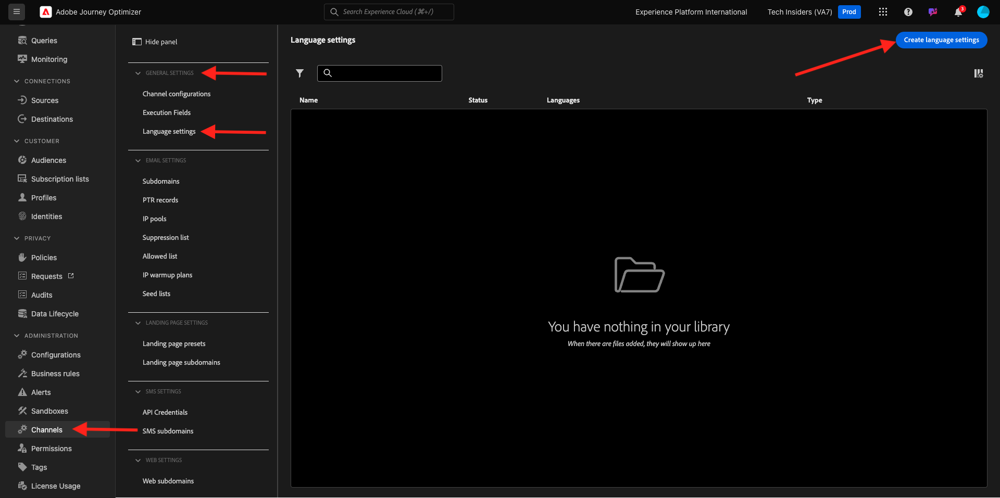

# 3.5.1 Übersetzungsdienstleister

## 3.5.1.1 Konfigurieren des Microsoft Azure-Übersetzers

Navigieren Sie zu [https://portal.azure.com/#home](https://portal.azure.com/#home).

Geben Sie in der Suchleiste `translators` ein. Klicken Sie dann auf **+ Erstellen**.

Wählen Sie **Übersetzer erstellen** aus.

Wählen Sie Ihre **Abonnement-ID** und **Ressourcengruppe**.
Legen Sie **Region** auf **Global** fest.
Setzen Sie **Preisstufe** auf **Kostenlos F0**.

Wählen Sie **Überprüfen + Erstellen** aus.

Wählen Sie **Erstellen** aus.

Wählen Sie **Zu Ressource wechseln** aus.

Wechseln Sie im linken Menü zu **Ressourcenverwaltung** > **Schlüssel und Endpunkt**. Klicken, um den Schlüssel zu kopieren.

## 3.5.1.2-Wörterbuch

Navigieren Sie zu [https://experience.adobe.com/](https://experience.adobe.com/). Auf **Journey Optimizer**.

Gehen Sie im linken Menü zu **Übersetzungen** und dann zu **Gebietsschema-Wörterbuch**. Wenn Sie diese Meldung sehen, klicken Sie auf **Standardgebietsschema hinzufügen**.

Sie sollten das dann sehen.

## Konfigurieren 3.5.1.3 Übersetzungsanbieters in AJO

Navigieren Sie zu [https://experience.adobe.com/](https://experience.adobe.com/). Auf **Journey Optimizer**.

Gehen Sie im linken Menü zu **Übersetzungen** und dann zu **Anbieter**. Klicken Sie **Anbieter hinzufügen**.

Wählen **unter &quot;**&quot; die Option **Microsoft Translator** aus. Aktivieren Sie das Kontrollkästchen, um die Verwendung des Übersetzungsanbieters zu aktivieren. Fügen Sie den Schlüssel ein, den Sie aus Microsoft Azure Translators kopiert haben. Klicken Sie dann auf **Anmeldedaten überprüfen**.

Ihre Anmeldedaten sollten dann erfolgreich validiert werden. Wenn dies der Fall ist, scrollen Sie nach unten, um die zu übersetzenden Sprachen auszuwählen.

Stellen Sie sicher, dass Sie `[en-US] English`, `[es] Spanish`, `[fr] French`, `[nl] Dutch` auswählen.

Scrollen Sie nach oben und klicken Sie auf **Speichern**.

Ihr **Übersetzungsanbieter** kann jetzt verwendet werden.

## 3.5.1.4 Konfigurieren von Übersetzungsprojekten

Navigieren Sie zu [https://experience.adobe.com/](https://experience.adobe.com/). Auf **Journey Optimizer**.

Gehen Sie im linken Menü zu **Übersetzungen** und dann zu **Gebietsschema-Wörterbuch**. Wenn Sie diese Meldung sehen, klicken Sie auf **Projekt erstellen**.

Geben Sie den Namen `--aepUserLdap-- - Translations` ein, legen Sie das **Source-Gebietsschema** auf `[en-US] English - United States` fest und aktivieren Sie die Kontrollkästchen, um sowohl **genehmigte Übersetzungen automatisch veröffentlichen** als auch **Überprüfungs-Workflow aktivieren**. Klicken Sie anschließend auf **+ Gebietsschema hinzufügen**.

Suchen Sie nach `fr`, aktivieren Sie das Kontrollkästchen für `[fr] French` und aktivieren Sie dann das Kontrollkästchen für **Microsoft Translator**. Klicken Sie auf **+ Gebietsschema hinzufügen**.

Suchen Sie nach `es`, aktivieren Sie das Kontrollkästchen für `[es] Spanish` und aktivieren Sie dann das Kontrollkästchen für **Microsoft Translator**. Klicken Sie auf **+ Gebietsschema hinzufügen**.

Suchen Sie nach `nl`, aktivieren Sie das Kontrollkästchen für `[nl] Spanish` und aktivieren Sie dann das Kontrollkästchen für **Microsoft Translator**. Klicken Sie auf **+ Gebietsschema hinzufügen**.

Klicken Sie auf **Speichern**.

Ihr **Übersetzungen**-Projekt kann jetzt verwendet werden.

## 3.5.1.5 Spracheinstellungen konfigurieren

Navigieren Sie **Kanäle** > **Allgemeine Einstellungen** > **Spracheinstellungen**. Klicken Sie **Spracheinstellungen erstellen**.

Verwenden Sie den Namen `--aepUserLdap--_translations`. Wählen Sie **Übersetzungsprojekt** aus. Klicken Sie dann auf das Symbol **Bearbeiten**.

Wählen Sie das Übersetzungsprojekt aus, das Sie im vorherigen Schritt erstellt haben. Klicken Sie auf **Auswählen**.

Sie sollten das dann sehen. Legen Sie die **Fallback-Voreinstellung** auf **Englisch - Vereinigte Staaten** fest. Klicken Sie auf **Bevorzugtes Attribut Profilsprache auswählen**, um zu entscheiden, welches Feld aus dem Kundenprofil zum Laden der Übersetzungen verwendet werden soll. Klicken Sie dann auf **Bearbeiten**, um das zu verwendende Feld auszuwählen.

Geben Sie **Suchleiste „Bevorzugte**&quot; ein und wählen Sie dann das Feld **Bevorzugte Sprache** aus.

Klicken Sie auf das **Bearbeiten**-Symbol für **Englisch - Vereinigte Staaten** und **Niederländisch**, um die Konfiguration zu überprüfen.

Hier finden Sie die Konfiguration für **Englisch - Vereinigte Staaten**. Klicken Sie **Abbrechen**.

Klicken Sie, um die Konfiguration für **Niederländisch“**. Klicken Sie **Abbrechen**.

Scrollen Sie nach oben und klicken Sie auf **Absenden**.

Ihre Spracheinstellungen sind jetzt konfiguriert.

Du hast diese Übung beendet.

## Nächste Schritte

Wechseln Sie zu [3.5.2 Kampagne erstellen](./ex2.md)

Zurück zu [Modul 3.5](./ajotranslationsvcs.md){target="_blank"}

Zurück zu [Alle Module](./../../../overview.md){target="_blank"}
