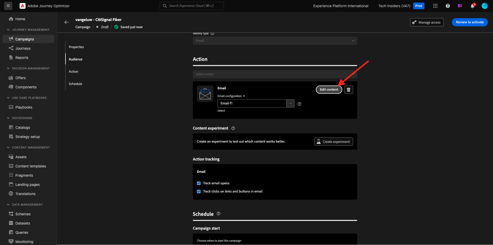

# 3.5.3 Hinzufügen von Sprachen zu E-Mails

Navigieren Sie zu [https://experience.adobe.com/](https://experience.adobe.com/). Auf **Journey Optimizer**.

Sie werden zur Ansicht **Startseite** in Journey Optimizer weitergeleitet. Stellen Sie zunächst sicher, dass Sie die richtige Sandbox verwenden. Die zu verwendende Sandbox heißt `--aepSandboxName--`.

Navigieren Sie zu **Kampagnen** und klicken Sie, um die soeben erstellte Kampagne zu öffnen.

Klicken Sie **Kampagne ändern**.

Klicken Sie auf **Ändern**.

Scrollen Sie nach unten zur Aktion **E-Mail** und klicken Sie auf **Inhalt bearbeiten**.

Klicken Sie **Sprachen hinzufügen**.

Wählen Sie Ihre **Spracheinstellungen** aus, die `--aepUserLdap--_translations` heißen. Klicken Sie auf **Auswählen**.

Sie sollten das dann sehen. Klicken Sie **An Übersetzung senden**.

Sie sollten dann eine Nachricht wie diese sehen. Der **An Übersetzung senden** Workflow wurde jetzt gestartet und dauert einige Minuten.
Sie sehen, dass sich der Status in **Übersetzung läuft** ändert.

Nach einigen Minuten ändert sich der Status des Übersetzungs-Workflows in **Übersetzung abgeschlossen**.

Klicken Sie auf die **`[es] Spanish`** Übersetzung. Anschließend wird der aktualisierte Text in der E-Mail-Vorschau und auch in der **Betreffzeile** angezeigt.
Bei Bedarf können Sie die Übersetzung trotzdem direkt im Feld **Betreffzeile** überprüfen und aktualisieren.

Klicken Sie auf **E-Mail-Text bearbeiten**, um die Übersetzung in der E-Mail zu überprüfen.

Sie können den Text manuell ändern, falls die Übersetzung überprüft werden muss.

Kehren Sie zur Kampagnenübersicht zurück, indem Sie auf den **Pfeil** neben dem Betreffzeilentext in der oberen linken Ecke klicken.

Dann solltest du wieder hier sein. Es ist nicht notwendig, diese Kampagne erneut zu aktivieren.

Kehren Sie zur Kampagne zurück, indem Sie auf den **Pfeil** in der oberen linken Ecke klicken.

Stellen Sie sicher, dass sich Ihre Kampagne im Status **Gestoppt** befindet.

Sie haben jetzt diese Übung beendet.

## Nächste Schritte

Wechseln Sie zu [Zusammenfassung und Vorteile](./summary.md)

Zurück zu [Modul 3.5](./ajotranslationsvcs.md){target="_blank"}

Zurück zu [Alle Module](./../../../overview.md){target="_blank"}
