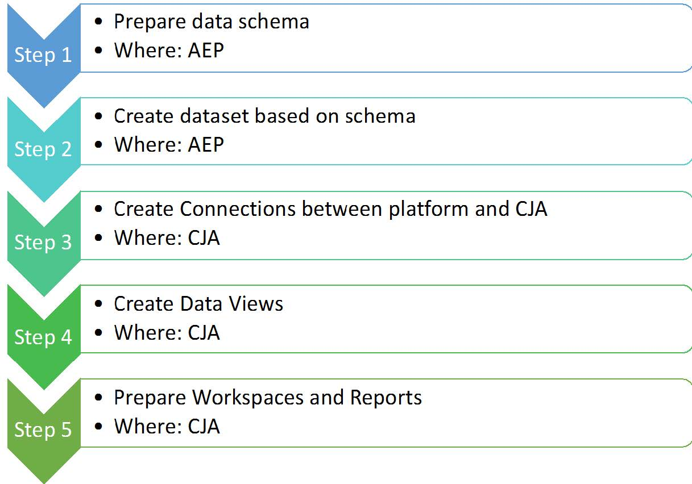
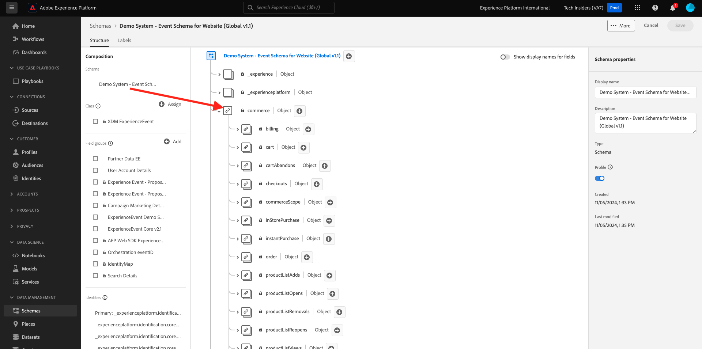

# 4.1.1 Customer Journey Analytics 101

## Ziele

- Grundlegendes zum CJA Application Service
- Erfahren Sie, wie Sie CJA positionieren
- Grundlegendes zum CJA-Workflow: von der Datenverbindung zu Einblicken

## 4.1.1.1 Was ist Customer Journey Analytics?

Customer Journey Analytics (CJA) bietet den Business Intelligence- und Datenwissenschaftsteams ein Toolkit für die Zusammenführung und Analyse kanalübergreifender Daten (online und offline). Die Funktionen von CJA bieten Kontext und Klarheit für die komplexe Journey von Kunden mit mehreren Kanälen. Der bereitgestellte Kontext bietet praktische Einblicke in das Entfernen von Schmerzpunkten aus dem Kundenkonvertierungsprozess und das Entwerfen und Bereitstellen außergewöhnlicher Erlebnisse für die Momente, die am wichtigsten sind.

CJA bringt Analysis Workspace auf Adobe Experience Platform. Adobe Experience Platform ist das Gehirn für Kommunikation und Orchestrierung. Mit CJA können Marken jetzt all diese Daten kontextualisieren und visualisieren, sodass Geschäfts- und Insight-Teams daraus lernen können, indem sie die vollständige Online- bis Offline-Journey analysieren.

Mit der Drag-and-Drop-, Point-and-Click- und benutzerfreundlichen Benutzeroberfläche von Analysis Workspace können Geschäfts- und Insight-Teams direkt mit CJA sprechen, Fragen stellen und Antworten direkt erhalten.

## 4.1.1.2 Hauptvorteile

Die drei Hauptvorteile für Kunden sind:

- Möglichkeit, Einblicke für alle verfügbar zu machen (d. h. Demokratisierung des Datenzugriffs)
- Möglichkeit, den Kunden in einer kontextuellen Journey zu sehen (d. h. Daten können sequenziell über mehrere Online- und Offline-Kanäle hinweg visualisiert werden)
- Die Fähigkeit, die Leistungsfähigkeit von Daten ohne Notwendigkeit zu nutzen (d. h. sie ermöglicht normalen Menschen die Nutzung von Daten, um tiefe Einblicke zu gewinnen und Analysen für die Marketing-Aktivierung zu erstellen)

## 4.1.1.3 Warum Customer Journey Analytics wählen?

CJA soll keine aktuelle BI-Anwendung wie Power BI, Microstrategy, Locker oder Tableau ersetzen. Diese BI-Anwendungen sollen Daten visualisieren, um Unternehmens-Dashboards zu erstellen, sodass alle Mitarbeiter in einem Unternehmen wichtige Metriken schnell betrachten können.\
Das Ziel von CJA besteht darin, Marketing- und Unternehmensteams Analysefunktionen bereitzustellen, damit diese Analysefunktionen für diese Personen &quot;dringend erforderlich&quot;sind.

Traditionell waren BI-Anwendungen nicht in der Lage, echte Customer Intelligence zu ermöglichen:

- Sie können keine Attribution vornehmen und keine Journey-Analyse von Kunden durchführen.
- BI-Anwendungen müssen die Frage frühzeitig kennen
- Interaktive Abfragen sind durch die Struktur der Datenbank beschränkt.
- SQL-Kenntnisse sind erforderlich.
- BI-Anwendungen geben Ihnen nicht die Möglichkeit zu fragen, warum etwas passiert ist.
- BI-Anwendungen haben keine direkte Verbindung zu Kunden-Touchpoints.

Aus den oben genannten Gründen treffen Geschäftsbenutzer und Analysten fast sofort auf die Sackgasse, was die Analyse teuer, langsam, unflexibel und von den Aktionssystemen getrennt macht.

Mit CJA können Sie eine 360-Grad-Sicht auf die Journey der Kunden haben, indem Sie Offline- und Online-Daten nutzen, mit den richtigen Tools, um die Zeit für Einblicke zu verkürzen, Geschäftsbenutzer unabhängig davon zu machen, warum etwas passiert ist und wie sie darauf reagieren.

## 4.1.1.4 Customer Journey Analytics-Workflow verstehen

Bevor Sie mit den nächsten Übungen beginnen, müssen Sie wissen, welche Schritte unternommen werden müssen, um Daten aus Adobe Experience Platform in Customer Journey Analytics zu übertragen, um sie zu visualisieren und einige tiefe Einblicke zu erhalten. Das nennen wir CJA-Workflow. Sehen wir uns das einmal an:

Bevor Sie mit den oben genannten Schritten beginnen, vergessen Sie Schritt 0, der darin besteht, die in Adobe Experience Platform verfügbaren Daten zu verstehen.

**Müll hinein, Müll raus.** Denken Sie daran? Sie müssen genau wissen, welche Daten verfügbar sind und wie die Schemas in Adobe Experience Platform konfiguriert sind. Das Verständnis der Daten in Adobe Experience Platform wird die Dinge nicht nur im Bereich der Datenverbindung, sondern auch beim Erstellen von Visualisierungen und beim Analysieren vereinfachen.

## 4.1.1.5 Schritt 0: Grundlagen zu Adobe Experience Platform-Schemata und -Datensätzen

Melden Sie sich bei Adobe Experience Platform an, indem Sie diese URL verwenden: [https://experience.adobe.com/platform](https://experience.adobe.com/platform).

Nach der Anmeldung landen Sie auf der Startseite von Adobe Experience Platform.

Bevor Sie fortfahren, müssen Sie eine **Sandbox** auswählen. Die auszuwählende Sandbox heißt ``--aepSandboxName--``. Klicken Sie dazu in der blauen Zeile oben auf Ihrem Bildschirm auf den Text **[!UICONTROL Produktions-Prod]** . Nachdem Sie die entsprechende Sandbox ausgewählt haben, wird die Bildschirmänderung angezeigt und Sie befinden sich jetzt in Ihrer dedizierten Sandbox.

Sehen Sie sich diese Schemata und Datensätze in Adobe Experience Platform an.

| Datensatz | Schema |
| ----------------- |-------------| 
| Demosystem - Ereignis-Datensatz für Website (Global v1.1) | Demosystem - Ereignisschema für Website (Global v1.1) |
| Demosystem - Ereignis-Datensatz für das Callcenter (Global v1.1) | Demosystem - Ereignisschema für das Callcenter (Global v1.1) |
| Demosystem - Ereignis-Datensatz für Sprachassistenten (Global v1.1) | Demosystem - Ereignisschema für Sprachassistenten (Global v1.1) |

Stellen Sie sicher, dass zumindest Folgendes überprüft wurde:

- Identitäten: CRMID, phoneNumber, ECID, email. Welche Identitäten sind die primären Identifikatoren, welche sind die sekundären Identifikatoren?
Sie können die Kennungen finden, indem Sie ein Schema öffnen und sich das Objekt `--aepTenantId--.identification.core` ansehen. Sehen Sie sich das Schema [Demo System - Event Schema for Website (Global v1.1)](https://experience.adobe.com/platform/schema) an.

- Durchsuchen Sie das Commerce-Objekt im Schema [Demo System - Event Schema for Website (Global v1.1)](https://experience.adobe.com/platform/schema).

- Vorschau aller [Datensätze](https://experience.adobe.com/platform/dataset/browse?limit=50&amp;page=1&amp;sortDescending=1&amp;sortField=created) anzeigen und Daten anzeigen

Sie können jetzt mit der Verwendung der Customer Journey Analytics-Benutzeroberfläche beginnen.

Nächster Schritt: [4.1.2 Adobe Experience Platform-Datensätze in Customer Journey Analytics verbinden](./ex2.md)

[Zurück zu Modul 4.1](./customer-journey-analytics-build-a-dashboard.md)

[Zu allen Modulen zurückkehren](../../../overview.md)
