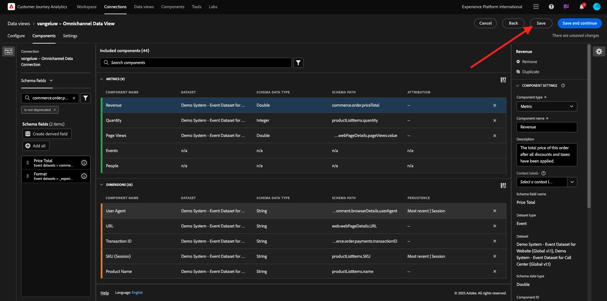
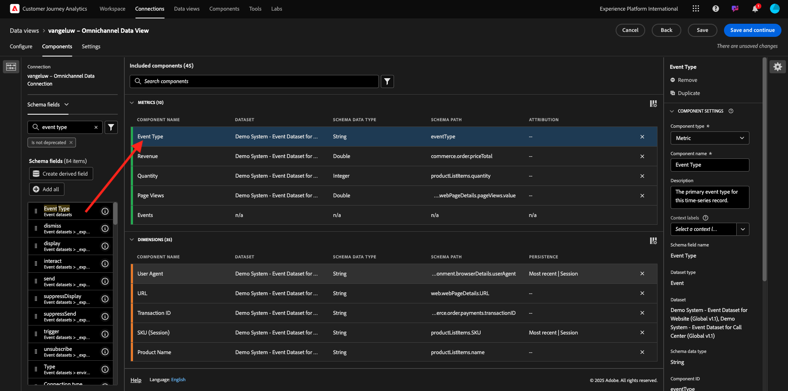

# 4.1.3 Erstellen einer Datenansicht

## Ziele

- Grundlegendes zur Benutzeroberfläche von Datenansichten
- Grundlegendes zu den grundlegenden Einstellungen der Besuchsdefinition
- Grundlegendes zu Attribution und Persistenz in einer Datenansicht

## Datenansicht 4.1.3.1

Nachdem Sie Ihre Verbindung hergestellt haben, können Sie jetzt mit der Beeinflussung der Visualisierung fortfahren. Ein Unterschied zwischen Adobe Analytics und CJA besteht darin, dass CJA eine Datenansicht benötigt, um die Daten vor der Visualisierung zu bereinigen und vorzubereiten.

Eine Datenansicht ähnelt dem Konzept von Virtual Report Suites in Adobe Analytics, wo Sie kontextabhängige Besuchsdefinitionen, Filter und auch die Aufrufart der Komponenten definieren.

Es wird mindestens eine Datenansicht pro Verbindung benötigt. In einigen Anwendungsfällen ist es jedoch von Vorteil, mehrere Datenansichten für dieselbe Verbindung zu haben, mit dem Ziel, verschiedenen Teams unterschiedliche Einblicke zu gewähren.
Wenn Sie möchten, dass Ihr Unternehmen datengesteuert wird, sollten Sie anpassen, wie Daten in jedem Team angezeigt werden. Einige Beispiele:

- UX-Metriken nur für das UX-Design-Team
- Verwenden Sie für KPIs und Metriken für Google Analytics dieselben Namen wie für Customer Journey Analytics, damit das Digital-Analytics-Team nur eine Sprache sprechen kann.
- Die Datenansicht wurde gefiltert, um beispielsweise Daten nur für einen Markt, eine Marke oder nur für Mobilgeräte anzuzeigen.

Aktivieren **auf dem Bildschirm** Verbindungen“ das Kontrollkästchen vor der soeben erstellten Verbindung. Klicken Sie **Datenansicht erstellen**.

Sie werden zum Workflow **Datenansicht erstellen“**.

## Definition der 4.1.3.2 Datenansicht

Jetzt können Sie die grundlegenden Definitionen für Ihre Datenansicht konfigurieren.

Die **Verbindung** die Sie in der vorherigen Übung erstellt haben, ist bereits ausgewählt. Ihre Verbindung heißt `--aepUserLdap-- – Omnichannel Data Connection`.

Geben Sie als Nächstes Ihrer Datenansicht einen Namen, der dieser Namenskonvention folgt: `--aepUserLdap-- – Omnichannel Data View`.

Geben Sie denselben Wert für die Beschreibung ein: `--aepUserLdap-- – Omnichannel Data View`.

| Name | Beschreibung | Externe ID |
| ----------------- |-------------|-------------| 
| `--aepUserLdap-- – Omnichannel Data View` | `--aepUserLdap-- – Omnichannel Data View` | `--aepUserLdap--123` |

Wählen Sie für **Zeitzone** die Zeitzone **Greenwich Mean Time; Monrovia, Casablanca [GMT]**. Dies ist ein wirklich interessanter Rahmen, da einige Unternehmen in verschiedenen Ländern und Regionen tätig sind. Durch die Zuweisung der richtigen Zeitzone für jedes Land werden typische Datenfehler vermieden, wie etwa der Glaube, dass in Peru die Mehrheit der Menschen T-Shirts um 4:00 Uhr kauft.

Sie können auch die Namen der Hauptmetriken (Person, Sitzung und Ereignis) ändern. Dies ist nicht erforderlich, aber einige Kunden verwenden lieber „Personen“, „Besuche“ und „Treffer“ anstelle von „Person“, „Sitzung“ und „Ereignisse“ (Standardbenennungskonvention von Customer Journey Analytics).

Sie sollten jetzt die folgenden Einstellungen konfiguriert haben:

Klicken Sie **Speichern und fortfahren**.

Klicken Sie auf **Speichern**.

## 4.1.3.3 von Datenansichtskomponenten

In dieser Übung konfigurieren Sie die Komponenten, die Sie zur Analyse der Daten und deren Visualisierung mit Analysis Workspace benötigen. In dieser Benutzeroberfläche gibt es drei Hauptbereiche:

- Links: Verfügbare Komponenten aus den ausgewählten Datensätzen
- Mitte: Komponenten zur Datenansicht hinzugefügt
- Rechte Seite: Komponenteneinstellungen

Jetzt müssen Sie die für die Analyse benötigten Komponenten per Drag-and-Drop auf die Seite **Komponenten hinzugefügt** ziehen. Dazu müssen Sie die Komponenten im linken Menü auswählen und sie in der Mitte auf die Arbeitsfläche ziehen und dort ablegen.

Beginnen wir mit der ersten Komponente: **Name (web.webPageDetails.name)**. Suchen Sie nach dieser Komponente und ziehen Sie sie dann auf die Arbeitsfläche.

Diese Komponente ist der Seitenname, wie er beim Lesen des Schemafelds `(web.webPageDetails.name)` werden kann.

Die Verwendung von **Name** als Name ist jedoch nicht die beste Namenskonvention für eine Business-Anwenderin oder einen -Anwender, um diese Dimension schnell zu verstehen.

Ändern wir den Namen in &quot;**&quot;**. Klicken Sie auf die Komponente und benennen Sie sie im Bereich **Komponenteneinstellungen** um.

Etwas wirklich Wichtiges ist die **Persistenzeinstellungen**. Das Konzept von eVars und Props existiert in CJA nicht, aber die Persistenzeinstellungen ermöglichen ein ähnliches Verhalten.

Wenn Sie diese Einstellungen nicht ändern, interpretiert CJA die Dimension als **Prop** (Trefferebene). Außerdem können wir die Persistenz ändern, um die Dimension zu einer **eVar** zu machen (den Wert über die gesamte Journey hinweg beibehalten).

Wenn Sie nicht mit eVars und Props vertraut sind, können Sie [weitere Informationen hierzu finden Sie in der Dokumentation](https://experienceleague.adobe.com/docs/analytics/landing/an-key-concepts.html?lang=de).

Lassen wir den Seitennamen als Eigenschaft. Daher müssen Sie keine „Persistenzeinstellungen **ändern**.

| Zu suchender Komponentenname | Neuer Name | Persistenzeinstellungen |
| ----------------- |-------------| --------------------| 
| Name (web.webPageDetails.name) | Seitenname |          |

Wählen Sie als Nächstes die Dimension **phoneNumber** aus und legen Sie sie auf der Arbeitsfläche ab. Der neue Name sollte &quot;**&quot;**.

Ändern wir abschließend die Persistenzeinstellungen, da die Mobilfunknummer auf Benutzerebene bestehen bleiben soll.

Um die Persistenz zu ändern, scrollen Sie im rechten Menü nach unten und öffnen Sie die Registerkarte **Persistenz**:

Aktivieren Sie das Kontrollkästchen, um die Persistenzeinstellungen zu ändern. Wählen Sie **Zuletzt verwendet** und den **Person (Reporting-Fenster** aus, da uns nur die letzte Mobiltelefonnummer dieser Person wichtig ist. Wenn der Kunde das Mobilgerät bei zukünftigen Besuchen nicht ausfüllt, wird dieser Wert weiterhin angezeigt.

| Zu suchender Komponentenname | Neuer Name | Persistenzeinstellungen |
| ----------------- |-------------| --------------------| 
| Telefonnummer | Telefonnummer | Zuletzt verwendet, Fenster „Personenberichte“ |

Die nächste Komponente ist `web.webPageDetails.pageViews.value`.

Suchen Sie im Menü auf der linken Seite nach `web.webPageDetails.pageViews.value`. Ziehen Sie diese Metrik auf die Arbeitsfläche.

Ändern Sie den Namen in **Seitenansichten** unter **Komponenteneinstellungen**.

| Zu suchender Komponentenname | Neuer Name | Attributionseinstellungen |
| ----------------- |-------------| --------------------| 
| web.webPageDetails.pageViews.value | Seitenansichten |         |

Für die Attributionseinstellungen müssen Sie nichts ändern.

Hinweis: Persistenzeinstellungen für Metriken können auch in Analysis Workspace geändert werden. In einigen Fällen können Sie sie hier festlegen, um zu vermeiden, dass Business-Anwender überlegen müssen, welches das beste Persistenzmodell ist.

Als Nächstes müssen Sie viele Dimensionen und Metriken konfigurieren, wie in der folgenden Tabelle angegeben.

### DIMENSIONEN

| Zu suchender Komponentenname | Neuer Name | Persistenzeinstellungen |
| ----------------- |-------------| --------------------| 
| brandName | Markenname | Zuletzt verwendet, Sitzung |
| Call-Feeling | Call Feeling |          |
| Anruf-ID | Interaktionstyp des Aufrufs |          |
| callTopic | Gesprächsthema | Zuletzt verwendet, Sitzung |
| ECID | ECID | Zuletzt verwendet, Fenster „Personenberichte“ |
| E-Mail | E-Mail-ID | Zuletzt verwendet, Fenster „Personenberichte“ |
| Zahlungsart | Zahlungsart |          |
| Methode zum Hinzufügen von Produkten | Methode zum Hinzufügen von Produkten | Zuletzt verwendet, Sitzung |
| Ereignistyp | Ereignistyp |         |
| Name (productListItems.name) | Produktname |         |
| SKU | SKU (Sitzung) | Zuletzt verwendet, Sitzung |
| Transaction ID | Transaction ID |         |
| URL (web.webPageDetails.URL) | URL |         |
| Benutzeragent | Benutzeragent | Zuletzt verwendet, Sitzung |

### METRIKEN

| Zu suchender Komponentenname | Neuer Name | Attributionseinstellungen |
| ----------------- |-------------| --------------------| 
| Menge | Menge |          |
| commerce.order.priceTotal | Einnahmen |         |

Ihre Konfiguration sollte dann wie folgt aussehen. Vergessen Sie nicht **Ihre Datenansicht** zu speichern“. Klicken Sie also **Speichern** jetzt.

## Berechnete Metriken 4.1.3.4

Obwohl Sie alle Komponenten in der Datenansicht organisiert haben, müssen Sie einige von ihnen noch anpassen, damit Business-Anwender bereit sind, ihre Analyse zu starten.

Wenn Sie sich erinnern, haben Sie keine spezifischen Metriken wie „Zum Warenkorb hinzufügen“, „Produktansicht“ oder „Käufe“ in die Datenansicht eingefügt.
Sie haben jedoch eine Dimension mit dem Namen **Ereignistyp**. Sie können diese Interaktionstypen also ableiten, indem Sie drei berechnete Metriken erstellen.

Beginnen wir mit der ersten Metrik: **Produktansichten**.

Suchen Sie auf der linken Seite nach **Ereignistyp** und wählen Sie die Dimension aus. Ziehen Sie sie dann per Drag-and-Drop auf die Arbeitsfläche **Enthaltene Komponenten**.
Klicken Sie auf die neue Metrik **Ereignistyp**, um sie auszuwählen.

Ändern Sie nun den Komponentennamen und die Beschreibung in die folgenden Werte:

| Name der Komponente | Komponentenbeschreibung |
| ----------------- |-------------| 
| Produktansichten | Produktansichten |

Jetzt können wir nur Ereignisse **Produktansichten** zählen. Scrollen Sie dazu nach unten auf der Seite **Komponenteneinstellungen**, bis Sie &quot;**einschließen/Werte ausschließen** sehen. Stellen Sie sicher, dass Sie die Option **Ein-/Ausschlusswerte festlegen** aktivieren.

Da Sie nur „Produktansichten **zählen möchten,** Sie **commerce.productViews** unter den Kriterien an.

Ihre berechnete Metrik ist jetzt bereit!

Als Nächstes wiederholen Sie denselben Vorgang für die Ereignisse **Zum Warenkorb hinzufügen** und **Kaufen**.

### Zum Warenkorb hinzufügen

Ziehen Sie zuerst dieselbe Dimension (Ereignistyp **per Drag-and-Drop**.

Es wird ein Popup-Fenster mit einer Warnung zu einem duplizierten Feld angezeigt, da dieselbe Variable verwendet wird. Bitte klicken Sie auf **Trotzdem hinzufügen**:

Führen Sie nun denselben Prozess aus wie bei der Metrik „Produktansichten“:
- Ändern Sie zunächst den Namen und die Beschreibung.
- Fügen Sie abschließend **commerce.productListAdds** als Kriterien hinzu, um nur zum Warenkorb hinzuzufügen

| Name | Beschreibung | Kriterien |
| ----------------- |-------------| -------------|
| Zum Warenkorb hinzufügen | Zum Warenkorb hinzufügen | commerce.productListAdds |

### Käufe

Ziehen Sie zunächst die Dimension **Ereignistyp) per Drag-and** Drop hinüber, wie wir es bei beiden vorherigen Metriken getan haben.

Es wird ein Popup-Fenster mit einer Warnung zu einem duplizierten Feld angezeigt, da dieselbe Variable verwendet wird. Bitte klicken Sie auf **Trotzdem hinzufügen**:

Führen Sie nun denselben Prozess aus wie bei den Metriken Produktansichten und Zum Warenkorb hinzufügen :
- Ändern Sie zunächst den Namen und die Beschreibung.
- Fügen Sie abschließend **commerce.purchases** als Kriterium hinzu, sodass nur Zu Warenkorb hinzufügen gezählt wird.

| Name | Beschreibung | Kriterien |
| ----------------- |-------------| -------------|
| Käufe | Käufe | commerce.purchases |

Ihre endgültige Konfiguration sollte dann in etwa wie folgt aussehen. Klicken Sie **Speichern und fortfahren**.

## Einstellungen für 4.1.3.5 Datenansicht

Sie sollten zu diesem Bildschirm weitergeleitet werden:

Auf dieser Registerkarte können Sie einige wichtige Einstellungen ändern, um die Verarbeitung von Daten zu ändern. Beginnen wir mit der Einstellung der **Sitzungs-Timeout** auf 30 Minuten. Dank des Zeitstempels jedes Erlebnisereignisses können Sie das Konzept einer Sitzung über alle Kanäle hinweg erweitern. Was passiert zum Beispiel, wenn ein Kunde das Callcenter anruft, nachdem er die Website besucht hat? Durch die Verwendung benutzerdefinierter Sitzungszeitlimits können Sie flexibel entscheiden, was eine Sitzung ist und wie diese Sitzung Daten zusammenführt.

Auf dieser Registerkarte können Sie andere Elemente wie das Filtern der Daten mithilfe eines Segments/Filters ändern. Das brauchen Sie in dieser Übung nicht zu tun.

Wenn Sie fertig sind, klicken Sie auf **Speichern und beenden**.

>[!NOTE]
>
>Sie können später zu dieser Datenansicht zurückkehren und Einstellungen und Komponenten jederzeit ändern. Änderungen wirken sich darauf aus, wie historische Daten angezeigt werden.

Sie können jetzt mit dem Teil Visualisierung und Analyse fortfahren!

Nächster Schritt: [4.1.4 Datenvorbereitung in Customer Journey Analytics](./ex4.md)

[Zurück zum Modul 4.1](./customer-journey-analytics-build-a-dashboard.md)

[Zurück zu „Alle Module“](./../../../overview.md)
