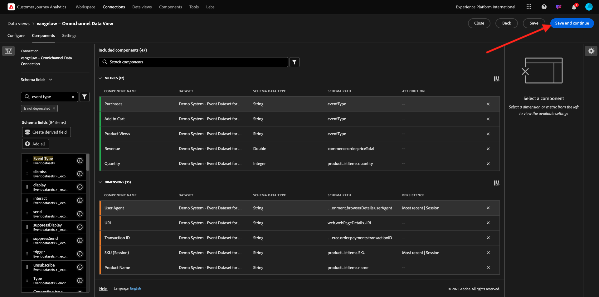

# 4.1.3 Datenansicht erstellen

## Ziele

- Grundlegendes zur Benutzeroberfläche der Datenansicht
- Grundlegende Einstellungen der Besuchsdefinition
- Attribution und Persistenz in einer Datenansicht

## 4.1.3.1 Datenansicht

Nachdem die Verbindung hergestellt wurde, können Sie jetzt Fortschritte bei der Beeinflussung der Visualisierung erzielen. Ein Unterschied zwischen Adobe Analytics und CJA besteht darin, dass CJA eine Datenansicht benötigt, um die Daten vor der Visualisierung zu bereinigen und vorzubereiten.

Eine Datenansicht ähnelt dem Konzept von Virtual Report Suites in Adobe Analytics, wo Sie kontextbezogene Besuchsdefinitionen, Filtervorgänge und auch die Art und Weise definieren, wie die Komponenten aufgerufen werden.

Sie benötigen mindestens eine Datenansicht pro Verbindung. Für einige Anwendungsfälle ist es jedoch großartig, mehrere Datenansichten für dieselbe Verbindung zu haben, um verschiedenen Teams unterschiedliche Einblicke zu geben.
Wenn Sie möchten, dass Ihr Unternehmen datengesteuert wird, sollten Sie anpassen, wie Daten in den einzelnen Teams angezeigt werden. Beispiele:

- UX-Metriken nur für das UX-Design-Team
- Verwenden Sie dieselben Namen für KPIs und Metriken für Google Analytics wie für Customer Journey Analytics, damit das Digital Analytics-Team nur 1 Sprache sprechen kann.
- Datenansicht gefiltert, um z. B. Daten nur für einen Markt, eine Marke oder nur für Mobilgeräte anzuzeigen.

Aktivieren Sie im Bildschirm **Verbindungen** das Kontrollkästchen vor der soeben erstellten Verbindung. Klicken Sie auf **Datenansicht erstellen**.

Sie werden zum Workflow **Datenansicht erstellen** weitergeleitet.

## 4.1.3.2 Datenansichtsdefinition

Sie können jetzt die grundlegenden Definitionen für Ihre Datenansicht konfigurieren.

Die **Verbindung**, die Sie in der vorherigen Übung erstellt haben, ist bereits ausgewählt. Ihre Verbindung heißt `--demoProfileLdap-- – Omnichannel Data Connection`.

Geben Sie anschließend Ihrer Datenansicht einen Namen gemäß dieser Namenskonvention: `--demoProfileLdap-- – Omnichannel Data View`.

Geben Sie für die Beschreibung denselben Wert ein: `--demoProfileLdap-- – Omnichannel Data View`.

| Name | Beschreibung |
| ----------------- |-------------| 
| `--demoProfileLdap-- – Omnichannel Data View` | `--demoProfileLdap-- – Omnichannel Data View` |

Wählen Sie für die Zeitzone **1} die Zeitzone** Greenwich Mean Time; Monrovia, Casablanca [GMT ]**.** Dies ist ein wirklich interessanter Rahmen, da einige Unternehmen in verschiedenen Ländern und Regionen tätig sind. Wenn Sie für jedes Land die richtige Zeitzone zuweisen, werden typische Datenfehler vermieden, z. B. weil Sie glauben, dass in Peru die Mehrheit der Menschen T-Shirts um 4:00 Uhr kaufen.

Sie können auch die Benennung der Hauptmetriken ändern (Person, Sitzung und Ereignis). Dies ist nicht erforderlich, aber einige Kunden verwenden gerne Personen, Besuche und Treffer anstelle von Personen, Sitzungen und Ereignissen (Standardbenennungskonvention von Customer Journey Analytics).

Folgende Einstellungen sollten jetzt konfiguriert sein:

Klicken Sie auf **Speichern und fortfahren**.

## 4.1.3.3 Datenansichtskomponenten

In dieser Übung konfigurieren Sie die Komponenten, die Sie benötigen, um die Daten zu analysieren und mithilfe von Analysis Workspace zu visualisieren. In dieser Benutzeroberfläche gibt es drei Hauptbereiche:

- Linke Seite: Verfügbare Komponenten aus den ausgewählten Datensätzen
- Mittel: Komponenten zur Datenansicht hinzugefügt
- Rechts: Komponenteneinstellungen

>[!IMPORTANT]
>
>Wenn Sie eine bestimmte Metrik oder Dimension nicht finden können, überprüfen Sie, ob das Feld `Contains data` aus Ihrer Datenansicht entfernt wurde. Wenn nicht, löschen Sie bitte dieses Feld.
>
>

Jetzt müssen Sie die für die Analyse benötigten Komponenten per Drag-and-Drop in den Abschnitt **Komponenten hinzugefügt** ziehen. Wählen Sie dazu die Komponenten im linken Menü aus und ziehen Sie sie auf die Arbeitsfläche in der Mitte.

Beginnen wir mit der ersten Komponente: **Name (web.webPageDetails.name)**. Suchen Sie nach dieser Komponente und ziehen Sie sie per Drag-and-Drop auf die Arbeitsfläche.

Diese Komponente ist der Seitenname, wie Sie sich aus dem Lesen des Schemafelds `(web.webPageDetails.name)` ableiten können.

Die Verwendung von **Name** als Name ist jedoch nicht die beste Namenskonvention für einen Geschäftsbenutzer, um diese Dimension schnell zu verstehen.

Ändern wir den Namen in &quot;**Seitenname**&quot;. Klicken Sie auf die Komponente und benennen Sie sie im Bereich **Komponenteneinstellungen** um.

Etwas wirklich Wichtiges ist die **Persistenzeinstellungen**. Das Konzept von eVars und prop existiert nicht in CJA, aber die Persistenzeinstellungen ermöglichen ein ähnliches Verhalten.

Wenn Sie diese Einstellungen nicht ändern, interpretiert CJA die Dimension als **Prop** (Trefferebene). Außerdem können wir die Persistenz ändern, um die Dimension zu **eVar** zu machen (der Wert wird über die Journey hinweg beibehalten).

Wenn Sie nicht mit eVars und Props vertraut sind, können Sie [mehr darüber in der Dokumentation](https://experienceleague.adobe.com/docs/analytics/landing/an-key-concepts.html) lesen.

Lassen Sie den Seitennamen als Eigenschaft. Daher müssen Sie keine **Persistenzeinstellungen** ändern.

| Komponentenname zur Suche | Neuer Name | Persistenz-Einstellungen |
| ----------------- |-------------| --------------------| 
| Name (web.webPageDetails.name) | Seitenname |          |

Wählen Sie anschließend die Dimension **phoneNumber** aus und legen Sie sie auf der Arbeitsfläche ab. Der neue Name sollte **Telefonnummer** lauten.

Lassen Sie uns abschließend die Persistenz-Einstellungen ändern, da die Mobiltelefonnummer auf Benutzerebene beibehalten werden sollte.

Scrollen Sie zum Ändern der Persistenz nach unten im rechten Menü und öffnen Sie die Registerkarte **Persistenz**:

Aktivieren Sie das Kontrollkästchen, um die Persistenzeinstellungen zu ändern. Wählen Sie den Bereich **Zuletzt verwendet** und den Bereich **Person (Berichtsfenster)** aus, da uns nur die letzte Mobiltelefonnummer dieser Person wichtig ist. Wenn der Kunde das Mobilgerät bei zukünftigen Besuchen nicht ausfüllt, wird dieser Wert dennoch ausgefüllt.

| Komponentenname zur Suche | Neuer Name | Persistenz-Einstellungen |
| ----------------- |-------------| --------------------| 
| phoneNumber | Telefonnummer | Zuletzt verwendet, Person (Berichtsfenster) |

Die nächste Komponente ist `web.webPageDetails.pageViews.value`.

Suchen Sie im Menü auf der linken Seite nach `web.webPageDetails.pageViews.value`. Ziehen Sie diese Metrik auf die Arbeitsfläche.

Ändern Sie den Namen in **Seitenansichten** unter den **Komponenteneinstellungen**.

| Komponentenname zur Suche | Neuer Name | Attributionseinstellungen |
| ----------------- |-------------| --------------------| 
| web.webPageDetails.pageViews.value | Seitenansichten |         |

Für die Attributionseinstellungen lassen wir diese leer.

Hinweis: Persistenzeinstellungen für Metriken können auch in Analysis Workspace geändert werden. In einigen Fällen können Sie es hier festlegen, um zu vermeiden, dass Geschäftsbenutzer sich vorstellen müssen, welches Persistenzmodell am besten geeignet ist.

Als Nächstes müssen Sie viele Dimensionen und Metriken konfigurieren, wie in der folgenden Tabelle angegeben.

### DIMENSIONEN

| Komponentenname zur Suche | Neuer Name | Persistenz-Einstellungen |
| ----------------- |-------------| --------------------| 
| brandName | Markenname | Zuletzt verwendete Sitzung |
| Rückruf | Anrufempfehlung |          |
| Aufruf-ID | Interaktionstyp aufrufen |          |
| callTopic | Anrufthema | Zuletzt verwendete Sitzung |
| ecid | ECID | Zuletzt verwendet, Person (Berichtsfenster) |
| E-Mail | Email ID | Zuletzt verwendet, Person (Berichtsfenster) |
| Zahlungsart | Zahlungsart |          |
| Methode zum Hinzufügen von Produkten | Methode zum Hinzufügen von Produkten | Zuletzt verwendete Sitzung |
| Ereignistyp | Ereignistyp |         |
| Name (productListItems.name) | Produktname |         |
| SKU | SKU (Sitzung) | Zuletzt verwendete Sitzung |
| Transaction ID | Transaction ID |         |
| URL (web.webPageDetails.URL) | URL |         |
| Benutzeragent | Benutzeragent | Zuletzt verwendete Sitzung |

### METRIKEN

| Komponentenname zur Suche | Neuer Name | Attributionseinstellungen |
| ----------------- |-------------| --------------------| 
| Menge | Menge |          |
| commerce.order.priceTotal | Umsatz |         |

Ihre Konfiguration sollte dann wie folgt aussehen:

Vergessen Sie nicht, Ihre Datenansicht mit **Speichern** zu speichern. Klicken Sie also jetzt auf **Speichern** .

## 4.1.3.4 Berechnete Metriken

Obwohl wir alle Komponenten in der Datenansicht organisiert haben, müssen Sie dennoch einige davon anpassen, damit Geschäftsbenutzer bereit sind, ihre Analyse zu starten.

Wenn Sie sich daran erinnern, haben wir nicht speziell Metriken wie &quot;Zum Warenkorb hinzufügen&quot;, &quot;Produktansicht&quot;oder &quot;Käufe&quot;in die Datenansicht integriert.
Wir haben jedoch eine Dimension namens &quot;**Ereignistyp**&quot;. Lassen Sie uns diese Interaktionstypen ableiten, indem wir 3 berechnete Metriken erstellen.

Beginnen wir mit der ersten Metrik: **Produktansichten**.

Suchen Sie auf der linken Seite nach **Ereignistyp** und wählen Sie die Dimension aus. Ziehen Sie es dann per Drag-and-Drop in die Arbeitsfläche **Eingeschlossene Komponenten**.

Klicken Sie auf , um die neue Metrik **Ereignistyp** auszuwählen.

Ändern Sie nun den Namen und die Beschreibung der Komponente in die folgenden Werte:

| Komponentenname | Komponentenbeschreibung |
| ----------------- |-------------| 
| Produktansichten | Produktansichten |

Jetzt können nur **Produktansichten** -Ereignisse gezählt werden. Scrollen Sie dazu nach unten auf die **Komponenteneinstellungen**, bis Sie **Ausschlusswerte einschließen** sehen. Stellen Sie sicher, dass Sie die Option **Ein-/Ausschlusswerte festlegen** aktivieren.

Da wir nur **Produktansichten** zählen möchten, geben Sie unter den Kriterien **commerce.productViews** an.

Ihre berechnete Metrik ist jetzt bereit!

Wiederholen Sie anschließend den gleichen Prozess für die Ereignisse **Zum Warenkorb hinzufügen** und **Kauf**.

### Zum Warenkorb hinzufügen

Ziehen Sie zunächst dieselbe Dimension in den Arbeitsbereich **Ereignistyp**.

Es wird eine Popup-Benachrichtigung zu einem duplizierten Feld angezeigt, da wir dieselbe Variable verwenden. Bitte klicken Sie auf **Add Anyway**:

Gehen Sie nun genauso vor wie für die Metrik Produktansichten:
- Ändern Sie zunächst den Namen und die Beschreibung.
- Fügen Sie schließlich **commerce.productListAdds** als Kriterium hinzu, um nur &quot;Zum Warenkorb hinzufügen&quot;zu zählen

| Name | Beschreibung | Kriterien |
| ----------------- |-------------| -------------|
| Zum Warenkorb hinzufügen | Zum Warenkorb hinzufügen | commerce.productListAdds |

### Käufe

Ziehen Sie zunächst die Dimension **Ereignistyp** in den Arbeitsbereich wie für beide vorherigen Metriken.

Es wird eine Popup-Benachrichtigung zu einem duplizierten Feld angezeigt, da wir dieselbe Variable verwenden. Bitte klicken Sie auf **Add Anyway**:

Gehen Sie nun genauso vor wie bei den Metriken Produktansichten und Zum Warenkorb hinzufügen:
- Ändern Sie zunächst den Namen und die Beschreibung.
- Fügen Sie schließlich **commerce.purchases** als Kriterien hinzu, um nur &quot;Zu Warenkorb hinzufügen&quot;zu zählen

| Name | Beschreibung | Kriterien |
| ----------------- |-------------| -------------|
| Käufe | Käufe | commerce.purchases |

Ihre endgültige Konfiguration sollte dann in etwa wie folgt aussehen: Klicken Sie auf **Speichern und fortfahren**.

## 4.1.3.5 Datenansichtseinstellungen

Sie sollten zu diesem Bildschirm weitergeleitet werden:

Auf dieser Registerkarte können Sie einige wichtige Einstellungen ändern, um die Art und Weise der Datenverarbeitung zu ändern. Legen wir zunächst den **Sitzungs-Timeout** auf 30 Minuten fest. Dank des Zeitstempels jedes Erlebnisereignisses können Sie das Konzept einer Sitzung über alle Kanäle hinweg erweitern. Was passiert beispielsweise, wenn ein Kunde nach dem Besuch der Website das Callcenter anruft? Durch die Verwendung benutzerdefinierter Sitzungs-Timeouts haben Sie viel Flexibilität bei der Entscheidung, was eine Sitzung ist und wie diese Sitzung Daten zusammenführt.

In diesem Tab können Sie andere Elemente ändern, z. B. die Filterung der Daten mithilfe eines Segments/Filters. In dieser Übung wirst du das nicht tun müssen.

Nachdem Sie fertig sind, klicken Sie auf **Speichern und beenden**.

>[!NOTE]
>
>Anschließend können Sie zu dieser Datenansicht zurückkehren und Einstellungen und Komponenten jederzeit ändern. Änderungen wirken sich darauf aus, wie historische Daten angezeigt werden.

Sie können jetzt mit dem Visualisierungs- und Analysebereich fortfahren!

Nächster Schritt: [4.1.4 Datenvorbereitung in Customer Journey Analytics](./ex4.md)

[Zurück zu Modul 4.1](./customer-journey-analytics-build-a-dashboard.md)

[Zu allen Modulen zurückkehren](./../../../overview.md)
