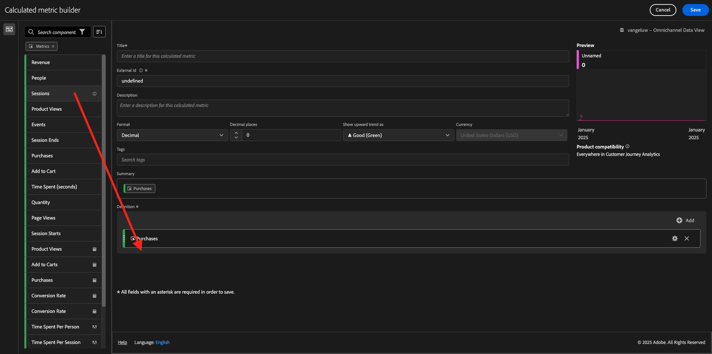

# 4.1.4 Datenvorbereitung in Analysis Workspace

## Ziele

- Grundlegendes zur Benutzeroberfläche von Analysis Workspace in CJA
- Verstehen der Konzepte der Datenvorbereitung in Analysis Workspace
- Erfahren Sie, wie Sie Datenberechnungen durchführen

## 4.1.4.1 der Analysis Workspace-Benutzeroberfläche in CJA

Analysis Workspace beseitigt alle typischen Einschränkungen eines einzelnen Analytics-Berichts. Sie bietet eine robuste, flexible Arbeitsfläche zum Erstellen benutzerdefinierter Analyseprojekte. Ziehen Sie eine beliebige Anzahl von Datentabellen, Visualisierungen und Komponenten (Dimensionen, Metriken, Segmente und Zeitgranularitäten) in ein Projekt. Erstellen Sie sofort Aufschlüsselungen und Segmente, erstellen Sie Kohorten für Analysen, erstellen Sie Warnhinweise, vergleichen Sie Segmente, führen Sie Fluss- und Fallout-Analysen durch und kuratieren und planen Sie Berichte für die Freigabe für alle Personen in Ihrem Unternehmen.

Customer Journey Analytics bringt diese Lösung auf die Platform-Daten. Wir empfehlen dringend, sich dieses vierminütige Übersichtsvideo anzusehen:

>[!VIDEO](https://video.tv.adobe.com/v/35109?quality=12&learn=on)

Wenn Sie Analysis Workspace noch nie verwendet haben, empfehlen wir dringend, sich dieses Video anzusehen:

>[!VIDEO](https://video.tv.adobe.com/v/26266?quality=12&learn=on)

### Erstellen eines Projekts

Jetzt ist es an der Zeit, Ihren ersten CJA-Arbeitsbereich zu erstellen. Wechseln Sie zur Registerkarte **Workspace** in CJA.
Klicken Sie **Projekt erstellen**.

Sie werden es dann sehen. Wählen Sie **Leeres Workspace-Projekt** und klicken Sie dann auf **Erstellen**.

Anschließend wird ein leeres Projekt angezeigt.

Wählen Sie zunächst die richtige Datenansicht in der oberen rechten Ecke Ihres Bildschirms aus. Die auszuwählende Datenansicht ist `--aepUserLdap-- - Omnichannel Data View`.

Als Nächstes speichern Sie Ihr Projekt und geben ihm einen Namen. Sie können den folgenden Befehl verwenden, um zu speichern:

| Betriebssystem | Abkürzung |
| ----------------- |-------------| 
| Windows | Strg+S |
| Mac | Befehl + S |

Daraufhin wird dieses Popup angezeigt:

Bitte diese Namenskonvention verwenden:

| Name | Beschreibung |
| ----------------- |-------------| 
| `--aepUserLdap-- - Omnichannel Analysis` | `--aepUserLdap-- - Omnichannel Analysis` |

Klicken Sie anschließend auf **Speichern**.

## Berechnete Metriken 4.1.4.2

Obwohl wir alle Komponenten in der Datenansicht organisiert haben, müssen Sie einige von ihnen noch anpassen, damit Business-Anwender bereit sind, mit ihrer Analyse zu beginnen. Außerdem können Sie bei jeder Analyse berechnete Metriken erstellen, um die Ergebnisse der Einblicke zu vertiefen.

Als Beispiel erstellen wir eine berechnete **Konversionsrate** unter Verwendung der Metrik **Käufe**/Ereignis, die wir in der Datenansicht definiert haben.

### Konversionsrate

Öffnen wir nun den Generator für berechnete Metriken. Klicken Sie auf das **+**, um Ihre erste berechnete Metrik in Analysis Workspace zu erstellen.

Der **Generator für berechnete**&quot; wird angezeigt:

Suchen Sie **Bestellungen** in der Liste der Metriken im Menü links. Klicken Sie unter **Metriken** auf **Alle anzeigen**

Ziehen Sie nun die Metrik **Bestellungen** per Drag-and-Drop in die Definition der berechneten Metrik.

In der Regel bedeutet Konversionsrate **Konversionen / Sitzungen**. Führen wir also dieselbe Berechnung auf der Arbeitsfläche für die berechnete Metrikdefinition durch. Suchen Sie die **Sitzungen** und ziehen Sie sie per Drag-and-Drop unter dem Ereignis **Bestellungen** in den Definitionsgenerator.

Beachten Sie, dass der Operator Division automatisch ausgewählt wird.

Die Konversionsrate wird im Allgemeinen in Prozent angegeben. Ändern wir also das Format in Prozent und wählen auch zwei Dezimalstellen aus.

Ändern Sie abschließend den Namen und die Beschreibung der berechneten Metrik:

| Titel | Beschreibung | Externe ID |
| ----------------- |-------------| -------------| 
| Konversionsrate | Konversionsrate | Konversionsrate |

Sie werden dann dies haben. Klicken Sie auf **Speichern**.

Klicken Sie **erneut auf** Speichern“.

## 4.1.4.3 berechnete Dimensionen: Filter (Segmentierung) und Datumsbereiche

### Filter: Berechnete Dimensionen

Berechnungen dürfen nicht nur für Metriken durchgeführt werden. Bevor Sie mit einer Analyse beginnen, ist es auch interessant, einige **berechnete Dimensionen** zu erstellen. Das bedeutete **Segmente** zurück in Adobe Analytics. Beim Customer Journey Analytics werden diese Segmente als &quot;**&quot;**.

Das Erstellen von Filtern hilft Business-Anwendern, die Analyse mit einigen wertvollen berechneten Dimensionen zu starten. Dadurch werden einige Aufgaben automatisiert und die Übernahme erleichtert. Hier einige Beispiele:

1. Eigene Medien, bezahlte Medien,
2. Neue und wiederkehrende Besuche
3. Kunden mit Transaktionsabbruch

Diese Filter können vor oder während des Analyseteils erstellt werden (was Sie in der nächsten Übung tun werden).

### Datumsbereiche: Dimensionen für die berechnete Zeit

Zeitdimensionen sind ein weiterer Typ berechneter Dimensionen. Dimension Einige werden bereits erstellt, aber Sie haben auch die Möglichkeit, in der Datenvorbereitungsphase eigene benutzerdefinierte Zeitvorgaben zu erstellen.

Mit diesen Dimensionen für berechnete Zeiten helfen wir Analysten und Business-Anwendern, sich wichtige Daten zu merken und sie zum Filtern und Ändern der Berichtszeit zu verwenden. Typische Fragen und Zweifel, die uns bei der Analyse in den Sinn kommen:

- Wann war der Schwarze Freitag letztes Jahr? 21.-29.?
- Wann haben wir diese Fernsehkampagne im Dezember gestartet?
- Von wann bis wann haben wir die Sommerverkäufe 2018 getätigt? Ich möchte es mit 2019 vergleichen. Kennst du übrigens die genauen Tage im Jahr 2019?

Sie haben jetzt die Datenvorbereitung mit CJA Analysis Workspace abgeschlossen.

Nächster Schritt: [4.1.5 Visualisierung mithilfe von Customer Journey Analytics](./ex5.md)

[Zurück zum Modul 4.1](./customer-journey-analytics-build-a-dashboard.md)

[Zurück zu „Alle Module“](./../../../overview.md)
