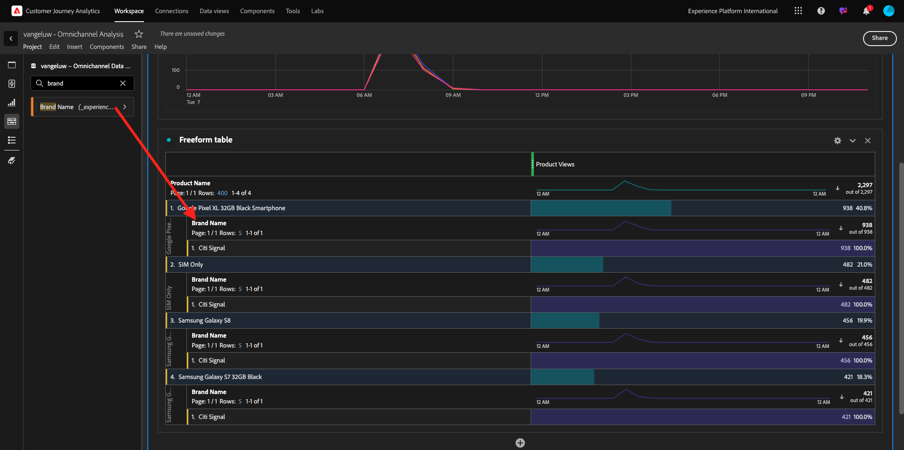
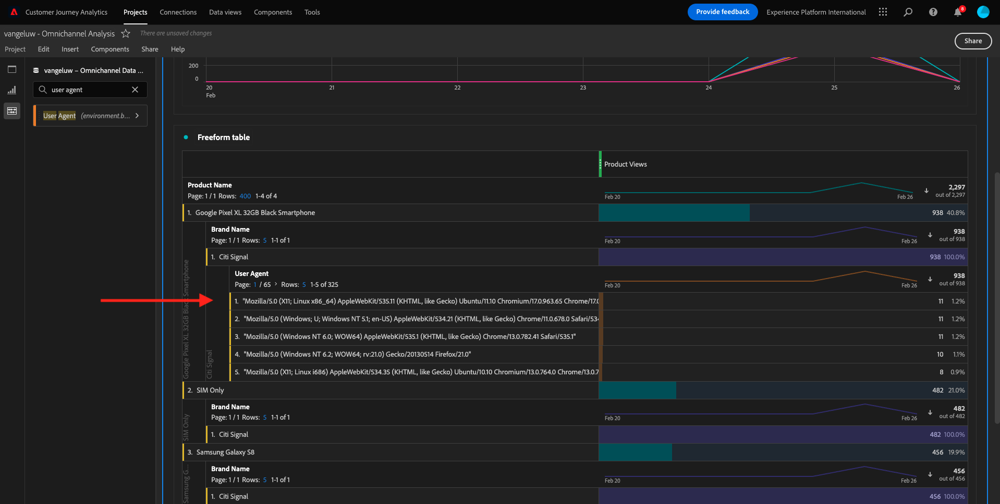
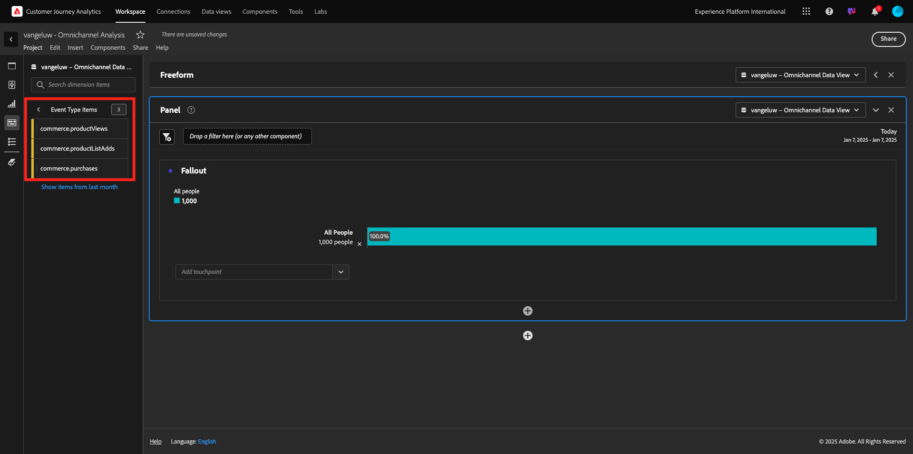
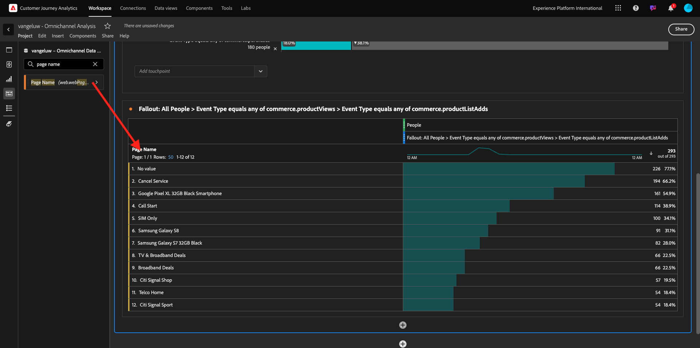
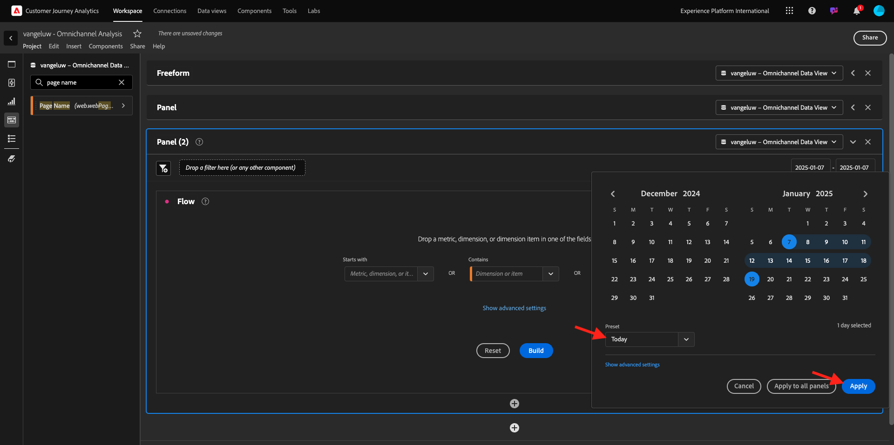
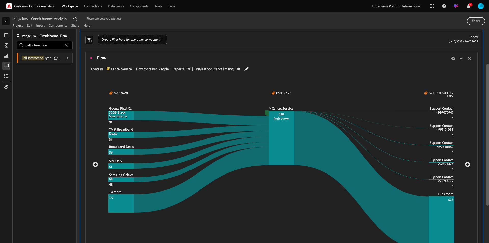

# 4.1.5 Visualisierung mithilfe von Customer Journey Analytics

## Ziele

- Grundlegendes zur Benutzeroberfläche von Analysis Workspace
- Erfahren Sie mehr über die Funktionen, die Analysis Workspace so anders machen.
- Erfahren Sie, wie Sie in CJA mit Analysis Workspace analysieren können

## Kontext

In diesen Übungen verwenden Sie Analysis Workspace in CJA, um Produktansichten, Produkttrichter, Abwanderung usw. zu analysieren.

Wir werden einige der Abfragen behandeln, die in Modul 7 - Abfrage-Service durchgeführt wurden, damit Sie sehen können, wie einfach es ist, dieselben Abfragen auszuführen und mehr, aber ohne SQL zu verwenden und sich nur auf die Drag-and-Drop-Philosophie von Analysis Workspace zu verlassen.

Verwenden wir das Projekt, das Sie in [4.1.4 Datenvorbereitung in Analysis Workspace](./ex4.md) erstellt haben, also [https://analytics.adobe.com](https://analytics.adobe.com).

Klicken Sie, um Ihre `--aepUserLdap-- - Omnichannel Analysis` zu öffnen.

Wenn Ihr Projekt geöffnet und die Datenansicht ausgewählt `--aepUserLdap-- - Omnichannel Analysis`, können Sie mit der Erstellung Ihrer ersten Visualisierungen beginnen.

## Wie viele Produktansichten haben wir täglich?

Zunächst müssen Sie die richtigen Daten auswählen, um die Daten zu analysieren. Gehen Sie zur Kalender-Dropdown-Liste auf der rechten Seite der Arbeitsfläche. Klicken Sie darauf und wählen Sie den entsprechenden Datumsbereich aus.

Suchen Sie im Menü auf der linken Seite (Bereich „Komponenten„) die berechnete Metrik **Produktansichten**. Wählen Sie es aus und ziehen Sie es in die Arbeitsfläche, oben rechts in der Freiformtabelle.

Automatisch wird die **Tag** hinzugefügt, um die erste Tabelle zu erstellen. Jetzt können Sie sehen, wie Ihre Frage im Flug beantwortet wird.

Klicken Sie anschließend mit der rechten Maustaste auf die Metrik-Zusammenfassung. Klicken Sie **Visualisieren**.

Klicken Sie auf **LINE**.

Sie sehen Ihre Produktansichten nach Stunden.

Sie können den Zeitrahmen in einen Tag ändern, indem Sie in der Visualisierung auf **Einstellungen** klicken.

Klicken Sie auf den Punkt neben **Linie**, um **Data Source verwalten**.

Klicken Sie anschließend auf **Auswahl sperren** und wählen Sie **Ausgewählte Elemente** aus, um diese Visualisierung zu sperren, sodass immer eine Zeitleiste mit Produktansichten angezeigt wird.

## Top 5 der angezeigten Produkte

Welche 5 Top-Produkte wurden angesehen?

Denken Sie daran, das Projekt ab und zu zu zu speichern.

| Betriebssystem | Abkürzung |
| ----------------- |-------------| 
| Windows | Strg+S |
| Mac | Befehl + S |

Finden wir die fünf am häufigsten angezeigten Produkte. Suchen Sie im Menü auf der linken Seite nach **Dimension** Produktname“.

Ziehen Sie nun per Drag-and **Drop „Produktname**, um die Dimension **Tag** zu ersetzen:

Dies wird das Ergebnis sein. Wählen Sie die vier Produktnamen aus, und Sie sehen das Visualisierungs-Update.

Versuchen Sie als Nächstes, eines der Produkte nach Markennamen aufzuschlüsseln. Suchen Sie nach **brandName** und ziehen Sie ihn unter den ersten Produktnamen.

Führen Sie anschließend eine Aufschlüsselung mit dem Benutzeragenten durch. Suchen Sie nach **Benutzeragent** und ziehen Sie ihn unter den Markennamen.

Sie sehen dann Folgendes:

Schließlich können Sie weitere Visualisierungen hinzufügen. Suchen Sie auf der linken Seite unter Visualisierungen nach `Donut`. Ziehen Sie `Donut` per Drag-and-Drop auf die Arbeitsfläche unter der **Linie**-Visualisierung.

Wählen Sie als Nächstes in der Tabelle die ersten 5 Zeilen **Benutzeragenten** aus der Aufschlüsselung aus, die wir unter **Google Pixel XL 32 GB Black Smartphone** > **Citi Signal** durchgeführt haben. Halten Sie die Taste **STRG** (unter Windows) oder die Schaltfläche **Befehl** (unter Mac) gedrückt, während Sie die drei Zeilen auswählen. Sie werden sehen, wie das Ringdiagramm aktualisiert wird.

Sie können das Design sogar für eine bessere Lesbarkeit anpassen, indem Sie sowohl das **Linie**-Diagramm als auch das **Ringdiagramm** etwas kleiner gestalten, damit sie nebeneinander passen:

Klicken Sie auf den Punkt neben **Ringdiagramm**, um **Data Source verwalten**.
Klicken Sie anschließend auf **Auswahl sperren**, um diese Visualisierung zu sperren, sodass immer eine Zeitleiste mit Produktansichten angezeigt wird.

Weitere Informationen zu Visualisierungen mit Analysis Workspace finden Sie hier:

- [https://experienceleague.adobe.com/docs/analytics/analyze/analysis-workspace/visualizations/freeform-analysis-visualizations.html](https://experienceleague.adobe.com/docs/analytics/analyze/analysis-workspace/visualizations/freeform-analysis-visualizations.html)
- [https://experienceleague.adobe.com/docs/analytics/analyze/analysis-workspace/visualizations/t-sync-visualization.html](https://experienceleague.adobe.com/docs/analytics/analyze/analysis-workspace/visualizations/t-sync-visualization.html)

## Produkt-Interaktionstrichter, vom Anzeigen bis zum Kaufen

Es gibt viele Möglichkeiten, diese Frage zu lösen. Eine davon ist die Verwendung des Produktinteraktionstyps und dessen Verwendung in einer Freiformtabelle. Eine andere Möglichkeit besteht in der Verwendung einer **Fallout-**. Verwenden wir den letzten, da wir ihn gleichzeitig visualisieren und analysieren möchten.

Schließen Sie das aktuelle Panel, das wir haben, indem Sie hier klicken:

Fügen Sie nun ein neues leeres Bedienfeld hinzu, indem Sie auf **+ Leeres Bedienfeld hinzufügen klicken**.

Klicken Sie auf die Visualisierung **Fallout**.

Wählen Sie denselben Datumsbereich wie in der vorherigen Übung aus.

Sie werden es dann sehen.

Suchen Sie die Dimension **Ereignistyp** unter den Komponenten auf der linken Seite. Klicken Sie auf den Pfeil, um die Dimension zu öffnen.

Es werden alle verfügbaren Ereignistypen angezeigt.

Wählen Sie das Element **commerce.productViews** aus und ziehen Sie es per Drag-and-Drop auf das Feld **Touchpoint hinzufügen** innerhalb der **Fallout-Visualisierung**.

Tun Sie dasselbe mit **commerce.productListAdds** und **commerce.purchases** und legen Sie sie im Feld **Touchpoint hinzufügen** innerhalb der **Fallout-Visualisierung**. Ihre Visualisierung sieht nun wie folgt aus:

Hier kann man vieles machen. Einige Beispiele: Vergleichen im Zeitverlauf, Vergleichen jedes Schritts nach Gerät oder Vergleichen nach Treue. Wenn Sie jedoch interessante Dinge analysieren möchten, z. B. warum Kunden nach dem Hinzufügen eines Artikels zu ihrem Warenkorb keinen Kauf tätigen, können wir das beste Tool in CJA verwenden: Rechtsklick.

Klicken Sie mit der rechten Maustaste auf den Touchpoint **commerce.productListAdds**. Klicken Sie dann auf **Fallout aufschlüsseln bei diesem Touchpoint**.

Eine neue Freiformtabelle wird erstellt, um zu analysieren, was die Personen getan haben, die keinen Kauf getätigt haben.

Ändern Sie **Ereignistyp** in der neuen Freiformtabelle nach **Seitenname**, um zu sehen, auf welche Seiten anstelle der Kaufbestätigungsseite gegangen wird.

## Was tun Personen auf der Website, bevor sie die Seite „Service abbrechen“ erreichen?

Auch hier gibt es viele Möglichkeiten, diese Analyse durchzuführen. Beginnen wir mit der Flussanalyse, um den Erkennungsteil zu starten.

Schließen Sie das aktuelle Bedienfeld, indem Sie hier klicken und dann ein neues leeres Bedienfeld hinzufügen, indem Sie auf **+ Leeres Bedienfeld hinzufügen klicken**.

Klicken Sie auf die **„Fluss**.

Sie werden es dann sehen. Wählen Sie denselben Datumsbereich wie in der vorherigen Übung aus. Klicken Sie auf **Übernehmen**.

Suchen Sie die Dimension **Seitenname** unter den Komponenten auf der linken Seite und klicken Sie auf den Pfeil, um die Dimension zu öffnen.

Sie finden alle angesehenen Seiten. Suchen Sie den Seitennamen: **Service abbrechen**.
Ziehen Sie **Service abbrechen** in die Flussvisualisierung im mittleren Feld. Klicken Sie **Erstellen**.

Sie sehen dann Folgendes:

Lassen Sie uns nun analysieren, ob Kunden, die die Seite **Service abbrechen** auf der Website besucht haben, auch Callcenter genannt haben, und was das Ergebnis war.

Gehen Sie unter den Dimensionen zurück und suchen Sie nach **Interaktionstyp des Aufrufs**.
Drag-and-Drop **Interaktionstyp „Aufruf**, um die erste Interaktion auf der rechten Seite in der **Flussvisualisierung“**.

Sie sehen jetzt das Support-Ticket der Kunden, die das Callcenter angerufen haben, nachdem sie die Seite **Service abbrechen** aufgerufen haben.

Suchen Sie als Nächstes unter den Dimensionen nach **Call Feeling**.  Ziehen Sie sie per Drag-and-Drop, um die erste Interaktion rechts in der **Flussvisualisierung“** ersetzen.

Sie sehen dann Folgendes:

Wie Sie sehen können, haben wir eine Omni-Channel-Analyse mit der Flussvisualisierung durchgeführt. Wir haben festgestellt, dass einige Kunden, die daran gedacht haben, ihren Service zu stornieren, nach dem Anruf beim Callcenter ein positives Gefühl hatten. Haben wir sie vielleicht durch eine Beförderung umgestellt?

## Wie schneiden Kunden mit einem positiven Callcenter-Kontakt mit den wichtigsten KPIs ab?

Segmentieren wir zunächst die Daten, um nur Benutzer mit „positiven **Aufrufen** erhalten. In CJA werden Segmente als Filter bezeichnet. Wechseln Sie zu den Filtern im Komponentenbereich (auf der linken Seite) und klicken Sie auf **+**.

Benennen Sie den Filter innerhalb des Filter-Builders

| Name | Beschreibung |
| ----------------- |-------------| 
| Call Feeling - Positiv | Call Feeling - Positiv |

Suchen Sie unter den Komponenten (innerhalb des Filter Builders) nach **Call Feeling** und ziehen Sie es per Drag-and-Drop in die Filter Builder-Definition.

Wählen Sie nun **positiv** als Wert für den Filter aus.

Ändern Sie den Bereich in &quot;**&quot;**. Klicken Sie auf **Speichern**.

Dann bist du wieder hier. Falls noch nicht geschehen, schließen Sie das vorherige Bedienfeld und fügen Sie ein neues leeres Bedienfeld hinzu, indem Sie auf **+ Leeres Bedienfeld hinzufügen klicken**.

Wählen Sie denselben Datumsbereich wie in der vorherigen Übung aus. Klicken Sie auf **Übernehmen**.

Klicken Sie **Freiformtabelle**.

Ziehen Sie nun den soeben erstellten Filter per Drag-and-Drop hinüber.

Zeit, einige Metriken hinzuzufügen. Beginnen Sie mit **Produktansichten**. Ziehen Sie per Drag-and-Drop in die Freiformtabelle. Sie können auch die Metrik **Ereignisse** löschen.

Tun Sie dasselbe mit **Personen**, **Zum Warenkorb hinzufügen** und **Käufe**. Du wirst so einen Tisch bekommen.

Dank der ersten Flussanalyse kam mir eine neue Frage in den Sinn. Wir haben uns also entschieden, diese Tabelle zu erstellen und einige KPIs mit einem Segment zu vergleichen, um diese Frage zu beantworten. Wie Sie sehen können, ist die Zeit bis zur Erkenntnis viel schneller als bei der Verwendung von SQL oder anderen BI-Lösungen.

## Zusammenfassende Informationen zu Customer Journey Analytics und Analysis Workspace

Wie Sie in diesem Labor erfahren haben, verknüpft Analysis Workspace Daten aus allen Kanälen miteinander, um die vollständige Kunden-Journey zu analysieren. Beachten Sie außerdem, dass Sie Daten in denselben Arbeitsbereich einbringen können, der nicht mit der Journey verknüpft ist.
Es kann sehr nützlich sein, getrennte Daten in Ihre Analyse zu bringen, um dem Journey einen Kontext zu geben. Einige Beispiele sind Dinge wie NPS-Daten, Umfragen, Facebook Ads-Ereignisse oder Offline-Interaktionen (nicht identifiziert).

Nächster Schritt: [Zusammenfassung und Vorteile](./summary.md)

[Zurück zum Modul 4.1](./customer-journey-analytics-build-a-dashboard.md)

[Zurück zu „Alle Module“](./../../../overview.md)
