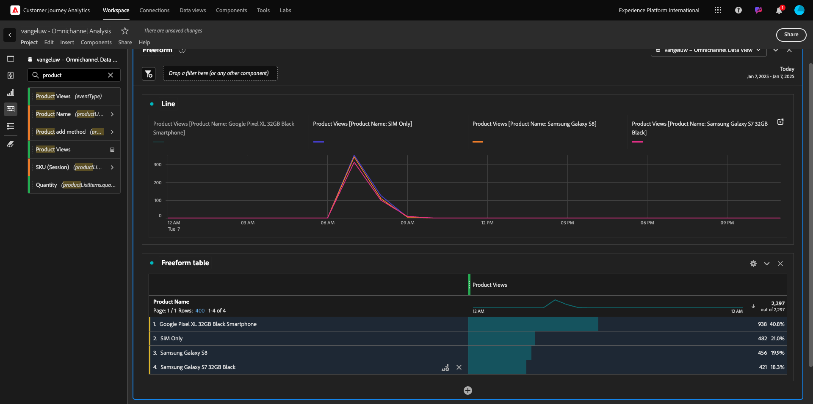
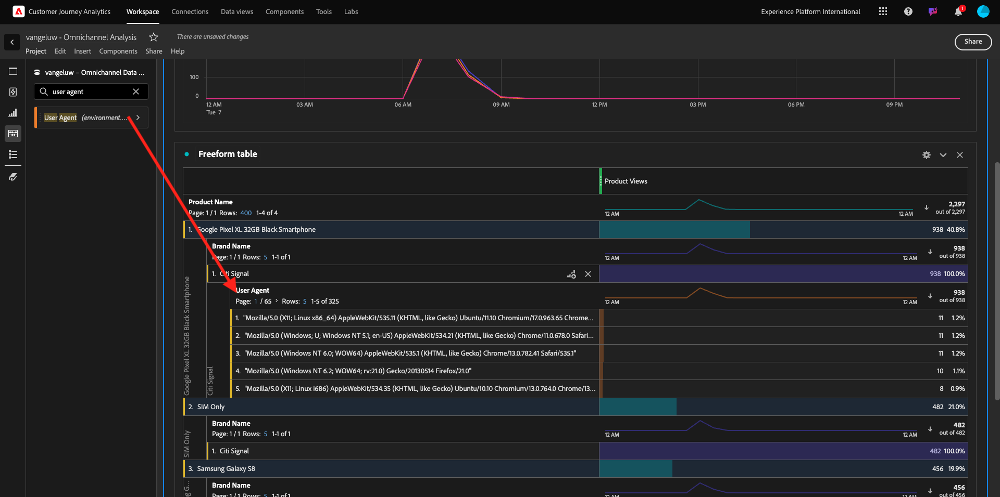

# 4.1.5 Visualisierung mit Customer Journey Analytics

## Ziele

- Grundlegendes zur Benutzeroberfläche von Analysis Workspace
- Lernen Sie einige Funktionen kennen, die Analysis Workspace so anders machen.
- Erfahren Sie, wie Sie mit Analysis Workspace in CJA analysieren.

## Kontext

In diesen Übungen verwenden Sie Analysis Workspace in CJA, um Produktansichten, Produkttribute, Abwanderungen usw. zu analysieren.

Wir werden einige der Abfragen behandeln, die in Modul 7 - Query Service durchgeführt werden, damit Sie sehen können, wie einfach es ist, dieselben Abfragen und mehr auszuführen, ohne SQL zu verwenden und sich nur auf die Drag-and-Drop-Philosophie von Analysis Workspace zu verlassen.

Verwenden wir das Projekt, das Sie in der [11.4-Datenvorbereitung in Analysis Workspace](./ex4.md) erstellt haben. Wechseln Sie daher zu [https://analytics.adobe.com](https://analytics.adobe.com).

Öffnen Sie Ihr Projekt `--aepUserLdap-- - Omnichannel Analysis`.

Wenn Ihr Projekt geöffnet und die Datenansicht `--aepUserLdap-- - Omnichannel Analysis` ausgewählt ist, können Sie mit der Erstellung Ihrer ersten Visualisierungen beginnen.

## Wie viele Produktansichten haben wir täglich?

Zunächst müssen wir die richtigen Daten für die Analyse der Daten auswählen. Gehen Sie auf der rechten Seite der Arbeitsfläche zum Kalender -Dropdown. Klicken Sie darauf und wählen Sie den entsprechenden Datumsbereich aus.

Suchen Sie im Menü auf der linken Seite (Komponentenbereich) die berechnete Metrik **Produktansichten**. Wählen Sie sie aus und ziehen Sie sie per Drag-and-Drop in die Arbeitsfläche oben rechts in der Freiformtabelle.

Automatisch wird die Dimension **Tag** hinzugefügt, um Ihre erste Tabelle zu erstellen. Jetzt können Sie sehen, wie Ihre Frage direkt beantwortet wird.

Klicken Sie anschließend mit der rechten Maustaste auf die Metrikzusammenfassung.

Klicken Sie auf **Visualisieren** und wählen Sie dann **Linie** als Visualisierung aus.

Sie sehen Ihre Produktansichten nach Tag.

Sie können den Zeitbereich auf den Tag ändern, indem Sie in der Visualisierung auf **Einstellungen** klicken.

Klicken Sie auf den Punkt neben **Zeile** auf **Data Source verwalten**.

Klicken Sie anschließend auf **Auswahl sperren** und wählen Sie **Ausgewählte Elemente** aus, um diese Visualisierung zu sperren, sodass immer eine Zeitleiste mit Produktansichten angezeigt wird.

## Die fünf häufigsten angezeigten Produkte

Welche Produkte werden am häufigsten angezeigt?

Vergessen Sie nicht, das Projekt ab und zu zu zu speichern.

| Betriebssystem | Kurzschnitt |
| ----------------- |-------------| 
| Windows | Kontrolle + S |
| Mac | Befehl + S |

Beginnen wir damit, die fünf am häufigsten angezeigten Produkte zu finden. Suchen Sie im linken Seitenmenü die Dimension **Produktname** - .

Ziehen Sie jetzt **Produktname** per Drag-and-Drop, um die Dimension **Tag** zu ersetzen:

Dies ist das Ergebnis

Versuchen Sie als Nächstes, eines der Produkte nach Markenname aufzuschlüsseln. Suchen Sie nach **brandName** und ziehen Sie ihn unter den ersten Produktnamen.

Erstellen Sie anschließend eine Aufschlüsselung mithilfe des Benutzeragenten. Suchen Sie nach **Benutzeragent** und ziehen Sie ihn unter den Markennamen.

Daraufhin sehen Sie Folgendes:

Schließlich können Sie weitere Visualisierungen hinzufügen. Suchen Sie auf der linken Seite unter &quot;Visualisierungen&quot;nach `Donut`. Nehmen Sie `Donut`, ziehen Sie es auf die Arbeitsfläche und legen Sie es unter der Visualisierung **Linie** ab.

Wählen Sie anschließend in der Tabelle die ersten 5 Zeilen für den Benutzeragenten **1} aus der Aufschlüsselung aus, die wir unter** Google Pixel XL 32 GB Black Smartphone **>** Citi Signal **durchgeführt haben.** Halten Sie bei der Auswahl der drei Zeilen die Schaltfläche **STRG** (unter Windows) oder die Schaltfläche **Befehl** (unter Mac) gedrückt.

Das Ringdiagramm wird sich ändern:

Sie können das Design sogar so anpassen, dass es besser lesbar ist, indem Sie sowohl das Diagramm **Linie** als auch das Diagramm **Donut** etwas kleiner machen, damit sie nebeneinander platziert werden können:

Klicken Sie auf den Punkt neben **Donut** , um **Data Source verwalten** zu aktivieren.
Klicken Sie anschließend auf **Auswahl sperren** , um diese Visualisierung so zu sperren, dass immer eine Zeitleiste mit Produktansichten angezeigt wird.

Weitere Informationen zu Visualisierungen mit Analysis Workspace finden Sie hier:

- [https://experienceleague.adobe.com/docs/analytics/analyze/analysis-workspace/visualizations/freeform-analysis-visualizations.html](https://experienceleague.adobe.com/docs/analytics/analyze/analysis-workspace/visualizations/freeform-analysis-visualizations.html)
- [https://experienceleague.adobe.com/docs/analytics/analyze/analysis-workspace/visualizations/t-sync-visualization.html](https://experienceleague.adobe.com/docs/analytics/analyze/analysis-workspace/visualizations/t-sync-visualization.html)

## Produkt-Interaktionstrichter, vom Anzeigen bis zum Kauf

Es gibt viele Möglichkeiten, diese Frage zu lösen. Eine davon besteht darin, den Interaktionstyp &quot;Produkt&quot;zu verwenden und ihn in einer Freiformtabelle zu verwenden. Eine andere Möglichkeit besteht darin, eine **Fallout-Visualisierung** zu verwenden. Verwenden wir die letzte, die wir gleichzeitig visualisieren und analysieren möchten.

Schließen Sie das aktuelle Bedienfeld, das wir haben, indem Sie hier klicken:

Fügen Sie jetzt ein neues leeres Bedienfeld hinzu, indem Sie auf **+ Leeres Bedienfeld hinzufügen** klicken.

Klicken Sie auf die Visualisierung **Fallout**.

Wählen Sie denselben Datumsbereich wie in der vorherigen Übung aus.

Dann wirst du das sehen.

Suchen Sie die Dimension **Ereignistyp** unter den Komponenten auf der linken Seite:

Klicken Sie auf den Pfeil, um die Dimension zu öffnen:

Es werden alle verfügbaren Ereignistypen angezeigt.

Wählen Sie das Element **commerce.productViews** aus und ziehen Sie es per Drag-and-Drop auf das Feld **Touchpoint hinzufügen** im Feld **Fallout-Visualisierung**.

Führen Sie dasselbe mit **commerce.productListAdds** und **commerce.purchases** aus und legen Sie sie im Feld **Touchpoint hinzufügen** im Feld **Fallout-Visualisierung** ab. Ihre Visualisierung sieht nun wie folgt aus:

Du kannst hier vieles tun. Einige Beispiele: Vergleich im Zeitverlauf, Vergleich jedes Schritts nach Gerät oder Vergleich nach Treue. Wenn wir jedoch interessante Dinge analysieren möchten, z. B. warum Kunden nach dem Hinzufügen eines Artikels zum Warenkorb keinen Kauf tätigen, können wir das beste Tool in CJA verwenden: Rechtsklick.

Klicken Sie mit der rechten Maustaste auf den Touchpoint **commerce.productListAdds**. Klicken Sie dann an diesem Touchpoint auf **Aufschlüsselungs-Fallout**.

Es wird eine neue Freiformtabelle erstellt, in der analysiert wird, was die Personen getan haben, wenn sie nichts gekauft haben.

Ändern Sie den **Ereignistyp** in der neuen Freiformtabelle durch **Seitenname**, um zu sehen, welche Seiten anstelle der Kaufbestätigungsseite aufgerufen werden.

## Was machen Personen auf der Site, bevor sie die Seite &quot;Abbrechen&quot;aufrufen?

Auch hier gibt es viele Möglichkeiten, diese Analyse durchzuführen. Verwenden wir die Flussanalyse, um den Erkundungsteil zu starten.

Schließen Sie das aktuelle Bedienfeld, indem Sie hier klicken:

Fügen Sie jetzt ein neues leeres Bedienfeld hinzu, indem Sie auf **+ Leeres Bedienfeld hinzufügen** klicken.

Klicken Sie auf die Visualisierung **Fluss**.

Daraufhin sehen Sie Folgendes:

Wählen Sie denselben Datumsbereich wie in der vorherigen Übung aus.

Suchen Sie die Dimension **Seitenname** unter den Komponenten auf der linken Seite:

Klicken Sie auf den Pfeil, um die Dimension zu öffnen:

Sie finden alle angezeigten Seiten. Suchen Sie den Seitennamen: **Dienst abbrechen**.
Ziehen Sie **Abbrechen-Dienst** in die Flussvisualisierung im mittleren Feld:

Daraufhin sehen Sie Folgendes:

Lassen Sie uns nun analysieren, ob Kunden, die die Seite **Abbrechen des Dienstes** auf der Website besucht haben, auch das Callcenter genannt haben und was das Ergebnis war.

Gehen Sie unter den Dimensionen zurück und suchen Sie dann **Interaktionstyp aufrufen**.
Ziehen Sie **Interaktionstyp aufrufen** in den Arbeitsbereich, um die erste Interaktion rechts neben der **Flussvisualisierung** zu ersetzen.

Jetzt sehen Sie das Supportticket der Kunden, die das Callcenter aufgerufen haben, nachdem sie die Seite **Abbrechen des Dienstes** besucht haben.

Suchen Sie anschließend unter den Dimensionen nach **Aufrufempfang**.  Ziehen Sie es per Drag-and-Drop in den Arbeitsbereich, um die erste Interaktion rechts neben der **Flussvisualisierung** zu ersetzen.

Daraufhin sehen Sie Folgendes:

Wie Sie sehen können, haben wir mithilfe der Flussvisualisierung eine Omnichannel-Analyse durchgeführt. Dadurch haben wir herausgefunden, dass einige Kunden, die daran gedacht haben, ihren Dienst abzubrechen, ein positives Gefühl hatten, nachdem sie das Callcenter angerufen hatten. Haben wir vielleicht mit einer Beförderung ihre Meinung geändert?

## Wie funktionieren Kunden mit einem positiven Callcenter-Kontakt mit den wichtigsten KPIs?

Segmentieren wir zunächst die Daten, um nur Benutzer mit **positiven** -Aufrufen zu erhalten. In CJA werden Segmente als Filter bezeichnet. Navigieren Sie zu Filtern im Komponentenbereich (auf der linken Seite) und klicken Sie auf **+**.

Benennen Sie den Filter im Filter-Builder.

| Name | Beschreibung |
| ----------------- |-------------| 
| Rufempfindlichkeit - positiv | Rufempfindlichkeit - positiv |

Suchen Sie unter den Komponenten (innerhalb des Filteraufbaus) nach **Aufrufegefühl** und ziehen Sie es per Drag-and-Drop in die Filtergenerator-Definition.

Wählen Sie nun **positiv** als Wert für den Filter aus.

Ändern Sie den Gültigkeitsbereich in den Wert **Person** .

Klicken Sie abschließend einfach auf **Speichern**.

Du wirst dann wieder hier sein. Wenn noch nicht geschehen, schließen Sie das vorherige Bedienfeld.

Fügen Sie jetzt ein neues leeres Bedienfeld hinzu, indem Sie auf **+ Leeres Bedienfeld hinzufügen** klicken.

Wählen Sie denselben Datumsbereich wie in der vorherigen Übung aus.

Klicken Sie auf **Freiformtabelle**.

Ziehen Sie nun den soeben erstellten Filter in den Arbeitsbereich.

Zeit zum Hinzufügen einiger Metriken. Beginnen Sie mit **Produktansichten**. Ziehen Sie die Freiformtabelle in den Arbeitsbereich. Sie können auch die Metrik **Ereignisse** löschen.

Führen Sie dasselbe mit **Personen**, **Zum Warenkorb hinzufügen** und **Käufen** durch. Du wirst am Ende einen Tisch wie diesen haben.

Dank der ersten Flussanalyse kam eine neue Frage in den Sinn. Also haben wir beschlossen, diese Tabelle zu erstellen und einige KPIs mit einem Segment zu vergleichen, um diese Frage zu beantworten. Wie Sie sehen können, ist die Zeit für Einblicke viel schneller als die Verwendung von SQL oder andere BI-Lösungen.

## Customer Journey Analytics- und Analysis Workspace-Neukodifizierung

Wie Sie in diesem Labor erfahren haben, ordnet Analysis Workspace Daten aus allen Kanälen zu, um die vollständige Journey zu analysieren. Beachten Sie außerdem, dass Sie Daten in denselben Arbeitsbereich bringen können, der nicht mit dem Journey verbunden ist.
Es kann sehr nützlich sein, getrennte Daten in Ihre Analyse aufzunehmen, um dem Journey Kontext zu geben. Einige Beispiele sind NPS-Daten, Umfragen, Facebook Ads-Ereignisse oder Offline-Interaktionen (nicht identifiziert).

Nächster Schritt: [Zusammenfassung und Vorteile](./summary.md)

[Zurück zu Modul 4.1](./customer-journey-analytics-build-a-dashboard.md)

[Zu allen Modulen zurückkehren](./../../../overview.md)
