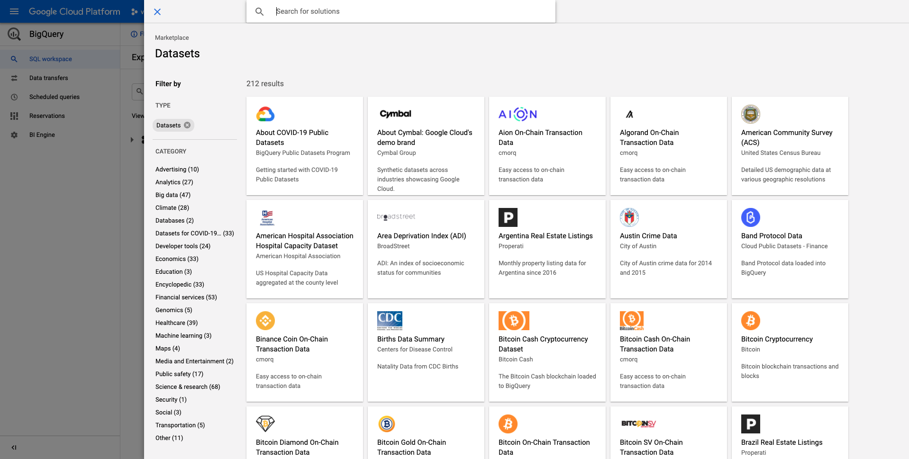

# 4.2.1 Google Cloud Platform-Konto erstellen

## Ziele

- Erstellen Ihres Google Cloud Platform-Kontos
- Kennenlernen von Google Cloud Platform Console
- Erstellen und Vorbereiten Ihres BigQuery-Projekts

## 4.2.1.1 Warum Google BigQuery mit Adobe Experience Platform verbinden, um Google Analytics-Daten zu erhalten

Google Cloud Platform (GCP) ist eine Suite öffentlicher Cloud-Computing-Dienste, die von Google angeboten werden. Die Google Cloud-Plattform umfasst eine Reihe gehosteter Dienste für die Computer-, Speicher- und Anwendungsentwicklung, die auf Google-Hardware ausgeführt werden.

BigQuery ist einer dieser Dienste und wird immer in Google Analytics 360 integriert. Google Analytics-Daten werden häufig gesampelt, wenn wir versuchen, Daten direkt daraus zu erhalten (z. B. API). Daher beinhaltet Google BigQuery, um nicht gesampelte Daten zu erhalten, sodass Marken erweiterte Analysen mit SQL durchführen und von der Leistungsfähigkeit von GCP profitieren können.

Google Analytics-Daten werden täglich mit einem Batch-Mechanismus in BigQuery geladen. Daher ist es nicht sinnvoll, diese GCP/BigQuery-Integration für die Echtzeit-Personalisierung und -Aktivierung zu verwenden.

Wenn eine Marke auf Grundlage von Google Analytics-Daten Echtzeit-Personalisierungsanwendungsfälle bereitstellen möchte, kann sie diese Daten auf der Website mit Google Tag Manager erfassen und dann in Echtzeit an Adobe Experience Platform streamen.

Der GCP/BigQuery Source Connector sollte für ...

- verfolgen Sie das gesamte Kundenverhalten auf der Website und laden Sie diese Daten zur Analyse, Datenwissenschaft und Personalisierung in Adobe Experience Platform, für die keine Echtzeit-Aktivierung erforderlich ist.
- Laden Sie Google Analytics historische Daten in Adobe Experience Platform, erneut für Analysen und Anwendungsfälle in der Datenwissenschaft.

## 4.2.1.2 Google-Konto erstellen

Um ein Google Cloud Platform-Konto zu erhalten, benötigen Sie ein Google-Konto.

## 4.2.1.3 Google Cloud Platform-Konto aktivieren

Nachdem Sie über Ihr Google-Konto verfügen, können Sie eine Google Cloud Platform-Umgebung erstellen. Gehen Sie dazu zu [https://console.cloud.google.com/](https://console.cloud.google.com/).

Akzeptieren Sie auf der nächsten Seite die Geschäftsbedingungen.

Klicken Sie anschließend auf **Projekt auswählen**.

Klicken Sie auf **NEUES PROJEKT**.

Benennen Sie Ihr Projekt nach dieser Benennungsregel:

| Übereinkommen | Beispiel |
| ----------------- |-------------| 
| `--demoProfileLdap---googlecloud` | delaigle-googlecloud |

Klicken Sie auf **Erstellen**.

Warten Sie, bis die Benachrichtigung oben rechts im Bildschirm angezeigt wird, dass die Erstellung abgeschlossen ist. Klicken Sie dann auf **Projekt anzeigen**.

Navigieren Sie dann zur Suchleiste am oberen Bildschirmrand und geben Sie **BigQuery** ein. Wählen Sie das erste Ergebnis aus.

Sie werden dann zur BigQuery-Konsole weitergeleitet und Sie werden eine Popup-Meldung sehen.

**Klicken Sie auf Fertig**.

Ziel dieses Moduls ist es, Google Analytics-Daten in Adobe Experience Platform zu übertragen. Dazu benötigen wir Platzhalterdaten in einem Datensatz der Google Analytics.

Klicken Sie im linken Seitenmenü auf **Daten hinzufügen** und anschließend auf **Öffentliche Datensätze durchsuchen**.

Dann sehen Sie dieses Fenster:

Geben Sie den Suchbegriff **Google Analytics-Beispiel** in die Suchleiste ein und wählen Sie das erste Ergebnis aus.

Der folgende Bildschirm mit einer Beschreibung des Datensatzes wird angezeigt. Klicken Sie auf **DATENSATZ ANZEIGEN**.

Sie werden dann zu BigQuery weitergeleitet, wo dieser **bigquery-public-data** -Datensatz unter **Explorer** angezeigt wird.

In **Explorer** sollte jetzt eine Reihe von Tabellen angezeigt werden. Entdecken Sie sie gerne. Wechseln Sie zu &quot;`google_analytics_sample`&quot;.

Klicken Sie auf , um die Tabelle `ga_sessions` zu öffnen.

Bevor Sie mit der nächsten Übung fortfahren, schreiben Sie bitte die folgenden Dinge in eine separate Textdatei auf Ihrem Computer:

| Anmeldedaten | Benennung | Beispiel |
| ----------------- |-------------| -------------|
| Projektname | `--demoProfileLdap---googlecloud` | vangeluw-googlecloud |
| Projekt-ID | random | created-task-306413 |

Sie finden Ihren Projektnamen und Ihre Projekt-ID, indem Sie in der oberen Menüleiste auf Ihren **Projektnamen** klicken:

Anschließend sehen Sie Ihre Projekt-ID auf der rechten Seite:

Sie können jetzt zu Übung 12.2 wechseln, wo Sie Ihre Hände schmutzig machen, indem Sie Google Analytics-Daten abfragen.

Nächster Schritt: [4.2.2 Erstellen Sie Ihre erste Abfrage in BigQuery](./ex2.md)

[Zurück zu Modul 4.2](./customer-journey-analytics-bigquery-gcp.md)

[Zu allen Modulen zurückkehren](./../../../overview.md)
