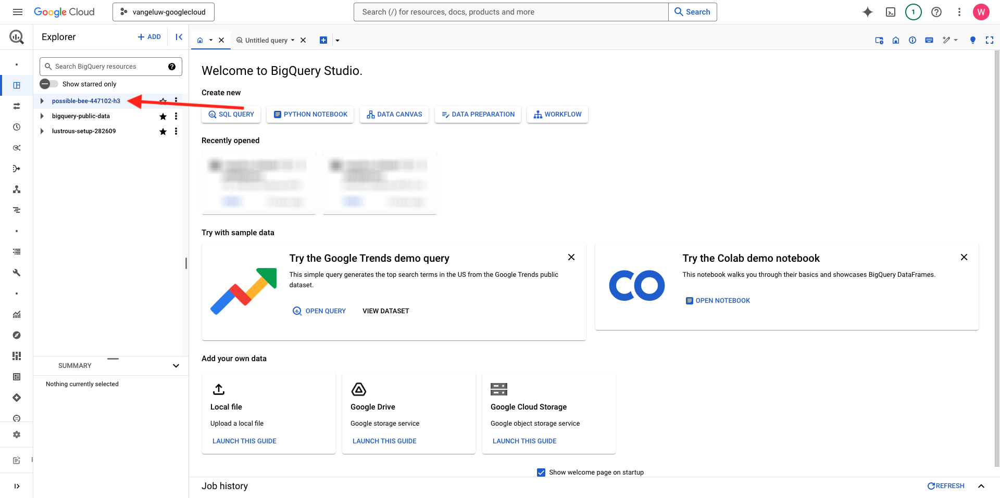

# 4.2.2 Erstellen Sie Ihre erste Abfrage in BigQuery

## Ziele

- Erkunden der BigQuery-Benutzeroberfläche
- Erstellen einer SQL-Abfrage in BigQuery
- Speichern Sie die Ergebnisse Ihrer SQL-Abfrage in einem Datensatz in BigQuery

## Kontext

Wenn sich Google Analytics-Daten in BigQuery befinden, sind Dimensionen, Metriken und andere Variablen verschachtelt. Außerdem werden Google Analytics-Daten täglich in verschiedene Tabellen geladen. Das bedeutet, dass es sehr schwierig und keine gute Idee ist, Google Analytics-Tabellen innerhalb von BigQuery direkt mit Adobe Experience Platform zu verbinden.

Die Lösung für dieses Problem besteht darin, Google Analytics-Daten in ein lesbares Format umzuwandeln, um die Aufnahme in Adobe Experience Platform zu vereinfachen.

## 4.2.2.1 Erstellen eines Datensatzes zum Speichern neuer BigQuery-Tabellen

Wechseln Sie zur [BigQuery-Konsole](https://console.cloud.google.com/bigquery).


In **Explorer** wird Ihre Projekt-ID angezeigt. Klicken Sie auf Ihre Projekt-ID (nicht auf den Datensatz **bigquery-public-data**).



Sie können sehen, dass es noch keinen Datensatz gibt, also erstellen wir jetzt einen.
Klicken Sie auf 3 **…** und dann auf **DATENSATZ ERSTELLEN**.


Auf der rechten Seite des Bildschirms sehen Sie das Menü **Datensatz erstellen**.


Verwenden Sie für **Datensatz-ID** die folgende Namenskonvention. Für die anderen Felder bleiben die Standardeinstellungen erhalten.

| Benennung | Beispiel |
| ----------------- | ------------- | 
| `--aepUserLdap--_BigQueryDataSet` | vangeluw_BigQueryDataSet |

Klicken Sie **DATENSATZ ERSTELLEN**.


Sie werden dann wieder in der BigQuery-Konsole sein, während Ihr Datensatz erstellt wurde.


## 4.2.2.2 Erstellen der ersten SQL BigQuery

Als Nächstes erstellen Sie Ihre erste Abfrage in BigQuery. Ziel dieser Abfrage ist es, die Beispieldaten der Google Analytics zu nehmen und sie so umzuwandeln, dass sie in Adobe Experience Platform aufgenommen werden können. Navigieren Sie zur Registerkarte **Nicht benannte Abfrage** .


Kopieren Sie die folgende SQL-Abfrage und fügen Sie sie in diesen Abfrage-Editor ein. Sie können die Abfrage lesen und die BigQuery-Syntax von Google Analytics verstehen.


```sql
SELECT
  CONCAT(fullVisitorId, CAST(hitTime AS String), '-', hitNumber) AS _id,
  TIMESTAMP(DATETIME(Year_Current, Month_Current, Day_Current, Hour, Minutes, Seconds)) AS timeStamp,
  fullVisitorId as GA_ID,
  -- Fake CUSTOMER ID
  CONCAT('3E-D4-',fullVisitorId, '-1W-93F' ) as customerID,
  Page,
  Landing_Page,
  Exit_Page,
  Device,
  Browser,
  MarketingChannel,
  TrafficSource,
  TrafficMedium,
  -- Enhanced Ecommerce
  TransactionID,
  CASE
      WHEN EcommerceActionType = '2' THEN 'Product_Detail_Views'
      WHEN EcommerceActionType = '3' THEN 'Adds_To_Cart'
      WHEN EcommerceActionType = '4' THEN 'Product_Removes_From_Cart'
      WHEN EcommerceActionType = '5' THEN 'Product_Checkouts'
      WHEN EcommerceActionType = '6' THEN 'Product_Refunds'
    ELSE
    NULL
  END
     AS Ecommerce_Action_Type,
  -- Entrances (metric)
  SUM(CASE
      WHEN isEntrance = TRUE THEN 1
    ELSE
    0
  END
    ) AS Entries,
    
--Pageviews (metric)
    COUNT(*) AS Pageviews,
    
 -- Exits 
    SUM(
    IF
      (isExit IS NOT NULL,
        1,
        0)) AS Exits,
        
 --Bounces
   SUM(CASE
      WHEN isExit = TRUE AND isEntrance = TRUE THEN 1
    ELSE
    0
  END
    ) AS Bounces,
        
  -- Unique Purchases (metric)
  COUNT(DISTINCT TransactionID) AS Unique_Purchases,
  -- Product Detail Views (metric)
  COUNT(CASE
      WHEN EcommerceActionType = '2' THEN fullVisitorId
    ELSE
    NULL
  END
    ) AS Product_Detail_Views,
  -- Product Adds To Cart (metric)
  COUNT(CASE
      WHEN EcommerceActionType = '3' THEN fullVisitorId
    ELSE
    NULL
  END
    ) AS Adds_To_Cart,
  -- Product Removes From Cart (metric)
  COUNT(CASE
      WHEN EcommerceActionType = '4' THEN fullVisitorId
    ELSE
    NULL
  END
    ) AS Product_Removes_From_Cart,
  -- Product Checkouts (metric)
  COUNT(CASE
      WHEN EcommerceActionType = '5' THEN fullVisitorId
    ELSE
    NULL
  END
    ) AS Product_Checkouts,
  -- Product Refunds (metric)
  COUNT(CASE
      WHEN EcommerceActionType = '7' THEN fullVisitorId
    ELSE
    NULL
  END
    ) AS Product_Refunds
  FROM (
  SELECT
    -- Landing Page (dimension)
    CASE
      WHEN hits.isEntrance = TRUE THEN hits.page.pageTitle
    ELSE NULL
  END
    AS Landing_page,
    
        -- Exit Page (dimension)
    CASE
      WHEN hits.isExit = TRUE THEN hits.page.pageTitle
    ELSE
    NULL
  END
    AS Exit_page,
    
    hits.page.pageTitle AS Page,
    hits.isEntrance,
    hits.isExit,
    hits.hitNumber as hitNumber,
    hits.time as hitTime,
    date as Fecha,
    fullVisitorId,
    visitStartTime,
    device.deviceCategory AS Device,
    device.browser AS Browser,
    channelGrouping AS MarketingChannel,
    trafficSource.source AS TrafficSource,
    trafficSource.medium AS TrafficMedium,
    hits.transaction.transactionId AS TransactionID,
    CAST(EXTRACT(YEAR FROM CURRENT_DATE()) AS INT64) AS Year_Current,
    CAST(EXTRACT(MONTH FROM CURRENT_DATE()) AS INT64) AS Month_Current,
     CAST(EXTRACT(DAY FROM CURRENT_DATE()) AS INT64) AS Day_Current,
    CAST(EXTRACT(DAY FROM DATE_SUB(CURRENT_DATE(),INTERVAL 1 DAY)) AS INT64) AS Day_Current_Before,
    CAST(FORMAT_DATE('%Y', PARSE_DATE("%Y%m%d", date)) AS INT64) AS Year,
  CAST(FORMAT_DATE('%m', PARSE_DATE("%Y%m%d",date)) AS INT64) AS Month,
  CAST(FORMAT_DATE('%d', PARSE_DATE("%Y%m%d",date)) AS INT64) AS Day,
    CAST(EXTRACT (hour FROM TIMESTAMP_SECONDS(hits.time)) AS INT64) AS Hour,
  CAST(EXTRACT (minute FROM TIMESTAMP_SECONDS(hits.time)) AS INT64) AS Minutes,
  CAST(EXTRACT (second FROM TIMESTAMP_SECONDS(hits.time)) AS INT64) AS SecondS,
    hits.eCommerceAction.action_type AS EcommerceActionType
  
  FROM
    `bigquery-public-data.google_analytics_sample.ga_sessions_*`,
     UNNEST(hits) AS hits
  WHERE
    _table_suffix BETWEEN '20170101'
    AND '20170331'
    AND totals.visits = 1
    AND hits.type = 'PAGE'
    )
    
GROUP BY
  1,
  2,
  3,
  4,
  5,
  6,
  7,
  8,
  9,
  10,
  11,
  12,
  13,
  14
    
  ORDER BY 2 DESC
```

Wenn Sie fertig sind, klicken Sie auf **Ausführen**, um die Abfrage auszuführen:


Die Ausführung der Abfrage kann einige Minuten dauern.

Nachdem die Abfrage ausgeführt wurde, sehen Sie die folgende Ausgabe in den **Abfrageergebnissen**.


## 4.2.2.3 Speichern der Ergebnisse Ihrer BigQuery SQL-Abfrage

Der nächste Schritt besteht darin, die Ausgabe Ihrer Abfrage zu speichern, indem Sie auf die Schaltfläche **ERGEBNISSE SPEICHERN** klicken.


Wählen Sie als Speicherort für Ihre Ausgabe **BigQuery-Tabelle**.


Anschließend wird ein neues Popup angezeigt, in dem Ihr **Projektname** und **Datensatzname** vorausgefüllt sind. Der Datensatzname sollte der Datensatz sein, den Sie zu Beginn dieser Übung mit dieser Namenskonvention erstellt haben:

| Benennung | Beispiel |
| ----------------- | ------------- | 
| `--aepUserLdap--_BigQueryDataSet` | `vangeluw_BigQueryDataSet` |

Geben Sie nun einen Tabellennamen ein. Bitte diese Namenskonvention verwenden:

| Benennung | Beispiel |
| ----------------- |------------- | 
| `--aepUserLdap--_GAdataTableBigQuery` | `vangeluw_GAdataTableBigQuery` |

Klicken Sie **SPEICHERN**.


Es kann einige Zeit dauern, bis die Daten in der von Ihnen erstellten Tabelle bereit sind. Aktualisieren Sie den Browser nach einigen Minuten. Sie sollten dann in Ihrem Datensatz die `--aepUserLdap--_GAdataTableBigquery` Tabelle unter **Explorer** in Ihrem BigQuery-Projekt sehen.


Fahren Sie nun mit der nächsten Übung fort, in der Sie diese Tabelle mit Adobe Experience Platform verbinden.

Nächster Schritt: [4.2.3 Verbinden von GCP und BigQuery mit Adobe Experience Platform](./ex3.md)

[Zurück zum Modul 4.2](./customer-journey-analytics-bigquery-gcp.md)

[Zurück zu „Alle Module“](./../../../overview.md)
