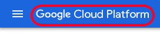
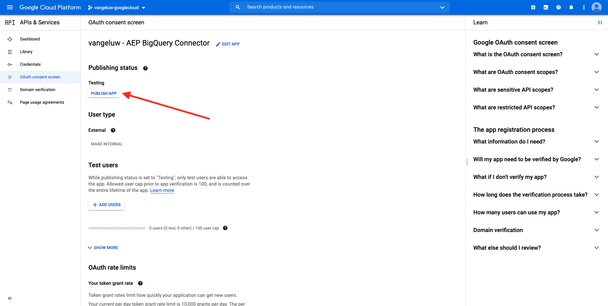
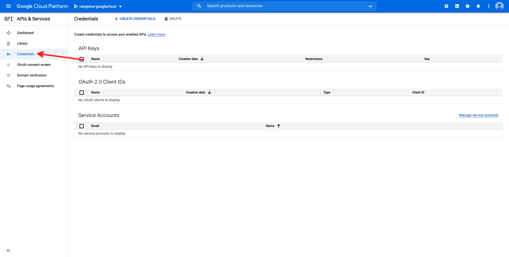
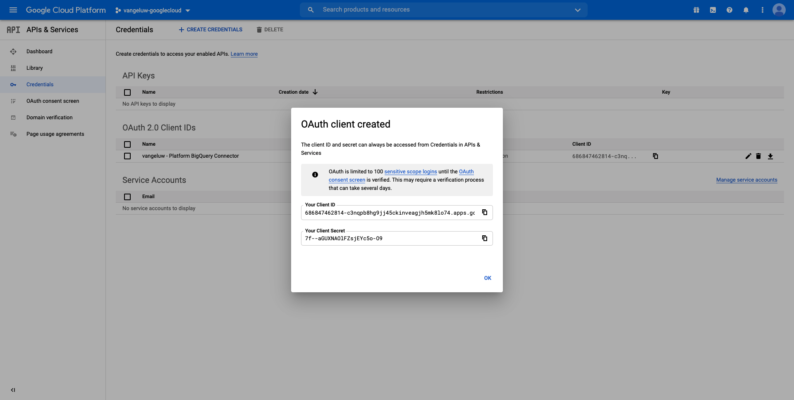

# 4.2.3 Verbinden von GCP und BigQuery mit Adobe Experience Platform

## Ziele

- Erkunden der API und Services in Google Cloud Platform
- Kennenlernen von OAuth Playground zum Testen von Google-APIs
- Erstellen Ihrer ersten BigQuery-Verbindung in Adobe Experience Platform

## Kontext

Adobe Experience Platform bietet einen Connector in **Sources**, der Ihnen dabei hilft, BigQuery-Datensätze in Adobe Experience Platform zu importieren. Dieser Daten-Connector basiert auf der Google BigQuery-API. Daher ist es wichtig, Ihre Google Cloud Platform und Ihre BigQuery-Umgebung ordnungsgemäß auf den Empfang von API-Aufrufen von Adobe Experience Platform vorzubereiten.

Zum Konfigurieren des BigQuery Source-Connectors in Adobe Experience Platform benötigen Sie die folgenden vier Werte:

- Projekt
- clientId
- clientSecret
- refreshToken

Bisher haben Sie nur die erste, die **Projekt-ID**. Dieser **Projekt-ID**-Wert ist eine zufällige ID, die von Google beim Erstellen Ihres BigQuery-Projekts während Übung 12.1 generiert wurde.

Bitte Projekt-ID in eine separate Textdatei kopieren.

| Anmeldedaten | Benennung | Beispiel |
| ----------------- |-------------| -------------|
| Projekt-ID | random | compose-task-306413 |

Sie können Ihre Projekt-ID jederzeit überprüfen, indem Sie auf **Projektname** in der oberen Menüleiste klicken:

Auf der rechten Seite sehen Sie Ihre Projekt-ID:

In dieser Übung erfahren Sie, wie Sie die anderen drei erforderlichen Felder abrufen:

- clientId
- clientSecret
- refreshToken

## 4.2.3.1 Google Cloud-API und -Services

Navigieren Sie zunächst zurück zur Startseite von Google Cloud Platform. Klicken Sie dazu einfach auf das Logo oben links im Bildschirm.

Sobald Sie sich auf der Startseite befinden, wechseln Sie zum linken Menü und klicken Sie auf **APIs und Services** und dann auf **Dashboard**.

Jetzt sehen Sie die Startseite **APIs und Services**.

Auf dieser Seite sehen Sie die Verwendung Ihrer verschiedenen Google-API-Verbindungen. Um eine API-Verbindung einzurichten, damit Adobe Experience Platform aus BigQuery lesen kann, müssen Sie die folgenden Schritte ausführen:

- Zunächst müssen Sie einen OAuth-Einverständnisbildschirm erstellen, um zukünftige Authentifizierungen zu aktivieren. Googles Sicherheitsgründe erfordern auch, dass ein Mensch die erste Authentifizierung durchführt, bevor ein programmatischer Zugriff erlaubt wird.
- Zweitens benötigen Sie API-Anmeldeinformationen (clientId und clientSecret), die für die API-Authentifizierung und den Zugriff auf Ihren BigQuery-Connector verwendet werden.

## OAuth-Einverständnisbildschirm 4.2.3.2

Beginnen wir mit der Erstellung des OAuth-Einverständnisbildschirms. Klicken Sie im linken Menü auf der Startseite **APIs und Services** auf **OAuth-Einverständnisbildschirm**.

Sie sehen dann Folgendes:

Wählen Sie den Benutzertyp aus: **Extern**. Klicken Sie anschließend auf **ERSTELLEN**.

Sie befinden sich dann im Fenster **OAuth-Einverständnisbildschirm-Konfiguration**.

Geben Sie hier nur den Namen des Einverständnisbildschirms in das Feld **Anwendungsname** ein und wählen Sie die E-**-Mail**. Verwenden Sie für den Anwendungsnamen diese Namenskonvention:

| Benennung | Beispiel |
| ----------------- |-------------| 
| `--aepUserLdap-- - AEP BigQuery Connector` | vangeluw - AEP BigQuery-Connector |

Scrollen Sie dann nach unten, bis Sie **Kontaktinformationen für Entwickler** sehen und eine E-Mail-Adresse ausfüllen.

Klicken Sie **Speichern und fortfahren**.

Sie werden es dann sehen. Klicken Sie **Speichern und fortfahren**.

Sie werden es dann sehen. Klicken Sie **Speichern und fortfahren**.

Sie werden es dann sehen. Klicken Sie **ZURÜCK ZUM DASHBOARD**.

Sie werden es dann sehen. Klicken Sie auf **PUBLISH-**.

Klicken Sie **BESTÄTIGEN**.

Sie werden es dann sehen.

Im nächsten Schritt schließen Sie die API-Einrichtung ab und erhalten Ihre API-Anmeldeinformationen.

## 4.2.3.3 Google-API-Anmeldedaten: Client-Geheimnis und Client-ID

Klicken Sie im linken Menü auf **Anmeldedaten**. Sie sehen dann Folgendes:

Klicken Sie auf die Schaltfläche **+ ANMELDEINFORMATIONEN ERSTELLEN**.

Es werden drei Optionen angezeigt. Klicken Sie auf die **OAuth-Client-ID**:

Wählen Sie im nächsten Bildschirm **Web-Anwendung** aus.

Es werden mehrere neue Felder angezeigt. Sie müssen jetzt den **Namen** der OAuth-Client-ID und auch die (**Umleitungs-URIs)**.

Befolgen Sie diese Namenskonvention:

| Feld | Wert | Beispiel |
| ----------------- |-------------| -------------| 
| Name | ldap - AEP BigQuery-Connector | vangeluw - Platform BigQuery-Connector |
| Autorisierte Weiterleitungs-URIs | https://developers.google.com/oauthplayground | https://developers.google.com/oauthplayground |

Das Feld **Autorisierte Weiterleitungs-URIs** ist ein sehr wichtiges Feld, da Sie es später benötigen werden, um das RefreshToken zu erhalten, das Sie benötigen, um die Einrichtung des BigQuery Source-Connectors in Adobe Experience Platform abzuschließen.

Bevor Sie fortfahren, müssen Sie nach Eingabe der URL die **Eingabetaste** drücken, um den Wert im Feld **Autorisierte Umleitungs-URIs** zu speichern. Wenn Sie nicht auf die **Enter**-Schaltfläche klicken, werden Sie zu einem späteren Zeitpunkt auf Probleme stoßen, nämlich auf dem **OAuth 2.0 Playground**.

Klicken Sie anschließend auf **Erstellen**:

Jetzt sehen Sie Ihre Client-ID und Ihr Client-Geheimnis.

Bitte diese beiden Felder kopieren und in eine Textdatei auf Ihrem Desktop einfügen. Sie können jederzeit zu einem späteren Zeitpunkt auf diese Anmeldeinformationen zugreifen, es ist jedoch einfacher, wenn Sie sie in einer Textdatei neben Ihrer BigQuery-Projekt-ID speichern.

Zusammenfassend für Ihr BigQuery Source Connector-Setup in Adobe Experience Platform stehen Ihnen jetzt die folgenden Werte bereits zur Verfügung:

| BigQuery Connector-Anmeldedaten | Wert |
| ----------------- |-------------| 
| Projekt-ID | Ihre eigene Projekt-ID (z. B.: compose-task-306413) |
| clientId | yourClientID |
| clientSecret | yourClientSecret |

Ihnen fehlt noch das **refreshToken**. Das refreshToken ist aus Sicherheitsgründen erforderlich. In der Welt der APIs laufen Token normalerweise alle 24 Stunden ab. Daher wird **refreshToken** benötigt, um das Sicherheits-Token alle 24 Stunden zu aktualisieren, damit Ihr Source Connector-Setup weiterhin eine Verbindung zu Google Cloud Platform und BigQuery herstellen kann.

## 4.2.3.4 der BigQuery-API und des refreshToken

Es gibt viele Möglichkeiten, ein refreshToken für den Zugriff auf Google Cloud Platform-APIs zu erhalten. Eine dieser Optionen ist beispielsweise die Verwendung von Postman.
Google hat jedoch etwas entwickelt, das einfacher zu testen und mit seinen APIs zu spielen ist, ein Tool namens **OAuth 2.0 Playground**.

Um auf **OAuth 2.0 Playground** zuzugreifen, gehen Sie zu [https://developers.google.com/oauthplayground](https://developers.google.com/oauthplayground).

Anschließend sehen Sie die Homepage **OAuth 2.0**.

Klicken Sie auf **Zahnrad**-Symbol oben rechts im Bildschirm:

Achten Sie darauf, dass Ihre Einstellungen mit denen im Bild oben übereinstimmen.

Überprüfen Sie die Einstellungen so, dass sie 100 % sicher sind.

Aktivieren Sie abschließend das Kontrollkästchen **Eigene OAuth-Anmeldeinformationen verwenden**

Es sollten zwei Felder angezeigt werden, für die Sie den Wert angeben können.

Bitte die Felder dieser Tabelle ausfüllen:

| Playground-API-Einstellungen | Ihre Google API-Anmeldedaten |
| ----------------- |-------------| 
| OAuth Client-ID | Ihre eigene Client-ID (in der Textdatei auf Ihrem Desktop) |
| OAuth-Client-Geheimnis | Ihr eigenes Client-Geheimnis (in der Textdatei auf Ihrem Desktop) |

Kopieren Sie **Client-ID** und **Client-Geheimnis** aus der Textdatei, die Sie auf Ihrem Desktop erstellt haben.

Nachdem Sie Ihre Anmeldedaten ausgefüllt haben, klicken Sie auf **Schließen**

Im linken Menü sehen Sie alle verfügbaren Google-APIs. Suchen Sie nach **BigQuery API v2**.

Wählen Sie als Nächstes den Umfang aus, wie in der folgenden Abbildung dargestellt:

Nachdem Sie sie ausgewählt haben, sollten Sie eine blaue Schaltfläche sehen, auf der steht **APIs autorisieren**. Klicken Sie darauf.

Wählen Sie das Google-Konto aus, das Sie zum Einrichten von GCP und BigQuery verwendet haben.

Möglicherweise wird eine große Warnung angezeigt: **Diese App ist nicht verifiziert**. Dies geschieht, weil Ihr Platform BigQuery Connector noch nicht formal überprüft wurde, sodass Google nicht weiß, ob es eine authentische App ist oder nicht. Sie sollten diese Benachrichtigung ignorieren.

Klicken Sie auf **Erweitert**.

Klicken Sie anschließend auf **Wechseln zu LDAP - AEP BigQuery Connector (unsicher)**.

Sie werden zu unserem von Ihnen erstellten OAuth-Einverständnisbildschirm weitergeleitet.

Wenn Sie die Zwei-Faktor-Authentifizierung (2FA) verwenden, geben Sie den Verifizierungs-Code ein, der Ihnen gesendet wurde.

Google zeigt jetzt acht verschiedene Eingabeaufforderungen **Berechtigung** an. Klicken Sie **Zulassen** für alle acht Berechtigungsanfragen. (Dies ist ein Verfahren, das einmal von einem echten Menschen befolgt und bestätigt werden muss, bevor die API programmgesteuerte Anfragen zulässt.)

Auch hier **acht verschiedene Popup-Fenster** werden nicht angezeigt. Sie müssen für alle auf **Zulassen** klicken.

Nach den acht Berechtigungsanfragen sehen Sie diese Übersicht. Klicken Sie **Zulassen**, um den Vorgang abzuschließen.

Nach dem letzten **Zulassen**-Klick werden Sie zum OAuth 2.0-Playground zurückgeleitet und sehen dies:

Klicken Sie auf **Autorisierungs-Code für Token austauschen**.

Nach einigen Sekunden wird die Ansicht **Schritt 2 - Autorisierungs-Code für Token austauschen** automatisch geschlossen und Sie sehen **Schritt 3 - Anfrage an API konfigurieren**.

Sie müssen zurück zu **Schritt 2 Austausch-Autorisierungs-Code für Token**, klicken Sie also erneut auf **Schritt 2 Austausch-Autorisierungs-Code für**-Token, um das **Token aktualisieren** zu visualisieren.

Daraufhin wird die Meldung &quot;**Token“**.

Kopieren Sie das **Aktualisierungstoken** und fügen Sie es zusammen mit den anderen BigQuery Source Connector-Anmeldeinformationen in die Textdatei auf Ihrem Desktop ein:

| BigQuery Source Connector-Anmeldedaten | Wert |
| ----------------- |-------------| 
| Projekt-ID | Ihre eigene zufällige Projekt-ID (z. B.: apt-summer-273608) |
| clientId | yourClientID |
| clientSecret | yourClientSecret |
| refreshToken | yourRefreshToken |

Als Nächstes richten wir Ihren Source-Connector in Adobe Experience Platform ein.

## 4.2.3.5 - Verbinden von Platform mit Ihrer eigenen BigQuery-Tabelle

Melden Sie sich über die folgende URL bei Adobe Experience Platform an: [https://experience.adobe.com/platform](https://experience.adobe.com/platform).

Nach dem Login landen Sie auf der Homepage von Adobe Experience Platform.

Bevor Sie fortfahren, müssen Sie eine **Sandbox“**. Die auszuwählende Sandbox hat den Namen ``--aepSandboxName--``. Nach Auswahl der entsprechenden Sandbox wird der Bildschirm geändert und Sie befinden sich nun in Ihrer dedizierten Sandbox.

Navigieren Sie im linken Menü zu Quellen . Anschließend wird die Homepage **Quellen** angezeigt. Klicken Sie **Menü** Quellen“ auf **Datenbanken**. Klicken Sie auf die Karte **Google BigQuery**. Klicken Sie anschließend auf **Einrichten** oder **+ Konfigurieren**.

Sie sollten jetzt eine neue Verbindung erstellen.

Klicken Sie auf **Neues**. Jetzt müssen Sie alle folgenden Felder ausfüllen, basierend auf der Einrichtung, die Sie in GCP und BigQuery vorgenommen haben.

Beginnen wir mit der Benennung der Verbindung:

Bitte diese Namenskonvention verwenden:

| BigQuery Connector-Anmeldedaten | Wert | Beispiel |
| ----------------- |-------------| -------------| 
| Kontoname | `--aepUserLdap-- - BigQuery Connection` | vangeluw - BigQuery-Verbindung |
| Beschreibung | `--aepUserLdap-- - BigQuery Connection` | vangeluw - BigQuery-Verbindung |

Das sollte Ihnen etwas wie das geben:

Füllen Sie anschließend die GCP- und BigQuery-API **Kontoauthentifizierung**-Details aus, die Sie in einer Textdatei auf Ihrem Desktop gespeichert haben:

| BigQuery Connector-Anmeldedaten | Wert |
| ----------------- |-------------| 
| Projekt-ID | Ihre eigene zufällige Projekt-ID (z. B.: apt-summer-273608) |
| clientId | ... |
| clientSecret | ... |
| refreshToken | ... |

Ihre **Kontoauthentifizierung**-details sollten jetzt wie folgt aussehen:

Nachdem Sie alle diese Felder ausgefüllt haben, klicken Sie auf **Mit Quelle verbinden**.

Wenn Ihre **Kontoauthentifizierung** korrekt ausgefüllt wurden, sollten Sie jetzt eine visuelle Bestätigung sehen, dass die Verbindung ordnungsgemäß funktioniert, indem Sie die Bestätigung **Verbunden** sehen.

Nachdem Sie Ihre Verbindung erstellt haben, klicken Sie auf **Weiter**:

Jetzt wird der BigQuery-Datensatz angezeigt, den Sie während Übung 12.2 erstellt haben.

Gut gemacht! In der nächsten Übung laden Sie Daten aus dieser Tabelle und ordnen sie einem Schema und Datensatz in Adobe Experience Platform zu.

Nächster Schritt: [4.2.4 Daten von BigQuery in Adobe Experience Platform laden](./ex4.md)

[Zurück zum Modul 4.2](./customer-journey-analytics-bigquery-gcp.md)

[Zurück zu „Alle Module“](./../../../overview.md)
