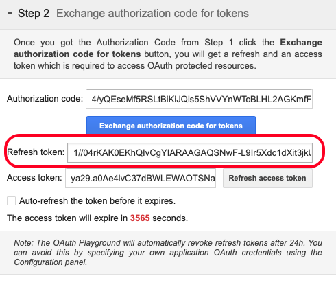

# 4.2.3 GCP und BigQuery mit Adobe Experience Platform verbinden

## Ziele

- API und Dienste in Google Cloud Platform
- Machen Sie sich mit OAuth Playground vertraut, um Google-APIs zu testen.
- Erstellen der ersten BigQuery-Verbindung in Adobe Experience Platform

## Kontext

Adobe Experience Platform bietet einen Connector innerhalb von **Quellen** , mit dem Sie BigQuery-Datensätze in Adobe Experience Platform importieren können. Dieser Data Connector basiert auf der Google BigQuery-API. Daher ist es wichtig, Ihre Google Cloud-Plattform und Ihre BigQuery-Umgebung ordnungsgemäß darauf vorzubereiten, API-Aufrufe von Adobe Experience Platform zu empfangen.

Zum Konfigurieren von BigQuery Source Connector in Adobe Experience Platform benötigen Sie die folgenden vier Werte:

- Projekt
- clientId
- clientSecret
- refreshToken

Bisher gibt es nur die erste, die **Projekt-ID**. Dieser **Projekt-ID** -Wert ist eine zufällige ID, die von Google beim Erstellen Ihres BigQuery-Projekts in Übung 12.1 generiert wurde.

Kopieren Sie die Projekt-ID in eine separate Textdatei.

| Anmeldedaten | Benennung | Beispiel |
| ----------------- |-------------| -------------|
| Projekt-ID | random | created-task-306413 |

Sie können Ihre Projekt-ID jederzeit überprüfen, indem Sie in der oberen Menüleiste auf Ihren **Projektnamen** klicken:

Auf der rechten Seite sehen Sie die Projekt-ID:

In dieser Übung erfahren Sie, wie Sie die anderen 3 erforderlichen Felder abrufen:

- clientId
- clientSecret
- refreshToken

## 4.2.3.1 Google Cloud-API und -Dienste

Gehen Sie zunächst zur Startseite der Google Cloud Platform zurück. Klicken Sie dazu einfach auf das Logo oben links im Bildschirm.

Sobald Sie sich auf der Startseite befinden, wechseln Sie zum linken Menü und klicken Sie auf **APIs &amp; Services** und dann auf **Dashboard**.

Sie sehen nun die Homepage für **APIs &amp; Services** .

Auf dieser Seite können Sie die Nutzung Ihrer verschiedenen Google API-Verbindungen sehen. Führen Sie die folgenden Schritte aus, um eine API-Verbindung einzurichten, damit Adobe Experience Platform aus BigQuery lesen kann:

- Zunächst müssen Sie einen OAuth-Einverständnisbildschirm erstellen, um zukünftige Authentifizierungen zu ermöglichen. Aus Sicherheitsgründen von Google ist es auch erforderlich, dass ein Mensch die erste Authentifizierung durchführt, bevor ein programmatischer Zugriff erlaubt ist.
- Außerdem benötigen Sie API-Anmeldeinformationen (clientId und clientSecret), die für die API-Authentifizierung und den Zugriff auf Ihren BigQuery Connector verwendet werden.

## 4.2.3.2 OAuth-Bildschirm für Zustimmung

Beginnen wir mit der Erstellung des OAuth-Einverständnisbildschirms. Klicken Sie im linken Menü auf der Homepage **APIs &amp; Services** auf **OAuth-Einverständnisbildschirm**.

Daraufhin sehen Sie Folgendes:

Wählen Sie den Benutzertyp aus: **External**. Klicken Sie anschließend auf **ERSTELLEN**.

Sie befinden sich dann im Fenster **OAuth Consent Screen configuration** .

Hier müssen Sie lediglich den Namen des Zustimmungsbildschirms in das Feld **Anwendungsname** eingeben und die E-Mail-Adresse **Benutzerunterstützung** auswählen. Verwenden Sie für den Anwendungsnamen die folgende Benennungskonvention:

| Benennung | Beispiel |
| ----------------- |-------------| 
| `--aepUserLdap-- - AEP BigQuery Connector` | vangeluw - AEP BigQuery Connector |

Scrollen Sie anschließend nach unten, bis **Kontaktinformationen für Entwickler** angezeigt werden, und füllen Sie eine E-Mail-Adresse aus.

Klicken Sie auf **SPEICHERN UND FORTFAHREN**.

Dann wirst du das sehen. Klicken Sie auf **SPEICHERN UND FORTFAHREN**.

Dann wirst du das sehen. Klicken Sie auf **SPEICHERN UND FORTFAHREN**.

Dann wirst du das sehen. Klicken Sie auf **ZURÜCK ZUM DASHBOARD**.

Dann wirst du das sehen. Klicken Sie auf **PUBLISH APP**.

Klicken Sie auf **BESTÄTIGEN**.

Dann wirst du das sehen.

Im nächsten Schritt werden Sie die API-Einrichtung abschließen und Ihre API-Anmeldeinformationen abrufen.

## 4.2.3.3 Google API-Anmeldeinformationen: Client Secret und Client Id

Klicken Sie im linken Menü auf **Anmeldedaten**. Daraufhin sehen Sie Folgendes:

Klicken Sie auf die Schaltfläche **+ CREATE CREATE CREDENTIALS** .

Sie werden drei Optionen sehen. Klicken Sie auf die **OAuth-Client-ID**:

Wählen Sie im nächsten Bildschirm **Webanwendung** aus.

Es werden mehrere neue Felder angezeigt. Sie müssen nun den **Namen** der OAuth-Client-ID eingeben und auch die **autorisierten Umleitungs-URIs** eingeben.

Befolgen Sie diese Benennungskonvention:

| Feld | Wert | Beispiel |
| ----------------- |-------------| -------------| 
| Name | ldap - AEP BigQuery Connector | vangeluw - Platform BigQuery Connector |
| Autorisierte Umleitungs-URIs | https://developers.google.com/oauthplayground | https://developers.google.com/oauthplayground |

Das Feld **Autorisierte Umleitungs-URIs** ist ein sehr wichtiges Feld, da Sie es später benötigen, um das RefreshToken zu erhalten, das Sie zum Abschluss der Einrichtung des BigQuery Source Connector in Adobe Experience Platform benötigen.

Bevor Sie fortfahren, müssen Sie die Schaltfläche **Enter** physisch nach Eingabe der URL drücken, um den Wert im Feld **Autorisierte Umleitungs-URIs** zu speichern. Wenn Sie nicht auf die Schaltfläche **Enter** klicken, treten später im **OAuth 2.0 Playground** Probleme auf.

Klicken Sie anschließend auf **Erstellen**:

Jetzt sehen Sie Ihre Client-ID und Ihr Client-Geheimnis.

Kopieren Sie diese beiden Felder und fügen Sie sie in eine Textdatei auf Ihrem Desktop ein. Sie können auf diese Anmeldedaten immer zu einem späteren Zeitpunkt zugreifen. Es ist jedoch einfacher, sie in einer Textdatei neben Ihrer BigQuery Project-ID zu speichern.

Als Grundlage für Ihre BigQuery Source Connector-Einrichtung in Adobe Experience Platform stehen Ihnen jetzt die folgenden Werte bereits zur Verfügung:

| BigQuery Connector-Anmeldedaten | Wert |
| ----------------- |-------------| 
| Projekt-ID | Ihre eigene Projekt-ID (z. B.: created-task-306413) |
| clientid | yourclientid |
| clientsecret | yourclientsecret |

Ihnen fehlt immer noch der **refreshToken**. Das refreshToken ist aus Sicherheitsgründen eine Anforderung. In der Welt der APIs laufen Token normalerweise alle 24 Stunden ab. Daher ist **refreshToken** erforderlich, um das Sicherheits-Token alle 24 Stunden zu aktualisieren, damit Ihr Source Connector-Setup weiterhin eine Verbindung zu Google Cloud Platform und BigQuery herstellen kann.

## 4.2.3.4 BigQuery-API und der refreshToken

Es gibt viele Möglichkeiten, ein refreshToken für den Zugriff auf Google Cloud Platform-APIs abzurufen. Eine dieser Optionen ist beispielsweise die Verwendung von Postman.
Google hat jedoch etwas einfacher entwickelt, um ihre APIs zu testen und wiederzugeben, ein Tool namens **OAuth 2.0 Playground**.

Um auf **OAuth 2.0 Playground** zuzugreifen, gehen Sie zu [https://developers.google.com/oauthplayground](https://developers.google.com/oauthplayground).

Sie sehen dann die Homepage **OAuth 2.0 Playground** .

Klicken Sie auf das Symbol **Zahnrad** oben rechts auf Ihrem Bildschirm:

Stellen Sie sicher, dass Ihre Einstellungen mit denen im Bild oben übereinstimmen.

Überprüfen Sie, ob die Einstellungen zu 100 % sicher sind.

Wenn Sie fertig sind, aktivieren Sie das Kontrollkästchen von **Verwenden Ihrer eigenen OAuth-Anmeldeinformationen**

Es sollten zwei Felder angezeigt werden, für die Sie den Wert haben.

Bitte füllen Sie die Felder in dieser Tabelle aus:

| Einstellungen der Player-API | Ihre Google API-Anmeldeinformationen |
| ----------------- |-------------| 
| OAuth-Client-ID | Ihre eigene Client-ID (in der Textdatei auf Ihrem Desktop) |
| OAuth Client Secret | Ihr eigenes Client-Geheimnis (in der Textdatei auf Ihrem Desktop) |

Kopieren Sie die **Client-ID** und den **Client-Geheimnis** aus der Textdatei, die Sie auf Ihrem Desktop erstellt haben.

Klicken Sie nach dem Ausfüllen Ihrer Anmeldedaten auf **Schließen**

Im linken Menü sehen Sie alle verfügbaren Google-APIs. Suchen Sie nach **BigQuery API v2**.

Wählen Sie dann den Umfang wie in der folgenden Abbildung angegeben aus:

Nachdem Sie sie ausgewählt haben, sollte eine blaue Schaltfläche mit der Beschriftung **APIs autorisieren** angezeigt werden. Klicken Sie darauf.

Wählen Sie das Google-Konto aus, das Sie zum Einrichten von GCP und BigQuery verwendet haben.

Möglicherweise wird eine große Warnung angezeigt: **Diese App ist nicht verifiziert**. Dies geschieht, weil Ihr Platform BigQuery-Connector noch nicht offiziell überprüft wurde. Google weiß also nicht, ob es sich um eine authentische App handelt oder nicht. Sie sollten diese Benachrichtigung ignorieren.

Klicken Sie auf **Erweitert**.

Klicken Sie anschließend auf &quot;**Gehe zu ldap - AEP BigQuery Connector (unsafe)**&quot;.

Sie werden zu unserem OAuth-Einverständnisbildschirm weitergeleitet, den Sie erstellt haben.

Wenn Sie Zweifaktorauthentifizierung (2FA) verwenden, geben Sie den an Sie gesendeten Verifizierungscode ein.

Google zeigt Ihnen jetzt acht verschiedene **Berechtigungsanforderungen** an. Klicken Sie für alle acht Berechtigungsanfragen auf **Zulassen** . (Dies ist ein Verfahren, das einmal von einem echten Menschen befolgt und bestätigt werden muss, bevor die API programmatische Anfragen zulässt.)

Auch hier werden **acht verschiedene Popup-Fenster** nicht angezeigt. Sie müssen für alle auf **Zulassen** klicken.

Nach den acht Berechtigungsanfragen wird diese Übersicht angezeigt. Klicken Sie auf **Zulassen** , um den Prozess abzuschließen.

Nach dem letzten **Allow**-Klick werden Sie zurück zum OAuth 2.0-Playground gesendet und sehen Folgendes:

Klicken Sie auf **Exchange authorization code for tokens**.

Nach einigen Sekunden wird die Ansicht **Schritt 2 - Exchange authorization code for tokens** automatisch geschlossen. Sie sehen **Schritt 3 - Konfigurieren der Anfrage an API**.

Sie müssen zurück zu **Schritt 2: Exchange authorization code for tokens** gehen. Klicken Sie daher erneut auf **Schritt 2 Exchange authorization code for tokens** , um das **Aktualisierungstoken** zu visualisieren.

Sie sehen nun das **Aktualisierungstoken**.

Kopieren Sie das **Aktualisierungs-Token** und fügen Sie es zusammen mit den anderen BigQuery Source Connector-Anmeldedaten in die Textdatei auf Ihrem Desktop ein:

| BigQuery Source Connector-Anmeldedaten | Wert |
| ----------------- |-------------| 
| Projekt-ID | Ihre eigene zufällige Projekt-ID (z. B.: apt-summer-273608) |
| clientid | yourclientid |
| clientsecret | yourclientsecret |
| refreshToken | yourrefreshToken |

Als Nächstes richten wir Ihren Source Connector in Adobe Experience Platform ein.

## 4.2.3.5 - Plattform mit Ihrer eigenen BigQuery-Tabelle verbinden

Melden Sie sich bei Adobe Experience Platform an, indem Sie diese URL verwenden: [https://experience.adobe.com/platform](https://experience.adobe.com/platform).

Nach der Anmeldung landen Sie auf der Startseite von Adobe Experience Platform.

Bevor Sie fortfahren, müssen Sie eine **Sandbox** auswählen. Die auszuwählende Sandbox heißt ``--aepSandboxName--``. Nachdem Sie die entsprechende Sandbox ausgewählt haben, wird die Bildschirmänderung angezeigt und Sie befinden sich jetzt in Ihrer dedizierten Sandbox.

Gehen Sie im linken Menü zu Quellen . Anschließend sehen Sie die Homepage **Quellen**. Klicken Sie im Menü **Quellen** auf **Datenbanken**. Klicken Sie auf die Karte **Google BigQuery** . Klicken Sie als Nächstes auf **Einrichten** oder **+ Konfigurieren**.

Sie sollten jetzt eine neue Verbindung erstellen.

Klicken Sie auf **Neues Konto**. Jetzt müssen Sie alle folgenden Felder ausfüllen, basierend auf der Einrichtung, die Sie in GCP und BigQuery durchgeführt haben.

Beginnen wir mit der Benennung der Verbindung:

Bitte verwenden Sie diese Namenskonvention:

| BigQuery Connector-Anmeldedaten | Wert | Beispiel |
| ----------------- |-------------| -------------| 
| Kontoname | `--aepUserLdap-- - BigQuery Connection` | vangeluw - BigQuery-Verbindung |
| Beschreibung | `--aepUserLdap-- - BigQuery Connection` | vangeluw - BigQuery-Verbindung |

Was sollte Ihnen so etwas geben:

Füllen Sie anschließend die GCP- und BigQuery-API **Kontoauthentifizierung**-Details aus, die Sie in einer Textdatei auf Ihrem Desktop gespeichert haben:

| BigQuery Connector-Anmeldedaten | Wert |
| ----------------- |-------------| 
| Projekt-ID | Ihre eigene zufällige Projekt-ID (z. B.: apt-summer-273608) |
| clientId | ... |
| clientSecret | ... |
| refreshToken | ... |

Ihre **Kontoauthentifizierung**-Details sollten jetzt wie folgt aussehen:

Nachdem Sie alle diese Felder ausgefüllt haben, klicken Sie auf **Mit Quelle verbinden**.

Wenn Ihre Details zur **Kontoauthentifizierung** korrekt ausgefüllt wurden, sollten Sie jetzt eine visuelle Bestätigung sehen, dass die Verbindung ordnungsgemäß funktioniert, indem Sie die Bestätigung **Verbunden** sehen.

Nachdem Sie die Verbindung erstellt haben, klicken Sie auf **Weiter**:

Jetzt wird der BigQuery-Datensatz angezeigt, den Sie in Übung 12.2 erstellt haben.

Gut gemacht! In der nächsten Übung laden Sie Daten aus dieser Tabelle und ordnen sie einem Schema und Datensatz in Adobe Experience Platform zu.

Nächster Schritt: [4.2.4 Daten aus BigQuery in Adobe Experience Platform laden](./ex4.md)

[Zurück zu Modul 4.2](./customer-journey-analytics-bigquery-gcp.md)

[Zu allen Modulen zurückkehren](./../../../overview.md)
