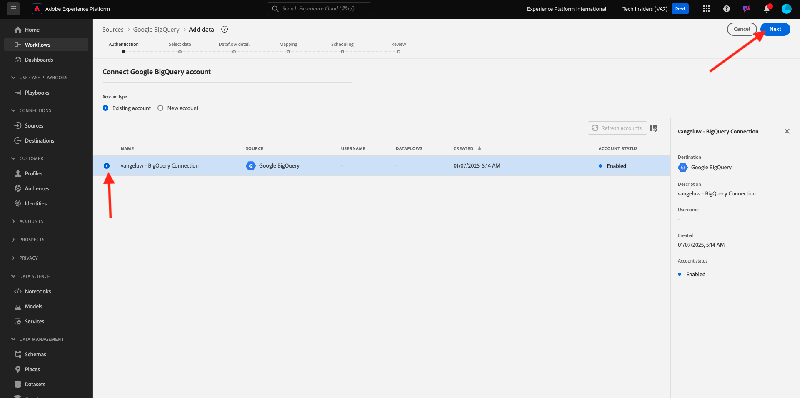
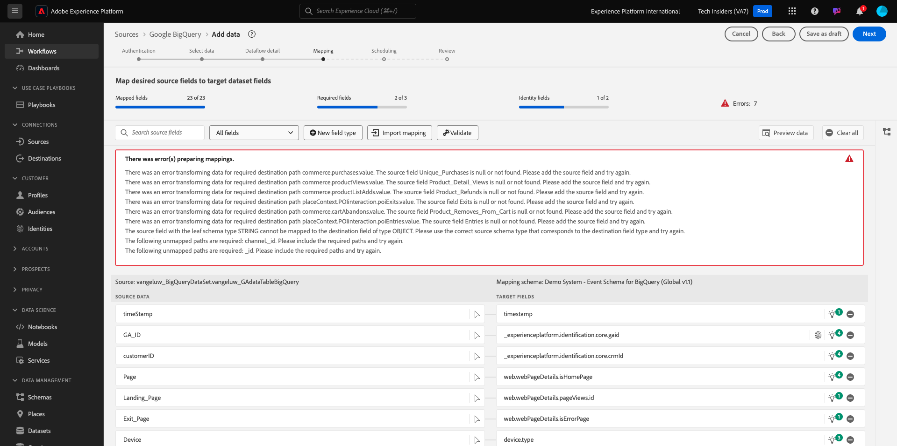
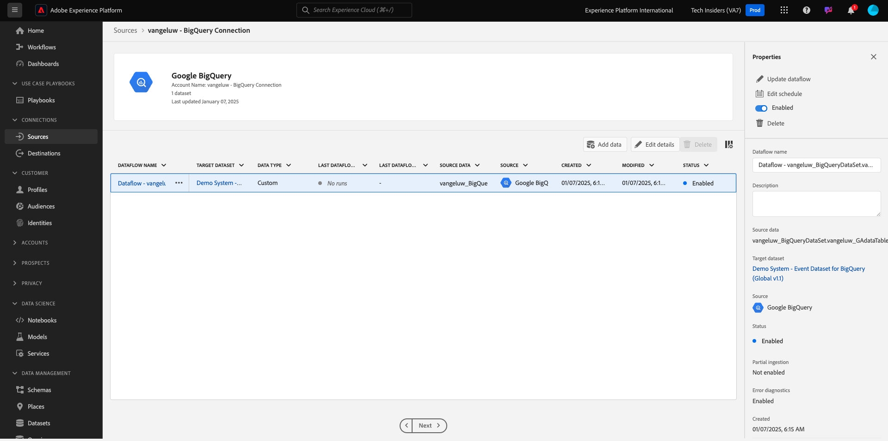

# 4.2.4 Laden von Daten aus BigQuery in Adobe Experience Platform

## Ziele

- BigQuery-Daten einem XDM-Schema zuordnen
- BigQuery-Daten in Adobe Experience Platform laden
- Machen Sie sich mit der Benutzeroberfläche des BigQuery Source-Connectors vertraut

## Bevor Sie beginnen

Nach der vorherigen Übung sollte diese Seite in Adobe Experience Platform geöffnet sein:

**Wenn Sie sie geöffnet haben, fahren Sie mit der nächsten Übung fort.**

**Wenn es nicht geöffnet ist, navigieren Sie zu [Adobe Experience Platform](https://experience.adobe.com/platform/home).**

Navigieren Sie im linken Menü zu Quellen . Anschließend wird die Homepage **Quellen** angezeigt. Wechseln Sie im **Quellen** zum **Quell-Connector von Google BigQuery** und klicken Sie auf **Einrichten**.

Daraufhin wird der Auswahlbildschirm für das Google BigQuery-Konto angezeigt. Wählen Sie Ihr Konto aus und klicken Sie auf **Weiter**.

Anschließend wird der Bildschirm **Daten auswählen** angezeigt.

## 4.2.4.1 BigQuery-Tabellenauswahl

Wählen **im Bildschirm „Daten**&quot; Ihren BigQuery-Datensatz aus. Sie können jetzt eine Beispieldatenvorschau der Google Analytics-Daten in BigQuery sehen.

Klicken Sie auf **Weiter**.

## XDM-Zuordnung 4.2.4.2

Sie sehen dies jetzt:

Jetzt müssen Sie entweder einen neuen Datensatz erstellen oder einen vorhandenen Datensatz auswählen, in den die Google Analytics-Daten geladen werden. Für diese Übung wurden bereits ein Datensatz und ein Schema erstellt. Sie müssen kein neues Schema oder keinen neuen Datensatz erstellen.

Wählen Sie **Vorhandener Datensatz** aus. Öffnen Sie das Dropdown-Menü, um einen Datensatz auszuwählen. Suchen Sie nach dem Datensatz mit dem Namen `Demo System - Event Dataset for BigQuery (Global v1.1)` und wählen Sie ihn aus. Klicken Sie auf **Weiter**.

Scroll down. Jetzt müssen Sie jedes **Source-Feld** von Google Analytics/BigQuery einem XDM-**Target-Feld** Feld für Feld zuordnen. Möglicherweise wird eine Reihe von Fehlern angezeigt, die in der folgenden Zuordnungsübung behoben werden.

Verwenden Sie die folgende Zuordnungstabelle für diese Übung.

| Quellfeld | Zielfeld |
| ----------------- |-------------| 
| `_id` | `_id` |
| `_id` | Kanal._id |
| `timeStamp` | Zeitstempel |
| `GA_ID` | ``--aepTenantId--``.identification.core.gaid |
| `customerID` | ``--aepTenantId--``. identification.core.crmId |
| `Page` | web.webPageDetails.name |
| `Device` | device.type |
| `Browser` | environment.browserDetails.vendor |
| `MarketingChannel` | marketing.trackingCode |
| `TrafficSource` | channel.typeAtSource |
| `TrafficMedium` | channel.mediaType |
| `TransactionID` | commerce.order.payments.transactionID |
| `Ecommerce_Action_Type` | eventType |
| `Pageviews` | web.webPageDetails.pageViews.value |

Bei einigen Feldern müssen Sie die ursprüngliche Zuordnung entfernen und eine neue erstellen, bei einem **berechneten Feld**.

| Berechnetes Feld | Zielfeld |
| ----------------- |-------------| 
| `iif("Ecommerce_Action_Type".equalsIgnoreCase("Product_Refunds"), 1, 0)` | commerce.purchases.value |
| `iif("Ecommerce_Action_Type".equalsIgnoreCase("Product_Detail_Views"), 1, 0)` | commerce.productViews.value |
| `iif("Adds_To_Cart".equalsIgnoreCase("Adds_To_Cart"), 1, 0)` | commerce.productListAdds.value |
| `iif("Ecommerce_Action_Type".equalsIgnoreCase("Product_Removes_From_Cart"), 1, 0)` | commerce.productListRemovals.value |
| `iif("Ecommerce_Action_Type".equalsIgnoreCase("Product_Checkouts"), 1, 0)` | commerce.checkouts.value |

Um ein **berechnetes Feld** zu erstellen, klicken Sie auf **+ Neuer** und anschließend auf **Berechnetes Feld**.

Fügen Sie die obige Regel ein und klicken Sie **Speichern** für jedes der Felder in der obigen Tabelle.

Sie haben jetzt eine **Zuordnung** wie diese hier.

Die Quellfelder **GA_ID** und **customerID** werden einer Kennung in diesem XDM-Schema zugeordnet. Auf diese Weise können Sie Google Analytics-Daten (Web-/App-Verhaltensdaten) mit anderen Datensätzen wie Treue- oder Callcenter-Daten anreichern.

Klicken Sie auf **Weiter**.

## 4.2.4.3 der Verbindung und Planung der Datenaufnahme

Daraufhin wird die Registerkarte **Planung** angezeigt:

Auf der Registerkarte **Planung** können Sie eine Häufigkeit für den Datenaufnahmeprozess für diese (**)** Daten definieren.

Da Sie Demodaten in Google BigQuery verwenden, die nicht aktualisiert werden, besteht keine echte Notwendigkeit, in dieser Übung einen Zeitplan festzulegen. Sie müssen etwas auswählen, und um zu viele unnötige Datenaufnahmen zu vermeiden, müssen Sie die Häufigkeit wie folgt festlegen:

- Häufigkeit: **Woche**
- Intervall: **200**
- Startzeit: **jederzeit in der nächsten Stunde**

**Wichtig**: Stellen Sie sicher, dass Sie den Umschalter **Aufstockung** aktivieren.

Zu guter Letzt müssen Sie ein Feld **delta** definieren.

Das **delta**-Feld wird verwendet, um die Verbindung zu planen und nur neue Zeilen hochzuladen, die in Ihren BigQuery-Datensatz gelangen. Ein Delta-Feld ist normalerweise immer eine Zeitstempelspalte. Für zukünftige geplante Datenerfassungen werden also nur die Zeilen mit einem neuen, neueren Zeitstempel aufgenommen.

Wählen Sie **timeStamp** als Delta-Feld aus.
Klicken Sie auf **Weiter**.

## Verbindung 4.2.4.4 und starten

Jetzt sehen Sie einen detaillierten Überblick über Ihre Verbindung. Stellen Sie sicher, dass alles korrekt ist, bevor Sie fortfahren, da einige Einstellungen anschließend nicht mehr geändert werden können, z. B. die XDM-Zuordnung.

Klicken Sie auf **Fertigstellen**.

Nachdem die Verbindung erstellt wurde, wird Folgendes angezeigt:

Sie können jetzt mit der nächsten Übung fortfahren, in der Sie Customer Journey Analytics verwenden werden, um leistungsstarke Visualisierungen auf den Daten von Google Analytics zu erstellen.

Nächster Schritt: [4.2.5 Analysieren von Google Analytics-Daten mit Customer Journey Analytics](./ex5.md)

[Zurück zum Modul 4.2](./customer-journey-analytics-bigquery-gcp.md)

[Zurück zu „Alle Module“](./../../../overview.md)
