# 4.2.5 Google Analytics-Daten mithilfe von Customer Journey Analytics analysieren

## Ziele

- BigQuery-Datensatz mit Customer Journey Analytics (CJA) verbinden
- Verbinden Sie Google Analytics mit Treuedaten und schließen Sie sie an.
- Kennenlernen der CJA-Benutzeroberfläche

## 4.2.5.1 Verbindung erstellen

Wechseln Sie zu [analytics.adobe.com](https://analytics.adobe.com) , um auf Customer Journey Analytics zuzugreifen.

Wechseln Sie auf der Customer Journey Analytics-Homepage zu **Verbindungen**.

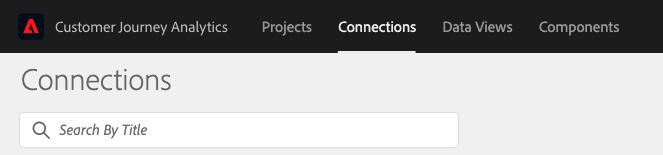

Hier sehen Sie alle Verbindungen, die zwischen CJA und Platform hergestellt wurden. Diese Verbindungen haben dasselbe Ziel wie Report Suites in Adobe Analytics. Die Erfassung der Daten ist jedoch völlig anders. Alle Daten stammen aus Adobe Experience Platform-Datensätzen.

Klicken Sie auf **Neue Verbindung erstellen**.

Daraufhin wird die Benutzeroberfläche **Verbindung erstellen** angezeigt.

Zunächst müssen Sie die richtige Sandbox auswählen, die verwendet werden soll. Wählen Sie im Sandbox-Menü Ihre Sandbox aus, die `--aepSandboxId--` sein soll. In diesem Beispiel lautet die zu verwendende Sandbox **AEP-Aktivierung FY21**.

Nach Auswahl Ihrer Sandbox werden die verfügbaren Datensätze aktualisiert.

Im linken Menü können Sie alle verfügbaren Adobe Experience Platform-Datensätze sehen. Suchen Sie nach dem Datensatz &quot;`Demo System - Event Dataset for BigQuery (Global v1.1)`&quot;. Klicken Sie auf **+** , um den Datensatz zu dieser Verbindung hinzuzufügen.

Nach dem Hinzufügen wird der Datensatz in der Verbindung angezeigt.

Jetzt müssen Sie die **Personen-ID** auswählen. Stellen Sie sicher, dass **loyaltyId** als Personen-ID ausgewählt ist.

Sie ergänzen nun die Interaktionsdaten der Google Analytics-Website mit einem anderen Adobe Experience Platform-Datensatz.

Suchen Sie nach dem Datensatz `Demo System - Profile Dataset for Loyalty (Global v1.1)` -Datensatz und fügen Sie ihn dieser Verbindung hinzu.

Daraufhin sehen Sie Folgendes:

Um beide Datensätze zusammenzuführen, müssen Sie eine **Personen-ID** auswählen, die denselben ID-Typ enthält. Der Datensatz `Demo System - Profile Dataset for Loyalty (Global v1.1)` verwendet die **loyaltyId** als Personen-ID, die denselben Typ von IDs wie die `Demo System - Event Dataset for BigQuery (Global v1.1)` enthält, die auch die **loyaltyId** als Personen-ID verwendet.

Klicken Sie auf **Weiter**.

Daraufhin sehen Sie Folgendes:

Hier müssen Sie Ihrer Verbindung einen Namen geben.

Verwenden Sie diese Namenskonvention: `ldap - GA + Loyalty Data Connection`.

Beispiel: `vangeluw - GA + Loyalty Data Connection`

Bevor Sie fertig sind, aktivieren Sie bitte auch **ab heute alle neuen Daten für alle Datensätze in dieser Verbindung automatisch importieren .** wie in der Abbildung unten.

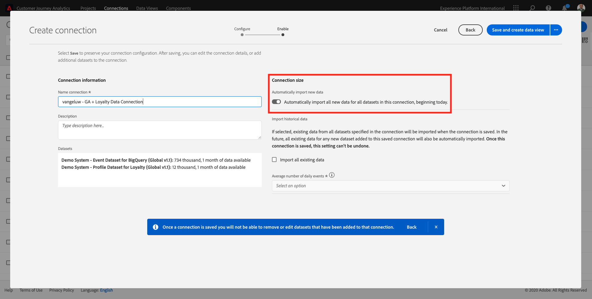

Dadurch wird alle 60 Minuten ein Datenfluss von Adobe Experience Platform nach CJA gestartet, bei großen Datenmengen kann es jedoch bis zu 24 Stunden dauern.

Sie müssen auch historische Daten aufstocken. Aktivieren Sie daher das Kontrollkästchen für &quot;**Alle vorhandenen Daten importieren**&quot;und wählen Sie &quot;**weniger als 1 Million**&quot;unter &quot;**Durchschnittliche Anzahl der täglichen Ereignisse**&quot;.

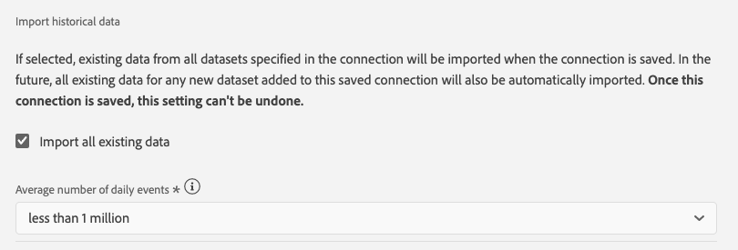

Nachdem Sie Ihre **Verbindung** erstellt haben, kann es einige Stunden dauern, bis Ihre Daten in Customer Journey Analytics verfügbar sind.

Klicken Sie auf **Speichern** und gehen Sie zur nächsten Übung.

Ihre Verbindung wird dann in der Liste der verfügbaren Verbindungen angezeigt.

## 4.2.5.2 Datenansicht erstellen

Nachdem die Verbindung hergestellt wurde, können Sie jetzt Fortschritte bei der Beeinflussung der Visualisierung erzielen. Ein Unterschied zwischen Adobe Analytics und CJA besteht darin, dass CJA eine Datenansicht benötigt, um die Daten vor der Visualisierung zu bereinigen und vorzubereiten.

Eine Datenansicht ähnelt dem Konzept von Virtual Report Suites in Adobe Analytics, wo Sie kontextbezogene Besuchsdefinitionen, Filtervorgänge und auch die Art und Weise definieren, wie die Komponenten aufgerufen werden.

Sie benötigen mindestens eine Datenansicht pro Verbindung. Für einige Anwendungsfälle ist es jedoch großartig, mehrere Datenansichten für dieselbe Verbindung zu haben, um verschiedenen Teams unterschiedliche Einblicke zu geben.

Wenn Sie möchten, dass Ihr Unternehmen datengesteuert wird, sollten Sie anpassen, wie Daten in den einzelnen Teams angezeigt werden. Beispiele:

- UX-Metriken nur für das UX-Design-Team
- Verwenden Sie dieselben Namen für KPIs und Metriken für Google Analytics wie für Customer Journey Analytics, damit das Digital Analytics-Team nur 1 Sprache sprechen kann.
- Datenansicht gefiltert, um z. B. Daten nur für 1 Markt, 1 Marke oder nur für Mobilgeräte anzuzeigen.

Aktivieren Sie im Bildschirm **Verbindungen** das Kontrollkästchen vor der soeben erstellten Verbindung.

Klicken Sie nun auf **Datenansicht erstellen**.

Sie werden zum Workflow **Datenansicht erstellen** weitergeleitet.

Sie können jetzt die grundlegenden Definitionen für Ihre Datenansicht konfigurieren. Dinge wie Zeitzone, Sitzungs-Timeout oder die Datenansichtsfilterung (der Segmentierungsteil ähnelt Virtual Report Suites in Adobe Analytics).

Die **Verbindung**, die Sie in der vorherigen Übung erstellt haben, ist bereits ausgewählt. Ihre Verbindung heißt `ldap - GA + Loyalty Data Connection`.

Geben Sie anschließend der Datenansicht einen Namen, der dieser Namenskonvention entspricht: `ldap - GA + Loyalty Data View`.

Geben Sie für die Beschreibung denselben Wert ein: `ldap - GA + Loyalty Data View`.

Vor der Analyse oder Visualisierung müssen wir eine Datenansicht mit allen Feldern, Dimensionen und Metriken und ihren Attributionseinstellungen erstellen.

| Feld | Namenskonvention | Beispiel |
| ----------------- |-------------|-------------|  
| Namensverbindung | ldap - GA- und Loyalitätsdatenansicht | vangeluw - GA + Loyalty Data View |
| Beschreibung | ldap - GA- und Loyalitätsdatenansicht | vangeluw - GA + Loyalty Data View |

Klicken Sie auf **Speichern und fortfahren**.

Sie können Ihrer Datenansicht jetzt Komponenten hinzufügen. Wie Sie sehen können, werden einige Metriken und Dimensionen automatisch hinzugefügt.

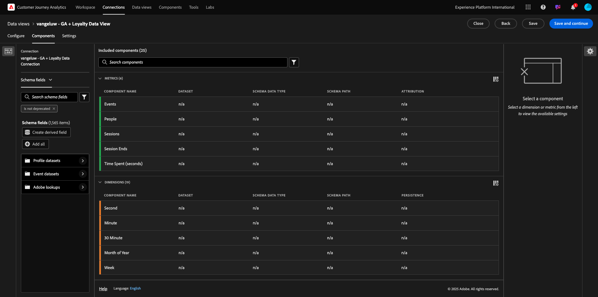

Fügen Sie der Datenansicht die folgenden Komponenten hinzu:

| Komponentenname | Komponententyp | Komponentenpfad |
| -----------------|-----------------|-----------------|
| level | Dimension | _experienceplatform.loyaltyDetails.level |
| Punkte | Metrik | _experienceplatform.loyaltyDetails.points |
| commerce.checkouts.value | Metrik | commerce.checkouts.value |
| commerce.productListRemovals.value | Metrik | commerce.productListRemovals.value |
| commerce.productListAdds | Metrik | commerce.productListAdds |
| commerce.productViews.value | Metrik | commerce.productViews.value |
| commerce.purchases.value | Metrik | commerce.purchases.value |
| web.webPageDetails.pageViews | Metrik | web.webPageDetails.pageViews |
| Transaction ID | Dimension | commerce.order.payments.transactionID |
| channel.mediaType | Dimension | channel.mediaType |
| channel.typeAtSource | Dimension | channel.typeAtSource |
| Trackingcode | Dimension | marketing.trackingCode |
| gaid | Dimension | _experienceplatform.identification.core.gaid |
| web.webPageDetails.name | Dimension | web.webPageDetails.name |
| Ereignistyp | Dimension | eventType |
| Anbieter | Dimension | environment.browserDetails.vendor |
| Kennung | Dimension | _id |
| Zeitstempel | Dimension | Zeitstempel |
| Typ | Dimension | device.type |
| loyaltyId | Dimension | _experiencePlatform.identification.core.loyaltyId |

Dann haben Sie Folgendes:

Als Nächstes müssen Sie den Anzeigenamen einiger der oben genannten Metriken und Dimensionen ändern, damit Sie sie bei der Erstellung Ihrer Analyse einfach verwenden können. Wählen Sie dazu die Metrik oder Dimension aus und aktualisieren Sie das Feld **Name** , wie in der folgenden Abbildung angegeben.

| Ursprünglicher Name der Komponente | Anzeigename |
| -----------------|-----------------|
| level | Treuestufe |
| Punkte | Treuepunkte |
| commerce.checkouts.value | Checkouts |
| commerce.productListRemovals.value | Entnahme aus Warenkorb |
| commerce.productListAdds | Hinzufügen zum Warenkorb |
| commerce.productViews.value | Produktansichten |
| commerce.purchases.value | Käufe |
| web.webPageDetails.pageViews | Seitenansichten |
| channel.mediaType | Traffic Medium |
| channel.typeAtSource | Traffic-Quelle |
| Trackingcode | Marketingkanal |
| gaid | Google Analytics-ID |
| Name | Seitentitel |
| Anbieter | Browser |
| Typ | Device Type |
| loyaltyId | Treue-ID |

Sie haben dann etwas wie das:

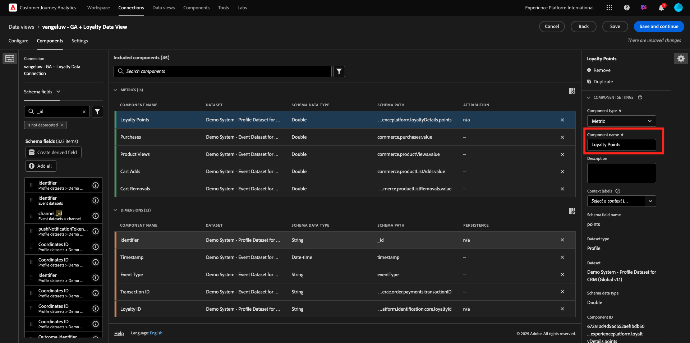

Als Nächstes müssen Sie einige Änderungen am Personen- und Sitzungskontext für einige dieser Komponenten vornehmen, indem Sie die **Attributionseinstellungen** ändern.

Ändern Sie die **Attributionseinstellungen** für die folgenden Komponenten:

| Komponente |
| -----------------|
| Traffic-Quelle |
| Marketingkanal |
| Browser |
| Traffic Medium |
| Device Type |
| Google Analytics-ID |
| Treue-ID |
| Treuestufe |
| Treuepunkte |

Wählen Sie dazu die Komponente aus, klicken Sie auf **Benutzerdefiniertes Attributionsmodell verwenden** und legen Sie das **Modell** auf **Letztkontakt** und das **Ablaufdatum** auf **Person (Berichtsfenster)** fest. Wiederholen Sie diesen Vorgang für alle oben genannten Komponenten.

Nachdem Sie die Änderungen an den Attributionseinstellungen für alle oben genannten Komponenten vorgenommen haben, sollten Sie diese Ansicht haben:

Ihre Datenansicht ist jetzt konfiguriert. Klicken Sie auf **Speichern**.

Sie können jetzt Google Analytics-Daten in Adobe Analytics Analysis Workspace analysieren. Lasst uns zur nächsten Übung übergehen.

## 4.2.5.3 Projekt erstellen

Wechseln Sie unter Customer Journey Analytics zu **Projekte**.

Daraufhin sehen Sie Folgendes:

Erstellen Sie ein Projekt, indem Sie auf **Neues Projekt erstellen** klicken.

Sie haben jetzt ein leeres Projekt:

Speichern Sie zunächst Ihr Projekt und geben Sie ihm einen Namen. Sie können den folgenden Befehl zum Speichern verwenden:

| Betriebssystem | Kurzschnitt |
| ----------------- |-------------| 
| Windows | Kontrolle + S |
| Mac | Befehl + S |

Dieses Popup wird angezeigt:

Bitte verwenden Sie diese Namenskonvention:

| Name | Beschreibung |
| ----------------- |-------------| 
| ldap - GA + Loyalty Workspace | ldap - GA + Loyalty Workspace |

Klicken Sie anschließend auf **Projekt speichern**.

Wählen Sie dann in der oberen rechten Ecke des Bildschirms die korrekte Datenansicht aus. Dies ist die Datenansicht, die Sie in der vorherigen Übung mit der Namenskonvention `ldap - GA + Loyalty Data View` erstellt haben. In diesem Beispiel ist die auszuwählende Datenansicht `ldap - GA + Loyalty Data View`.

### 12.5.3.1 Freiformtabellen

Freiformtabellen funktionieren mehr oder weniger als Pivot-Tabellen in Excel. Sie wählen etwas aus der linken Leiste aus, ziehen es in die Freiform und erhalten einen Tabellenbericht.

Freiformtabellen sind fast grenzenlos. Sie können (fast) alles tun, was im Vergleich zu Google Analytics so viel Wert bringt (da dieses Tool einige Analyseeinschränkungen aufweist). Dies ist einer der Gründe, warum Google Analytics-Daten in ein anderes Analysetool geladen werden.

Sehen Sie sich zwei Beispiele an, in denen Sie SQL, BigQuery und einige Zeit benötigen, um einfache Fragen zu beantworten, die in der Google Analytics-Benutzeroberfläche oder Google Data Studio nicht möglich sind:

- Wie viele Personen gelangen zum Checkout aus dem Safari-Browser, aufgeteilt nach Marketing-Kanälen? Beachten Sie, dass die Checkout-Metrik vom Safari-Browser gefiltert wird. Die Variable Browser = Safari wurde einfach per Drag-and-Drop auf die Checkout-Spalte verschoben.

- Als Analytiker kann ich sehen, dass der Social Marketing-Kanal geringe Konversionen aufweist. Ich verwende die Letztkontakt-Attribution als Standard, aber was ist mit Erstkontakt? Wenn Sie den Mauszeiger über eine Metrik bewegen, werden die Metrikeinstellungen angezeigt. Dort kann ich das gewünschte Attributionsmodell auswählen. Sie können die Attribution in GA (nicht in Data Studio) als eigenständige Aktivität durchführen, aber Sie können keine anderen Metriken oder Dimensionen haben, die nicht mit der Attributionsanalyse in derselben Tabelle in Verbindung stehen.

Beantworten wir diese Fragen und weitere Fragen mit Analysis Workspace in CJA.

Wählen Sie zunächst den richtigen Datumsbereich (**Letzte 53 volle Wochen**) auf der rechten Seite des Bedienfelds aus.

Klicken Sie dann auf **Anwenden** , um den Datumsbereich anzuwenden. Merken Sie sich diesen Schritt für die nächsten Übungen.

>[!NOTE]
>
>Wenn Sie gerade die **Datenverbindung** und die **Datenansicht** erstellt haben, müssen Sie möglicherweise einige Stunden warten. CJA benötigt etwas Zeit, um historische Daten aufzustocken, wenn eine große Menge an Datensätzen vorhanden ist.

Ziehen wir einige Dimensionen und Metriken per Drag-and-Drop in den Arbeitsbereich, um die Marketing-Kanäle zu analysieren. Verwenden Sie zunächst die Dimension **Marketing-Kanal** und ziehen Sie sie auf die Arbeitsfläche der **Freiformtabelle**. (Klicken Sie auf **Alle anzeigen** , falls die Metrik nicht sofort im Menü &quot;Metriken&quot;angezeigt wird)

Daraufhin sehen Sie Folgendes:

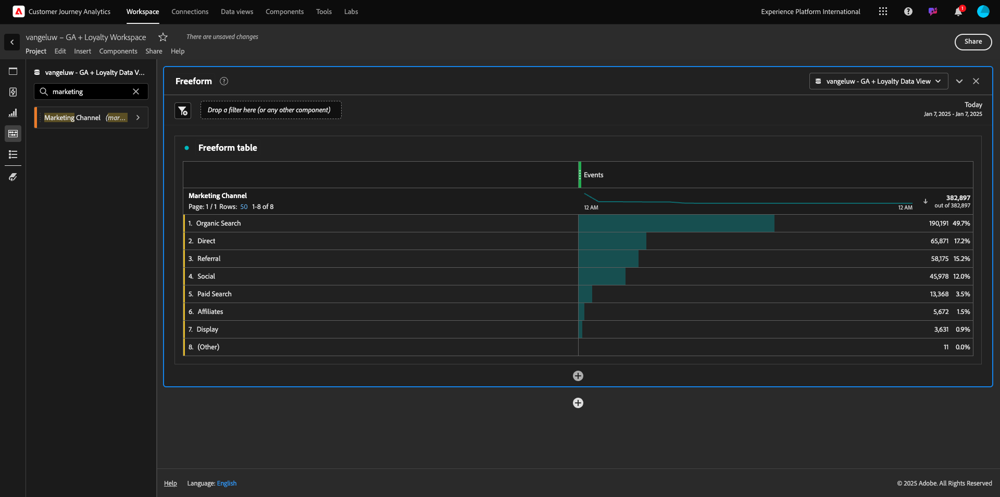

Als Nächstes müssen Sie die Metriken zur Freiformtabelle hinzufügen. Sie sollten diese Metriken hinzufügen: **Personen**, **Sitzungen**, **Produktansichten**, **Checkouts**, **Einkäufe**, **Konversionsrate** (berechnete Metrik).

Bevor Sie dies tun können, müssen Sie die berechnete Metrik **Konversionsrate** erstellen. Klicken Sie dazu auf das Symbol **+** neben Metriken:

Verwenden Sie als Namen für die berechnete Metrik **Konversionsrate**. Ziehen Sie dann die Metriken **Kauf** und **Sitzungen** auf die Arbeitsfläche. Setzen Sie **Format** auf **Prozent** und **Dezimalstellen** auf **2**. Klicken Sie abschließend auf **Speichern**.

Um alle diese Metriken als Nächstes in der **Freiformtabelle** zu verwenden, ziehen Sie sie einzeln auf die **Freiformtabelle**. Siehe Beispiel unten.

Am Ende steht eine Tabelle wie diese:

Wie oben erwähnt, geben Ihnen **Freiformtabellen** die Freiheit, die Sie für eine tiefgehende Tauchanalyse benötigen. Sie können beispielsweise eine beliebige andere Dimension auswählen, um eine bestimmte Metrik in der Tabelle aufzuschlüsseln.

Navigieren Sie beispielsweise zu Dimensionen, suchen Sie nach und wählen Sie die Variable **Browser** aus.

Daraufhin wird eine Übersicht der für diese Dimension verfügbaren Werte angezeigt.

Wählen Sie die Dimension **Safari** aus und ziehen Sie sie auf eine Metrik, z. B. **Checkouts**. Daraufhin sehen Sie Folgendes:

Auf diese Weise haben Sie gerade eine potenzielle Frage beantwortet, die Sie hatten: Wie viele Personen gelangen mit Safari zur Checkout-Seite, aufgeteilt nach Marketing-Kanal?

Antworten wir jetzt auf die Frage Attribution .

Suchen Sie die Metrik **Kauf** in der Tabelle.

Bewegen Sie den Mauszeiger über die Metrik. Daraufhin wird das Symbol **Einstellungen** angezeigt. Klicken Sie darauf.

Daraufhin wird ein Kontextmenü angezeigt. Aktivieren Sie das Kontrollkästchen für **nicht standardmäßiges Attributionsmodell**.

Im Popup-Fenster können Sie die Attributionsmodelle und das Lookback-Fenster einfach ändern (was mit SQL sehr komplex ist).

Wählen Sie **Erstkontakt** als Attributionsmodell aus.

Wählen Sie **Person** für das Lookback-Fenster aus.

Klicken Sie nun auf **Anwenden**.

Sie können jetzt sehen, dass das Attributionsmodell für diese bestimmte Metrik jetzt &quot;Erstkontakt&quot;ist.

Sie können beliebig viele Aufschlüsselungen ohne Einschränkungen für Variablentypen, Segmente, Dimensionen oder Datumsbereiche durchführen.

Noch wichtiger ist die Möglichkeit, beliebige Datensätze aus Adobe Experience Platform zu verknüpfen, um die digitalen Verhaltensdaten von Google Analytics anzureichern. Zum Beispiel Offline-, Callcenter-, Treueprogramm- oder CRM-Daten.

Um diese Funktion zu demonstrieren, konfigurieren wir Ihre erste Aufschlüsselung, die Offline-Daten mit Online-Daten kombiniert. Wählen Sie die Dimension **Treueebene** aus und ziehen Sie sie auf einen beliebigen **Marketingkanal**, z. B. **Organische Suche**:

Als Nächstes analysieren wir, welcher **Gerätetyp** von Kunden verwendet wird, die mit **Organische Suche** auf die Site gelangt sind, mit einer **Treuestufe**, die **Bronze** lautet. Nehmen Sie die Dimension **Gerätetyp** und ziehen Sie sie auf **Bronze**. Daraufhin sehen Sie Folgendes:

Sie können sehen, dass für Ihre erste Aufschlüsselung die Treuestufe verwendet wird. Diese Dimension stammt aus einem anderen Datensatz und aus einem anderen Schema als dem, das Sie für den BigQuery-Connector verwendet haben. Die Personen-ID **loyaltyID** (Demo-System - Ereignisschema für BigQuery (Global v1.1) und die Kennung **loyaltyID** (Demo System - Profile Schema for Loyalty (Global v1.1) stimmen überein. Daher können Sie Erlebnisereignisse aus Google Analytics mit Profildaten aus dem Treueschema kombinieren.

Wir können die Zeilen weiterhin mit Segmenten oder bestimmten Datumsbereichen aufteilen (um möglicherweise bestimmte Fernsehkampagnen widerzuspiegeln), um Fragen an Customer Journey Analytics zu stellen und die Antworten unterwegs zu erhalten.

Das gleiche Endergebnis mit SQL und dann einem Visualisierungs-Tool eines Drittanbieters zu erzielen, ist eine große Herausforderung. Besonders wenn Sie Fragen stellen und versuchen, die Antworten sofort zu bekommen. Customer Journey Analytics hat diese Herausforderung nicht und ermöglicht es Data Analysten, die Daten flexibel und in Echtzeit abzufragen.

## 4.2.5.3.2 Trichteranalyse oder Fallout-Analyse

Trichter eignen sich hervorragend, um die wichtigsten Schritte einer Journey zu verstehen. Diese Schritte können auch aus Offline-Interaktionen (z. B. vom Callcenter) stammen und dann mit digitalen Touchpoints im selben Trichter kombiniert werden.

Customer Journey Analytics ermöglicht Ihnen das und vieles mehr. Wenn Sie sich an Modul 13 erinnern, können wir mit der rechten Maustaste klicken und Dinge wie:

- Analysieren, wohin die Benutzer nach einem Fallout-Schritt navigieren
- Erstellen eines Segments von einem beliebigen Punkt im Trichter
- Anzeigen des Trends in einer Liniendiagramm-Visualisierung

Sehen wir uns noch eine Sache an, die Sie tun können: Wie steht es mit meinem Kunden-Journey-Trichter in diesem Monat im Vergleich zum Vormonat? Was ist mit Mobile vs Desktop?

Nachfolgend werden zwei Bedienfelder erstellt:

- Trichteranalyse (Januar)
- Trichteranalyse (Februar)

Sie werden sehen, dass wir einen Trichter über verschiedene Zeiträume (Januar und Februar) vergleichen, aufgeteilt nach Gerätetyp.

Diese Art von Analyse ist in der Google Analytics-Benutzeroberfläche nicht möglich oder sehr begrenzt. CJA fügt also den von Google Analytics erfassten Daten wieder viel Wert hinzu.

So erstellen Sie Ihre erste Fallout-Visualisierung. Schließen Sie das aktuelle Bedienfeld, um mit einem neuen zu beginnen.

Sehen Sie sich die rechte Seite des Bedienfelds an und klicken Sie auf den Pfeil, um es zu schließen.

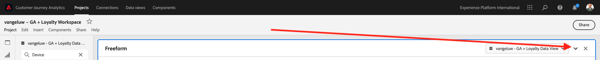

Klicken Sie anschließend auf **+** , um einen neuen Bereich zu erstellen.

Wählen Sie nun die Visualisierung **Fallout** aus.

Angenommen, Sie möchten wissen, was mit Ihrem Haupt-E-Commerce-Trichter passiert: Startseite > Interne Suche > Produktdetails > Checkout > Kauf.

Beginnen wir mit dem Hinzufügen neuer Schritte zum Trichter. Öffnen Sie dazu die Dimension **Seitenname** .

Daraufhin werden alle verfügbaren Seiten angezeigt, die besucht wurden.

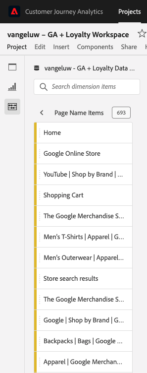

Ziehen Sie **Home** in den ersten Schritt.

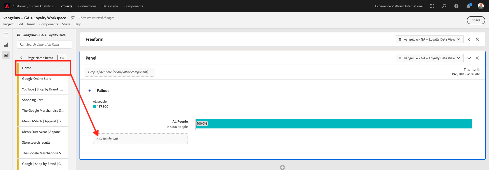

Verwenden Sie als zweiten Schritt **Suchergebnisse speichern**

Jetzt müssen Sie einige E-Commerce-Aktionen hinzufügen. Suchen Sie in den Dimensionen nach der Dimension Dimension **Ereignistyp** . Klicken Sie auf , um die Dimension zu öffnen.

Wählen Sie **Product_Detail_Views** aus und ziehen Sie es in den nächsten Schritt.

Wählen Sie **Product_Checkouts** aus und ziehen Sie es in den nächsten Schritt.

Ändern Sie die Größe Ihrer Fallout-Visualisierung.

Ihre Fallout-Visualisierung ist jetzt bereit.

Um die Einblicke zu analysieren und zu dokumentieren, ist es immer eine gute Idee, eine **Text** -Visualisierung zu erstellen. Um eine **Text** -Visualisierung hinzuzufügen, klicken Sie im linken Menü auf das Symbol **Diagramm** , um alle verfügbaren Visualisierungen anzuzeigen. Ziehen Sie dann die Visualisierung **Text** auf die Arbeitsfläche. Ändern Sie die Größe und verschieben Sie sie so, dass sie wie unten dargestellt aussieht.

Ändern Sie die Größe erneut, um sie an das Dashboard anzupassen:

Fallouts-Visualisierungen ermöglichen auch Aufschlüsselungen. Verwenden Sie die Dimension **Gerätetyp** , indem Sie sie öffnen und einige der Werte nacheinander auf die Visualisierung ziehen:

Sie erhalten eine erweiterte Visualisierung:

Customer Journey Analytics ermöglicht Ihnen das und vieles mehr. Durch Rechtsklick auf eine beliebige Stelle im Fallout...

- Analysieren, wohin die Benutzer von einem Fallout-Schritt gehen
- Erstellen eines Segments von einem beliebigen Punkt im Trichter
- Trend für jeden Schritt in einer Linienvisualisierung erstellen
- Vergleichen Sie alle Trichter visuell mit verschiedenen Zeiträumen.

Führen Sie beispielsweise einen Rechtsklick in einen beliebigen Schritt des Fallout aus, um einige dieser Analyseoptionen anzuzeigen.

## 4.2.5.3.3 Flussanalyse und Visualisierung

Wenn Sie eine erweiterte Flussanalyse mit Google Analytics durchführen möchten, müssen Sie SQL verwenden, um die Daten zu extrahieren, und dann eine Drittanbieterlösung für den Visualisierungsteil verwenden. Customer Journey Analytics wird dabei helfen.

In diesem Schritt konfigurieren Sie eine Flussanalyse, um diese Frage zu beantworten: Welche Hauptbeitragskanäle stehen vor einer bestimmten Landingpage zur Verfügung?  Mit zwei Drag-and-Drop-Vorgängen und einem Klick als Analytiker können Sie den Fluss des Benutzers zur Landingpage mit den beiden letzten Touches der Marketing-Kanäle erkennen.

Weitere Fragen, die Customer Journey Analytics Ihnen bei der Beantwortung von Fragen helfen kann:

- Was ist die Hauptkombination von Kanälen vor einer bestimmten Landingpage?
- Was veranlasst einen Benutzer, die Sitzung zu beenden, wenn er zum Product_Checkout gelangt? Wo liegen die vorherigen Schritte?

Beginnen wir mit einem leeren Bedienfeld, um diese Fragen zu beantworten. Schließen Sie das aktuelle Bedienfeld und klicken Sie auf **+**.

Wählen Sie nun die Visualisierung **Fluss** aus.

Erstellen wir nun eine kanalübergreifende Analyse des Marketingkanalflusses mit mehreren Pfaden. Ziehen Sie die Dimension **Marketingkanal** in den Bereich **Einstiegs-Dimensionen**.

Sie können nun die ersten Einstiegspfade sehen:

Klicken Sie auf den ersten Pfad, um einen Drilldown durchzuführen.

Jetzt wird der nächste Pfad (Marketingkanal) angezeigt.

Machen wir einen dritten Drilldown. Klicken Sie auf die erste Option im neuen Pfad, **Verweis**.

Die Visualisierung sollte nun wie folgt dargestellt werden:

Komplizieren wir die Dinge! Angenommen, Sie möchten analysieren, was die Landingpage nach zwei Marketingpfaden war? Dazu können Sie eine sekundäre Dimension verwenden, um den letzten Pfad zu ändern. Suchen Sie die Dimension **Seitenname** und ziehen Sie sie wie folgt:

Jetzt sehen Sie Folgendes:

Lasst uns eine andere Flussanalyse durchführen. Diesmal analysieren Sie, was nach einem bestimmten Ausstiegspunkt passiert ist. Andere Analytics-Lösungen erfordern die Verwendung von SQL/ETL und wiederum ein Visualisierungstool von Drittanbietern, um dasselbe zu erreichen.

Bringen Sie eine neue **Flussvisualisierung** in den Bereich.

Dann haben Sie Folgendes:

Suchen Sie die Dimension **Ereignistyp** und ziehen Sie sie in den Bereich **Ausstiegsdimension** .

Jetzt können Sie sehen, welche **Ereignistyp**-Pfade Kunden zum Beenden gebracht haben.

Lassen Sie uns untersuchen, was vor dem Beenden der Kasse-Aktion passiert ist. Klicken Sie auf den Pfad **Product_Checkouts** :

Ein neuer Aktionspfad wird mit einigen Daten angezeigt, die nicht aufschlussreich sind.

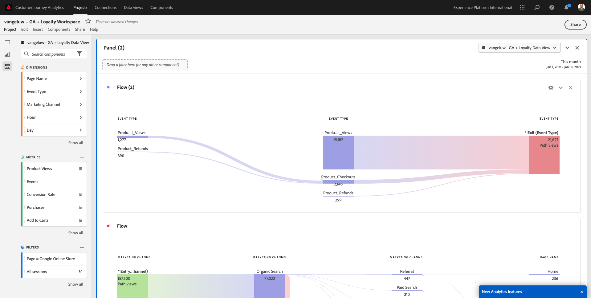

Lasst uns weiter analysieren! Suchen Sie die Dimension **Seitenname** und ziehen Sie sie in den neuen generierten Pfad.

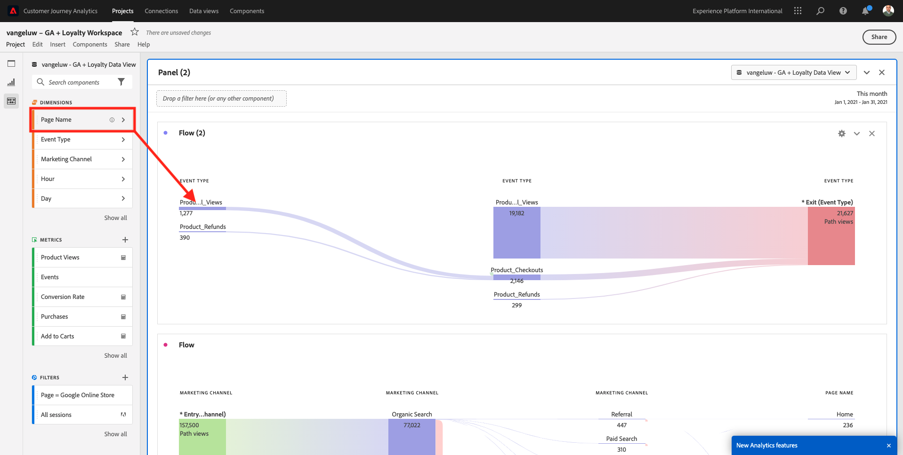

Sie haben jetzt eine erweiterte Flussanalyse in Minutenschnelle durchgeführt. Sie können auf die verschiedenen Pfade klicken, um zu sehen, wie sie sich vom Ausstieg zu den vorherigen Schritten verbinden.

Sie verfügen jetzt über ein leistungsstarkes Kit, um Trichter zu analysieren und Wege des Kundenverhaltens über digitale, aber auch Offline-Touchpoints zu untersuchen.

Vergiss nicht, deine Änderungen zu speichern!

## 4.2.5.4 Projekt freigeben

>[!IMPORTANT]
>
>Der folgende Inhalt ist als FYI gedacht - Sie müssen Ihr Projekt **NOT** für andere freigeben.

FYI - Sie können dieses Projekt mit Kollegen teilen, um zusammenzuarbeiten oder Geschäftsfragen gemeinsam zu analysieren.

Nächster Schritt: [Zusammenfassung und Vorteile](./summary.md)

[Zurück zu Modul 4.2](./customer-journey-analytics-bigquery-gcp.md)

[Zu allen Modulen zurückkehren](./../../../overview.md)
