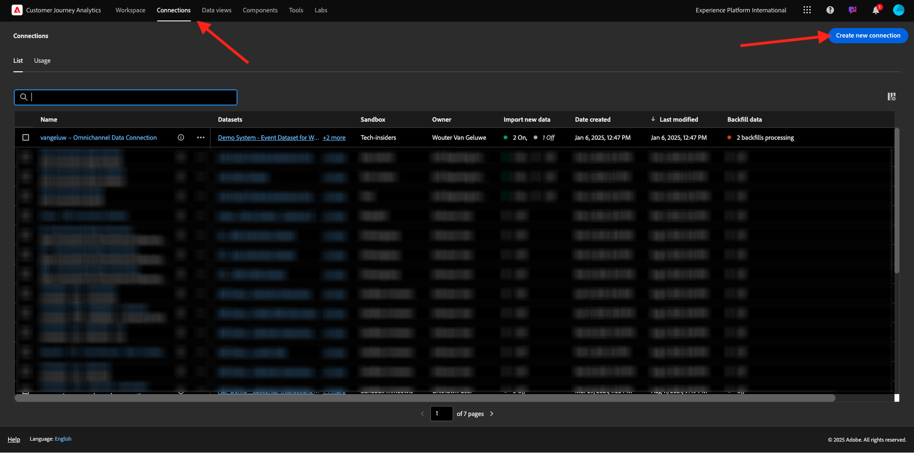
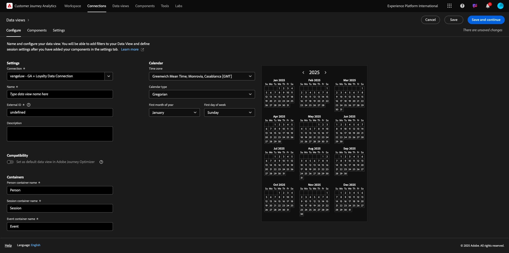
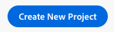
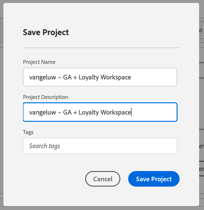
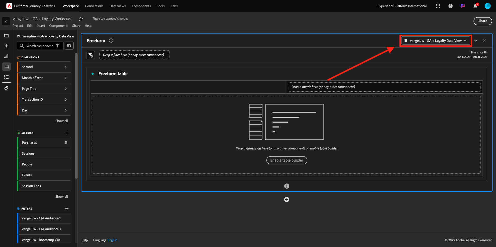
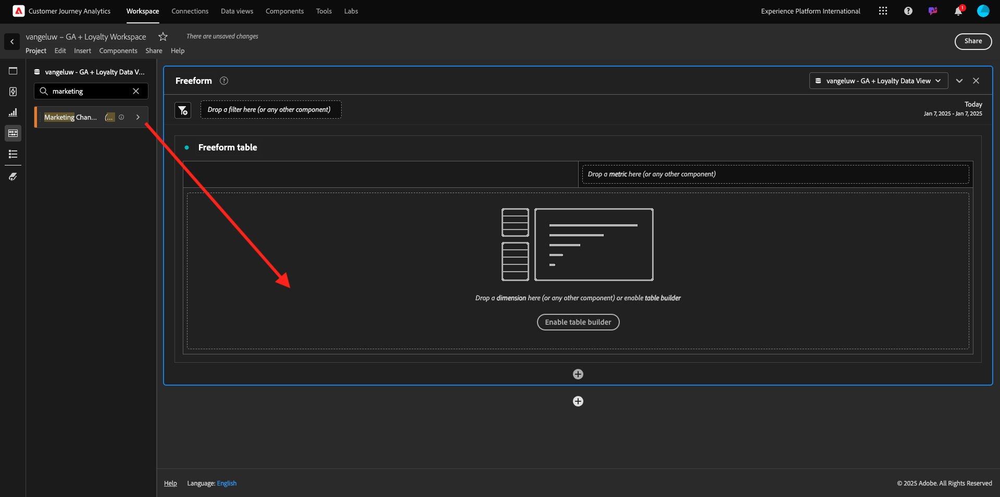
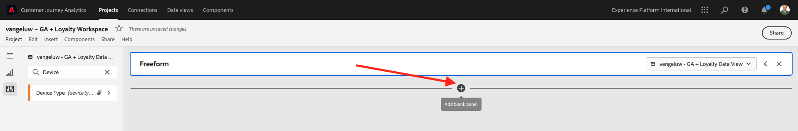
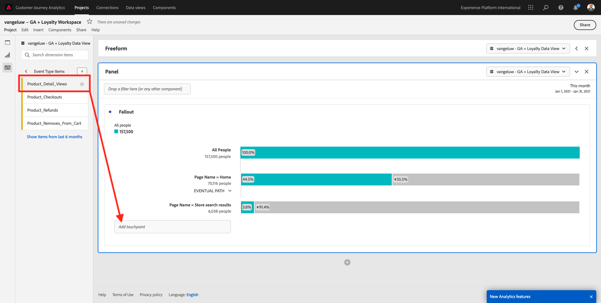
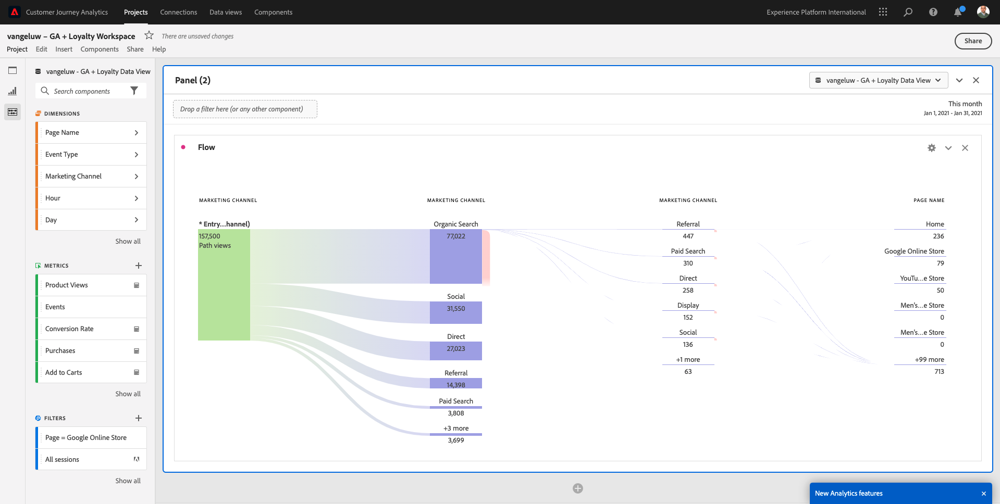
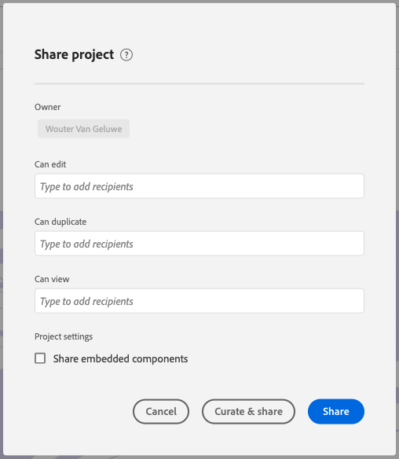

# 4.2.5 Analysieren von Google Analytics-Daten mit Customer Journey Analytics

## Ziele

- Verbinden Ihres BigQuery-Datensatzes mit Customer Journey Analytics (CJA)
- Treuedaten verbinden und Google Analytics beitreten
- Kennenlernen der CJA-Benutzeroberfläche

## 4.2.5.1 Verbindung herstellen

Navigieren Sie zu [analytics.adobe.com](https://analytics.adobe.com), um auf Customer Journey Analytics zuzugreifen.

Gehen Sie auf der Customer Journey Analytics-Homepage zu **Verbindungen**.

Hier können Sie die verschiedenen Verbindungen sehen, die zwischen CJA und Platform hergestellt wurden. Diese Verbindungen verfolgen dasselbe Ziel wie Report Suites in Adobe Analytics. Die Erfassung der Daten ist jedoch völlig anders. Alle Daten stammen aus Adobe Experience Platform-Datensätzen.

Klicken Sie **Neue Verbindung erstellen**.

Anschließend wird die Benutzeroberfläche **Verbindung erstellen** angezeigt.

Verwenden Sie für den Namen Folgendes: `--aepUserLdap-- - GA + Loyalty Data Connection`.

Sie müssen die richtige zu verwendende Sandbox auswählen. Wählen Sie im Menü Sandbox Ihre Sandbox aus, die `--aepSandboxName--` werden soll. In diesem Beispiel ist die zu verwendende Sandbox **Tech Insiders**.

Legen Sie die **durchschnittliche Anzahl der täglichen Ereignisse** auf **weniger als 1 Million** fest.

Im Menü Datensatz können Sie jetzt mit dem Hinzufügen von Datensätzen beginnen. Klicken Sie **Datensätze hinzufügen**.

Die hinzuzufügenden Datensätze sind:
- `Demo System - Profile Dataset for CRM (Global v1.1)`
- `Demo System - Event Dataset for BigQuery (Global v1.1)`

Suchen Sie nach beiden Datensätzen, aktivieren Sie deren Kontrollkästchen und klicken Sie dann auf **Weiter**.

Sie sehen dann Folgendes:

Ändern Sie für den `Demo System - Event Dataset for BigQuery (Global v1.1)` die **Personen-ID** in **loyaltyId** und setzen Sie den **Datenquellentyp** auf **Web-Daten**. Aktivieren Sie beide Optionen für **Alle neuen Daten importieren** und **Alle vorhandenen Daten aufstocken**.

Stellen Sie für die `Demo System - Event Dataset for BigQuery (Global v1.1)` sicher, dass **Personen-ID** auf **crmId** gesetzt ist, und setzen Sie **Datenquellentyp** auf **Web-Daten**. Aktivieren Sie beide Optionen für **Alle neuen Daten importieren** und **Alle vorhandenen Daten aufstocken**. Klicken Sie **Datensätze hinzufügen**.

Dann bist du hier. Klicken Sie auf **Speichern**.

Nachdem Sie Ihre **Verbindung** erstellt haben, kann es einige Stunden dauern, bis Ihre Daten in CJA verfügbar sind.

Anschließend wird Ihre Verbindung in der Liste der verfügbaren Verbindungen angezeigt.

## 4.2.5.2 Datenansicht erstellen

Nachdem Sie Ihre Verbindung hergestellt haben, können Sie jetzt mit der Beeinflussung der Visualisierung fortfahren. Ein Unterschied zwischen Adobe Analytics und CJA besteht darin, dass CJA eine Datenansicht benötigt, um die Daten vor der Visualisierung zu bereinigen und vorzubereiten.

Eine Datenansicht ähnelt dem Konzept von Virtual Report Suites in Adobe Analytics, wo Sie kontextabhängige Besuchsdefinitionen, Filter und auch die Aufrufart der Komponenten definieren.

Es wird mindestens eine Datenansicht pro Verbindung benötigt. In einigen Anwendungsfällen ist es jedoch von Vorteil, mehrere Datenansichten für dieselbe Verbindung zu haben, mit dem Ziel, verschiedenen Teams unterschiedliche Einblicke zu gewähren.

Wenn Sie möchten, dass Ihr Unternehmen datengesteuert wird, sollten Sie anpassen, wie Daten in jedem Team angezeigt werden. Einige Beispiele:

- UX-Metriken nur für das UX-Design-Team
- Verwenden Sie für KPIs und Metriken für Google Analytics dieselben Namen wie für Customer Journey Analytics, damit das Digital-Analytics-Team nur eine Sprache sprechen kann.
- Die Datenansicht wurde gefiltert, um beispielsweise Daten nur für einen Markt, eine Marke oder nur für Mobilgeräte anzuzeigen.

Aktivieren **auf dem Bildschirm** Verbindungen“ das Kontrollkästchen vor der soeben erstellten Verbindung. Klicken Sie **Datenansicht erstellen**.

Sie werden zum Workflow **Datenansicht erstellen“**.

Jetzt können Sie die grundlegenden Definitionen für Ihre Datenansicht konfigurieren. Dinge wie Zeitzone, Sitzungs-Timeout oder die Filterung der Datenansicht (der Segmentierungsteil ähnelt Virtual Report Suites in Adobe Analytics).

Die **Verbindung** die Sie in der vorherigen Übung erstellt haben, ist bereits ausgewählt. Ihre Verbindung heißt `--aepUserLdap-- - GA + Loyalty Data Connection`.

Geben Sie als Nächstes Ihrer Datenansicht einen Namen, der dieser Namenskonvention folgt: `--aepUserLdap-- - GA + Loyalty Data View`.

Geben Sie denselben Wert für die Beschreibung ein: `--aepUserLdap-- - GA + Loyalty Data View`.

Bevor wir eine Analyse oder Visualisierung durchführen können, müssen wir eine Datenansicht mit allen Feldern, Dimensionen und Metriken und ihren Attributionseinstellungen erstellen.

| Feld | Namenskonvention |
| ----------------- |-------------|  
| Name der Verbindung | `--aepUserLdap-- - GA + Loyalty Data View` | Vangeluw - GA- und Treueprogramm-Datenansicht |
| Beschreibung | `--aepUserLdap-- - GA + Loyalty Data View` |
| Externe ID | `--aepUserLdap--GA` |

Klicken Sie **Speichern und fortfahren**.

Sie können jetzt Komponenten zu Ihrer Datenansicht hinzufügen. Wie Sie sehen können, werden einige Metriken und Dimensionen automatisch hinzugefügt.

Fügen Sie der Datenansicht die folgenden Komponenten hinzu:

| Name der Komponente | Komponententyp | Komponentenpfad |
| -----------------|-----------------|-----------------|
| Ebene | Dimension | _experienceplatform.loyaltyDetails.level |
| Punkte | Metrik | _experienceplatform.loyaltyDetails.points |
| commerce.checkouts.value | Metrik | commerce.checkouts.value |
| commerce.productListRemovals.value | Metrik | commerce.productListRemovals.value |
| commerce.productListAdds | Metrik | commerce.productListAdds |
| commerce.productViews.value | Metrik | commerce.productViews.value |
| commerce.purchases.value | Metrik | commerce.purchases.value |
| web.webPageDetails.pageViews | Metrik | web.webPageDetails.pageViews |
| Transaction ID | Dimension | commerce.order.payments.transactionID |
| channel.mediaType | Dimension | channel.mediaType |
| channel.typeAtSource | Dimension | channel.typeAtSource |
| Trackingcode | Dimension | marketing.trackingCode |
| GAID | Dimension | _experienceplatform.identification.core.gaid |
| web.webPageDetails.name | Dimension | web.webPageDetails.name |
| Ereignistyp | Dimension | eventType |
| Anbieter | Dimension | environment.browserDetails.vendor |
| Kennung | Dimension | _id |
| Zeitstempel | Dimension | Zeitstempel |
| Typ | Dimension | device.type |
| LoyaltyId | Dimension | _experienceplatform.identification.core.loyaltyId |

Sie erhalten dann Folgendes:

Als Nächstes müssen Sie den Anzeigenamen einiger der oben genannten Metriken und Dimensionen ändern, damit Sie sie beim Erstellen Ihrer Analyse einfach verwenden können. Wählen Sie dazu die Metrik oder Dimension aus und aktualisieren Sie das Feld **Name** wie in der folgenden Abbildung dargestellt.

| Ursprünglicher Komponentenname | Anzeigename |
| -----------------|-----------------|
| Ebene | Treuestufe |
| Punkte | Treuepunkte |
| commerce.checkouts.value | Checkouts |
| commerce.productListRemovals.value | Entnahmen aus Warenkorb |
| commerce.productListAdds | Hinzufügen zum Warenkorb |
| commerce.productViews.value | Produktansichten |
| commerce.purchases.value | Käufe |
| web.webPageDetails.pageViews | Seitenansichten |
| channel.mediaType | Traffic Medium |
| channel.typeAtSource | Traffic-Quelle |
| Trackingcode | Marketing-Kanal |
| GAID | Google Analytics-ID |
| Name | Seitentitel |
| Anbieter | Browser |
| Typ | Device Type |
| LoyaltyId | Treue-ID |

Sie erhalten dann etwas wie das Folgende:

Als Nächstes müssen Sie einige Änderungen am Personen- und Sitzungskontext für einige dieser Komponenten vornehmen, indem Sie die &quot;**&quot;**.

Ändern Sie die **Attributionseinstellungen** für die folgenden Komponenten:

| Komponente |
| -----------------|
| Traffic-Quelle |
| Marketing-Kanal |
| Browser |
| Traffic Medium |
| Device Type |
| Google Analytics-ID |
| Treue-ID |
| Treuestufe |
| Treuepunkte |

Wählen Sie dazu die Komponente aus, klicken Sie auf **Benutzerdefiniertes Attributionsmodell verwenden** und legen Sie **Modell** auf **Letztkontakt** und **Gültigkeit** auf **Person (Reporting-Fenster)**. Wiederholen Sie dies für alle oben genannten Komponenten.

Nachdem Sie die Änderungen an den Attributionseinstellungen für alle oben genannten Komponenten vorgenommen haben, sollten Sie diese Ansicht haben:

Ihre Datenansicht ist jetzt konfiguriert. Klicken Sie auf **Speichern**.

Sie können jetzt die Daten von Google Analytics in Adobe Analytics Analysis Workspace analysieren. Gehen wir zur nächsten Übung über.

## 4.2.5.3 Erstellen eines Projekts

Gehen Sie in Customer Journey Analytics zu **Projekte**.

Sie sehen dann Folgendes:

Erstellen Sie ein Projekt, indem **Neues Projekt erstellen** klicken.

Sie haben jetzt ein leeres Projekt:

Speichern Sie zunächst Ihr Projekt und geben Sie ihm einen Namen. Sie können den folgenden Befehl verwenden, um zu speichern:

| Betriebssystem | Abkürzung |
| ----------------- |-------------| 
| Windows | Strg+S |
| Mac | Befehl + S |

Daraufhin wird dieses Popup angezeigt:

Bitte diese Namenskonvention verwenden:

| Name | Beschreibung |
| ----------------- |-------------| 
| LDAP - GA + Loyalty Workspace | LDAP - GA + Loyalty Workspace |

Klicken Sie anschließend auf **Projekt speichern**.

Wählen Sie anschließend die richtige Datenansicht in der oberen rechten Ecke Ihres Bildschirms aus. Dies ist die Datenansicht, die Sie in der vorherigen Übung erstellt haben, mit der `ldap - GA + Loyalty Data View` der Namenskonvention. In diesem Beispiel ist die auszuwählende Datenansicht `ldap - GA + Loyalty Data View`.

### 12.5.3.1 Freiformtabellen

Freiformtabellen funktionieren mehr oder weniger als Pivot-Tabellen in Excel. Sie wählen etwas aus der linken Leiste aus, ziehen es in die Freiform und Sie erhalten einen Tabellenbericht.

Freiformtabellen sind nahezu unbegrenzt. Sie können (fast) alles tun, und das bringt so viel Wert im Vergleich zu Google Analytics (da dieses Tool einige Analyseeinschränkungen hat). Dies ist einer der Gründe dafür, Google Analytics-Daten in ein anderes Analyse-Tool zu laden.

Nachfolgend sehen Sie zwei Beispiele, in denen Sie SQL, BigQuery und einige Zeit benötigen, um einfache Fragen zu beantworten, die in der Google Analytics-Benutzeroberfläche oder in Google Data Studio nicht möglich sind:

- Wie viele Personen gelangen zur Kasse über den Safari-Browser, aufgeteilt nach Marketing-Kanal? Beachten Sie, dass die Checkout-Metrik vom Safari-Browser gefiltert wird. Wir haben gerade die Variable Browser = Safari auf die Checkout-Spalte gezogen und dort abgelegt.

- Als Analyst kann ich sehen, dass der Social-Media-Marketing-Kanal niedrige Konversionen hat. Ich verwende die Attribution Letztkontakt als Standard, aber wie sieht es mit Erstkontakt aus? Wenn Sie den Mauszeiger über eine beliebige Metrik bewegen, werden die Metrikeinstellungen angezeigt. Dort kann ich das gewünschte Attributionsmodell auswählen. Sie können die Attribution in GA (nicht in Data Studio) als eigenständige Aktivität durchführen, aber Sie können nicht andere Metriken oder Dimensionen innerhalb derselben Tabelle haben, die nicht mit der Attributionsanalyse verbunden sind.

Beantworten wir diese und einige weitere Fragen mit Analysis Workspace in CJA.

Wählen Sie zunächst den rechten Datumsbereich (**Letzte 53 volle Wochen**) auf der rechten Seite des Bedienfelds aus.

Klicken Sie anschließend **Anwenden**, um den Datumsbereich anzuwenden. Merken Sie sich diesen Schritt für die nächsten Übungen.

>[!NOTE]
>
>Wenn Sie gerade die **Datenverbindung** und **Datenansicht** erstellt haben, müssen Sie möglicherweise einige Stunden warten. CJA benötigt etwas Zeit, um historische Daten aufzustocken, wenn eine große Menge an Datensätzen vorhanden ist.

Ziehen wir einige Dimensionen und Metriken per Drag-and-Drop in die Analyse der Marketing-Kanäle. Verwenden Sie zunächst die Dimension **Marketing-**) und ziehen Sie sie per Drag-and-Drop auf die Arbeitsfläche der **Freiformtabelle**. (Klicken Sie auf **Alle anzeigen** falls Sie die Metrik nicht sofort im Menü Metriken sehen)

Sie sehen dann Folgendes:

Als Nächstes müssen Sie die Metriken zur Freiformtabelle hinzufügen. Sie sollten diese Metriken hinzufügen: **Personen**, **Sitzungen**, **Produktansichten**, **Checkouts**, **Käufe**, **Konversionsrate** (berechnete Metrik).

Bevor Sie dies tun können, müssen Sie die berechnete Metrik **Konversionsrate)**. Klicken Sie dazu auf das Symbol **+** neben Metriken:

Verwenden Sie als Namen für die berechnete Metrik **Konversionsrate**. Ziehen Sie dann die Metriken **Kauf** und **Sitzungen** auf die Arbeitsfläche. Legen Sie **Format** auf **Prozent** und **Dezimalstellen** auf **2** fest. Klicken Sie abschließend auf **Speichern**.

Als Nächstes sollten Sie alle diese Metriken in der **Freiformtabelle** einzeln per Drag-and-Drop auf die **Freiformtabelle** ziehen. Siehe folgendes Beispiel.

Am Ende haben Sie so einen Tisch:

Wie bereits erwähnt **bieten Ihnen** Freiformtabellen die Freiheit, die Sie für eine umfassende Analyse benötigen. Sie können beispielsweise eine beliebige andere Dimension auswählen, um eine bestimmte Metrik in der Tabelle aufzuschlüsseln.

Gehen Sie beispielsweise zu Dimensionen und suchen Sie die Variable **Browser** und wählen Sie sie aus.

Anschließend sehen Sie eine Übersicht der verfügbaren Werte für diese Dimension.

Wählen Sie die Dimension **Safari** und ziehen Sie sie per Drag-and-Drop auf eine Metrik, z. B **„Checkouts**. Sie sehen dann Folgendes:

Auf diese Weise haben Sie gerade eine potenzielle Frage beantwortet, die Sie hatten: Wie viele Personen gelangen mithilfe von Safari zur Checkout-Seite, aufgeteilt nach Marketing-Kanal?

Beantworten wir nun die Frage der Attribution .

Suchen Sie die **Kauf** in der Tabelle.

Bewegen Sie den Mauszeiger über die Metrik **und ein Symbol** Einstellungen“ wird angezeigt. Klicken Sie darauf.

Ein Kontextmenü wird angezeigt. Aktivieren Sie das Kontrollkästchen für **nicht standardmäßiges Attributionsmodell**.

Im Popup, das angezeigt wird, können Sie die Attributionsmodelle und das Lookback-Fenster (was mit SQL ziemlich komplex zu erreichen ist) einfach ändern.

Wählen Sie **Erstkontakt** als Attributionsmodell aus.

Wählen Sie **Person** für das Lookback-Fenster aus.

Klicken Sie jetzt **Apply**.

Sie können jetzt sehen, dass das Attributionsmodell für diese bestimmte Metrik jetzt Erstkontakt ist.

Sie können beliebig viele Aufschlüsselungen durchführen, ohne die Typen von Variablen, Segmenten, Dimensionen oder Datumsbereichen zu begrenzen.

Noch spezieller ist die Möglichkeit, einen beliebigen Datensatz aus Adobe Experience Platform zu verbinden, um die digitalen Verhaltensdaten von Google Analytics anzureichern. Beispielsweise offline, Callcenter, Treueprogramm oder CRM-Daten.

Um diese Funktion zu präsentieren, konfigurieren wir Ihre erste Aufschlüsselung, die Offline-Daten mit Online-Daten kombiniert. Wählen Sie die Dimension **Treuestufe** und ziehen Sie sie per Drag-and-Drop auf einen **Marketing-Kanal**, z. B. **Organische Suche**:

Als Nächstes analysieren wir, welcher **Gerätetyp** von Kunden verwendet wird, die mit der **organischen Suche** mit einem **Treuestufe**, nämlich **Bronze**, auf die Website gekommen sind. Nehmen Sie die Dimension **Gerätetyp** und ziehen Sie sie per Drag-and-Drop auf **Bronze**. Sie sehen dann Folgendes:

Sie können sehen, dass für Ihre erste Aufschlüsselung die Treuestufe verwendet wird. Diese Dimension stammt aus einem anderen Datensatz und einem anderen Schema als dem, das Sie für den BigQuery-Connector verwendet haben. Die Personen-ID **loyaltyID** (Demosystem - Ereignisschema für BigQuery (Global v1.1)) und **loyaltyID** (Demosystem - Profilschema für Treue (Global v1.1)) stimmen überein. Daher können Sie Erlebnisereignisse von Google Analytics mit Profildaten aus dem Treueschema kombinieren.

Wir können die Zeilen nach Segmenten oder bestimmten Datumsbereichen aufteilen (möglicherweise um bestimmte TV-Kampagnen widerzuspiegeln), um Fragen an Customer Journey Analytics zu stellen und die Antworten unterwegs zu erhalten.

Dasselbe Endergebnis mit SQL und einem Visualisierungs-Tool von Drittanbietern zu erreichen, ist eine ziemliche Herausforderung. Besonders, wenn man Fragen stellt und versucht, Antworten im Flug zu bekommen. Customer Journey Analytics stellt diese Herausforderung nicht dar und ermöglicht es Datenanalysten, die Daten flexibel und in Echtzeit abzufragen.

## 4.2.5.3.2 Trichter- oder Fallout-Analyse

Trichter eignen sich hervorragend, um die wichtigsten Schritte auf einer Kunden-Journey zu verstehen. Diese Schritte können auch aus Offline-Interaktionen stammen (z. B. vom Callcenter) und dann mit digitalen Touchpoints im selben Trichter kombiniert werden.

Mit Customer Journey Analytics kann man das und vieles mehr. Wenn Sie sich an Modul 13 erinnern, können wir mit der rechten Maustaste klicken und folgende Dinge tun:

- Analysieren, wo die Benutzer nach einem Fallout-Schritt navigieren
- Erstellen eines Segments aus einem beliebigen Punkt des Trichters
- Den Trend in einem beliebigen Stadium in einer Liniendiagramm-Visualisierung anzeigen

Sehen wir uns eine andere Sache an, die Sie tun können: Wie ist mein Kunde Journey Funnel diesen Monat im Vergleich zum Vormonat? Was ist mit Mobile vs. Desktop?

Nachfolgend werden zwei Bedienfelder erstellt:

- Trichteranalyse (Januar)
- Trichteranalyse (Februar)

Sie werden sehen, dass wir einen Trichter über verschiedene Zeiträume (Januar und Februar) vergleichen, aufgeteilt nach Gerätetyp.

Diese Art der Analyse ist in der Benutzeroberfläche von Google Analytics nicht möglich oder sehr eingeschränkt. CJA fügt also wieder viel Wert zu den von Google Analytics erfassten Daten hinzu.

So erstellen Sie Ihre erste Fallout-Visualisierung: Bitte das aktuelle Panel schließen, um mit einem neuen zu beginnen.

Sehen Sie sich die rechte Seite des Bedienfelds an und klicken Sie auf den Pfeil, um es zu schließen.

Klicken Sie anschließend auf **+**, um ein neues Bedienfeld zu erstellen.

Wählen Sie jetzt die **Fallout**-Visualisierung aus.

Analysten können sich vorstellen, dass Sie verstehen möchten, was mit Ihrem Haupt-E-Commerce-Trichter passiert: Startseite > Interne Suche > Produktdetails > Checkout > Kauf.

Beginnen wir mit dem Hinzufügen einiger neuer Schritte zum Trichter. Öffnen Sie dazu die Dimension **Seitenname** .

Anschließend werden alle verfügbaren Seiten angezeigt, die besucht wurden.

Ziehen Sie **Home** per Drag-and-Drop in den ersten Schritt.

Verwenden Sie im zweiten Schritt **Suchergebnisse speichern**

Jetzt müssen Sie einige E-Commerce-Aktionen hinzufügen. Suchen Sie in den Dimensionen nach der Dimension Dimension **Ereignistyp** . Klicken, um die Dimension zu öffnen.

Wählen Sie **product_detail_views** aus und ziehen Sie es per Drag-and-Drop in den nächsten Schritt.

Wählen Sie **product_checkouts** aus und ziehen Sie es per Drag-and-Drop in den nächsten Schritt.

Ändern der Größe der Fallout-Visualisierung.

Ihre Fallout-Visualisierung ist jetzt bereit.

Um mit der Analyse und Dokumentation der Einblicke zu beginnen, ist es immer eine gute Idee, eine **Text**-Visualisierung zu erstellen. Um eine **Text**-Visualisierung hinzuzufügen, klicken Sie auf das **Diagramm**-Symbol im linken Menü, um alle verfügbaren Visualisierungen anzuzeigen. Ziehen Sie dann die Visualisierung **Text** per Drag-and-Drop auf die Arbeitsfläche. Ändern Sie die Größe und verschieben Sie sie so, dass sie wie die Abbildung unten aussieht.

Ändern Sie die Größe erneut, um sie an das Dashboard anzupassen:

Fallout-Visualisierungen ermöglichen auch Aufschlüsselungen. Verwenden Sie die Dimension **Gerätetyp**, indem Sie sie öffnen und einige der Werte einzeln auf die Visualisierung ziehen:

Zum Schluss erhalten Sie eine erweiterte Visualisierung:

Mit Customer Journey Analytics kann man das und vieles mehr. Wenn Sie mit der rechten Maustaste auf eine beliebige Stelle im Fallout klicken, können Sie…

- Analysieren, wohin die Benutzer von einem Fallout-Schritt gehen
- Erstellen eines Segments aus einem beliebigen Punkt des Trichters
- Trennen beliebiger Schritte in einer Linienvisualisierung
- Vergleichen Sie auf visuelle Weise einen beliebigen Trichter mit verschiedenen Zeiträumen.

Klicken Sie beispielsweise mit der rechten Maustaste auf einen beliebigen Schritt des Fallouts, um einige dieser Analyseoptionen anzuzeigen.

## 4.2.5.3.3 Flussanalyse und Visualisierung

Wenn Sie eine erweiterte Flussanalyse mit Google Analytics durchführen möchten, müssen Sie SQL verwenden, um die Daten zu extrahieren, und dann eine Drittanbieterlösung für den Visualisierungsteil verwenden. Customer Journey Analytics wird dabei helfen.

In diesem Schritt konfigurieren Sie eine Flussanalyse, um die folgende Frage zu beantworten: Was sind die wichtigsten Kanäle, die vor einer bestimmten Landingpage beitragen?  Mit zwei Drag-and-Drop-Aktionen und einem Klick können Sie als Analyst den Fluss der Benutzenden zur Landingpage mit den beiden letzten Berührungen der Marketing-Kanäle erkennen.

Andere Fragen, die Customer Journey Analytics Ihnen beantworten kann:

- Was ist die Hauptkombination von Kanälen vor einer bestimmten Landingpage?
- Was führt dazu, dass ein Benutzer die Sitzung beendet, wenn er/sie zum Produkt-Checkout gelangt? Wo sind die vorherigen Schritte?

Beginnen wir mit einem leeren Bedienfeld, das diese Fragen beantwortet. Schließen Sie den aktuellen Bereich und klicken Sie auf **+**.

Wählen Sie jetzt die Visualisierung **Fluss** aus.

Richten wir jetzt eine kanalübergreifende Marketing-Kanal-Flussanalyse ein. Ziehen Sie die Dimension **Marketing-Kanal** in den Bereich **Einstiegs-Dimensionen**.

Die ersten Einstiegspfade werden nun angezeigt:

Klicken Sie auf den ersten Pfad, um einen Drilldown durchzuführen.

Sie können jetzt den nächsten Pfad (Marketing-Kanal) sehen.

Machen wir noch eine dritte Aufschlüsselung. Klicken Sie auf die erste Option im neuen Pfad **Verweis**.

Jetzt sollte die Visualisierung wie folgt aussehen:

Lasst uns die Dinge verkomplizieren. Angenommen, Sie möchten analysieren, was die Landingpage nach zwei Marketing-Pfaden war? Dazu können Sie eine sekundäre Dimension verwenden, um den letzten Pfad zu ändern. Suchen Sie die Dimension **Seitenname** und ziehen Sie sie wie folgt per Drag-and-Drop hinüber:

Sie sehen dies jetzt:

Führen wir eine weitere Flussanalyse durch. Dieses Mal werden Sie analysieren, was nach einem bestimmten Ausgangspunkt passiert ist. Andere Analytics-Lösungen erfordern die Verwendung von SQL/ETL und ein Visualisierungs-Tool von Drittanbietern, um dasselbe zu erreichen.

Bringen Sie eine neue **Flussvisualisierung** in das Bedienfeld.

Sie erhalten dann Folgendes:

Suchen Sie die Dimension **Ereignistyp** und ziehen Sie sie per Drag-and-Drop in den Bereich **Dimension**.

Jetzt können Sie sehen, welche **Ereignistyp**-Pfade Kunden zum Ausgang geführt haben.

Lassen Sie uns untersuchen, was vor dem Beenden der Checkout-Aktion passiert ist. Klicken Sie auf den Pfad **product_checkouts**:

Ein neuer Aktionspfad wird mit Daten angezeigt, die nicht aufschlussreich sind.

Lassen Sie uns das näher analysieren! Suchen Sie die Dimension **Seitenname** und ziehen Sie sie per Drag-and-Drop in den neu generierten Pfad.

Sie haben jetzt in Minuten eine erweiterte Flussanalyse durchgeführt. Sie können auf die verschiedenen Pfade klicken, um zu sehen, wie sie eine Verbindung vom Ausgang zu den vorherigen Schritten herstellen.

Sie verfügen jetzt über ein leistungsstarkes Kit, um Trichter zu analysieren und Kundenverhaltenspfade über digitale, aber auch Offline-Touchpoints hinweg zu erkunden.

Vergessen Sie nicht, Ihre Änderungen zu speichern!

## Projekt freigeben 4.2.5.4

>[!IMPORTANT]
>
>Die folgenden Inhalte sind als Informationen zu Informationszwecken gedacht - Sie **Ihr Projekt** für andere freigeben.

Zu Ihrer Information: Sie können dieses Projekt mit Kollegen teilen, um geschäftliche Fragen gemeinsam zu bearbeiten oder zu analysieren.

Nächster Schritt: [Zusammenfassung und Vorteile](./summary.md)

[Zurück zum Modul 4.2](./customer-journey-analytics-bigquery-gcp.md)

[Zurück zu „Alle Module“](./../../../overview.md)
