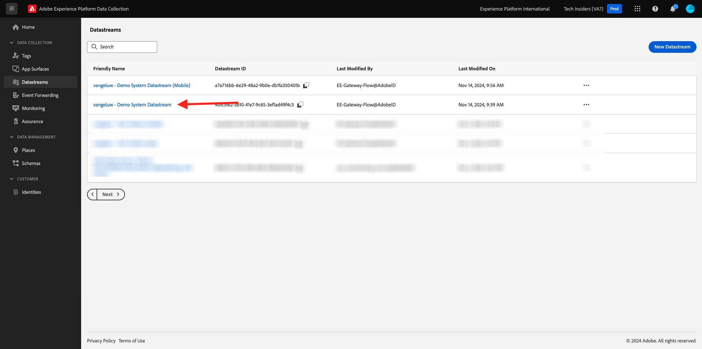
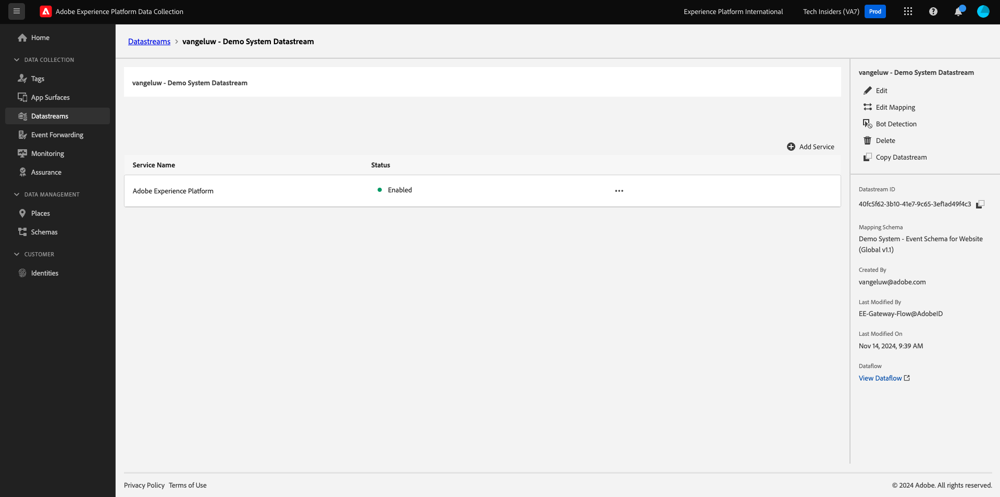
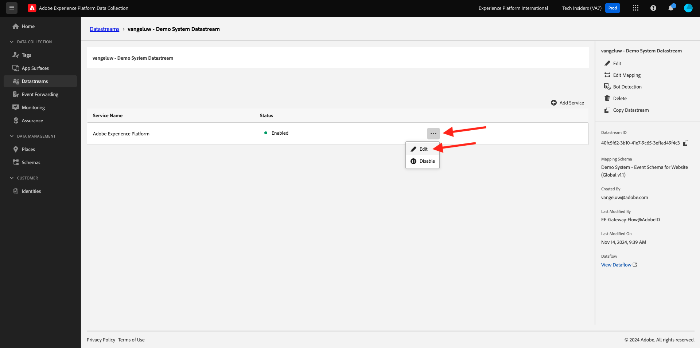

# 1.1.2 Edge Network-, Datenspeicher und serverseitige Datenerfassung

## Kontext

In dieser Übung erstellen Sie einen **Datastream**. Ein **Datastream** gibt den Adobe Edge-Servern an, wohin die Daten gesendet werden sollen, nachdem sie vom Web SDK erfasst wurden. Möchten Sie beispielsweise die Daten an Adobe Experience Platform senden? Adobe Analytics? Adobe Audience Manager? Adobe Target?

Datenspeicher werden immer in der Benutzeroberfläche der Adobe Experience Platform-Datenerfassung verwaltet und sind für die Adobe Experience Platform-Datenerfassung mit dem Web SDK von entscheidender Bedeutung. Selbst wenn Sie das Web SDK mit einer Nicht-Adobe-Tag-Management-Lösung implementieren, müssen Sie Ihren Datastream weiterhin in der Benutzeroberfläche der Adobe Experience Platform-Datenerfassung erstellen.

Sie werden das Web SDK in der nächsten Übung im Browser implementieren. Dann wird Ihnen klarer sein, wie die erfassten Daten aussehen. Zunächst teilen wir dem Datastream nur mit, wohin die Daten weitergeleitet werden sollen.

## Erstellen eines Datenspeichers

In [Übung 0.2](./../../../modules/gettingstarted/gettingstarted/ex2.md) haben Sie bereits einen Datastream erstellt, aber wir haben nicht den Hintergrund und den Grund für die Verwendung des Datastreams besprochen.

Ein Datastream teilt den Adobe Edge-Servern mit, wohin die Daten gesendet werden sollen, nachdem sie vom Web SDK erfasst wurden. Möchten Sie beispielsweise die Daten an Adobe Experience Platform senden? Adobe Analytics? Adobe Audience Manager? Adobe Target? Datenspeicher werden in der Benutzeroberfläche der Adobe Experience Platform-Datenerfassung verwaltet und sind für die Platform-Datenerfassung mit dem Web SDK von entscheidender Bedeutung, unabhängig davon, ob Sie das Web SDK über die Adobe Experience Platform-Datenerfassung implementieren oder nicht.

Sehen wir uns Ihren **[!UICONTROL Datastream]** an:

Wechseln Sie zu [https://experience.adobe.com/launch/](https://experience.adobe.com/launch/).

Klicken Sie im linken Menü auf **[!UICONTROL Datastreams]** oder **[!UICONTROL Datastreams (Beta)]** .

Suchen Sie nach Ihrem Datastream mit dem Namen `--aepUserLdap-- - Demo System Datastream`.

Sie sehen dann die Details Ihres Datastreams.

Klicken Sie auf **...** neben **Adobe Experience Platform** und klicken Sie auf **Bearbeiten**.

Dann wirst du das sehen. Derzeit haben Sie nur Adobe Experience Platform aktiviert. Ihre Konfiguration ähnelt der unten stehenden Konfiguration. (Je nach Umgebung und Adobe Experience Platform-Instanz kann der Sandbox-Name unterschiedlich sein.)

Sie sollten die folgenden Felder wie folgt interpretieren:

Für diesen Datastream ...

- Alle erfassten Daten werden in der Sandbox `--aepSandboxName--` in Adobe Experience Platform gespeichert
- Alle Erlebnisereignisdaten werden standardmäßig im Datensatz **Demo System - Ereignisdatensatz für Website (Global v1.1)** erfasst.
- Alle Profildaten werden standardmäßig im Datensatz &quot;**Demo System - Profildatensatz für Website&quot;(Global v1.1)**&quot;erfasst (die native Aufnahme von Profildaten mit dem Web SDK wird derzeit noch nicht vom Web SDK unterstützt und zu einem späteren Zeitpunkt bereitgestellt)
- Wenn Sie den Anwendungsdienst **Offer decisioning** für diesen Datastream verwenden möchten, müssen Sie das Kontrollkästchen zum Offer decisioning aktivieren. (Dies ist Teil von [Modul 3.3](./../../../modules/ajo-b2c/module3.3/offer-decisioning.md))
- Wenn Sie die **Edge-Segmentierung** verwenden möchten, müssen Sie das Kontrollkästchen für die Edge-Segmentierung aktivieren.
- Wenn Sie die **Personalization-Ziele** verwenden möchten, müssen Sie das Kontrollkästchen für Personalization-Ziele aktivieren.

Derzeit ist keine andere Konfiguration für Ihren Datastream erforderlich.

Nächster Schritt: [1.1.3 Einführung in die Adobe Experience Platform-Datenerfassung](./ex3.md)

[Zurück zu Modul 1.1](./data-ingestion-launch-web-sdk.md)

[Zu allen Modulen zurückkehren](./../../../overview.md)
