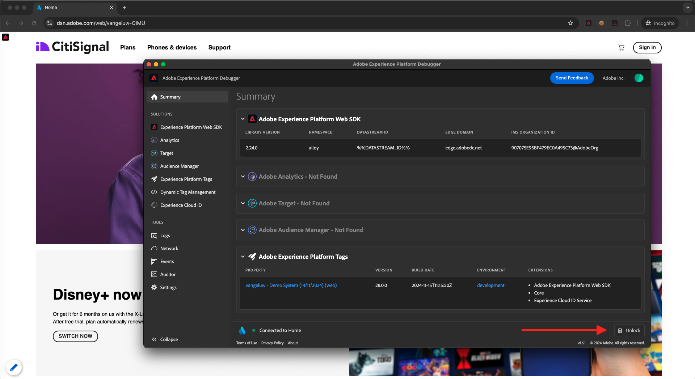

# 1.1.4 Clientseitige Web-Datenerfassung

## Überprüfen der Daten in der Anforderung

### Installieren des Adobe Experience Platform Debuggers

Der Experience Platform Debugger ist eine Erweiterung für Chrome- und Firefox-Browser, die Ihnen dabei hilft, die auf Ihren Webseiten implementierte Adobe-Technologie zu sehen. Installieren Sie die Version für Ihren bevorzugten Browser:

- [Firefox-Erweiterung](https://addons.mozilla.org/de/firefox/addon/adobe-experience-platform-dbg/)

- [Chrome-Erweiterung](https://chrome.google.com/webstore/detail/adobe-experience-platform/bfnnokhpnncpkdmbokanobigaccjkpob)

Wenn Sie den Debugger noch nie verwendet haben - und dieser von dem vorherigen Adobe Experience Cloud Debugger unterscheidet -, sollten Sie sich dieses fünfminütige Übersichtsvideo ansehen:

>[!VIDEO](https://video.tv.adobe.com/v/32156?quality=12&learn=on)

Da Sie die Demo-Website im Inkognito-Modus laden, müssen Sie sicherstellen, dass der Experience Platform Debugger auch im Inkognito-Modus verfügbar ist. Wechseln Sie dazu in Ihrem Browser zu **chrome://extensions** und öffnen Sie die Experience Platform Debugger-Erweiterung.

Stellen Sie sicher, dass diese beiden Einstellungen aktiviert sind:

- Entwicklermodus
- In Inkognito zulassen

### Öffnen Sie die Demowebsite

Wechseln Sie zu [https://dsn.adobe.com](https://dsn.adobe.com). Nach der Anmeldung bei Ihrer Adobe ID sehen Sie dies. Klicken Sie auf die drei Punkte **..** im Website-Projekt und dann auf **Ausführen** , um es zu öffnen.

Sie werden dann Ihre Demowebsite öffnen sehen. Wählen Sie die URL aus und kopieren Sie sie in die Zwischenablage.

Öffnen Sie ein neues Inkognito-Browserfenster.

Fügen Sie die URL Ihrer Demo-Website ein, die Sie im vorherigen Schritt kopiert haben. Sie werden dann aufgefordert, sich mit Ihrer Adobe ID anzumelden.

Wählen Sie Ihren Kontotyp aus und schließen Sie den Anmeldevorgang ab.

Sie sehen dann Ihre Website in einem Inkognito-Browser-Fenster geladen. Für jede Demonstration müssen Sie ein neues Inkognito-Browser-Fenster verwenden, um Ihre Demo-Website-URL zu laden.

### Verwenden Sie den Experience Platform Debugger, um die Aufrufe anzuzeigen, die an die Edge gesendet werden.

Stellen Sie sicher, dass die Demo-Website geöffnet ist, und klicken Sie auf das Symbol Experience Platform Debugger-Erweiterung .

Der Debugger wird geöffnet und zeigt die Details der Implementierung an, die in Ihrer Adobe Experience Platform-Datenerfassungseigenschaft erstellt wurde. Denken Sie daran, dass Sie die Erweiterung und die Regeln debuggen, die Sie gerade bearbeitet haben.

Klicken Sie oben rechts auf die Schaltfläche **[!UICONTROL Anmelden]** , um sich zu authentifizieren. Wenn Sie bereits über die Benutzeroberfläche zur Datenerfassung von Adobe Experience Platform eine Browser-Registerkarte geöffnet haben, wird der Authentifizierungsschritt automatisch durchgeführt und Sie müssen Ihren Benutzernamen und Ihr Kennwort nicht erneut eingeben.

Sie werden dann im Debugger angemeldet sein.

Drücken Sie die Schaltfläche Neu laden auf Ihrer Demo-Website, um den Debugger mit dieser Registerkarte zu verbinden.

Vergewissern Sie sich, dass der Debugger, wie oben dargestellt, &quot;**[!UICONTROL Verbindung zur Startseite&quot;]**&quot;ist, und klicken Sie dann auf das Symbol &quot;**[!UICONTROL Sperren]**&quot;, um den Debugger mit der Demowebsite zu sperren. Wenn Sie dies nicht tun, schaltet der Debugger weiter, um die Implementierungsdetails der Browser-Registerkarte anzuzeigen, die im Fokus ist, was verwirrend sein kann. Sobald der Debugger gesperrt ist, wird das Symbol in **Entsperren** geändert.

Navigieren Sie anschließend zu einer beliebigen Seite auf der Demowebsite, z. B. der Kategorieseite **Pläne** .

Klicken Sie nun im linken Navigationsbereich auf **[!UICONTROL Experience Platform Web SDK]** , um die **[!UICONTROL Netzwerkanforderungen]** anzuzeigen.

Jede Anforderung enthält eine Zeile **[!UICONTROL events]** .

Klicken Sie auf , um eine Zeile **[!UICONTROL events]** zu öffnen. Beachten Sie, wie Sie das Ereignis **web.webpageDetails.pageViews** sowie weitere native Variablen sehen können, die dem Format **Web SDK ExperienceEvent XDM** entsprechen.

Diese Arten von Anforderungsdetails sind auch auf der Registerkarte &quot;Netzwerk&quot;sichtbar. Filtern Sie nach Anforderungen mit **interact** , um die vom Web SDK gesendeten Anforderungen zu finden. Alle Details der XDM-Payload finden Sie im Abschnitt Payload :

Nächster Schritt: [1.1.5 Adobe Analytics und Adobe Audience Manager implementieren](./ex5.md)

[Zurück zu Modul 1.1](./data-ingestion-launch-web-sdk.md)

[Zu allen Modulen zurückkehren](./../../../overview.md)
