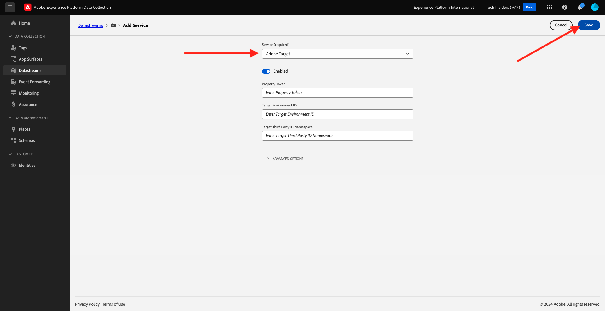

# 1.1.6 Adobe Target implementieren

## 1.1.6.1 Datenspeicher für die Verwendung von Adobe Target aktualisieren

Wenn Sie vom Web SDK erfasste Daten an Adobe Target senden und eine Antwort von Adobe Target mit einem personalisierten Erlebnis für jeden Kunden erhalten möchten, führen Sie die folgenden Schritte aus.

Wechseln Sie zu [https://experience.adobe.com/launch/](https://experience.adobe.com/launch/) und gehen Sie zu **Datastreams**.

Wählen Sie oben rechts auf Ihrem Bildschirm den Namen Ihrer Sandbox aus, der `--aepSandboxId--` lauten soll. Öffnen Sie Ihren spezifischen Datastream mit dem Namen `--demoProfileLdap-- - Demo System Datastream`.

Dann wirst du das sehen. Um Adobe Target zu aktivieren, klicken Sie auf **+Dienst hinzufügen**.

Dann wirst du das sehen. Wählen Sie den Dienst **Adobe Target** aus, nach dem Sie optional zusätzliche Informationen angeben können. Zum jetzigen Zeitpunkt muss dies nicht gespeichert werden. Klicken Sie daher auf **Abbrechen**.

Nächster Schritt: [1.1.7 XDM-Schema-Anforderungen in Adobe Experience Platform](./ex7.md)

[Zurück zu Modul 1.1](./data-ingestion-launch-web-sdk.md)

[Zu allen Modulen zurückkehren](./../../../overview.md)
