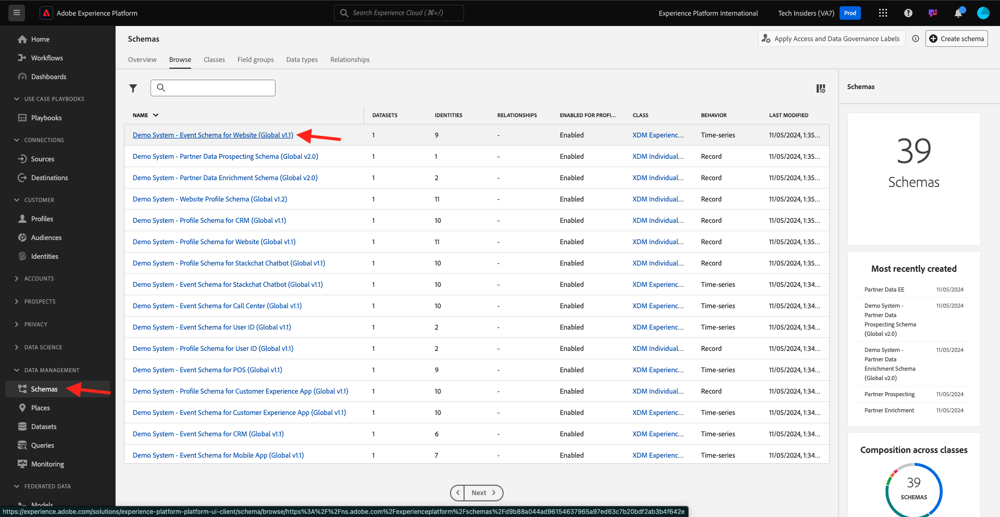

# 1.1.7 XDM-Schema-Anforderungen in Adobe Experience Platform

Um sicherzustellen, dass Web SDK und legierte.js Daten in Adobe Experience Platform erfassen können, muss ein bestimmtes XDM-Mixin zum XDM-Schema in Adobe Experience Platform gehören.

Gehen Sie zu [https://experience.adobe.com/platform](https://experience.adobe.com/platform) und melden Sie sich an.

Wählen Sie nach der Anmeldung die entsprechende Sandbox aus, indem Sie in der blauen Zeile oben auf Ihrem Bildschirm auf den Text **Produktions-Prod** klicken. Wählen Sie die Sandbox `--aepSandboxName--` aus.

Nachdem Sie Ihre Sandbox ausgewählt haben, sehen Sie die Bildschirmänderung und befinden sich jetzt in Ihrer Sandbox.

Wechseln Sie im linken Menü zu **Schemas** und öffnen Sie das Schema **Demo System - Event Schema for Website (Global v1.1)** .

In diesem Schema sehen Sie, dass die Feldergruppe **AEP Web SDK ExperienceEvent** hinzugefügt wurde. Diese Feldergruppe fügt alle minimal erforderlichen Felder zum Schema hinzu. Jedes Erlebnisereignisschema in Adobe Experience Platform, das vom Web SDK verwendet wird, erfordert immer, dass diese Feldergruppe Teil des Schemas ist.

In [Modul 1.2](./../module1.2/data-ingestion.md) erfahren Sie, wie Sie Schemas Feldergruppen hinzufügen.

Nächster Schritt: [Zusammenfassung und Vorteile](./summary.md)

[Zurück zu Modul 1.1](./data-ingestion-launch-web-sdk.md)

[Zu allen Modulen zurückkehren](./../../../overview.md)
