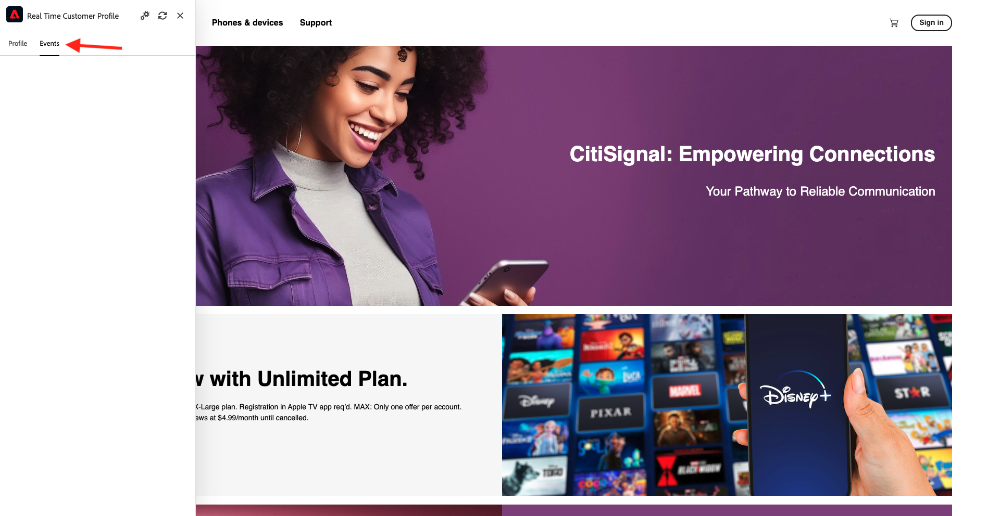

# 1.2.1 Von unbekannt zu bekannt auf der Website

## Kontext

Die Journey von Unbekannt zu Bekanntem ist heutzutage eines der wichtigsten Markenthemen, ebenso wie die Kunden-Journey von der Akquise bis zur Bindung.

Adobe Experience Platform spielt bei dieser Journey eine große Rolle. Plattform ist das Gehirn für Kommunikation, das Erlebnissystem der Aufzeichnung.

Platform ist eine Umgebung, in der das Wort **Kunde** breiter ist als nur die **bekannten**-Kunden. Dies ist sehr wichtig, wenn Sie mit Marken sprechen: Ein unbekannter Besucher auf der Website ist auch aus Sicht von Platform ein Kunde, und daher wird das gesamte Verhalten eines unbekannten Besuchers auch an Platform gesendet. Dank dieses Ansatzes kann sich eine Marke, wenn dieser Kunde schließlich ein bekannter Kunde wird, auch visualisieren, was vor diesem Moment passiert ist. Dies hilft aus Sicht der Attribution und Erlebnisoptimierung.

## Was wirst du tun?

Sie nehmen nun Daten in Adobe Experience Platform auf und diese Daten werden mit Kennungen wie ECIDs und E-Mail-Adressen verknüpft. Das Ziel ist es, den Geschäftskontext dessen, was Sie tun werden, aus der Sicht der Konfiguration zu verstehen. In der nächsten Übung beginnen Sie mit der Konfiguration aller erforderlichen Elemente, um die gesamte Datenaufnahme in Ihrer eigenen Sandbox-Umgebung zu ermöglichen.

### Kunden-Journey-Fluss

Navigieren Sie zu [https://dsn.adobe.com](https://dsn.adobe.com). Nachdem Sie sich mit Ihrer Adobe ID angemeldet haben, sehen Sie Folgendes. Klicken Sie auf die 3 Punkte **…** in Ihrem Website-Projekt und dann auf **Ausführen**, um es zu öffnen.

Anschließend wird Ihre Demo-Website geöffnet. Wählen Sie die URL aus und kopieren Sie sie in die Zwischenablage.

Öffnen Sie ein neues Inkognito-Browser-Fenster.

Fügen Sie die URL Ihrer Demo-Website ein, die Sie im vorherigen Schritt kopiert haben. Sie werden dann aufgefordert, sich mit Ihrer Adobe ID anzumelden.

Wählen Sie Ihren Kontotyp aus und schließen Sie den Anmeldevorgang ab.

Ihre Website wird dann in einem Inkognito-Browser-Fenster geladen. Für jede Demonstration müssen Sie ein neues Inkognito-Browser-Fenster verwenden, um Ihre Demo-Website-URL zu laden.

Klicken Sie auf das Adobe-Logo oben links im Bildschirm, um den Profil-Viewer zu öffnen.

Sehen Sie sich das Bedienfeld Profil-Viewer und das Echtzeit-Kundenprofil mit der **Experience Cloud-ID** als primäre Kennung für diesen derzeit unbekannten Kunden an.

Sie können auch alle Erlebnisereignisse sehen, die basierend auf dem Verhalten des Kunden erfasst wurden. Die Liste ist derzeit leer, aber das wird sich bald ändern.

Navigieren Sie zur Produktkategorie **Telefone und Geräte** . Klicken Sie anschließend auf das Produkt **iPhone 15 Pro**.

Anschließend wird die Produktdetailseite angezeigt. Ein Erlebnisereignis vom Typ **Produktansicht** wurde jetzt mithilfe der Web-SDK-Implementierung, die Sie im vorherigen Modul überprüft haben, an Adobe Experience Platform gesendet.

Öffnen Sie das Bedienfeld Profil-Viewer und sehen Sie sich Ihre **Erlebnisereignisse“**.

Gehen Sie zurück zur Kategorieseite **Telefone und Geräte** und klicken Sie auf ein anderes Produkt. Ein weiteres Erlebnisereignis wurde an Adobe Experience Platform gesendet.

Öffnen Sie das Bedienfeld Profil-Viewer . Es werden jetzt zwei Erlebnisereignisse vom Typ **Produktansicht** angezeigt. Während das Verhalten anonym ist, können wir bei ordnungsgemäßem Einverständnis jeden Klick verfolgen und in Adobe Experience Platform speichern. Sobald der anonyme Kunde bekannt wird, können wir das gesamte anonyme Verhalten automatisch mit dem bekannten Profil zusammenführen.

Klicken Sie **Anmelden** um zur Anmelde-/Anmeldeseite zu gelangen.

Klicken Sie **Konto erstellen**.

Füllen Sie Ihre Daten aus und klicken Sie **Registrieren**, woraufhin Sie zur vorherigen Seite weitergeleitet werden.

Öffnen Sie das Bedienfeld Profil-Viewer und navigieren Sie zum Echtzeit-Kundenprofil. Im Profil-Viewer-Fenster sollten Sie alle Ihre personenbezogenen Daten angezeigt bekommen, z. B. Ihre neu hinzugefügten E-Mail- und Telefonkennungen.

Wechseln Sie im Bedienfeld Profil-Viewer zu Erlebnisereignisse . Die beiden Produkte, die Sie zuvor angezeigt haben, werden im Bedienfeld Profil-Viewer angezeigt. Beide Ereignisse sind jetzt auch mit Ihrem „bekannten“ Profil verbunden.

Sie haben jetzt Daten in Adobe Experience Platform aufgenommen und diese Daten mit Kennungen wie ECIDs und E-Mail-Adressen verknüpft. Das Ziel ist, den Geschäftskontext von dem zu verstehen, was Sie tun werden. In der nächsten Übung beginnen Sie mit der Konfiguration aller erforderlichen Elemente, um die gesamte Datenaufnahme zu ermöglichen.

Nächster Schritt: [1.2.2 Konfigurieren von Schemata und Festlegen von Kennungen](./ex2.md)

[Zurück zum Modul 1.2](./data-ingestion.md)

[Zurück zu „Alle Module“](../../../overview.md)
