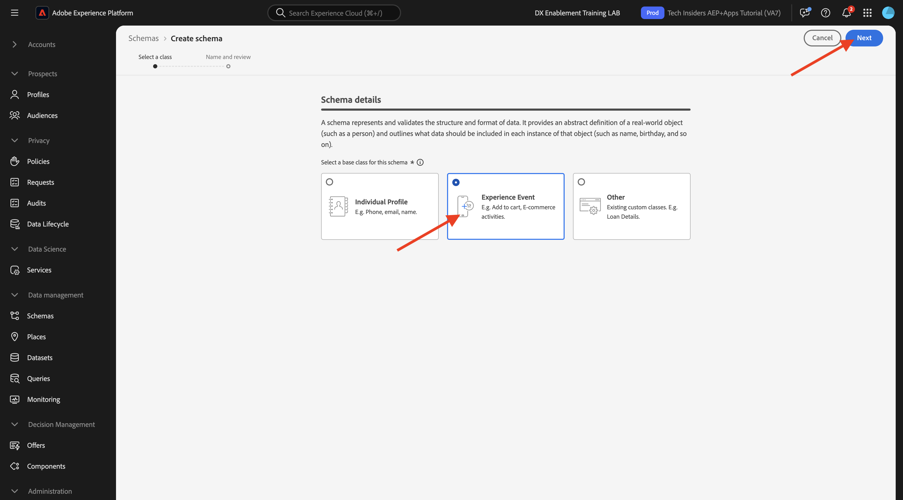

# 1.2.2 Konfigurieren von Schemata und Set-Bezeichnern

In dieser Übung überprüfen Sie die Konfiguration der erforderlichen XDM-Schemata, um Profilinformationen und Kundenverhalten zu klassifizieren. In jedem XDM-Schema wird außerdem eine primäre Kennung definiert, mit der alle kundenbezogenen Informationen verknüpft werden.

## Story

Bevor Sie mit der Konfiguration von XDM-Schemas und der Definition von Kennungen beginnen, müssen Sie über den Geschäftskontext dessen nachdenken, was wir versuchen zu tun:

- Sie möchten Daten
- Daten mit einem Kunden verknüpfen
- Sie möchten ein progressives Echtzeit-Kundenprofil erstellen

Es gibt zwei Arten von Daten, die wir erfassen möchten:

- Wer ist dieser Kunde?
- Was macht dieser Kunde?

Die Frage jedoch **Wer ist dieser Kunde?** ist eine sehr offene Frage, die viele Antworten bereithält. Wenn Ihr Unternehmen diese Frage beantwortet sehen möchte, suchen Sie nach demografischen Informationen wie Vorname, Nachname und Adresse. Aber auch für Kontaktinformationen wie eine E-Mail-Adresse oder eine Mobiltelefonnummer. Und auch für Informationen in Bezug auf Sprache, Opt-in/Opt-out und vielleicht sogar Profilbilder. Und schließlich müssen Sie wirklich wissen, wie wir diesen Kunden in den verschiedenen Systemen identifizieren, die Ihr Unternehmen verwendet.

Dasselbe gilt für die Frage **Was macht dieser Kunde?**. Es ist eine sehr offene Frage mit vielen Antworten. Wenn Ihr Unternehmen diese Frage beantwortet sehen möchte, suchen Sie nach jeder Interaktion, die ein Kunde mit einer Ihrer Online- und Offline-Eigenschaften hatte. Welche Seiten oder Produkte wurden besucht? Hat dieser Kunde ein Produkt in seinen Warenkorb gelegt oder sogar einen Artikel gekauft? Welches Gerät und welcher Browser wurden verwendet, um die Website zu durchsuchen? Welche Art von Informationen sucht dieser Kunde und wie können wir diese verwenden, um diesem Kunden ein ansprechendes Erlebnis zu konfigurieren und bereitzustellen? Und schließlich müssen wir wirklich wissen, wie wir diesen Kunden in den verschiedenen Systemen identifizieren, die Ihr Unternehmen verwenden wird.

## Wer ist dieser Kunde?

Die Antwort auf &quot;**ist dieser Kunde?** für Ihr Unternehmen erfolgt über die Anmelde-/Registrierungsseite.

Aus Sicht des Schemas betrachten wir dies als eine **Klasse**. Die Frage: **Wer ist dieser Kunde?** definieren wir in der Klasse **[!UICONTROL XDM Individual Profile]**.

Wenn Sie also ein XDM-Schema erstellen, um die Antwort auf „Wer **dieser Kunde?** müssen Sie zunächst ein Schema erstellen und definieren, das auf die Klasse „XDM Individual Profile **[!UICONTROL verweist]**.

Um anzugeben, welche Art von Antworten auf diese Frage gegeben werden können, müssen Sie [!UICONTROL Feldergruppen“ &#x200B;]. [!UICONTROL Feldergruppen] sind Erweiterungen der Profile-Klasse und haben sehr spezifische Konfigurationen. Demografische Informationen wie Vorname, Nachname, Geschlecht und Geburtstag sind beispielsweise Teil der [!UICONTROL Feldergruppe]: **[!UICONTROL Demografische Details]**.

Zweitens muss Ihr Unternehmen entscheiden, wie Sie diesen Kunden identifizieren. Im Falle Ihres Unternehmens kann die Hauptkennung eines bekannten Kunden eine bestimmte Kunden-ID sein, wie z. B. eine E-Mail-Adresse. Technisch gesehen gibt es jedoch andere Möglichkeiten, einen Kunden in Ihrem Unternehmen zu identifizieren, z. B. mithilfe einer Mobiltelefonnummer.
In diesem Labor definieren wir die E-Mail-Adresse als primäre Kennung und die Telefonnummer als sekundäre Kennung.

Schließlich ist es wichtig, den Kanal zu unterscheiden, auf dem Daten erfasst wurden. In diesem Fall sprechen wir über Website-Registrierungen und das Schema, das definiert werden muss, muss widerspiegeln, **wo** die Registrierungsdaten erfasst wurden. Der Kanal spielt auch eine wichtige Rolle bei der Beeinflussung der erfassten Daten. Daher empfiehlt es sich, die Schemas für jede Kombination aus Kanal, primärer Kennung und erfasstem Datentyp zu definieren.

Auf dieser Grundlage wurden Schemas in Adobe Experience Platform erstellt.

Melden Sie sich über die folgende URL bei Adobe Experience Platform an: [https://experience.adobe.com/platform](https://experience.adobe.com/platform).

Nach dem Login landen Sie auf der Homepage von Adobe Experience Platform.

Bevor Sie fortfahren, müssen Sie eine **Sandbox“**. Die auszuwählende Sandbox hat den Namen ``--aepSandboxName--``. Nach Auswahl der entsprechenden Sandbox wird der Bildschirm geändert und Sie befinden sich nun in Ihrer dedizierten Sandbox.

Klicken Sie in Adobe Experience Platform **[!UICONTROL Schemata]** im Menü links auf Ihrem Bildschirm. Sie sehen die Liste der verfügbaren [!UICONTROL Schemata]. Sie sollten ein neues Schema erstellen. Um ein neues Schema zu erstellen, klicken Sie auf **[!UICONTROL + Schema erstellen]**.

Wählen Sie **Manuell** und klicken Sie auf **Auswählen**.

Wählen Sie anschließend **Individuelles Profil** und klicken Sie auf **Weiter**.

Geben Sie den Namen Ihres Schemas wie folgt ein: `--aepUserLdap-- - Demo System - Profile Schema for Website`. Klicken Sie auf **Fertigstellen**.

Ein neues Schema wird jetzt erstellt.

Jetzt müssen Sie definieren, was eine Antwort auf die Frage **Wer ist dieser Kunde?** sollte wie folgt aussehen.
In der Einführung dieses Labors haben wir festgestellt, dass die folgenden Attribute benötigt werden, um einen Kunden zu definieren:

- Demografische Informationen wie Vorname, Nachname und Adresse
- Kontaktinformationen wie Privatadresse, E-Mail-Adresse oder Mobiltelefonnummer
- Weitere Informationen zu Sprache, Opt-in/Opt-out und möglicherweise sogar Profilbildern.
- Primäre Kennung für einen Kunden

Damit diese Informationen Teil Ihres Schemas werden, müssen Sie die folgenden [!UICONTROL Feldergruppen] zu Ihrem Schema hinzufügen:

- Demografische Details (demografische Informationen)
- Persönliche Kontaktdaten (Kontaktinformationen)
- Details zu Einverständnis und Voreinstellungen (andere Informationen)
- Die benutzerdefinierte Feldergruppe zur Profilkennung Ihres Unternehmens (Primäre und Sekundäre Kennungen)

Klicken Sie auf die Schaltfläche **+** unter **Feldergruppen**.

Wählen Sie auf dem **[!UICONTROL Feldergruppe hinzufügen]** die Optionen [!UICONTROL Feldergruppe] **[!UICONTROL Demografische]**, **[!UICONTROL Persönliche Kontaktdetails]** und **[!UICONTROL Einverständnis und Voreinstellungen]**.

Klicken Sie auf **[!UICONTROL Feldergruppen hinzufügen]**, um die [!UICONTROL Feldergruppe“ &#x200B;] Schema hinzuzufügen.

Sie haben jetzt Folgendes:

Als Nächstes benötigen Sie eine neue [!UICONTROL Feldergruppe], um den **[!UICONTROL Bezeichner]** zu erfassen, der für die Datenerfassung verwendet wird. Wie Sie in der vorherigen Übung gesehen haben, gibt es ein Konzept von Identifikatoren. Eine Primäre Kennung ist die wichtigste, da alle erfassten Daten mit dieser Kennung verknüpft werden.

Sie erstellen jetzt Ihre eigene benutzerdefinierte [!UICONTROL Feldergruppe] und erweitern daher das [!UICONTROL XDM-Schema] entsprechend den Anforderungen Ihrer eigenen Organisation.

Klicken Sie auf **[!UICONTROL + Hinzufügen]** unter **Feldergruppen**, um eine [!UICONTROL Feldergruppe] hinzuzufügen.

Anstatt eine vorhandene [!UICONTROL Feldergruppe] wiederzuverwenden, erstellen Sie jetzt Ihre eigene [!UICONTROL Feldergruppe]. Wählen Sie dazu **[!UICONTROL Neue Feldergruppe erstellen]** aus.

Sie müssen jetzt einen **[!UICONTROL Anzeigenamen]** und eine **[!UICONTROL Beschreibung]** für Ihre neue [!UICONTROL Feldergruppe].

Als Name für unser Schema verwenden wir Folgendes:
`--aepUserLdap-- - Profile Identification Field Group`

Klicken Sie auf **[!UICONTROL Feldergruppen hinzufügen]**, um die neu erstellte [!UICONTROL Feldergruppe] zu Ihrem Schema hinzuzufügen.

Sie haben jetzt diese Schemastruktur eingerichtet.

Ihre neue [!UICONTROL Feldergruppe] ist noch leer, sodass Sie jetzt Felder zu dieser [!UICONTROL Feldergruppe“ hinzufügen &#x200B;].
Klicken Sie in der [!UICONTROL Feldergruppe]-Liste auf Ihre benutzerdefinierte [!UICONTROL Feldergruppe].

Es werden jetzt eine Reihe neuer Schaltflächen angezeigt.

Klicken Sie in der obersten Ebene Ihres Schemas auf die Schaltfläche **[!UICONTROL + Feld hinzufügen]**.

Nachdem Sie auf die Schaltfläche **[!UICONTROL + Feld hinzufügen]** geklickt haben, wird jetzt ein neues, nicht benanntes Feld in Ihrem Schema angezeigt.

Sie sollten jetzt die Informationen dieses neuen Feldes eingeben, indem Sie diese Objektdefinitionen verwenden:

- Feldname: **`--aepUserLdap--_identification`**
- Anzeigename: **`--aepUserLdap--_identification`**
- Typ: **[!UICONTROL Objekt]**
- Feldergruppe: **`--aepUserLdap-- - Profile Identification Field Group`**

Klicken Sie auf **Übernehmen**.

Sie sehen jetzt ein neues Objekt in Ihrem Schema, das ein benutzerdefiniertes **[!UICONTROL Objekt]** im Schema darstellt und nach Ihrer Adobe Experience Platform-Mandanten-ID benannt ist. Ihre Adobe Experience Platform-Mandanten-ID ist `--aepTenantId--` und für jede AEP-Instanz eindeutig.

Sie fügen nun unter diesem Mandanten im soeben erstellten Objekt **Identifikation** ein Objekt mit drei neuen Feldern hinzu. Um mit dem Hinzufügen jedes einzelnen dieser drei Felder zu beginnen, klicken Sie auf das **+-Symbol** unter **Identifizierung** für jedes Feld.

Verwenden Sie die folgenden Informationen, um diese drei neuen Felder unter dem Objekt **[!UICONTROL Identifizierung]** zu erstellen:

- ECID:
   - Feldname: **`--aepUserLdap--_ecid`**
   - Anzeigename: **`--aepUserLdap--ecid`**
   - Typ: **[!UICONTROL String]**
   - Feldergruppe: **`--aepUserLdap-- - Profile Identification Field Group`**

- emailId
   - Feldname: **`--aepUserLdap--_emailId`**
   - Anzeigename: **`--aepUserLdap--_emailId`**
   - Typ: **[!UICONTROL String]**
   - Feldergruppe: **`--aepUserLdap-- - Profile Identification Field Group`**

- Mobilgerät
   - Feldname: **`--aepUserLdap--_mobilenr`**
   - Anzeigename: **`--aepUserLdap--_mobilenr`**
   - Typ: **[!UICONTROL String]**
   - Feldergruppe: **`--aepUserLdap-- - Profile Identification Field Group`**

So sollte jedes Feld nach der anfänglichen Feldkonfiguration aussehen.

- `--aepUserLdap--_mobilenr`

Scrollen Sie zum Speichern des Felds nach unten in **[!UICONTROL Feldeigenschaften]**, bis die Schaltfläche (**[!UICONTROL )]**. Klicken Sie auf **[!UICONTROL Schaltfläche &quot;]**&quot;.

- `--aepUserLdap--_ecid`

Vergessen Sie nicht, nach unten zu scrollen und auf **Übernehmen** zu klicken.

- `--aepUserLdap--_emailId`

Vergessen Sie nicht, nach unten zu scrollen und auf **Übernehmen** zu klicken.

Jedes Feld ist als Typ **[!UICONTROL Zeichenfolge]** definiert und Sie konfigurieren diese Felder jetzt als **[!UICONTROL Identitäten]**. Bei diesem Schema gehen wir davon aus, dass ein Kunde immer über seine E-Mail-Adresse identifiziert wird. Das bedeutet, dass Sie das Feld **[!UICONTROL emailId]** als **[!UICONTROL primäre]** Kennung und die anderen Felder als normale Kennungen konfigurieren müssen.

Ihre drei Felder müssen jetzt als „Identität **[!UICONTROL -Felder]** werden.

Gehen Sie wie folgt vor, um diese Felder **[!UICONTROL Identität]**-Felder zu definieren:

- Wählen Sie die **`--aepUserLdap--_emailId`** aus.
- Scrollen Sie auf der rechten Seite in den Feldeigenschaften nach unten, bis Sie **[!UICONTROL Identität]** sehen. Aktivieren Sie das Kontrollkästchen für **[!UICONTROL Identität]**.

- Aktivieren Sie jetzt das Kontrollkästchen für **[!UICONTROL Primäre Identität]**.

- Wählen Sie abschließend den Namespace **[!UICONTROL E-Mail]** aus der Liste der **[!UICONTROL Namespaces]**. Ein Namespace wird vom Identitätsdiagramm in Adobe Experience Platform verwendet, um IDs in Namespaces zu klassifizieren und die Beziehung zwischen diesen Namespaces zu definieren. Klicken Sie **[!UICONTROL Übernehmen]**, um Ihre Änderungen zu speichern.

Als Nächstes müssen Sie die anderen Felder für **`--aepUserLdap--_ecid`** und **`--aepUserLdap--_mobilenr`** als Standardkennungen definieren.

Wählen Sie die **`--aepUserLdap--_ecid`** aus. Scrollen Sie auf der rechten Seite in den Feldeigenschaften nach unten, bis Sie **[!UICONTROL Identität]** sehen. Aktivieren Sie das Kontrollkästchen für **[!UICONTROL Identität]**.
Wählen Sie anschließend den Namespace **[!UICONTROL ECID]** aus der Liste der **[!UICONTROL Namespaces]**.
Klicken Sie **[!UICONTROL Übernehmen]**, um Ihre Änderungen zu speichern.

Wählen Sie die **`--aepUserLdap--_mobilenr`** aus. Scrollen Sie auf der rechten Seite in den Feldeigenschaften nach unten, bis Sie **[!UICONTROL Identität]** sehen. Aktivieren Sie das Kontrollkästchen für **[!UICONTROL Identität]**.
Wählen Sie den Namespace **[!UICONTROL Telefon]** aus der Liste der **[!UICONTROL Namespaces]**.
Klicken Sie **[!UICONTROL Übernehmen]**, um Ihre Änderungen zu speichern.

Das **[!UICONTROL Identifizierungsobjekt]** sollte nun wie folgt aussehen, wobei die drei ID-Felder jetzt auch ein **[!UICONTROL Fingerabdruck]**-Symbol anzeigen, um anzuzeigen, dass sie als Kennungen definiert wurden.

Klicken Sie **[!UICONTROL Speichern]**, um Ihre Änderungen zu speichern.

Die letzte Möglichkeit besteht darin, das Schema zu aktivieren, das mit dem (Profil **[!UICONTROL verknüpft]**.
Durch die Aktivierung Ihres Profilschemas stellen Sie sicher, dass alle mit diesem Schema an Adobe Experience Platform gesendeten Daten Teil der Echtzeit-Kundenprofilumgebung sind, sodass alle diese Daten in Echtzeit für Abfragen, Segmentierung und Aktivierung verwendet werden können.

Wählen Sie dazu den Namen Ihres Schemas aus.

Klicken Sie auf der rechten Registerkarte Ihres Schemas auf den Umschalter **[!UICONTROL Profil]** der derzeit deaktiviert ist.

Aktivieren Sie den [!UICONTROL Profil]-Schalter, indem Sie darauf klicken.

Klicken Sie auf **[!UICONTROL Aktivieren]**, um dieses Schema für das Profil zu aktivieren.

Ihr Schema ist jetzt so konfiguriert, dass es Teil des [!UICONTROL Echtzeit-Kundenprofils) &#x200B;]. Klicken Sie auf **[!UICONTROL Speichern]**, um Ihr Schema zu speichern.

## Was macht dieser Kunde?

Erfasst die Antwort auf die Frage **Was macht dieser Kunde?** für Ihr Unternehmen erfolgt beispielsweise über eine Produktansicht auf einer Produktseite.

Aus der Schemaperspektive betrachten wir dies als eine **[!UICONTROL Klasse]**. Die Frage: **Was macht dieser Kunde?** ist etwas, das wir in der Klasse „ExperienceEvent **[!UICONTROL definiert]**.

Wenn Sie also ein [!UICONTROL XDM-Schema] erstellen, um die Antwort auf zu erfassen **„Was tut dieser Kunde?** müssen Sie zunächst ein Schema erstellen und definieren, das auf die Klasse „ExperienceEvent **[!UICONTROL verweist]**.

Um anzugeben, welche Art von Antworten auf diese Frage gegeben werden können, müssen Sie &quot;[!UICONTROL &quot; &#x200B;]. [!UICONTROL Feldergruppen] sind Erweiterungen der Klasse [!UICONTROL ExperienceEvent] und haben sehr spezifische Konfigurationen. Beispielsweise gehören Informationen darüber, welche Art von Produkten ein Kunde angesehen oder zum Warenkorb hinzugefügt hat, zur [!UICONTROL Feldergruppe] **Commerce Details**.

Zweitens muss Ihr Unternehmen entscheiden, wie Sie das Verhalten dieses Kunden identifizieren. Da wir über Interaktionen auf einer Website sprechen, ist es möglich, dass Ihr Unternehmen den Kunden kennt, aber es ist ebenso möglich, dass ein unbekannter, anonymer Besucher auf der Website aktiv ist. Wir können also keine Kennung wie eine E-Mail-Adresse verwenden. In diesem Fall entscheidet sich Ihr Unternehmen wahrscheinlich dafür, die [!UICONTROL Experience Cloud ID (ECID)] als primäre Kennung zu verwenden.

Schließlich ist es wichtig, den Kanal zu unterscheiden, auf dem Daten erfasst wurden. In diesem Fall werden wir über Website-Interaktionen sprechen und das Schema, das definiert werden muss, muss widerspiegeln, **wo** die Interaktionsdaten erfasst wurden. Der Kanal spielt auch eine wichtige Rolle bei der Beeinflussung der erfassten Daten. Daher empfiehlt es sich, die Schemas für jede Kombination aus Kanal, primärer Kennung und erfasstem Datentyp zu definieren.

Auf der Grundlage der obigen Informationen müssen Sie ein Schema in Adobe Experience Platform konfigurieren.

Nach dem Login landen Sie auf der Homepage von Adobe Experience Platform.

Bevor Sie fortfahren, müssen Sie eine **[!UICONTROL Sandbox“]**. Die [!UICONTROL &#x200B; auszuwählende &#x200B;]Sandbox“ heißt ``--aepSandboxName--``. Nach Auswahl der entsprechenden Sandbox wird der Bildschirm geändert und Sie befinden sich nun in Ihrer dedizierten Sandbox.

Klicken Sie in Adobe Experience Platform **[!UICONTROL Schemata]** im Menü auf der linken Bildschirmseite und gehen Sie zu **Durchsuchen**. Sie sollten ein neues Schema erstellen. Um ein neues Schema zu erstellen, klicken Sie auf die Schaltfläche **[!UICONTROL + Schema erstellen]**.

Wählen Sie **Manuell** und klicken Sie auf **Auswählen**.

Wählen Sie **Erlebnisereignis** aus und klicken Sie auf **Weiter**.

Geben Sie einen Namen für das Schema wie folgt ein: `--aepUserLdap-- - Demo System - Event Schema for Website`. Klicken Sie auf **Fertigstellen**.

Ein neues Schema wird erstellt und Sie können konfigurieren, welche Daten für dieses Schema erfasst werden.

Jetzt müssen Sie definieren, was eine Antwort auf die Frage **Was tut dieser Kunde?** sollte wie folgt aussehen.
In der Einführung dieses Labors haben wir festgestellt, dass die folgenden Attribute definieren müssen, was ein Kunde tut:

- Welche Seiten oder Produkte wurden besucht?
- Hat dieser Kunde ein Produkt in seinen Warenkorb gelegt oder sogar einen Artikel gekauft?
- Welches Gerät und welcher Browser wurden verwendet, um die Website zu durchsuchen?
- Welche Art von Informationen sucht dieser Kunde und wie können wir diese verwenden, um diesem Kunden ein ansprechendes Erlebnis zu konfigurieren und bereitzustellen?
- Primäre Kennung für einen Kunden

Damit diese Informationen Teil Ihres Schemas werden, müssen Sie die folgende [!UICONTROL Feldergruppe] zu Ihrem Schema hinzufügen:

- AEP Web SDK ExperienceEvent
- die benutzerdefinierte Profilidentifizierung Ihres Unternehmens [!UICONTROL Feldergruppe]

Klicken Sie auf **+ Hinzufügen** unter **Feldergruppen**.

Wählen Sie im **[!UICONTROL Feldergruppe hinzufügen]** die Option [!UICONTROL Feldergruppe] **[!UICONTROL AEP Web SDK ExperienceEvent]**. Klicken Sie **[!UICONTROL Feldergruppen hinzufügen]**.

Sie erhalten dann Folgendes:

Als Nächstes müssen Sie eine neue [!UICONTROL Feldergruppe“ erstellen] um die **[!UICONTROL Kennung]** für die Datenerfassung zu erfassen.

Sie erstellen jetzt Ihre eigene benutzerdefinierte [!UICONTROL Feldergruppe] und erweitern daher das [!UICONTROL XDM-Schema] entsprechend den Anforderungen Ihrer eigenen Organisation.

Eine [!UICONTROL Feldergruppe] ist mit einer [!UICONTROL Klasse] verknüpft, was bedeutet, dass Sie die zuvor erstellte [!UICONTROL Feldergruppe] nicht einfach wiederverwenden können.

Klicken Sie auf die Schaltfläche **[!UICONTROL + Hinzufügen]**, um mit dem Hinzufügen einer [!UICONTROL Feldergruppe“ &#x200B;].

Anstatt eine vorhandene [!UICONTROL Feldergruppe] wiederzuverwenden, erstellen Sie jetzt Ihre eigene [!UICONTROL Feldergruppe]. Wählen Sie **[!UICONTROL Neue Feldergruppe erstellen]** und geben Sie den Namen für Ihre Feldergruppe wie folgt ein: `--aepUserLdap-- - ExperienceEvent Identification Field Group`.
Klicken Sie **Feldergruppen hinzufügen**

Sie sollten jetzt über diese [!UICONTROL Schema]-Struktur verfügen.

Ihre neue [!UICONTROL Feldergruppe] ist noch leer, sodass Sie nun Felder zu dieser Feldergruppe hinzufügen müssen.
Klicken Sie in der [!UICONTROL Feldergruppe]-Liste auf Ihre benutzerdefinierte [!UICONTROL Feldergruppe].

Es werden jetzt eine Reihe neuer Schaltflächen angezeigt.

Klicken Sie auf der obersten Ebene Ihres Schemas neben Ihrem Schema - Name auf die Schaltfläche **[!UICONTROL +]**.

Nachdem Sie auf die Schaltfläche **+** geklickt haben, wird jetzt ein neues, nicht benanntes Feld in Ihrem Schema angezeigt.

Hier können Sie Ihr neues Feld definieren:

- Feldname: **`--aepUserLdap--_identification`**
- Anzeigename: **`--aepUserLdap--_identification`**
- Typ: **[!UICONTROL Objekt]**
- Feldergruppe: `--aepUserLdap-- - ExperienceEvent Identification Field Group`

Klicken Sie auf **Übernehmen**.

Ihr neues Feld wird jetzt unter Ihrer Adobe Experience Platform-Mandanten-ID erstellt. Ihre Adobe Experience Platform-Mandanten-ID ist `--aepTenantId--`.

Sie fügen nun 1 neues Feld unter dem Objekt **[!UICONTROL Identifikation]** hinzu.

Klicken Sie auf die Schaltfläche **[!UICONTROL +]** neben dem Objekt **[!UICONTROL Identifizierung]**, um ein neues Feld zu erstellen.

Das ECID-Feld wird als Typ **[!UICONTROL Zeichenfolge]** definiert und Sie konfigurieren dieses Feld als **[!UICONTROL Identität]**. Für das Schema **[!UICONTROL Demosystem - Ereignisschema für Website]** gehen wir davon aus, dass ein Kunde immer mit seiner [!UICONTROL ECID] identifiziert wird, was bedeutet, dass Sie das Feld **[!UICONTROL ECID]** als **primäre** konfigurieren müssen

Sie haben jetzt ein leeres Feld. Sie müssen das obige Feld wie angegeben konfigurieren.

- ECID:

   - Feldname: **`--aepUserLdap--_ecidweb`**
   - Anzeigename: **`--aepUserLdap--_ecidweb`**
   - Typ: **[!UICONTROL String]**
   - Feldergruppe: `--aepUserLdap-- - ExperienceEvent Identification Field Group`

So sollte das `--aepUserLdap--_ecidweb`-Feld nach der anfänglichen Feldkonfiguration aussehen:

Scrollen Sie nach unten und klicken Sie auf **[!UICONTROL Anwenden]**.

Sie haben jetzt ein neues Feld, aber dieses Feld wurde noch nicht als Feld **[!UICONTROL Identität]** definiert.

Um diese Felder als „Identität **[!UICONTROL -Felder]** definieren, wählen Sie die **`--aepUserLdap--_ecidweb`** aus.
Scrollen Sie auf der rechten Seite in den Feldeigenschaften nach unten, bis Sie **[!UICONTROL Identität]** sehen. Aktivieren Sie das Kontrollkästchen für **[!UICONTROL Identität]** und aktivieren Sie das Kontrollkästchen für **[!UICONTROL Primäre Identität]**.
Wählen Sie den Namespace **[!UICONTROL ECID]** aus der Liste der **[!UICONTROL Namespaces]**.

Klicken Sie **[!UICONTROL Übernehmen]**, um Ihre Änderungen zu speichern.

Das **[!UICONTROL Identifizierungsobjekt]** sollte nun wie folgt aussehen, wobei das ecid-Feld jetzt auch ein **Fingerabdruck**-Symbol anzeigt, um anzuzeigen, dass sie als Kennungen definiert wurden.
Klicken Sie **[!UICONTROL Speichern]**, um Ihre Änderungen zu speichern.

Beachten Sie, dass beim letztendlichen Aufnehmen von Daten für dieses Schema einige Felder erforderlich sind.
Beispielsweise sind die Felder **[!UICONTROL _id]** und **[!UICONTROL timestamp]** erforderliche Felder, was durch die ExperienceEvent-Klasse vorgeschrieben wird.

- _id muss eine eindeutige ID für eine bestimmte Datenaufnahme enthalten
- Zeitstempel muss der Zeitstempel dieses Treffers im Format **`"YYYY-MM-DDTHH:MM:SSSZ"`** sein, wie zum Beispiel: **`"2024-11-18T07:20:000Z"`**

Sie haben jetzt ein Schema definiert, vorhandene und neu erstellte [!UICONTROL Feldergruppen“ verknüpft &#x200B;] definierte Kennungen.

Die letzte Möglichkeit besteht darin, das Schema zu aktivieren, das mit dem (Profil **[!UICONTROL verknüpft]**.
Wenn Sie Ihr Schema für [!UICONTROL Profile] aktivieren, stellen Sie sicher, dass alle Daten, die mit diesem Schema an Adobe Experience Platform gesendet werden, Teil des Echtzeit-Kundenprofils sind, wodurch sichergestellt wird, dass alle diese Daten in Echtzeit für Abfragen, Segmentierung und Aktivierung verwendet werden können.

Klicken Sie dazu auf den Namen Ihres Schemas.

Auf der rechten Registerkarte Ihres Schemas sehen Sie einen **[!UICONTROL Profil]-Umschalter** der derzeit deaktiviert ist. Klicken Sie auf [!UICONTROL &#x200B; Umschalter &#x200B;]Profil“, um ihn zu aktivieren.

Sie werden diese Nachricht sehen. Klicken Sie auf **[!UICONTROL Aktivieren]**, um dieses Schema für das Profil zu aktivieren.

Ihr Schema ist jetzt so konfiguriert, dass es Teil des Echtzeit-Kundenprofils ist.

Klicken Sie auf **[!UICONTROL Speichern]**, um Ihr Schema zu speichern.

Sie haben jetzt das Erstellen von Schemas abgeschlossen, die für die Verwendung im Echtzeit-Kundenprofil aktiviert wurden.

Sehen wir uns in der nächsten Übung Datensätze an.

Nächster Schritt: [1.2.3 Konfigurieren von Datensätzen](./ex3.md)

[Zurück zum Modul 1.2](./data-ingestion.md)

[Zurück zu „Alle Module“](../../../overview.md)
