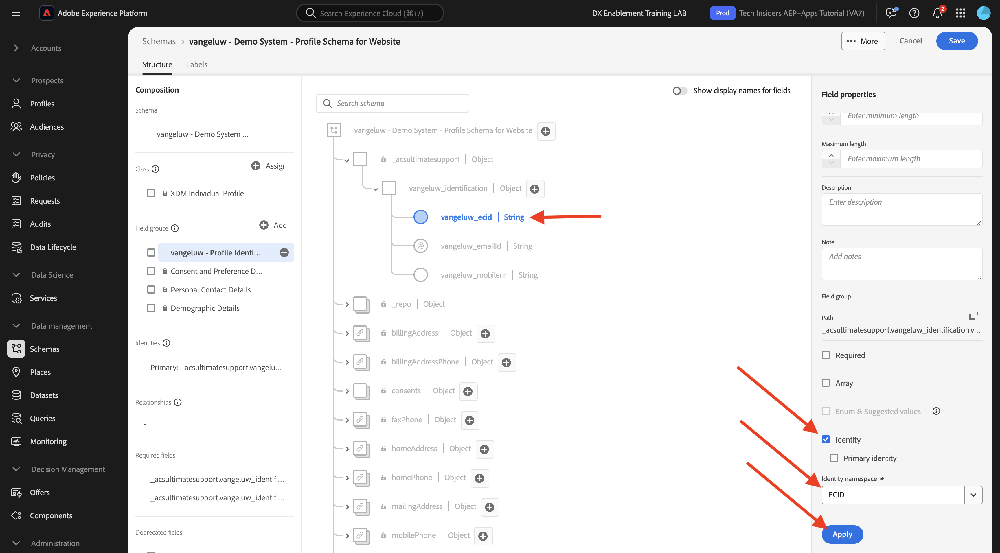
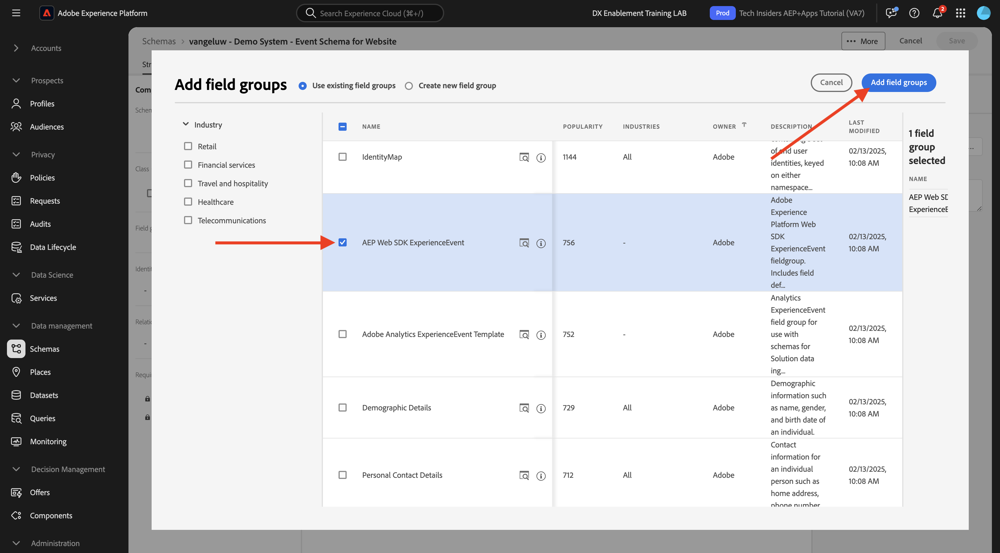

# 1.2.2 Schemas konfigurieren und Kennungen festlegen

In dieser Übung konfigurieren Sie die erforderlichen XDM-Schemas, um Profilinformationen und Kundenverhalten zu klassifizieren. In jedem XDM-Schema müssen Sie auch eine primäre Kennung konfigurieren, mit der alle Informationen verknüpft werden.

## Geschichte

Bevor Sie mit der Konfiguration von XDM-Schemas und dem Festlegen Primärer IDs beginnen, müssen wir über den Geschäftskontext unserer Bemühungen nachdenken:

- Sie möchten Daten
- Sie möchten Daten mit einem Kunden verknüpfen
- Sie möchten ein progressives Echtzeit-Kundenprofil erstellen

Es gibt zwei Arten von Daten, die wir erfassen möchten:

- Wer ist dieser Kunde?
- Was macht dieser Kunde?

Die Frage **Wer ist dieser Kunde?** ist eine sehr offene Frage, die viele Antworten hat. Wenn Ihr Unternehmen diese Frage beantworten möchte, suchen Sie nach demografischen Informationen wie Vorname, Nachname und Adresse. Aber auch für Kontaktinformationen wie E-Mail-Adresse oder Mobiltelefonnummer. Und auch für Informationen bezüglich Sprache, OptIn/OptOut und vielleicht sogar Profilbilder. Und schließlich müssen Sie wirklich wissen, wie wir diesen Kunden in den verschiedenen Systemen identifizieren, die Ihr Unternehmen verwendet.

Dasselbe gilt für die Frage **Was macht dieser Kunde?**. Es ist eine sehr offene Frage mit vielen Antworten. Wenn Ihr Unternehmen diese Frage beantworten möchte, suchen Sie nach einer Interaktion, die ein Kunde mit einer Ihrer Online- und Offline-Eigenschaften hatte. Welche Seiten oder Produkte wurden besucht? Hat dieser Kunde seinem Warenkorb ein Produkt hinzugefügt oder sogar einen Artikel gekauft? Welches Gerät und welcher Browser wurden zum Durchsuchen der Website verwendet? Nach welcher Art von Informationen sucht dieser Kunde und wie können wir diese verwenden, um diesem Kunden ein angenehmes Erlebnis zu bieten? Und schließlich müssen wir wirklich wissen, wie wir diesen Kunden in den verschiedenen Systemen identifizieren, die Ihr Unternehmen verwenden wird.

## 1.2.1.1 - Wer ist dieser Kunde?

Erfassen der Antwort an **Wer ist dieser Kunde?** für Ihr Unternehmen erfolgt über die Anmelde-/Registrierungs-Seite.

Aus Schema-Sicht betrachten wir dies als **Klasse**. Die Frage: **Wer ist dieser Kunde?** ist etwas, das wir in der Klasse **[!UICONTROL XDM Individual Profile]** definieren.

Wenn Sie also ein XDM-Schema erstellen, um die Antwort auf **Wer ist dieser Kunde?**, müssen Sie zunächst ein Schema erstellen und definieren, das auf die Klasse **[!UICONTROL XDM Individual Profile]** verweist.

Um festzulegen, welche Art von Antworten auf diese Frage gegeben werden können, müssen Sie [!UICONTROL Feldergruppen] definieren. [!UICONTROL Feldergruppen] sind Erweiterungen der Profilklasse und haben sehr spezifische Konfigurationen. demografische Informationen wie Vorname, Nachname, Geschlecht und Geburtstag sind beispielsweise Teil der [!UICONTROL Feldergruppe]: **[!UICONTROL Demografische Details]**.

Zweitens muss Ihr Unternehmen entscheiden, wie dieser Kunde identifiziert werden kann. Im Fall Ihres Unternehmens kann die Hauptkennung für einen bekannten Kunden eine bestimmte Kunden-ID sein, z. B. eine E-Mail-Adresse. Technisch gesehen gibt es jedoch andere Möglichkeiten, einen Kunden in Ihrem Unternehmen zu identifizieren, wie etwa die Verwendung einer Mobiltelefonnummer.
In diesem Labor definieren wir die E-Mail-Adresse als primäre Kennung und die Telefonnummer als sekundäre Kennung.

Schließlich ist es wichtig, den Kanal zu unterscheiden, auf dem Daten erfasst wurden. In diesem Fall geht es um Website-Registrierungen, und das zu definierende Schema muss **widerspiegeln, wo** die Registrierungsdaten erfasst wurden. Der Kanal spielt außerdem eine wichtige Rolle bei der Beeinflussung der erfassten Daten. Daher empfiehlt es sich, Schemas für jede Kombination von Kanal, primärer Kennung und Typ der erfassten Daten zu definieren.

Auf der Grundlage der oben stehenden Elemente müssen Sie ein Schema in Adobe Experience Platform konfigurieren.

Melden Sie sich bei Adobe Experience Platform an, indem Sie diese URL verwenden: [https://experience.adobe.com/platform](https://experience.adobe.com/platform).

Nach der Anmeldung landen Sie auf der Startseite von Adobe Experience Platform.

Bevor Sie fortfahren, müssen Sie eine **Sandbox** auswählen. Die auszuwählende Sandbox heißt ``--module2sandbox--``. Klicken Sie dazu in der blauen Zeile oben auf Ihrem Bildschirm auf den Text **[!UICONTROL Produktions-Prod]** . Nachdem Sie die entsprechende Sandbox ausgewählt haben, wird die Bildschirmänderung angezeigt und Sie befinden sich jetzt in Ihrer dedizierten Sandbox.

Klicken Sie in Adobe Experience Platform im Menü auf der linken Bildschirmseite auf **[!UICONTROL Schemas]** . Sie sehen die Liste der verfügbaren [!UICONTROL Schemas].

Sie sollten ein neues Schema erstellen. Um ein neues Schema zu erstellen, klicken Sie auf die Schaltfläche **[!UICONTROL + Schema erstellen]** und wählen Sie **[!UICONTROL XDM Individual Profile]** aus.

Nachdem Sie auf die Schaltfläche **[!UICONTROL + Schema erstellen]** geklickt haben, wird ein neues Schema erstellt und Sie werden aufgefordert, **Feldergruppen** auszuwählen oder zu erstellen.

Jetzt müssen Sie definieren, welche Antwort auf die Frage **Wer ist dieser Kunde?** sollte wie folgt aussehen:
In der Einführung dieses Labors haben wir festgestellt, dass folgende Attribute erforderlich sind, um einen Kunden zu definieren:

- Demografische Informationen wie Vorname, Nachname und Adresse
- Kontaktinformationen wie Privatadresse, E-Mail-Adresse oder Mobiltelefonnummer
- Andere Informationen bezüglich Sprache, OptIn/OptOut und vielleicht sogar Profilbilder.
- Primäre Kennung für einen Kunden

Damit diese Informationen Teil Ihres Schemas werden, müssen Sie die folgenden [!UICONTROL Feldgruppen] zu Ihrem Schema hinzufügen:

- Demografische Details (demografische Informationen)
- Persönliche Kontaktdaten (Kontaktinformationen)
- Präferenzdetails (weitere Informationen)
- Benutzerdefinierte Profilidentifizierungsfeldgruppe Ihres Unternehmens (Primäre und Sekundäre Kennungen)

Wählen Sie im Bildschirm **[!UICONTROL Feldergruppe hinzufügen]** die Optionen [!UICONTROL Feldergruppe] **[!UICONTROL Demografische Details]**, **[!UICONTROL Persönliche Kontaktdetails]** und **[!UICONTROL Präferenzdetails]** aus.

Klicken Sie auf die Schaltfläche **[!UICONTROL Feldgruppen hinzufügen]** , um Ihrem Schema die [!UICONTROL Feldergruppe] hinzuzufügen.

Jetzt haben Sie Folgendes:

Als Nächstes benötigen Sie eine neue [!UICONTROL Feldergruppe], um die für die Datenerfassung verwendete **[!UICONTROL Kennung]** zu erfassen. Wie Sie in der vorherigen Übung gesehen haben, gibt es ein Konzept von Primären und Sekundären Kennungen. Eine Primäre Kennung ist die wichtigste, da alle erfassten Daten mit dieser Kennung verknüpft werden.

Sie erstellen jetzt Ihre eigene benutzerdefinierte [!UICONTROL Feldergruppe] und erweitern daher das [!UICONTROL XDM-Schema], um die Anforderungen Ihres eigenen Unternehmens zu erfüllen.

Klicken Sie auf die Schaltfläche **[!UICONTROL + Hinzufügen]** , um eine [!UICONTROL Feldergruppe] hinzuzufügen.

Statt eine vorhandene [!UICONTROL Feldergruppe] wiederzuverwenden, erstellen Sie jetzt Ihre eigene [!UICONTROL Feldergruppe]. Wählen Sie dazu **[!UICONTROL Neue Feldergruppe erstellen]** aus.

Sie müssen jetzt einen **[!UICONTROL Anzeigenamen]** und eine **[!UICONTROL Beschreibung]** für Ihre neue [!UICONTROL Feldergruppe] angeben.

Als Name für unser Schema verwenden wir Folgendes:
`--aepUserLdap-- - Profile Identification Field Group`

Beispiel: Für ldap **[!UICONTROL vangeluw]** sollte dies der Name des Schemas sein:

**[!UICONTROL vangeluw - Feldergruppe zur Profilidentifizierung]**

Das sollte Ihnen etwas wie Folgendes geben:

Klicken Sie auf die Schaltfläche **[!UICONTROL Feldgruppen hinzufügen]** , um die neu erstellte [!UICONTROL Feldergruppe] zu Ihrem Schema hinzuzufügen.

Diese Schemastruktur sollte jetzt vorhanden sein.

Ihre neue [!UICONTROL Feldergruppe] ist weiterhin leer. Daher müssen Sie jetzt dieser [!UICONTROL Feldergruppe] Felder hinzufügen.
Klicken Sie in der Liste [!UICONTROL Feldergruppe] auf Ihre benutzerdefinierte [!UICONTROL Feldergruppe].

Es werden jetzt einige neue Schaltflächen angezeigt.

Klicken Sie auf der obersten Ebene Ihres Schemas auf die Schaltfläche **[!UICONTROL + Feld hinzufügen]** .

Nachdem Sie auf die Schaltfläche **[!UICONTROL + Feld hinzufügen]** geklickt haben, sehen Sie jetzt ein neues **[!UICONTROL Objekt]** in Ihrem Schema. Dieses Objekt stellt ein benutzerdefiniertes **[!UICONTROL Objekt]** in Ihrem Schema dar und wird nach Ihrer Adobe Experience Platform-Mandanten-ID benannt. Ihre Adobe Experience Platform-Mandanten-ID ist `--aepTenantId--`.

Sie fügen jetzt ein neues Objekt unter diesem Mandanten hinzu. Klicken Sie dazu auf das Feld **[!UICONTROL Neues Feld]** unter dem Mandanten-Objekt.

Verwenden Sie diese Objektdefinitionen:

- Feldname: **[!UICONTROL identification]**
- Anzeigename: **[!UICONTROL identification]**
- Typ: **[!UICONTROL Objekt]**

Klicken Sie auf **[!UICONTROL Anwenden]** , um Ihre Änderungen zu speichern.

Nachdem Sie auf **[!UICONTROL Anwenden]** geklickt haben, sehen Sie jetzt Ihr **[!UICONTROL Identifizierungs]** -Objekt im Schema.

Sie fügen nun 3 neue Felder unter dem Objekt **[!UICONTROL identification]** hinzu:

- ecid:
   - Feldname: **[!UICONTROL ecid]**
   - Anzeigename: **[!UICONTROL ecid]**
   - Typ: **[!UICONTROL String]**

- emailId
   - Feldname: **[!UICONTROL emailId]**
   - Anzeigename: **[!UICONTROL emailId]**
   - Typ: **[!UICONTROL String]**

- mobilenr
   - Feldname: **[!UICONTROL mobilenr]**
   - Anzeigename: **[!UICONTROL mobilenr]**
   - Typ: **[!UICONTROL String]**

Jedes Feld wird als Typ **[!UICONTROL String]** definiert und wir konfigurieren diese Felder als **[!UICONTROL Identitäten]**. Für das Schema **[!UICONTROL Website Registration Schema]** gehen wir davon aus, dass ein Kunde immer durch seine E-Mail-Adresse identifiziert wird. Das bedeutet, dass Sie das Feld **[!UICONTROL emailId]** als **[!UICONTROL primäre]** Kennung und die anderen Felder als **[!UICONTROL sekundäre]** IDs konfigurieren müssen.

Um die Felder hinzuzufügen, klicken Sie auf die Schaltfläche **[!UICONTROL +]** neben dem Objekt **[!UICONTROL identification]** .

Sie haben jetzt ein leeres Feld. Konfigurieren Sie die drei oben genannten Felder wie angegeben.

So sollte jedes Feld nach der ursprünglichen Feldkonfiguration aussehen.

Klicken Sie auf die Schaltfläche **[!UICONTROL +]** neben dem Objekt **[!UICONTROL identification]** , um ein neues Feld zu erstellen und die Felder wie angegeben auszufüllen.

- ecid

Um Ihr Feld zu speichern, scrollen Sie in den **[!UICONTROL Feldeigenschaften]** nach unten, bis die Schaltfläche **[!UICONTROL Anwenden]** angezeigt wird. Klicken Sie auf die Schaltfläche **[!UICONTROL Anwenden]** .

Klicken Sie auf die Schaltfläche **[!UICONTROL +]** neben dem Objekt **[!UICONTROL identification]** , um ein neues Feld zu erstellen und die Felder wie angegeben auszufüllen.

- emailId

Um Ihr Feld zu speichern, scrollen Sie in den **[!UICONTROL Feldeigenschaften]** nach unten, bis die Schaltfläche **[!UICONTROL Anwenden]** angezeigt wird. Klicken Sie auf die Schaltfläche **[!UICONTROL Anwenden]** .

Klicken Sie auf die Schaltfläche **[!UICONTROL +]** neben dem Objekt **[!UICONTROL identification]** , um ein neues Feld zu erstellen und die Felder wie angegeben auszufüllen.

- mobilenr

Um Ihr Feld zu speichern, scrollen Sie in den **[!UICONTROL Feldeigenschaften]** nach unten, bis die Schaltfläche **[!UICONTROL Anwenden]** angezeigt wird. Klicken Sie auf die Schaltfläche **[!UICONTROL Anwenden]** .

Sie haben jetzt 3 Felder, diese Felder wurden jedoch noch nicht als **[!UICONTROL Identitätsfelder]** definiert.

Gehen Sie wie folgt vor, um diese Felder als **[!UICONTROL Identitätsfelder]** zu definieren:

- Wählen Sie das Feld **[!UICONTROL emailId]** aus.
- Scrollen Sie rechts in den Feldeigenschaften nach unten, bis **[!UICONTROL Identität]** angezeigt wird. Aktivieren Sie das Kontrollkästchen für **[!UICONTROL Identität]**.

  

- Aktivieren Sie jetzt das Kontrollkästchen für **[!UICONTROL Primäre Identität]**.

  

- Wählen Sie abschließend den Namespace **[!UICONTROL E-Mail]** aus der Liste der **[!UICONTROL Namespaces]** aus. Ein Namespace wird vom Identitätsdiagramm in Adobe Experience Platform verwendet, um IDs in Namespaces zu klassifizieren und die Beziehung zwischen diesen Namespaces zu definieren.

  

- Klicken Sie abschließend auf **[!UICONTROL Anwenden]** , um Ihre Änderungen zu speichern.

  

Als Nächstes müssen Sie die anderen Felder für **[!UICONTROL ecid]** und **[!UICONTROL mobilenr]** als sekundäre Kennungen definieren.

- Wählen Sie das Feld **[!UICONTROL ecid]** aus.
- Scrollen Sie rechts in den Feldeigenschaften nach unten, bis **[!UICONTROL Identität]** angezeigt wird. Aktivieren Sie das Kontrollkästchen für **[!UICONTROL Identität]**.

  

- Wählen Sie anschließend den Namespace **[!UICONTROL ECID]** aus der Liste der **[!UICONTROL Namespaces]** aus. Ein [!UICONTROL Namespace] wird vom Identitätsdiagramm in Adobe Experience Platform verwendet, um IDs in Namespaces zu klassifizieren und die Beziehung zwischen diesen Namespaces zu definieren.

  

- Klicken Sie auf **[!UICONTROL Anwenden]** , um Ihre Änderungen zu speichern.

  

- Wählen Sie das Feld **[!UICONTROL mobilenr]** aus.
- Scrollen Sie rechts in den Feldeigenschaften nach unten, bis **[!UICONTROL Identität]** angezeigt wird. Aktivieren Sie das Kontrollkästchen für **[!UICONTROL Identität]**.

  

- Stellen Sie sicher, dass Sie den Namespace **[!UICONTROL Telefon]** aus der Liste der **[!UICONTROL Namespaces]** auswählen. Ein Namespace wird vom Identitätsdiagramm in Adobe Experience Platform verwendet, um IDs in Namespaces zu klassifizieren und die Beziehung zwischen diesen Namespaces zu definieren.

  

- Klicken Sie auf **[!UICONTROL Anwenden]** , um Ihre Änderungen zu speichern.

  

Das Objekt **[!UICONTROL identification]** sollte jetzt wie folgt aussehen, wobei die 3 ID-Felder jetzt auch ein Symbol **[!UICONTROL fingerprint]** zeigen, dass sie als Bezeichner definiert wurden.

Geben wir nun Ihrem Schema einen Namen. Wählen Sie das Feld **Unbenanntes Schema** aus.

Als Name für unser Schema verwenden Sie Folgendes:

`--aepUserLdap-- - Demo System - Profile Schema for Website`

Ersetzen Sie **[!UICONTROL ldap]** durch Ihren spezifischen ldap. Beispiel: Für ldap **[!UICONTROL vangeluw]** sollte dies der Name des Schemas sein:

**[!UICONTROL vangeluw - Demosystem - Profilschema für Website]**

Das sollte Ihnen etwas wie Folgendes geben:

Sie haben jetzt ein Schema definiert, vorhandene und neu erstellte [!UICONTROL Feldergruppen] verknüpft und Kennungen definiert.

Klicken Sie auf **[!UICONTROL Speichern]** , um Ihre Änderungen zu speichern.

Das letzte, was Sie hier tun müssen, ist, das Schema zu aktivieren, das mit dem **[!UICONTROL Profil]** verknüpft werden soll.
Durch die Aktivierung Ihres Schemas für Profile stellen Sie sicher, dass alle Daten, die mit diesem Schema an Adobe Experience Platform gesendet werden, Teil der Echtzeit-Kundenprofil-Umgebung sind, die sicherstellt, dass alle diese Daten in Echtzeit für Abfragen, Segmentierung und Aktivierung verwendet werden können.

Wählen Sie dazu den Namen Ihres Schemas aus.

Auf der rechten Registerkarte Ihres Schemas sehen Sie einen **[!UICONTROL Profil -Umschalter]**, der derzeit deaktiviert ist.

Aktivieren Sie den Schalter [!UICONTROL Profil] - durch Klicken darauf.

Sie sehen diese Meldung:

Klicken Sie auf **[!UICONTROL Aktivieren]** , um dieses Schema für das Profil zu aktivieren.

Ihr Schema ist jetzt so konfiguriert, dass es Teil des [!UICONTROL Echtzeit-Kundenprofils] ist.

Klicken Sie abschließend auf **[!UICONTROL Speichern]** , um Ihr Schema zu speichern.

### 1.2.1.2 - Was macht dieser Kunde?

Erfassen der Antwort auf die Frage **Was tut dieser Kunde?** für Ihr Unternehmen ausgeführt wird, z. B. durch eine Produktansicht auf einer Produktseite.

Aus der Sicht eines Schemas betrachten wir dies als **[!UICONTROL Klasse]**. Die Frage: **Was macht dieser Kunde?** ist etwas, das wir in der Klasse **[!UICONTROL ExperienceEvent]** definiert haben.

Wenn Sie also ein [!UICONTROL XDM-Schema] erstellen, um die Antwort auf **Was tut dieser Kunde?**, müssen Sie zunächst ein Schema erstellen und definieren, das auf die Klasse **[!UICONTROL ExperienceEvent]** verweist.

Um festzulegen, welche Art von Antworten auf diese Frage gegeben werden können, müssen Sie [!UICONTROL Feldergruppe] definieren. [!UICONTROL Feldergruppen] sind Erweiterungen der Klasse [!UICONTROL ExperienceEvent] und haben sehr spezifische Konfigurationen. Beispielsweise sind Informationen darüber, welche Art von Produkten ein Kunde angesehen oder zu seinem Warenkorb hinzugefügt hat, Teil der [!UICONTROL Feldergruppe] **Commerce-Details**.

Zweitens muss Ihr Unternehmen entscheiden, wie Sie das Verhalten dieses Kunden identifizieren. Da wir über Interaktionen auf einer Website sprechen, ist es möglich, dass Ihr Unternehmen den Kunden kennt, aber es ist ebenso möglich, dass ein unbekannter, anonymer Besucher auf der Website aktiv ist. Wir können also keine Kennung wie E-Mail-Adresse verwenden. In diesem Fall wird Ihr Unternehmen wahrscheinlich entscheiden, die [!UICONTROL Experience Cloud ID (ECID)] als primäre Kennung zu verwenden.

Schließlich ist es wichtig, den Kanal zu unterscheiden, auf dem Daten erfasst wurden. In diesem Fall sprechen wir von Website-Interaktionen. Das zu definierende Schema muss **wo** die Interaktionsdaten erfasst wurden, widerspiegeln. Der Kanal spielt außerdem eine wichtige Rolle bei der Beeinflussung der erfassten Daten. Daher empfiehlt es sich, Schemas für jede Kombination von Kanal, primärer Kennung und Typ der erfassten Daten zu definieren.

Auf der Grundlage der obigen Informationen müssen Sie ein Schema in Adobe Experience Platform konfigurieren.

Nach der Anmeldung landen Sie auf der Startseite von Adobe Experience Platform.

Bevor Sie fortfahren, müssen Sie eine **[!UICONTROL Sandbox]** auswählen. Die auszuwählende [!UICONTROL Sandbox] trägt den Namen ``--module2sandbox--``. Klicken Sie dazu in der blauen Zeile oben auf Ihrem Bildschirm auf den Text **[!UICONTROL Produktions-Prod]** . Nachdem Sie die entsprechende Sandbox ausgewählt haben, wird die Bildschirmänderung angezeigt und Sie befinden sich jetzt in Ihrer dedizierten Sandbox.

Klicken Sie in Adobe Experience Platform im Menü auf der linken Bildschirmseite auf **[!UICONTROL Schemas]** .

In [!UICONTROL Schemas] werden alle vorhandenen Schemas angezeigt.

Sie sollten ein neues Schema erstellen. Um ein neues Schema zu erstellen, klicken Sie auf die Schaltfläche **[!UICONTROL + Schema erstellen]** und wählen Sie **[!UICONTROL XDM ExperienceEvent]** aus.

Nachdem Sie auf die Schaltfläche **[!UICONTROL + Schema erstellen]** geklickt haben, wird ein neues Schema erstellt und Sie werden aufgefordert, **Feldergruppen** auszuwählen oder zu erstellen.

Jetzt müssen Sie definieren, welche Antwort auf die Frage **Was tut dieser Kunde?** sollte wie folgt aussehen:
In der Einführung dieses Labors haben wir festgestellt, dass folgende Attribute erforderlich sind, um zu definieren, was ein Kunde tut:

- Welche Seiten oder Produkte wurden besucht?
- Hat dieser Kunde seinem Warenkorb ein Produkt hinzugefügt oder sogar einen Artikel gekauft?
- Welches Gerät und welcher Browser wurden zum Durchsuchen der Website verwendet?
- Nach welcher Art von Informationen sucht dieser Kunde und wie können wir diese verwenden, um diesem Kunden ein angenehmes Erlebnis zu bieten?
- Primäre Kennung für einen Kunden

Damit diese Informationen Teil Ihres Schemas werden, müssen Sie die folgende [!UICONTROL Feldergruppe] zu Ihrem Schema hinzufügen:

- Web-Details
- Commerce-Details
- Umgebungsdetails
- benutzerspezifische Profilkennung Ihres Unternehmens [!UICONTROL Feldergruppe] (Primäre und Sekundäre Kennungen)

Wählen Sie im Bildschirm **[!UICONTROL Feldergruppe hinzufügen]** die Optionen [!UICONTROL Feldergruppen] **[!UICONTROL Webdetails]**, **[!UICONTROL Commerce-Details]** und **[!UICONTROL Umgebungsdetails]** aus.

Klicken Sie auf die Schaltfläche **[!UICONTROL Feldgruppen hinzufügen]** , um Ihrem Schema die Feldergruppe hinzuzufügen.

Dann haben Sie Folgendes:

Als Nächstes müssen Sie eine neue [!UICONTROL Feldergruppe] erstellen, um die für die Datenerfassung verwendete **[!UICONTROL Kennung]** zu erfassen. Wie Sie in der vorherigen Übung gesehen haben, gibt es ein Konzept von Primären und Sekundären Kennungen. Eine Primäre Kennung ist die wichtigste, da alle erfassten Daten mit dieser Kennung verknüpft werden.

Sie erstellen jetzt Ihre eigene benutzerdefinierte [!UICONTROL Feldergruppe] und erweitern daher das [!UICONTROL XDM-Schema], um die Anforderungen Ihres eigenen Unternehmens zu erfüllen.

Eine [!UICONTROL Feldergruppe] ist mit einer [!UICONTROL Klasse] verknüpft. Das bedeutet, dass Sie die zuvor erstellte [!UICONTROL Feldergruppe] nicht einfach wiederverwenden können.

Klicken Sie auf die Schaltfläche **[!UICONTROL + Hinzufügen]** , um eine [!UICONTROL Feldergruppe] hinzuzufügen.

Statt eine vorhandene [!UICONTROL Feldergruppe] wiederzuverwenden, erstellen Sie jetzt Ihre eigene [!UICONTROL Feldergruppe]. Wählen Sie dazu **[!UICONTROL Neue Feldergruppe erstellen]** aus.

Sie müssen nun einen **[!UICONTROL Anzeigenamen]** und eine **[!UICONTROL Beschreibung]** für Ihre neue Feldergruppe angeben.

Verwenden Sie als Namen für Ihre Feldergruppe Folgendes:

`--aepUserLdap-- - ExperienceEvent Identification Field Group`

Beispiel: Für ldap **[!UICONTROL vangeluw]** sollte dies der Name des Schemas sein:

**[!UICONTROL vangeluw - ExperienceEvent Identification Field Group]**

Das sollte Ihnen etwas wie Folgendes geben:

Klicken Sie auf die Schaltfläche **[!UICONTROL Feldergruppe hinzufügen]** , um die neu erstellte [!UICONTROL Feldergruppe] zu Ihrem Schema hinzuzufügen.

Sie sollten jetzt diese [!UICONTROL Schema]-Struktur haben.

Ihre neue [!UICONTROL Feldergruppe] ist weiterhin leer. Daher müssen Sie dieser Feldergruppe jetzt Felder hinzufügen.
Klicken Sie in der Liste [!UICONTROL Feldergruppe] auf Ihre benutzerdefinierte [!UICONTROL Feldergruppe].

Es werden jetzt einige neue Schaltflächen angezeigt.

Klicken Sie auf der obersten Ebene Ihres Schemas neben Ihrem Schema - name auf die Schaltfläche **[!UICONTROL +]** .

Nachdem Sie auf die Schaltfläche **[!UICONTROL +]** geklickt haben, sehen Sie jetzt ein neues **[!UICONTROL Objekt]** in Ihrem Schema. Dieses Objekt stellt ein benutzerdefiniertes **[!UICONTROL Objekt]** in Ihrem [!UICONTROL Schema] dar und wird nach Ihrer Adobe Experience Platform-Mandanten-ID benannt. Ihre Adobe Experience Platform-Mandanten-ID ist `--aepTenantId--`.

Sie fügen jetzt ein neues Objekt unter diesem Mandanten hinzu. Klicken Sie dazu auf das Feld **[!UICONTROL Neues Feld]** unter dem Mandanten-Objekt.

Verwenden Sie diese Objektdefinitionen:

- Feldname: **[!UICONTROL identification]**
- Anzeigename: **[!UICONTROL identification]**
- Typ: **[!UICONTROL Objekt]**

Scrollen Sie nach unten und klicken Sie auf **[!UICONTROL Anwenden]** , um Ihre Änderungen zu speichern.

Nachdem Sie auf **[!UICONTROL Anwenden]** geklickt haben, sehen Sie jetzt Ihr **[!UICONTROL Identifizierungs]** -Objekt im Schema.

Sie fügen nun ein neues Feld unter dem Objekt **[!UICONTROL identification]** hinzu.

Klicken Sie auf die Schaltfläche **[!UICONTROL +]** neben dem Objekt **[!UICONTROL identification]** , um ein neues Feld zu erstellen.

Das ECID-Feld wird als Typ **[!UICONTROL String]** definiert und Sie konfigurieren dieses Feld als **[!UICONTROL Identität]**. Für das Schema **[!UICONTROL Demo System - Ereignisschema für Website]** gehen wir davon aus, dass ein Kunde immer durch seine [!UICONTROL ECID] identifiziert wird. Dies bedeutet, dass Sie das Feld **[!UICONTROL ECID]** als **primäre**-Kennung konfigurieren müssen

Sie haben jetzt ein leeres Feld. Sie müssen das obige Feld wie angegeben konfigurieren.

- ecid:

   - Feldname: **[!UICONTROL ecid]**
   - Anzeigename: **[!UICONTROL ecid]**
   - Typ: **[!UICONTROL String]**

So sollte das Feld [!UICONTROL ecid] nach Ihrer anfänglichen Feldkonfiguration aussehen:

Scrollen Sie nach unten und klicken Sie auf **[!UICONTROL Anwenden]**.

Sie haben jetzt ein neues Feld, aber dieses Feld wurde noch nicht als **[!UICONTROL Identitätsfeld]** definiert.

Gehen Sie wie folgt vor, um diese Felder als **[!UICONTROL Identitätsfelder]** zu definieren:

- Wählen Sie das Feld **[!UICONTROL ecid]** aus.
- Scrollen Sie rechts in den Feldeigenschaften nach unten, bis **[!UICONTROL Identität]** angezeigt wird. Aktivieren Sie das Kontrollkästchen für **[!UICONTROL Identität]**.

- Aktivieren Sie jetzt das Kontrollkästchen für **[!UICONTROL Primäre Identität]**.

- Wählen Sie abschließend den Namespace **[!UICONTROL ECID]** aus der Liste der **[!UICONTROL Namespaces]** aus. Ein [!UICONTROL Namespace] wird vom [!UICONTROL Identitätsdiagramm] in Adobe Experience Platform verwendet, um IDs in Namespaces zu klassifizieren und die Beziehung zwischen diesen Namespaces zu definieren.

  

- Klicken Sie abschließend auf **[!UICONTROL Anwenden]** , um Ihre Änderungen zu speichern.

  

Das Objekt **[!UICONTROL identification]** sollte jetzt wie folgt aussehen, wobei das ecid-Feld jetzt auch ein Symbol **fingerprint** anzeigt, dass sie als Bezeichner definiert wurden.

Geben wir nun Ihrem Schema einen Namen. Wählen Sie das Feld **Unbenanntes Schema** aus.

Als Name für unser Schema verwenden wir Folgendes:
`--aepUserLdap-- - Demo System - Event Schema for Website`

Beispiel: Für ldap **[!UICONTROL vangeluw]** sollte dies der Name des Schemas sein:

**[!UICONTROL vangeluw - Demosystem - Ereignisschema für Website]**

Das sollte Ihnen etwas wie Folgendes geben:

Klicken Sie auf **[!UICONTROL Speichern]** , um Ihre Änderungen zu speichern.

Beachten Sie, dass beim letzten Erfassen von Daten für dieses Schema einige Felder erforderlich sind.
Beispielsweise sind die Felder **[!UICONTROL _id]** und **[!UICONTROL timestamp]** erforderliche Felder.

- _id muss eine eindeutige ID für eine bestimmte Datenaufnahme enthalten
- timestamp muss der Zeitstempel dieses Treffers im Format **[!UICONTROL &quot;YYYY-MM-DDTHH:MM:SSSZ&quot;]** sein, z. B.: **[!UICONTROL &quot;2019-04-08T07:20:000Z&quot;]**

Sie haben jetzt ein Schema definiert, vorhandene und neu erstellte [!UICONTROL Feldergruppen] verknüpft und Kennungen definiert.

Das letzte, was Sie hier tun müssen, ist, das Schema zu aktivieren, das mit dem **[!UICONTROL Profil]** verknüpft werden soll.
Durch Aktivierung Ihres Schemas für [!UICONTROL Profil] stellen Sie sicher, dass alle Daten, die an Adobe Experience Platform mit diesem Schema gesendet werden, Teil des Echtzeit-Kundenprofils sind, das sicherstellt, dass alle diese Daten in Echtzeit für Abfragen, Segmentierung und Aktivierung verwendet werden können.

Wählen Sie dazu den Namen Ihres Schemas aus.

Auf der rechten Registerkarte Ihres Schemas wird ein Umschalter **[!UICONTROL Profil] angezeigt, der derzeit deaktiviert ist.**

Aktivieren Sie den Schalter [!UICONTROL Profil] - durch Klicken darauf.

Sie sehen diese Meldung:

Klicken Sie auf **[!UICONTROL Aktivieren]** , um dieses Schema für das Profil zu aktivieren.

Ihr Schema ist jetzt so konfiguriert, dass es Teil des Echtzeit-Kundenprofils ist.

Klicken Sie abschließend auf **[!UICONTROL Speichern]** , um Ihr Schema zu speichern.

Sie haben nun die Erstellung von Schemata abgeschlossen, die für die Verwendung im Echtzeit-Kundenprofil aktiviert sind.

Sehen wir uns die Datensätze in der nächsten Übung an.

Nächster Schritt: [1.2.3 Datensätze konfigurieren](./ex3.md)

[Zurück zu Modul 1.2](./data-ingestion.md)

[Zu allen Modulen zurückkehren](../../../overview.md)
