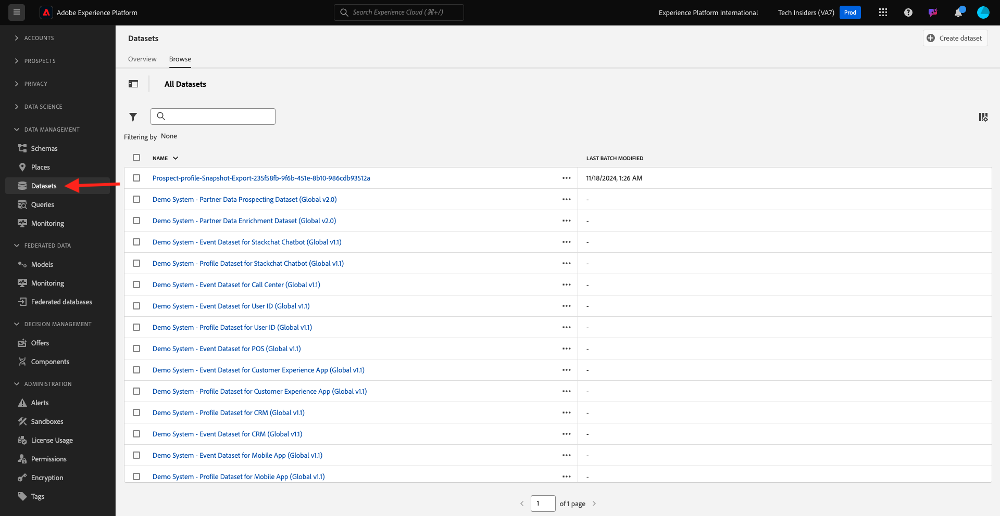
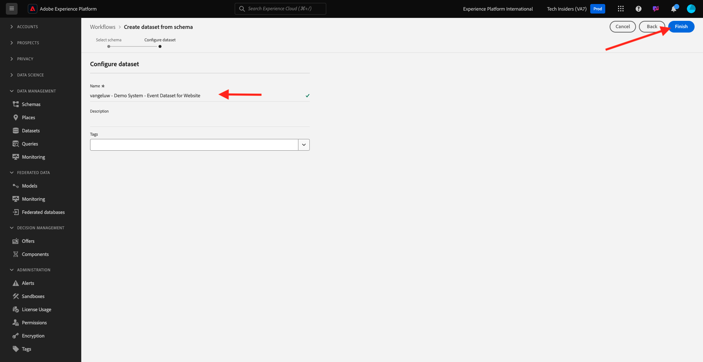

# 1.2.3 Datensätze konfigurieren

In dieser Übung konfigurieren Sie die erforderlichen Datensätze, um Profilinformationen und Kundenverhalten zu erfassen und zu speichern. Jeder Datensatz, den Sie in diesem erstellen, verwendet eines der Schemas, die Sie im vorherigen Schritt erstellt haben.

## Geschichte

Nach der Definition der Antwort auf die Fragen **Wer ist dieser Kunde?** und **Was macht dieser Kunde?** sollte so aussehen, müssen Sie jetzt einen Behälter erstellen, der diese Informationen verwendet, um an Adobe Experience Platform gesendete Daten zu empfangen und zu validieren.

## 1.2.3.1 - Datensätze erstellen

Erstellen Sie nun zwei Datensätze:

- 1 Datensatz zum Erfassen der Informationen, die Antworten auf die Frage &quot;**Wer ist dieser Kunde?&quot;** - Frage.
- 1 Datensatz, um die Informationen zu erfassen, die die **Was tut dieser Kunde?** - Frage.

Melden Sie sich bei Adobe Experience Platform an, indem Sie diese URL verwenden: [https://experience.adobe.com/platform](https://experience.adobe.com/platform).

Nach der Anmeldung landen Sie auf der Startseite von Adobe Experience Platform.

Bevor Sie fortfahren, müssen Sie eine **[!UICONTROL Sandbox]** auswählen. Die auszuwählende Sandbox heißt ``--module2sandbox--``. Klicken Sie dazu in der blauen Zeile oben auf Ihrem Bildschirm auf den Text **[!UICONTROL Produktions-Prod]** . Nachdem Sie die entsprechende [!UICONTROL Sandbox] ausgewählt haben, sehen Sie die Bildschirmänderung und befinden sich nun in Ihrer dedizierten [!UICONTROL Sandbox].

Klicken Sie in Adobe Experience Platform im Menü auf der linken Bildschirmseite auf **[!UICONTROL Datensätze]** .  Daraufhin sehen Sie Folgendes:

Erstellen wir zunächst den Datensatz, um die Website-Registrierungsinformationen zu erfassen.

Sie sollten einen neuen Datensatz erstellen. Um einen neuen Datensatz zu erstellen, klicken Sie auf die Schaltfläche **[!UICONTROL + Datensatz erstellen]**.

Nachdem Sie auf die Schaltfläche **[!UICONTROL + Datensatz erstellen]** geklickt haben, wird der folgende Bildschirm angezeigt.

Sie müssen einen Datensatz aus dem Schema definieren, das Sie im vorherigen Schritt definiert haben. Klicken Sie auf die Option **[!UICONTROL Datensatz aus Schema erstellen]** - .

Wählen Sie im nächsten Bildschirm das Schema aus, das Sie in 1, 0 erstellt haben.`--demoProfileLdap-- - Demo System - Profile Schema for Website`

Klicken Sie nach Auswahl des Schemas auf **[!UICONTROL Weiter]** , um fortzufahren.

Geben wir einen Namen für Ihren Datensatz ein.

Verwenden Sie als Namen für unseren Datensatz Folgendes:

`--demoProfileLdap-- - Demo System - Profile Dataset for Website`

Beispiel: Für ldap **[!UICONTROL vangeluw]** sollte dies der Name des Schemas sein:

**[!UICONTROL vangeluw - Demosystem - Profildatensatz für Website]**

Das sollte Ihnen etwas wie Folgendes geben:

Klicken Sie auf **[!UICONTROL Beenden]** , um die Datensatzkonfiguration abzuschließen.

Jetzt sehen Sie Folgendes:

Gehen Sie zurück zur Übersicht über [!UICONTROL Datensätze] . Der erstellte Datensatz wird nun in der Übersicht angezeigt.

Als Nächstes konfigurieren Sie einen zweiten Datensatz, um Interaktionen mit Websites zu erfassen.

Sie sollten einen neuen Datensatz erstellen. Um einen neuen Datensatz zu erstellen, klicken Sie auf die Schaltfläche **[!UICONTROL + Datensatz erstellen]**.

Nachdem Sie auf die Schaltfläche **[!UICONTROL + Datensatz erstellen]** geklickt haben, wird der folgende Bildschirm angezeigt.

Sie müssen einen Datensatz aus dem Schema definieren, das Sie im vorherigen Schritt definiert haben. Klicken Sie auf die Option **[!UICONTROL Datensatz aus Schema erstellen]** - .

Wählen Sie im nächsten Bildschirm das Schema aus, das Sie in 2.2, `--demoProfileLdap-- - Demo System - Event Schema for Website` erstellt haben.

Klicken Sie nach Auswahl des Schemas auf **[!UICONTROL Weiter]** , um fortzufahren.

Geben wir einen Namen für Ihren Datensatz ein.

Als Name für unseren Datensatz verwenden wir Folgendes:

`--demoProfileLdap-- - Demo System - Event Dataset for Website`

Beispiel: Für ldap **[!UICONTROL vangeluw]** sollte dies der Name des Schemas sein:

**[!UICONTROL vangeluw - Demosystem - Ereignis-Datensatz für Website]**

Das sollte Ihnen etwas wie Folgendes geben:

Klicken Sie auf **[!UICONTROL Beenden]** , um die Datensatzkonfiguration abzuschließen.

Daraufhin sehen Sie Folgendes:

Gehen Sie zurück zum Übersichtsbildschirm [!UICONTROL Datensätze] .

Jetzt müssen Sie Ihre Datensätze aktivieren, damit sie Teil des Echtzeit-Kundenprofils von Adobe Experience Platform sind.

Öffnen Sie Ihren Datensatz &quot;`--demoProfileLdap--` - Demo System - Profil DataSet&quot;für Website, indem Sie darauf klicken.

Suchen Sie das Umschalter [!UICONTROL Profil] auf der rechten Seite des Bildschirms.

Klicken Sie auf den Umschalter [!UICONTROL Profil] , um diesen Datensatz für [!UICONTROL Profil] zu aktivieren.

Klicken Sie auf **[!UICONTROL Aktivieren]**.

Ihr Datensatz ist jetzt für [!UICONTROL Profil] aktiviert.

Gehen Sie zurück zur Datensatzübersicht und öffnen Sie den Datensatz `--demoProfileLdap-- - Demo System - Event Dataset` für die Website, indem Sie darauf klicken.

Suchen Sie das Umschalter [!UICONTROL Profil] auf der rechten Seite des Bildschirms.

Klicken Sie auf den Umschalter [!UICONTROL Profil] , um [!UICONTROL Profil] zu aktivieren.

Klicken Sie auf **[!UICONTROL Aktivieren]**.

Ihr Datensatz ist jetzt für [!UICONTROL Profil] aktiviert.

Nächster Schritt: [1.2.4 Datenerfassung aus Offline-Quellen](./ex4.md)

[Zurück zu Modul 1.2](./data-ingestion.md)

[Zu allen Modulen zurückkehren](../../../overview.md)
