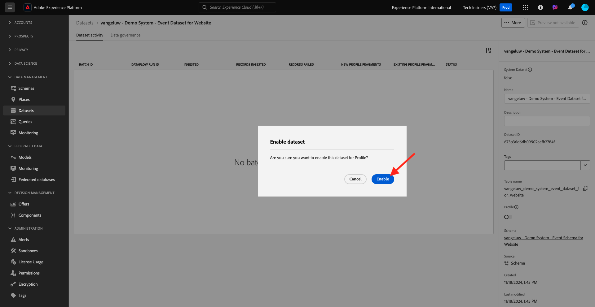

# 1.2.3 Datensätze konfigurieren

In dieser Übung konfigurieren Sie Datensätze, um Profilinformationen und Kundenverhalten zu erfassen und zu speichern. Jeder Datensatz, den Sie in diesem erstellen, verwendet eines der Schemas, die Sie im vorherigen Schritt erstellt haben.

## Kontext

Nach der Definition der Antwort auf die Fragen **Wer ist dieser Kunde?** und **Was macht dieser Kunde?** sollte so aussehen, müssen Sie jetzt einen Behälter erstellen, der diese Informationen verwendet, um an Adobe Experience Platform gesendete Daten zu empfangen und zu validieren.

## Erstellen von Datensätzen

Erstellen Sie nun zwei Datensätze:

- 1 Datensatz zum Erfassen der Informationen, die Antworten auf die Frage &quot;**Wer ist dieser Kunde?&quot;** - Frage.
- 1 Datensatz, um die Informationen zu erfassen, die die **Was tut dieser Kunde?** - Frage.

Melden Sie sich bei Adobe Experience Platform an, indem Sie diese URL verwenden: [https://experience.adobe.com/platform](https://experience.adobe.com/platform).

Nach der Anmeldung landen Sie auf der Startseite von Adobe Experience Platform.

Bevor Sie fortfahren, müssen Sie eine **[!UICONTROL Sandbox]** auswählen. Die auszuwählende Sandbox heißt ``--aepSandboxName--``. Nachdem Sie die entsprechende [!UICONTROL Sandbox] ausgewählt haben, sehen Sie die Bildschirmänderung und befinden sich nun in Ihrer dedizierten [!UICONTROL Sandbox].

Klicken Sie in Adobe Experience Platform im Menü auf der linken Bildschirmseite auf **[!UICONTROL Datensätze]** .  Daraufhin sehen Sie Folgendes:

Erstellen wir zunächst den Datensatz, um die Website-Registrierungsinformationen zu erfassen.

Sie sollten einen neuen Datensatz erstellen. Um einen neuen Datensatz zu erstellen, klicken Sie auf die Schaltfläche **[!UICONTROL + Datensatz erstellen]**.

Sie müssen einen Datensatz aus dem Schema definieren, das Sie im vorherigen Schritt definiert haben. Klicken Sie auf die Option **[!UICONTROL Datensatz aus Schema erstellen]** - .

Wählen Sie im nächsten Bildschirm das Schema aus, das Sie in 1, 0 erstellt haben.`--aepUserLdap-- - Demo System - Profile Schema for Website`

Klicken Sie auf **Weiter**.

Geben wir einen Namen für Ihren Datensatz ein.

Verwenden Sie als Namen für Ihren Datensatz Folgendes:

`--aepUserLdap-- - Demo System - Profile Dataset for Website`

Klicken Sie auf **Fertigstellen**.

Jetzt sehen Sie Folgendes:

Gehen Sie zurück zur Übersicht über [!UICONTROL Datensätze] . Der erstellte Datensatz wird nun in der Übersicht angezeigt.

Als Nächstes konfigurieren Sie einen zweiten Datensatz, um Interaktionen mit Websites zu erfassen.

Klicken Sie auf **[!UICONTROL + Datensatz erstellen]**.

Sie müssen einen Datensatz aus dem Schema definieren, das Sie im vorherigen Schritt definiert haben. Klicken Sie auf die Option **[!UICONTROL Datensatz aus Schema erstellen]** - .

Wählen Sie im nächsten Bildschirm das zuvor erstellte Schema `--aepUserLdap-- - Demo System - Event Schema for Website` aus.

Klicken Sie auf **Weiter**.

Geben wir einen Namen für Ihren Datensatz ein.

Verwenden Sie als Namen für unseren Datensatz Folgendes:

`--aepUserLdap-- - Demo System - Event Dataset for Website`

Klicken Sie auf **Fertigstellen**.

Daraufhin sehen Sie Folgendes:

Gehen Sie zurück zum Übersichtsbildschirm [!UICONTROL Datensätze] .

Jetzt müssen Sie Ihre Datensätze aktivieren, damit sie Teil des Echtzeit-Kundenprofils von Adobe Experience Platform sind.

Öffnen Sie den Datensatz `--aepUserLdap-- - Demo System - Profile Dataset for Website`, indem Sie darauf klicken.

Suchen Sie das Umschalter [!UICONTROL Profil] auf der rechten Seite des Bildschirms.
Klicken Sie auf den Umschalter [!UICONTROL Profil] , um diesen Datensatz für [!UICONTROL Profil] zu aktivieren.

Klicken Sie auf **[!UICONTROL Aktivieren]**.

Ihr Datensatz ist jetzt für [!UICONTROL Profil] aktiviert.

Gehen Sie zurück zur Datensatzübersicht und öffnen Sie den Datensatz `--aepUserLdap-- - Demo System - Event Dataset` für die Website, indem Sie darauf klicken.

Suchen Sie das Umschalter [!UICONTROL Profil] auf der rechten Seite des Bildschirms. Klicken Sie auf den Umschalter [!UICONTROL Profil] , um [!UICONTROL Profil] zu aktivieren.

Klicken Sie auf **[!UICONTROL Aktivieren]**.

Ihr Datensatz ist jetzt für [!UICONTROL Profil] aktiviert.

Nächster Schritt: [1.2.4 Datenerfassung aus Offline-Quellen](./ex4.md)

[Zurück zu Modul 1.2](./data-ingestion.md)

[Zu allen Modulen zurückkehren](../../../overview.md)
