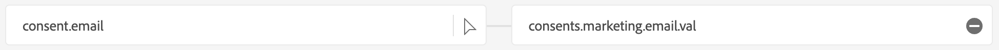
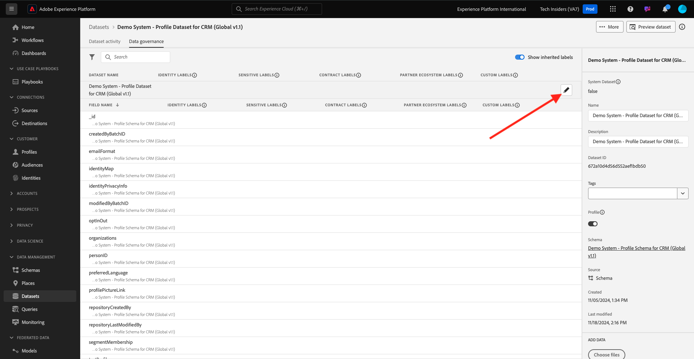

# 1.2.4 Datenaufnahme aus Offline-Quellen

In dieser Übung besteht das Ziel darin, externe Daten wie CRM-Daten in Platform zu integrieren.

## Lernziele

- Erfahren Sie, wie Sie Testdaten erzeugen
- Erfahren Sie, wie Sie CSV aufnehmen
- Erfahren Sie, wie Sie die Web-Benutzeroberfläche für die Datenaufnahme über Workflows verwenden
- Die Data Governance-Funktionen von Experience Platform

## Ressourcen

- Mockaroo: [https://www.mockaroo.com/](https://www.mockaroo.com/)
- Adobe Experience Platform: [https://experience.adobe.com/platform/](https://experience.adobe.com/platform/)

## Aufgaben

- Erstellen Sie eine CSV-Datei mit Demodaten. Nehmen Sie die CSV-Datei mithilfe der verfügbaren Workflows in Adobe Experience Platform auf.
- Grundlegendes zu den Data Governance-Optionen in Adobe Experience Platform

## Erstellen eines CRM-Datensatzes mithilfe eines Datengenerator-Tools

Für diese Übung benötigen Sie 1000 Beispielzeilen mit CRM-Daten.

Öffnen Sie die Mockaroo-Vorlage unter [https://www.mockaroo.com/12674210](https://www.mockaroo.com/12674210).

In der Vorlage werden Sie die folgenden Felder bemerken:

- id
- first_name
- last_name
- E-Mail
- gender
- birthDate
- home_latitude
- HOME_LÄNGE
- Länder-Code
- city
- country
- crmId
- consent.email
- consent.commercialEmail
- consent.any

Alle diese Felder wurden definiert, um Daten zu generieren, die mit Platform kompatibel sind.

Um Ihre CSV-Datei zu generieren, klicken Sie auf **[!UICONTROL Daten generieren]** Schaltfläche, um eine CSV-Datei mit 1000 Zeilen Demodaten zu erstellen und herunterzuladen.

Öffnen Sie die CSV-Datei, um den Inhalt zu visualisieren.

Wenn Ihre CSV-Datei fertig ist, können Sie mit der Aufnahme in AEP fortfahren.

### Überprüfen des Datensatzes

Navigieren Sie zu [https://experience.adobe.com/platform](https://experience.adobe.com/platform).

Bevor Sie fortfahren, müssen Sie eine **[!UICONTROL Sandbox“]**. Die auszuwählende Sandbox hat den Namen ``--aepSandboxName--``.

Klicken Sie in Adobe Experience Platform **[!UICONTROL Datensätze]** im Menü links auf dem Bildschirm.

Sie verwenden einen freigegebenen Datensatz. Der freigegebene Datensatz wurde bereits erstellt und heißt **[!UICONTROL Demosystem - Profildatensatz für CRM (Global v1.1)]**. Klicken Sie darauf, um sie zu öffnen.

Auf dem Bildschirm Übersicht sehen Sie drei Hauptinformationen.

>[!NOTE]
>
>Es ist möglich, dass die Ansicht Ihres Datensatzes leer ist, wenn in den letzten sieben Tagen keine Aktivität aufgetreten ist.

Zunächst zeigt das Dashboard [!UICONTROL Datensatzaktivität] die Gesamtzahl der CRM-Datensätze im Datensatz sowie die aufgenommenen Batches und deren Status an

Zweitens können Sie durch Scrollen auf der Seite nach unten überprüfen, wann Datenstapel aufgenommen wurden, wie viele Datensätze integriert wurden und auch, ob der Batch erfolgreich integriert wurde oder nicht. Die **[!UICONTROL Batch]** ID) ist die Kennung für einen bestimmten Batch-Vorgang und die **[!UICONTROL Batch-ID]** ist wichtig, da sie zur Fehlerbehebung verwendet werden kann, warum ein bestimmter Batch nicht erfolgreich integriert wurde.

Schließlich zeigt die Registerkarte [!UICONTROL Datensatz] Informationen wichtige Informationen wie die [!UICONTROL Datensatz-ID] (auch hier aus Sicht der Fehlerbehebung wichtig), den Namen des Datensatzes und ob der Datensatz für Profil aktiviert wurde.

Die wichtigste Einstellung hier ist die Verknüpfung zwischen dem Datensatz und dem Schema. Das Schema definiert, welche Daten aufgenommen werden können und wie diese Daten aussehen sollten.

In diesem Fall verwenden wir das **[!UICONTROL Demosystem - Profilschema für CRM (Global v1.1)]**, das der Klasse von **[!UICONTROL Profile]** zugeordnet ist und Erweiterungen, auch als Feldergruppen bezeichnet, implementiert hat.

Wenn Sie auf den Namen des Schemas klicken, gelangen Sie zur Übersicht [!UICONTROL Schema], in der alle Felder angezeigt werden, die für dieses Schema aktiviert wurden.

Für jedes Schema muss ein benutzerdefinierter, primärer Deskriptor definiert sein. Im Fall unseres CRM-Datensatzes hat das Schema definiert, dass das Feld **[!UICONTROL crmId]** die primäre Kennung sein sollte. Wenn Sie ein Schema erstellen und mit dem [!UICONTROL Echtzeit-Kundenprofil] verknüpfen möchten, müssen Sie eine benutzerdefinierte [!UICONTROL Feldergruppe] definieren, die auf Ihren primären Deskriptor verweist.

Sie können auch sehen, dass sich unsere primäre Identität in `--aepTenantId--.identification.core.crmId` befindet, verknüpft mit dem [!UICONTROL namespace] von **[!UICONTROL Demo System - CRMID]**.

Jedes Schema und somit jeder Datensatz, der im [!UICONTROL Echtzeit-Kundenprofil“ verwendet werden soll] sollte über eine [!UICONTROL Primäre Kennung verfügen]. Diese [!UICONTROL Primäre Kennung] ist die von der Marke für einen Kunden in diesem Datensatz verwendete Kennung. Bei einem CRM-Datensatz kann es sich um die E-Mail-Adresse oder die CRM-ID handeln. Bei einem Callcenter-Datensatz kann es sich um die Mobiltelefonnummer eines Kunden handeln.

Es empfiehlt sich, für jeden Datensatz ein separates, spezifisches Schema zu erstellen und den Deskriptor für jeden Datensatz spezifisch so festzulegen, dass er mit der Funktionsweise der aktuellen von der Marke verwendeten Lösungen übereinstimmt.

### Verwenden eines Workflows zum Zuordnen einer CSV-Datei zu einem XDM-Schema

Ziel dieser Übung ist es, CRM-Daten in AEP zu integrieren. Alle Daten, die in Platform aufgenommen werden, sollten dem jeweiligen XDM-Schema zugeordnet werden. Derzeit verfügen Sie auf der einen Seite über einen CSV-Datensatz mit 1.000 Zeilen und auf der anderen Seite über einen Datensatz, der mit einem Schema verknüpft ist. Um diese CSV-Datei in diesen Datensatz zu laden, muss eine Zuordnung erfolgen. Um diese Zuordnungsübung zu erleichtern, stehen in **[!UICONTROL Workflows]** Adobe Experience Platform zur Verfügung.

Klicken Sie auf **[!UICONTROL CSV zu XDM-Schema zuordnen]** und anschließend auf **[!UICONTROL Starten]**, um den Prozess zu starten.

Im nächsten Bildschirm müssen Sie einen Datensatz auswählen, in den Sie Ihre Datei aufnehmen möchten. Sie haben die Wahl, einen bereits vorhandenen Datensatz auszuwählen oder einen neuen zu erstellen. Für diese Übung verwenden wir eine vorhandene: Wählen Sie **[!UICONTROL Demosystem - Profildatensatz für CRM (Global v1.1)]** wie unten angegeben aus und lassen Sie die anderen Einstellungen auf den Standard gesetzt.

Klicken Sie auf **Weiter**.

Ziehen Sie Ihre CSV-Datei per Drag-and-Drop oder klicken Sie **[!UICONTROL Dateien auswählen]** und navigieren Sie auf Ihrem Computer zu Ihrem Desktop und wählen Sie Ihre CSV-Datei aus.

Nachdem Sie Ihre CSV-Datei ausgewählt haben, wird sie sofort hochgeladen und Sie sehen in Sekundenschnelle eine Vorschau Ihrer Datei.

Klicken Sie auf **Weiter**.

Jetzt müssen Sie die Spaltenüberschriften aus Ihrer CSV-Datei einer XDM-Eigenschaft in Ihrem **[!UICONTROL Demosystem - Profildatensatz für CRM)]**.

Adobe Experience Platform hat bereits einige Vorschläge für Sie unterbreitet, indem versucht wurde, die [!UICONTROL Source-Attribute] mit den [!UICONTROL Zielschemafeldern“ ].

>[!NOTE]
>
>Machen Sie sich keine Sorgen, wenn im Zuordnungsbildschirm Fehler angezeigt werden. Nach Befolgung der folgenden Anweisungen werden diese Fehler behoben.

Für die [!UICONTROL Schemazuordnungen] hat Adobe Experience Platform bereits versucht, Felder miteinander zu verknüpfen. Allerdings sind nicht alle Zuordnungsvorschläge korrekt. Jetzt müssen Sie die **Zielfelder** einzeln aktualisieren.

#### birthDate

Das Source-**&quot;**&quot; sollte mit dem Zielfeld „Person **Geburtsdatum“ verknüpft**.

#### city

Das Source-Schemafeld **city** sollte mit dem Zielfeld „homeAddress **city“ verknüpft**.

#### country

Das Source-Schemafeld **country** sollte mit dem Zielfeld „homeAddress.**&quot; verknüpft**.

#### Länder-Code

Das Source-Schemafeld **country_code** sollte mit dem Zielfeld „homeAddress **countryCode“ verknüpft**.

#### E-Mail

Das Source-Schemafeld **email** sollte mit dem Zielfeld **personalEmail.address) verknüpft**.

#### crmid

Das Source-Schemafeld **crmid** sollte mit dem Zielfeld **`--aepTenantId--`.identification.core.crmId} verknüpft**.

#### first_name

Das Source-Schemafeld **first_name** sollte mit dem Zielfeld **person.name.firstName** verknüpft werden.

#### gender

Das Source-Schemafeld **gender** sollte mit dem Zielfeld **person.gender** verknüpft werden.

#### home_latitude

Das Source-Schemafeld **home_latitude** sollte mit dem Zielfeld „homeAddress **verknüpft werden._schema.Latitude**.

#### HOME_LÄNGE

Das Source-Schemafeld **home_length** sollte mit dem Zielfeld „homeAddress **verknüpft werden._schema.Longitude**.

#### id

Das Source-Schemafeld **id** sollte mit dem Zielfeld **_id verknüpft**.

#### last_name

Das Source-Schemafeld **last_name** sollte mit dem Zielfeld **person.name.lastName** verknüpft werden.

#### consents.marketing.email.val

Das Source-Schemafeld **last_name** sollte mit dem Zielfeld **consents.marketing.email.val** verknüpft werden.

#### consents.marketing.commercialEmail.val

Das Source-Schemafeld **last_name** sollte mit dem Zielfeld **consents.marketing.commercialEmail.val** verknüpft werden.

#### consents.marketing.any.val

Das Source-Schemafeld **last_name** sollte mit dem Zielfeld &quot;**.marketing.any.val“ verknüpft**.

Du solltest das jetzt haben. Klicken Sie auf **Fertigstellen**.

Nachdem Sie auf **[!UICONTROL Beenden]** geklickt haben, sehen Sie die Übersicht **Datenfluss** und nach einigen Minuten können Sie Ihren Bildschirm aktualisieren, um zu sehen, ob Ihr Workflow erfolgreich abgeschlossen wurde. Klicken Sie auf **Name des Zieldatensatzes**.

Anschließend sehen Sie den Datensatz, in dem Ihre Aufnahme verarbeitet wurde, und eine [!UICONTROL Batch-ID], die gerade erfasst wurde, mit 1.000 aufgenommenen Datensätzen und dem Status **[!UICONTROL Erfolg]**. Klicken Sie **[!UICONTROL Datensatz in der Vorschau anzeigen]**.

Sie sehen jetzt ein kleines Beispiel für den Datensatz, um sicherzustellen, dass die geladenen Daten korrekt sind.

Nachdem die Daten geladen wurden, können Sie den richtigen Data-Governance-Ansatz für Ihren Datensatz definieren.

### Hinzufügen von Data Governance zu einem Datensatz

Nachdem Ihre Kundendaten erfasst wurden, müssen Sie sicherstellen, dass dieser Datensatz ordnungsgemäß für die Verwendung und Exportkontrolle verwaltet wird. Klicken Sie auf die **[!UICONTROL Data Governance]** und beachten Sie, dass Sie mehrere Arten von Einschränkungen festlegen können: Vertrag, Identität und Vertraulich, Partner-Ökosystem und Benutzerdefiniert.

Beschränken wir Identitätsdaten für den gesamten Datensatz. Bewegen Sie den Mauszeiger über den Datensatznamen und klicken Sie auf das Stiftsymbol, um die Einstellungen zu bearbeiten.

Gehen Sie **[!UICONTROL Identitätskennzeichnungen]** und Sie werden sehen, dass die Option **[!UICONTROL I2]** aktiviert ist. Dabei wird davon ausgegangen, dass alle Informationen in diesem Datensatz für die Person zumindest indirekt identifizierbar sind.

Klicken Sie **[!UICONTROL Änderungen speichern]**.

In einem anderen Modul werden wir einen tieferen Einblick in das WHO-Framework von Data Governance und Kennzeichnungen geben.

Damit haben Sie jetzt CRM-Daten erfolgreich in Adobe Experience Platform aufgenommen und klassifiziert.

Nächster Schritt: [1.2.5 Data Landing Zone](./ex5.md)

[Zurück zum Modul 1.2](./data-ingestion.md)

[Zurück zu „Alle Module“](../../../overview.md)
