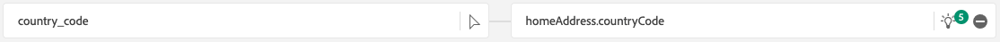
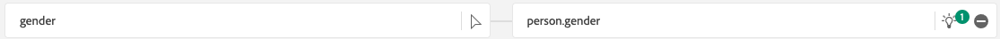

# 1.2.4 Datenerfassung aus Offline-Quellen

In dieser Übung besteht das Ziel darin, externe Daten wie CRM-Daten in Platform einzubinden.

## Lernziele

- Erfahren Sie, wie Sie Testdaten generieren
- Erfahren Sie, wie Sie CSV erfassen.
- Erfahren Sie, wie Sie die Web-Benutzeroberfläche für die Datenerfassung über Workflows verwenden.
- Grundlegendes zu den Data Governance-Funktionen von Experience Platform

## Ressourcen

- Mockaroo: [https://www.mockaroo.com/](https://www.mockaroo.com/)
- Adobe Experience Platform: [https://experience.adobe.com/platform/](https://experience.adobe.com/platform/)

## Aufgaben

- Erstellen Sie eine CSV-Datei mit Demodaten. Erfassen Sie die CSV-Datei in Adobe Experience Platform, indem Sie die verfügbaren Workflows verwenden.
- Data Governance-Optionen in Adobe Experience Platform

## Erstellen eines CRM-Datensatzes mit einem Tool zum Generieren von Daten

Für diese Übung benötigen Sie 1000 Beispielzeilen von CRM-Daten.

Öffnen Sie die Mockaroo-Vorlage, indem Sie zu [https://www.mockaroo.com/12674210](https://www.mockaroo.com/12674210) navigieren.

Auf der Vorlage werden die folgenden Felder angezeigt:

- id
- first_name
- last_name
- E-Mail
- gender
- birthDate
- home_latitude
- home_longitude
- country_code
- city
- country

Alle diese Felder wurden definiert, um Daten zu erzeugen, die mit Platform kompatibel sind.

Um Ihre CSV-Datei zu generieren, klicken Sie auf die Schaltfläche **[!UICONTROL Daten generieren]** , um eine CSV-Datei mit 1000 Zeilen Demodaten zu erstellen und herunterzuladen.

Öffnen Sie Ihre CSV-Datei, um deren Inhalt zu visualisieren.

Wenn Ihre CSV-Datei fertig ist, können Sie mit der Aufnahme in AEP fortfahren.

### Datensatz überprüfen

Öffnen Sie [Adobe Experience Platform](https://experience.adobe.com/platform) und gehen Sie zu **[!UICONTROL Datensätze]**.

Bevor Sie fortfahren, müssen Sie eine **[!UICONTROL Sandbox]** auswählen. Die auszuwählende Sandbox heißt ``--aepSandboxName--``.

Klicken Sie in Adobe Experience Platform im Menü auf der linken Bildschirmseite auf **[!UICONTROL Datensätze]** .

Sie verwenden einen freigegebenen Datensatz. Der freigegebene Datensatz wurde bereits erstellt und heißt **[!UICONTROL Demo-System - Profildatensatz für CRM (Global v1.1)]**. Klicken Sie darauf, um es zu öffnen.

Auf dem Übersichtsbildschirm können Sie drei Hauptinformationen sehen.

Zunächst zeigt das Dashboard [!UICONTROL Datensatzaktivität] die Gesamtzahl der CRM-Datensätze im Datensatz sowie die erfassten Batches und ihren Status an

Außerdem können Sie durch Scrollen auf der Seite überprüfen, wann Datenstapel erfasst wurden, wie viele Datensätze integriert wurden und ob der Batch erfolgreich integriert wurde oder nicht. Die **[!UICONTROL Batch-Kennung]** ist die Kennung für einen bestimmten Batch-Auftrag und die **[!UICONTROL Batch-Kennung]** ist wichtig, da sie zur Fehlerbehebung verwendet werden kann, warum ein bestimmter Batch nicht erfolgreich integriert wurde.

Schließlich enthält die Registerkarte [!UICONTROL Datensatz]-Info wichtige Informationen wie die [!UICONTROL Datensatz-ID] (ebenfalls wichtig aus der Sicht der Fehlerbehebung), den Namen des Datensatzes und ob der Datensatz für Profil aktiviert wurde.

Die wichtigste Einstellung hier ist die Verknüpfung zwischen dem Datensatz und dem Schema. Das Schema definiert, wie Daten erfasst werden können und wie diese aussehen sollen.

In diesem Fall verwenden wir das Schema &quot;**[!UICONTROL Demo System - Profil für CRM&quot;(Global v1.1)]**&quot;, das der Klasse von **[!UICONTROL Profil]** zugeordnet ist und Erweiterungen implementiert hat, auch Feldergruppen genannt.

Durch Klicken auf den Namen des Schemas gelangen Sie zur Übersicht [!UICONTROL Schema] , in der alle für dieses Schema aktivierten Felder angezeigt werden.

Für jedes Schema muss ein benutzerdefinierter, primärer Deskriptor definiert sein. Im Fall unseres CRM-Datensatzes hat das Schema definiert, dass das Feld **[!UICONTROL crmId]** die primäre Kennung sein sollte. Wenn Sie ein Schema erstellen und mit dem [!UICONTROL Echtzeit-Kundenprofil] verknüpfen möchten, müssen Sie eine benutzerdefinierte [!UICONTROL Feldergruppe] definieren, die auf Ihren primären Deskriptor verweist.

Sie können auch sehen, dass sich unsere primäre Identität in `--aepTenantId--.identification.core.crmId` befindet, verknüpft mit dem [!UICONTROL Namespace] von **[!UICONTROL Demo System - CRMID]**.

Jedes Schema und als solches sollte jeder Datensatz, der im [!UICONTROL Echtzeit-Kundenprofil] verwendet werden soll, einen [!UICONTROL Primären Bezeichner] haben. Diese [!UICONTROL Primäre Kennung] ist der Kennungsbenutzer, den die Marke für einen Kunden in diesem Datensatz verwendet. Bei einem CRM-Datensatz kann es sich um die E-Mail-Adresse oder die CRM-ID handeln. Bei einem Call-Center-Datensatz kann es sich um die Mobiltelefonnummer eines Kunden handeln.

Es empfiehlt sich, für jeden Datensatz ein separates, spezifisches Schema zu erstellen und den Deskriptor für jeden Datensatz so festzulegen, dass er mit der aktuellen Funktionsweise der von der Marke verwendeten Lösungen übereinstimmt.

### Verwenden eines Workflows zum Zuordnen einer CSV-Datei zu einem XDM-Schema

Ziel dieser Übung ist es, CRM-Daten in AEP zu integrieren. Alle Daten, die in Platform erfasst werden, sollten dem jeweiligen XDM-Schema zugeordnet werden. Derzeit verfügen Sie über einen CSV-Datensatz mit 1000 Zeilen auf der einen Seite und einen Datensatz, der mit einem Schema auf der anderen Seite verknüpft ist. Um diese CSV-Datei in diesen Datensatz zu laden, muss eine Zuordnung vorgenommen werden. Um diese Zuordnungsübung zu erleichtern, steht in Adobe Experience Platform **[!UICONTROL Workflows]** zur Verfügung.

Klicken Sie auf **[!UICONTROL CSV dem XDM-Schema zuordnen]** und dann auf **[!UICONTROL Starten]** , um den Prozess zu starten.

Im nächsten Bildschirm müssen Sie einen Datensatz auswählen, in dem Ihre Datei aufgenommen werden soll. Sie haben die Wahl zwischen der Auswahl eines bereits vorhandenen Datensatzes oder der Erstellung eines neuen Datensatzes. Für diese Übung verwenden wir einen vorhandenen Datensatz erneut: Wählen Sie bitte &quot;**[!UICONTROL Demo-System - Profildatensatz für CRM (Global v1.1)]**&quot;, wie unten angegeben, und lassen Sie die anderen Einstellungen standardmäßig aktiviert.

Klicken Sie auf **Weiter**.

Ziehen Sie Ihre CSV-Datei per Drag-and-Drop oder klicken Sie auf **[!UICONTROL Dateien auswählen]** und navigieren Sie auf Ihrem Computer zu Ihrem Desktop und wählen Sie Ihre CSV-Datei aus.

Nachdem Sie Ihre CSV-Datei ausgewählt haben, wird sie sofort hochgeladen und Sie erhalten innerhalb von Sekunden eine Vorschau Ihrer Datei.

Klicken Sie auf **Weiter**.

Jetzt müssen Sie die Spaltenüberschriften aus Ihrer CSV-Datei einer XDM-Eigenschaft in Ihrem **[!UICONTROL Demo-System - Profildatensatz für CRM]** zuordnen.

Adobe Experience Platform hat bereits einige Vorschläge für Sie gemacht, indem es versucht hat, die [!UICONTROL Source-Attribute] mit den [!UICONTROL Target-Schemafeldern] zu verknüpfen.

Für die [!UICONTROL Schemazuordnungen] hat Adobe Experience Platform bereits versucht, Felder miteinander zu verknüpfen. Allerdings sind nicht alle Vorschläge zur Kartierung korrekt. Sie müssen die **Zielfelder** jetzt einzeln aktualisieren.

#### birthDate

Das Source-Schemafeld **birthDate** sollte mit dem Zielfeld **person.birthDate** verknüpft sein.

#### city

Das Source-Schemafeld **city** sollte mit dem Zielfeld **homeAddress.city** verknüpft werden.

#### country

Das Source-Schemafeld **country** sollte mit dem Zielfeld **homeAddress.country** verknüpft sein.

#### country_code

Das Source-Schemafeld **country_code** sollte mit dem Zielfeld **homeAddress.countryCode** verknüpft sein.

#### E-Mail

Das Source-Schemafeld **email** sollte mit dem Zielfeld **personalEmail.address** verknüpft sein.

#### crmid

Das Source-Schemafeld **crmid** sollte mit dem Zielfeld **`--aepTenantId--`.identification.core.crmId** verknüpft werden.

#### first_name

Das Source-Schemafeld **first_name** sollte mit dem Zielfeld **person.name.firstName** verknüpft sein.

#### gender

Das Source-Schemafeld **gender** sollte mit dem Zielfeld **person.gender** verknüpft werden.

#### home_latitude

Das Source-Schemafeld **home_latitude** sollte mit dem Zielfeld **homeAddress verknüpft werden._schema.latitude**.

#### home_longitude

Das Source-Schemafeld **home_longitude** sollte mit dem Zielfeld **homeAddress verknüpft sein._schema.longitude**.

#### id

Das Source-Schemafeld **id** sollte mit dem Zielfeld **_id** verknüpft sein.

#### last_name

Das Source-Schemafeld **last_name** sollte mit dem Zielfeld **person.name.lastName** verknüpft sein.

Du solltest das jetzt haben. Klicken Sie auf **Fertigstellen**.

Nachdem Sie auf **[!UICONTROL Beenden]** geklickt haben, sehen Sie die Übersicht über den **Datenfluss** und nach einigen Minuten können Sie Ihren Bildschirm aktualisieren, um festzustellen, ob Ihr Workflow erfolgreich abgeschlossen wurde. Klicken Sie auf Ihren **Target-Datensatznamen**.

Dann sehen Sie den Datensatz, in dem Ihre Aufnahme verarbeitet wurde, und eine [!UICONTROL Batch-Kennung], die gerade erfasst wurde, mit 100 aufgenommenen Datensätzen und dem Status **[!UICONTROL Erfolg]**. Klicken Sie auf **[!UICONTROL Vorschau des Datensatzes anzeigen]**.

Es wird nun eine kleine Stichprobe des Datensatzes angezeigt, um sicherzustellen, dass die geladenen Daten korrekt sind.

Nachdem die Daten geladen wurden, können Sie den richtigen Data Governance-Ansatz für unseren Datensatz definieren.

### Hinzufügen von Data Governance zu Ihrem Datensatz

Nachdem Ihre Kundendaten erfasst wurden, müssen Sie sicherstellen, dass dieser Datensatz ordnungsgemäß für die Verwendung und Exportsteuerung verwaltet wird. Klicken Sie auf die Registerkarte **[!UICONTROL Data Governance]** und beachten Sie, dass Sie mehrere Arten von Einschränkungen festlegen können: Vertrag, Identität und vertraulich, Partner-Ökosystem und Benutzerdefiniert.

Schränken wir Identitätsdaten für den gesamten Datensatz ein. Bewegen Sie den Mauszeiger über den Namen Ihres Datensatzes und klicken Sie auf das Stiftsymbol, um die Einstellungen zu bearbeiten.

Wechseln Sie zu **[!UICONTROL Identitätsdaten]** und Sie werden sehen, dass die Option **[!UICONTROL I2]** aktiviert ist. Dies setzt voraus, dass alle Informationen in diesem Datensatz zumindest indirekt für die Person identifizierbar sind.

Klicken Sie auf **[!UICONTROL Änderungen speichern]**.

In einem anderen Modul werden wir einen tiefen Einblick in das Wem-Framework von Data Governance und Beschriftungen geben.

Damit haben Sie jetzt erfolgreich CRM-Daten in Adobe Experience Platform erfasst und klassifiziert.

Nächster Schritt: [ 1.2.5 Data Landing Zone](./ex5.md)

[Zurück zu Modul 1.2](./data-ingestion.md)

[Zu allen Modulen zurückkehren](../../../overview.md)
