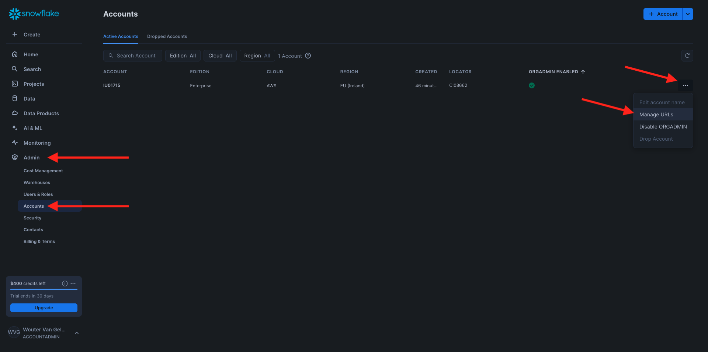
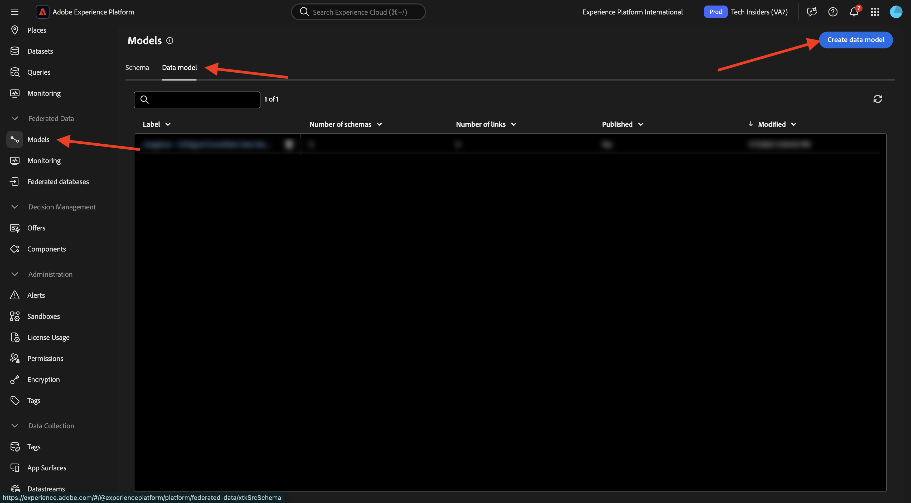
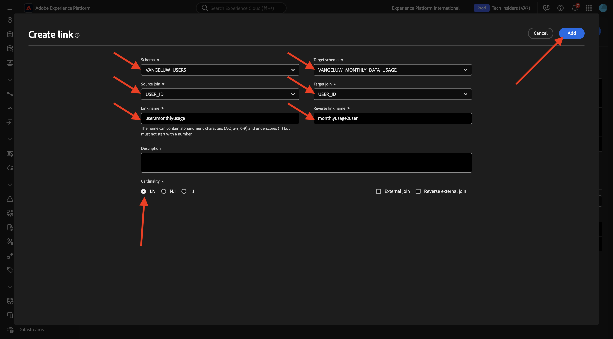
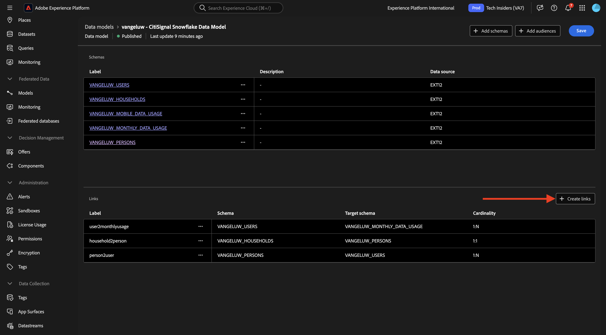

# 1.3.2 Erstellen von Schemata, Datenmodellen und Links

Sie können jetzt Ihre Federated Database in AEP konfigurieren.

Melden Sie sich über die folgende URL bei Adobe Experience Platform an: [https://experience.adobe.com/platform](https://experience.adobe.com/platform).

Nach dem Login landen Sie auf der Homepage von Adobe Experience Platform.

Bevor Sie fortfahren, müssen Sie eine **Sandbox“**. Die auszuwählende Sandbox hat den Namen ``--aepSandboxName--``. Nach Auswahl der entsprechenden Sandbox wird der Bildschirm geändert und Sie befinden sich nun in Ihrer dedizierten Sandbox.

## 1.3.2.1 Einrichten einer Federated Database in AEP

Klicken Sie **linken Menü auf** Verknüpfte Datenbanken“. Klicken Sie dann auf **Federated Database hinzufügen**.

Als **label** verwenden Sie `--aepUserLdap-- - CitiSignal Snowflake` und wählen Sie für den Typ **Snowflake**.

Unter „Details“ müssen Sie Ihre Anmeldedaten ausfüllen, die wie folgt aussehen:

**Server**:

Gehen Sie in Snowflake zu **Admin > Konten**. Klicken Sie auf die 3 **…** neben Ihrem Konto und dann auf **URLs verwalten**.

Sie werden es dann sehen. Kopieren Sie die **Aktuelle URL** und fügen Sie sie in das Feld **Server** in AEP ein.

**Benutzer**: Der zuvor in Übung 1.3.1.1 erstellte Benutzername
**Password**: Das zuvor in Übung 1.3.1.1 erstellte Kennwort
**Datenbank**: verwenden **CITISIGNAL**

Am Ende sollte es also so sein. Klicken Sie **Verbindung testen**. Wenn der Test erfolgreich ist, klicken Sie auf **Funktionen bereitstellen**, um Funktionen auf der Snowflake zu erstellen, die für die Workflow-Engine erforderlich sind.

Sobald die Verbindung erfolgreich getestet wurde und die Funktionen bereitgestellt sind, wird Ihre Konfiguration gespeichert.

Wenn Sie dann zurück zum Menü **Federated Datenbanken** gehen, sehen Sie Ihre Verbindung dort.

## 1.3.2.2 Erstellen von Schemata in AEP

Klicken Sie im linken Menü auf **Modelle** und gehen Sie dann zu **Schemata**. Klicken Sie **Schema erstellen**.

Wählen Sie Ihre Federated Database aus und klicken Sie auf **+ Tabellen hinzufügen**.

Sie werden es dann sehen. Wählen Sie die 5 Tabellen aus, die Sie zuvor in Snowflake erstellt haben:

- `CK_HOUSEHOLDS`
- `CK_MOBILE_DATA_USAGE`
- `CK_MONTHLY_DATA_USAGE`
- `CK_PERSONS`
- `CK_USERS`

Klicken Sie auf **Hinzufügen**.

AEP lädt dann die Informationen der einzelnen Tabellen und zeigt sie in der Benutzeroberfläche an.

Für jede Tabelle können Sie folgende Vorgänge durchführen:

- Ändern des Schema-Labels
- Hinzufügen einer Beschreibung
- Umbenennen aller Felder und Festlegen ihrer Sichtbarkeit
- Primärschlüssel für das Schema auswählen

Für diese Übung sind keine Änderungen erforderlich.

Klicken Sie auf **Erstellen**.

Sie werden es dann sehen. Sie können auf ein beliebiges Schema klicken und die Informationen überprüfen. Klicken Sie beispielsweise auf **CK_PERSONS**.

Anschließend sehen Sie dies mit der Möglichkeit, die Konfiguration zu bearbeiten. Klicken Sie **Daten**, um ein Beispiel für die Daten in der Snowflake-Datenbank anzuzeigen.

Anschließend sehen Sie ein Beispiel der Daten.

## 1.3.2.3 Erstellen eines Modells in AEP

Gehen Sie im linken Menü zu **Modelle** und dann zu **Datenmodell**. Klicken Sie **Datenmodell erstellen**.

Verwenden Sie für die Bezeichnung `--aepUserLdap-- - CitiSignal Snowflake Data Model`. Klicken Sie auf **Erstellen**.

Klicken Sie **Schemata hinzufügen**.

Wählen Sie Ihre Schemata aus und klicken Sie auf **Hinzufügen**.

Sie werden es dann sehen. Klicken Sie auf **Speichern**.

Sie können jetzt mit der Definition von Links zwischen Schemata beginnen. Um einen Link zu definieren, klicken Sie auf **Links erstellen**.

Definieren wir zunächst die Relation zwischen dem `CK_USERS` und dem `CK_PERSONS`.

Klicken Sie auf **Hinzufügen**.

Dann bist du wieder hier. Klicken Sie auf **Links erstellen**, um einen weiteren Link zu erstellen.

Als Nächstes definieren wir die Relation zwischen dem `CK_HOUSEHOLDS` und dem `CK_PERSONS`.

Dann bist du wieder hier. Klicken Sie auf **Links erstellen**, um einen weiteren Link zu erstellen.

Als Nächstes definieren wir die Relation zwischen dem `CK_MONTHLY_DATA_USAGE` und dem `CK_USERS`.

Dann bist du wieder hier. Klicken Sie auf **Links erstellen**, um einen weiteren Link zu erstellen.

Als Nächstes definieren wir die Relation zwischen dem `CK_USERS` und dem `CK_HOUSEHOLDS`.

Dann bist du wieder hier. Klicken Sie **Speichern**.

Die Einrichtung in AEP ist jetzt abgeschlossen. Sie können jetzt mit der Verwendung Ihrer Federated Data in einer Federated-Audience-Komposition beginnen.

Nächster Schritt: [1.3.3 Erstellen einer Federated Composition](./ex3.md)

[Zurück zum Modul 1.3](./fac.md)

[Zurück zu „Alle Module“](../../../overview.md)
