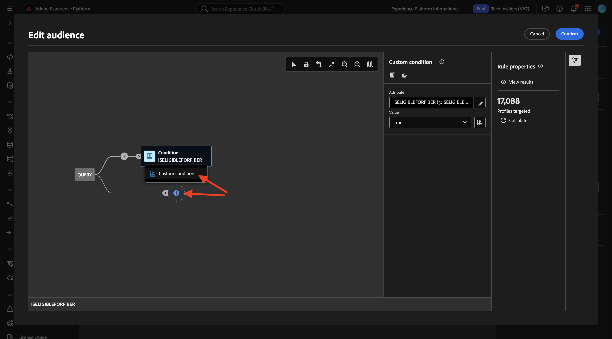
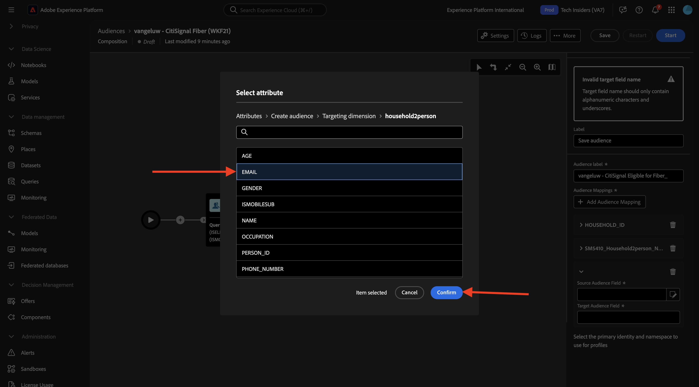

# 1.3.3 Erstellen einer Verbundzusammensetzung

Sie können jetzt Ihre Federated-Audience-Komposition in AEP konfigurieren.

Melden Sie sich über die folgende URL bei Adobe Experience Platform an: [https://experience.adobe.com/platform](https://experience.adobe.com/platform).

Nach dem Login landen Sie auf der Homepage von Adobe Experience Platform.

Bevor Sie fortfahren, müssen Sie eine **Sandbox“**. Die auszuwählende Sandbox hat den Namen ``--aepSandboxName--``. Nach Auswahl der entsprechenden Sandbox wird der Bildschirm geändert und Sie befinden sich nun in Ihrer dedizierten Sandbox.

## 1.3.3.1 Zielgruppe erstellen

Gehen Sie im linken Menü zu **Zielgruppen** und dann zu **Verbundkompositionen**. Klicken Sie **Komposition erstellen**.

Verwenden Sie für die Bezeichnung Folgendes: `--aepUserLdap-- - CitiSignal Fiber`. Wählen Sie das Datenmodell aus, das Sie in der vorherigen Übung mit dem Namen `--aepUserLdap-- - CitiSignal Snowflake Data Model` erstellt haben. Klicken Sie auf **Erstellen**.

Sie werden es dann sehen.

Klicken Sie auf das Symbol **+** und dann auf **Zielgruppe erstellen**.

Sie werden es dann sehen. Wählen Sie **Zielgruppe erstellen** aus. Klicken Sie auf das **Suchen**-Symbol, um ein Schema auszuwählen.

Wählen Sie das Schema **—aepUserLdap—_HOUSEHOLDS** aus. Klicken Sie auf **Bestätigen**.

Klicken Sie anschließend auf **Weiter**.

Sie können jetzt mit der Erstellung der Abfrage beginnen, die an Snowflake gesendet wird. Klicken Sie auf das Symbol **+** und dann auf **Benutzerdefinierte Bedingung**.

Wählen Sie das Attribut **ISELIGIBLEFORFIBER** Klicken Sie **Bestätigen**.

Sie werden es dann sehen. Legen Sie das Feld **Wert** auf **True** fest. Klicken Sie **Berechnen**, um die Abfrage an Snowflake zu senden und eine Schätzung der Profile abzurufen, die jetzt qualifiziert sind.

Klicken Sie dann erneut auf das Symbol **+** und anschließend erneut auf **Benutzerdefinierte**), um eine weitere Bedingung hinzuzufügen.

Die zweite hinzuzufügende Bedingung ist: `Is the user an existing CitiSignal Mobile subscriber?`. Die Antwort auf diese Frage ist die Verwendung der Beziehung zwischen dem Haushalt und dem Hauptkunden im Haushalt, die in einer anderen Tabelle definiert ist, **—aepUserLdap—_PERSONS**. Sie können im Attributmenü mithilfe des Links **household2person** einen Drilldown durchführen.

Wählen Sie das Attribut **ISMOBILESUB** aus und klicken Sie auf **Bestätigen**.

Legen Sie das Feld **Wert** erneut auf **True** Klicken Sie **Berechnen** um die Anzahl der Profile zu aktualisieren, die angesprochen werden sollen. Klicken Sie auf **Bestätigen**.

Klicken Sie auf das Symbol **+** und dann auf **Audience speichern**.

Legen Sie die **Zielgruppentitel** auf `--aepUserLdap-- - CitiSignal Eligible for Fiber` fest.

Klicken Sie auf **+ Zielgruppen-Mapping hinzufügen**.

Wählen Sie **HOUSEHOLD_ID** aus und klicken Sie auf **Bestätigen**.

Klicken Sie auf **+ Zielgruppen-Mapping hinzufügen**.

Drilldown durch Klicken auf **Zielgruppendimension**.

Drilldown durch Klicken auf den Link **household2person**.

Wählen Sie das Feld **NAME** aus. Klicken Sie auf **Bestätigen**.

Klicken Sie auf **+ Zielgruppen-Mapping hinzufügen**.

Drilldown durch Klicken auf **Zielgruppendimension**.

Drilldown durch Klicken auf den Link **household2person**.

Wählen Sie das Feld **E-MAIL** aus. Klicken Sie auf **Bestätigen**.

Sie werden es dann sehen. Jetzt müssen Sie das Primäre Identitätsfeld **** auf „Household2person_**&quot;**. Legen Sie **Identity-Namespace** auf **email** fest.

Klicken Sie auf **Speichern**.

Deine Komposition ist jetzt fertig. Klicken Sie auf **Start**, um sie auszuführen.

Die Abfrage wird jetzt nach unten an Snowflake gesendet, wo die Quelldaten abgefragt werden. Die Ergebnisse werden zurück in AEP verschoben, Quelldaten verbleiben jedoch in Snowflake.

Die Zielgruppe wird jetzt ausgefüllt und die Zielgruppe kann aus dem AEP-Ökosystem heraus angesprochen werden.

Nächster Schritt: [Zusammenfassung und Vorteile](./summary.md)

[Zurück zum Modul 1.3](./fac.md)

[Zurück zu „Alle Module“](../../../overview.md)
