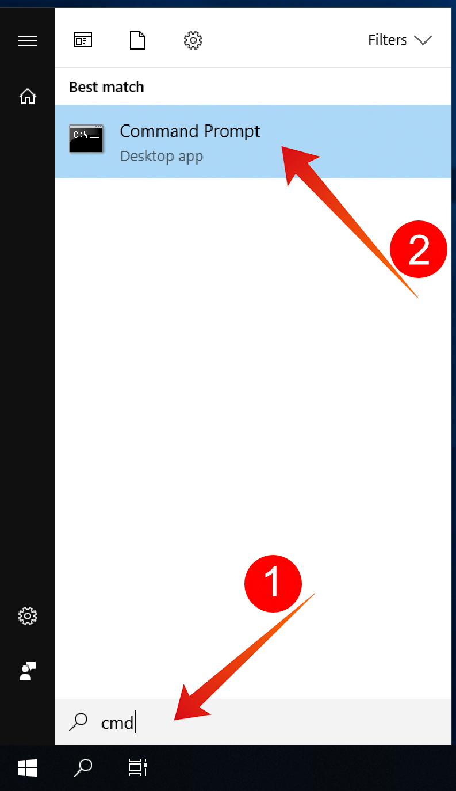

# 5.1.2 Erste Schritte

## Kennenlernen der Benutzeroberfläche von Adobe Experience Platform

Wechseln Sie zu [Adobe Experience Platform](https://experience.adobe.com/platform). Nach der Anmeldung landen Sie auf der Startseite von Adobe Experience Platform.

Bevor Sie fortfahren, müssen Sie eine **Sandbox** auswählen. Die auszuwählende Sandbox heißt ``--aepSandboxName--``. Nachdem Sie die entsprechende [!UICONTROL Sandbox] ausgewählt haben, sehen Sie die Bildschirmänderung und befinden sich nun in Ihrer dedizierten [!UICONTROL Sandbox].

## Daten auf der Plattform durchsuchen

Daten aus verschiedenen Kanälen zu beziehen, ist für jede Marke eine schwierige Aufgabe. In dieser Übung interagieren Kunden von Citi Signal mit Citi Signal auf ihrer Website, über ihre mobile App werden Kaufdaten vom Point of Sale-System von Citi Signal erfasst und sie verfügen über CRM- und Treuedaten. Citi Signal verwendet Adobe Analytics und Adobe Launch, um Daten über seine Website, mobile Anwendung und POS-System zu erfassen. Daher fließen diese Daten bereits in Adobe Experience Platform. Beginnen wir mit der Erforschung aller Daten für Citi Signal, die bereits in Adobe Experience Platform vorhanden sind.

Gehen Sie im linken Menü zu **Datensätze**.

Citi Signal streamt Daten an Adobe Experience Platform und diese Daten sind im Datensatz `Demo System - Event Dataset for Website (Global v1.1)` verfügbar. Suchen Sie nach `Demo System - Event Dataset for Website`.

Die Callcenter-Interaktionsdaten von Citi Signal werden im Datensatz `Demo System - Event Dataset for Call Center (Global v1.1)` erfasst. Suchen Sie im Suchfeld nach `Demo System - Event Dataset for Call Center` Daten. Klicken Sie auf den Namen des Datensatzes, um ihn zu öffnen.

Nachdem Sie auf den Datensatz geklickt haben, erhalten Sie einen Überblick über die Datensatzaktivität, z. B. aufgenommene und fehlgeschlagene Batches. Klicken Sie auf **Vorschau des Datensatzes anzeigen** , um ein Beispiel der im `Demo System - Event Dataset for Call Center (Global v1.1)` -Datensatz gespeicherten Daten anzuzeigen.

Das linke Bedienfeld zeigt die Schemastruktur für diesen Datensatz, und rechts sehen Sie ein Beispiel der erfassten Daten.

Klicken Sie auf **Schließen** , um das Fenster **Vorschau des Datensatzes anzeigen** zu schließen.

## Einführung in Query Service

Der Zugriff auf den Query Service erfolgt über **Abfragen** im linken Menü.

Durch Wechseln zu **Protokoll** wird die Seite &quot;Abfrageliste&quot;angezeigt, auf der Sie eine Liste aller Abfragen erhalten, die in dieser Organisation ausgeführt wurden, wobei sich die neueste Seite oben befindet.

Klicken Sie in der Liste auf eine SQL-Abfrage und beachten Sie die Details in der rechten Leiste.

Sie können im Fenster einen Bildlauf durchführen, um die gesamte Abfrage anzuzeigen, oder auf das unten hervorgehobene Symbol klicken, um die gesamte Abfrage in Ihr Notebook zu kopieren. Sie müssen die Abfrage derzeit nicht kopieren.

Sie können nicht nur die ausgeführten Abfragen sehen, sondern über diese Benutzeroberfläche neue Datensätze aus Abfragen erstellen. Diese Datensätze können mit dem Echtzeit-Kundenprofil von Adobe Experience Platform verknüpft oder als Eingabe für Adobe Experience Platform Data Science Workspace verwendet werden.

## PSQL-Client mit Query Service verbinden

Query Service unterstützt Clients mit einem Treiber für PostgreSQL. Dabei werden wir PSQL, eine Befehlszeilenschnittstelle, und Power BI oder Tableau verwenden. Stellen wir eine Verbindung zu PSQL her.

Klicken Sie auf **Anmeldeinformationen**.

Daraufhin wird der Bildschirm unten angezeigt. Der Bildschirm enthält Serverinformationen und Anmeldedaten für die Authentifizierung bei Query Service. Zunächst konzentrieren wir uns auf die rechte Seite des Bildschirms, der einen Verbindungsbefehl für PSQL enthält. Klicken Sie auf die Schaltfläche Kopieren , um den Befehl in die Zwischenablage zu kopieren.

Für Windows: Öffnen Sie die Befehlszeile, indem Sie die Windows-Taste drücken, Befehl eingeben und dann auf das Ergebnis Eingabeaufforderung klicken.

Für macOS: Öffnen Sie &quot;terminal.app&quot;über die Spotlight-Suche:

Fügen Sie den Verbindungsbefehl ein, den Sie aus der Query Service-Benutzeroberfläche kopiert haben, und drücken Sie die Eingabetaste im Eingabeaufforderungsfenster:

Windows:

MacOS:

Sie sind jetzt mit Query Service über PSQL verbunden.

In den nächsten Übungen wird es eine gewisse Interaktion mit diesem Fenster geben. Dies wird als Ihre **PSQL-Befehlszeilenschnittstelle** bezeichnet.

Jetzt können Sie mit dem Senden von Abfragen beginnen.

Nächster Schritt: [5.1.3 Verwenden des Abfragediensts](./ex3.md)

[Zurück zu Modul 5.1](./query-service.md)

[Zu allen Modulen zurückkehren](../../../overview.md)
