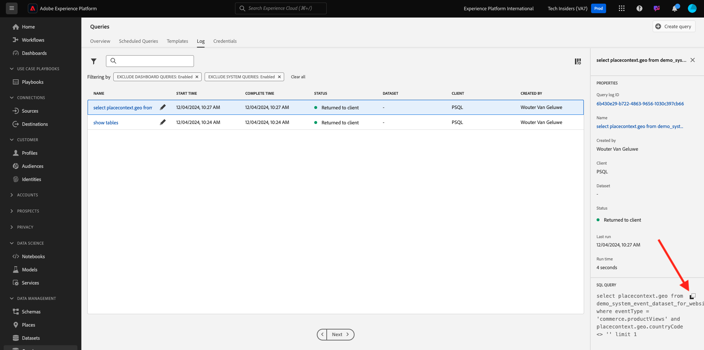

# 5.1.2 Erste Schritte

## Einführung in die Benutzeroberfläche von Adobe Experience Platform

Zu [Adobe Experience Platform](https://experience.adobe.com/platform). Nach dem Login landen Sie auf der Homepage von Adobe Experience Platform.

Bevor Sie fortfahren, müssen Sie eine **Sandbox“**. Die auszuwählende Sandbox hat den Namen ``--aepSandboxName--``. Nach Auswahl der entsprechenden [!UICONTROL Sandbox] wird der Bildschirm geändert und Sie befinden sich nun in Ihrer dedizierten [!UICONTROL Sandbox].

## Erkunden von Daten auf der Plattform

Das Zusammenführen von Daten aus verschiedenen Kanälen ist für jede Marke eine schwierige Aufgabe. In dieser Übung interagieren Citi Signal-Kunden mit Citi Signal auf ihrer Website, in ihrer mobilen App, Kaufdaten werden vom Point of Sale-System von Citi Signal erfasst und sie verfügen über CRM- und Treuedaten. Citi Signal verwendet Adobe Analytics und Adobe Launch, um Daten auf seiner Website, in seiner mobilen App sowie im POS-System zu erfassen, sodass diese Daten bereits in Adobe Experience Platform fließen. Beginnen wir damit, alle Daten für Citi Signal zu untersuchen, die bereits in Adobe Experience Platform vorhanden sind.

Navigieren Sie im linken Menü zu **Datensätze**.

Citi Signal streamt Daten in Adobe Experience Platform und diese Daten sind im `Demo System - Event Dataset for Website (Global v1.1)` Datensatz verfügbar. Suchen Sie nach `Demo System - Event Dataset for Website`.

Die Callcenter-Interaktionsdaten von Citi Signal werden im `Demo System - Event Dataset for Call Center (Global v1.1)` Datensatz erfasst. Suchen nach `Demo System - Event Dataset for Call Center` Daten im Suchfeld. Klicken Sie auf den Namen des Datensatzes, um ihn zu öffnen.

Nach dem Klicken auf den Datensatz erhalten Sie einen Überblick über die Datensatzaktivität, z. B. aufgenommene und fehlgeschlagene Batches. Klicken Sie **Vorschau des** anzeigen), um ein Beispiel für die im Datensatz gespeicherten Daten `Demo System - Event Dataset for Call Center (Global v1.1)` sehen.

Im linken Bereich wird die Schemastruktur für diesen Datensatz angezeigt. Auf der rechten Seite sehen Sie ein Beispiel für die aufgenommenen Daten.

Klicken Sie auf **Schließen**, um das Fenster **Datensatz in der Vorschau anzeigen** zu schließen.

## Einführung in Query Service

Sie können auf den Abfrage-Service zugreifen **indem Sie im** Menü auf „Abfragen“ klicken.

Wenn Sie zu **Log** wechseln, sehen Sie die Seite Abfrageliste , die Ihnen eine Liste aller Abfragen bereitstellt, die in dieser Organisation ausgeführt wurden, wobei die neueste Version oben steht.

Klicken Sie auf eine beliebige SQL-Abfrage aus der Liste und beachten Sie die Details in der rechten Leiste.

Sie können im Fenster scrollen, um die gesamte Abfrage anzuzeigen, oder Sie können auf das unten hervorgehobene Symbol klicken, um die gesamte Abfrage in Ihr Notizbuch zu kopieren. Sie müssen die Abfrage derzeit nicht kopieren.

Sie können nicht nur die ausgeführten Abfragen anzeigen. Mit dieser Benutzeroberfläche können Sie neue Datensätze aus Abfragen erstellen. Diese Datensätze können mit dem Echtzeit-Kundenprofil von Adobe Experience Platform verknüpft oder als Eingabe für Adobe Experience Platform Data Science Workspace verwendet werden.

## Verbinden des PSQL-Clients mit dem Abfrage-Service

Query Service unterstützt Clients mit einem Treiber für PostgreSQL. In diesem Fall verwenden wir PSQL, eine Befehlszeilenschnittstelle, und Power BI oder Tableau. Stellen wir eine Verbindung zu PSQL her.

Klicken Sie **Anmeldedaten**.

Daraufhin wird der folgende Bildschirm angezeigt. Der Bildschirm enthält Server-Informationen und Anmeldeinformationen für die Authentifizierung beim Abfrage-Service. Vorerst konzentrieren wir uns auf die rechte Seite des Bildschirms, die einen Connect-Befehl für PSQL enthält. Klicken Sie auf die Schaltfläche Kopieren , um den Befehl in die Zwischenablage zu kopieren.

Für Windows: Öffnen Sie die Befehlszeile, indem Sie die Windows-Taste drücken, „cmd“ eingeben und dann auf das Eingabeaufforderungsergebnis klicken.

Für macOS: Öffnen Sie die App „terminal.app“ über die Spotlight-Suche:

Fügen Sie den Verbindungsbefehl ein, den Sie aus der Benutzeroberfläche des Abfrage-Service kopiert haben, und drücken Sie die Eingabetaste im Eingabeaufforderungsfenster:

Windows:

MacOS:

Sie sind jetzt über PSQL mit dem Abfrage-Service verbunden.

In den nächsten Übungen wird es einige Interaktionen mit diesem Fenster geben. Wir nennen es Ihre **PSQL-Befehlszeilenschnittstelle**.

Jetzt können Sie mit dem Senden von Abfragen beginnen.

Nächster Schritt: [5.1.3 Verwenden des Abfrage-Service](./ex3.md)

[Zurück zu Modul 5.1](./query-service.md)

[Zurück zu „Alle Module“](../../../overview.md)
